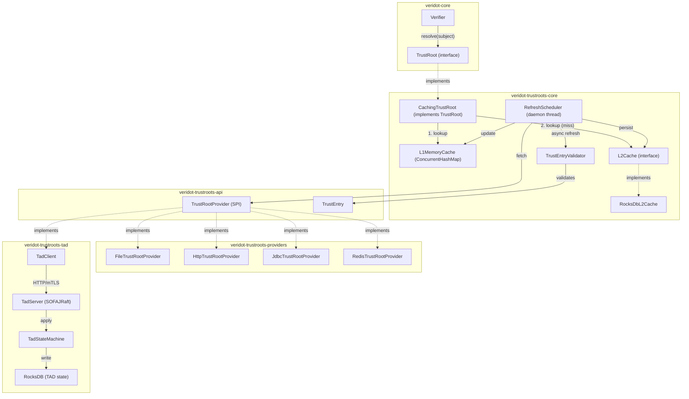
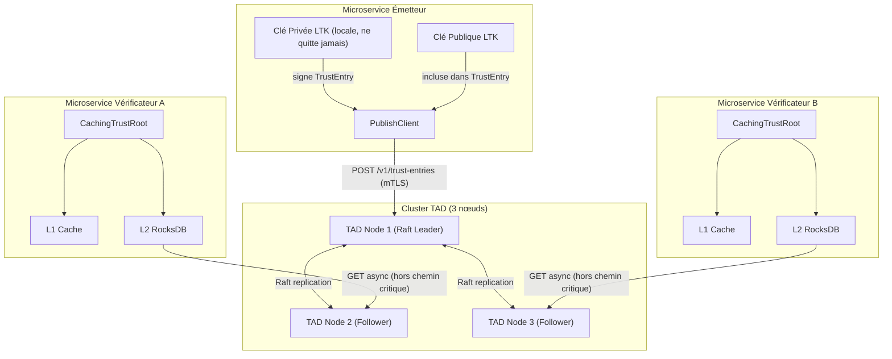
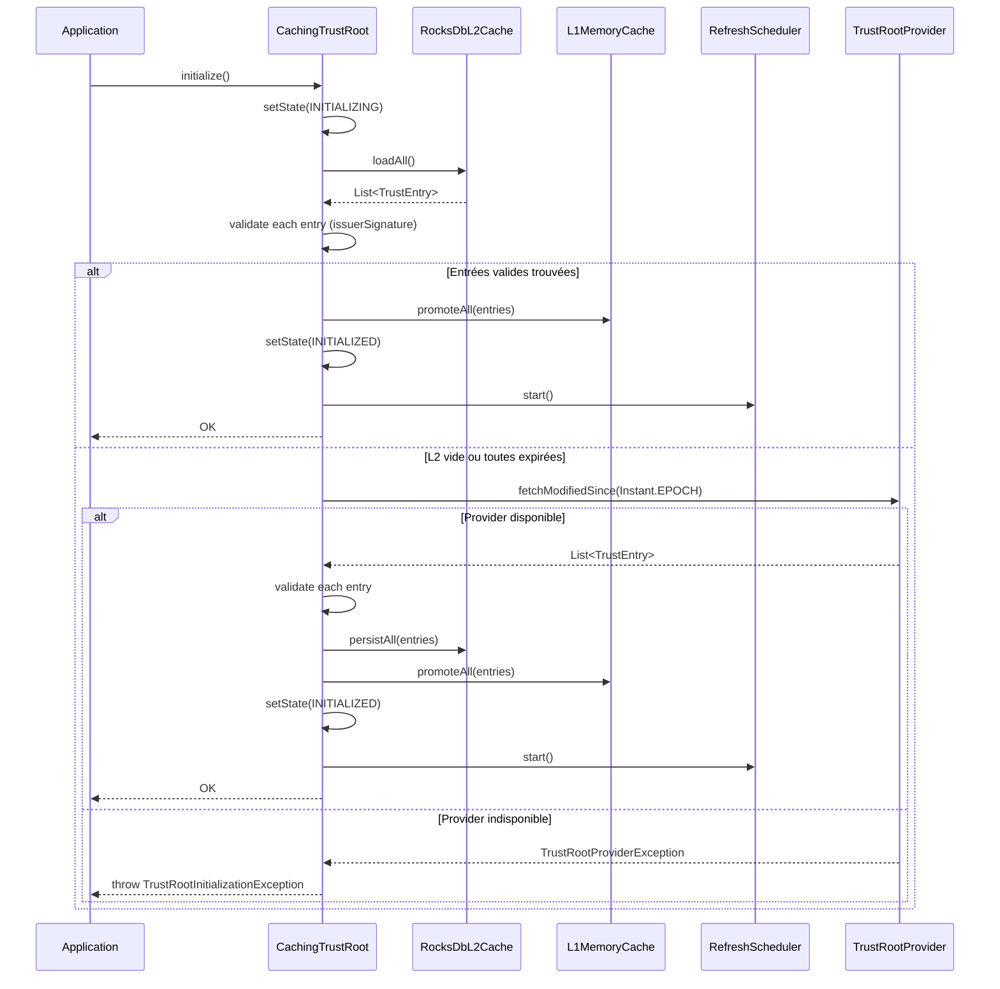
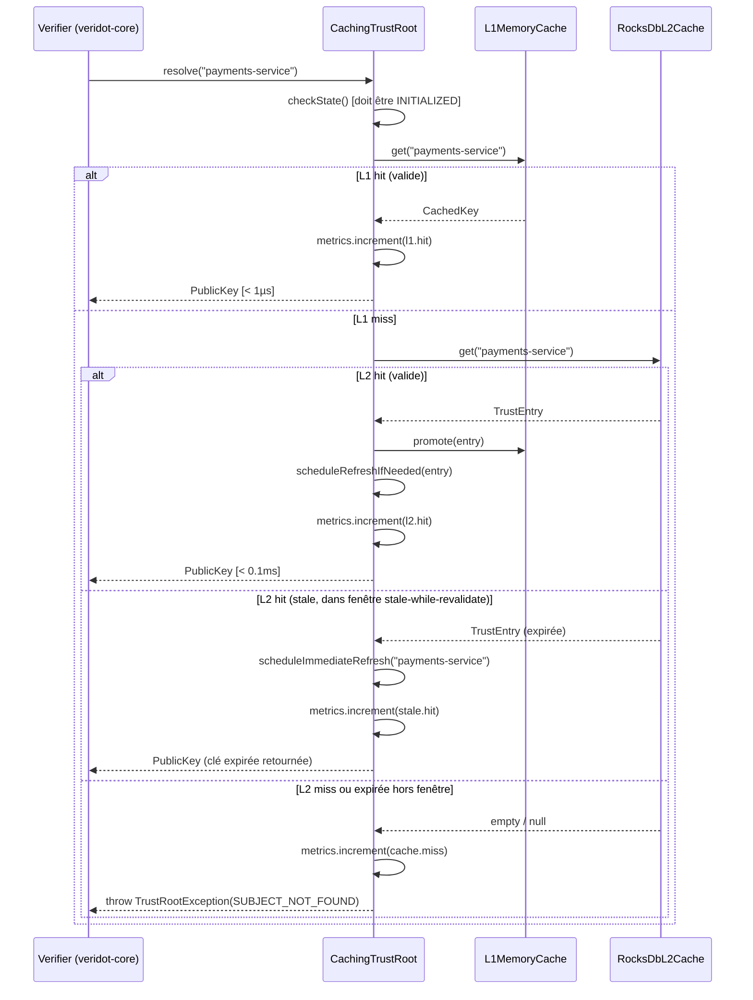
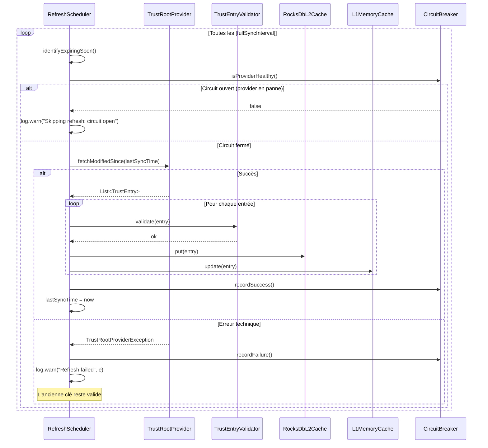
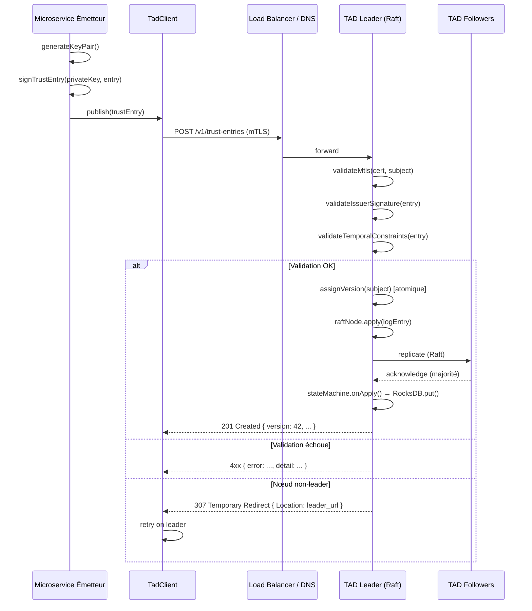
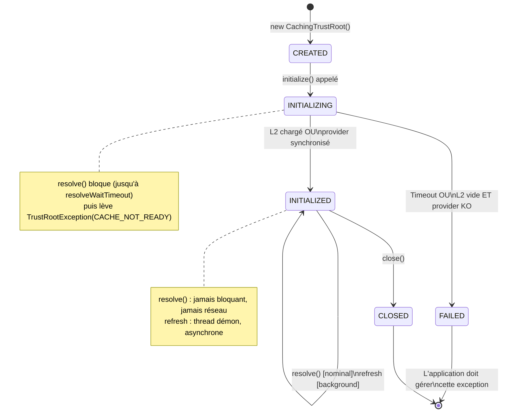
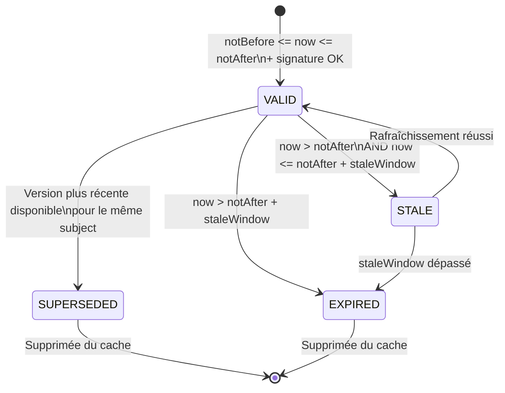
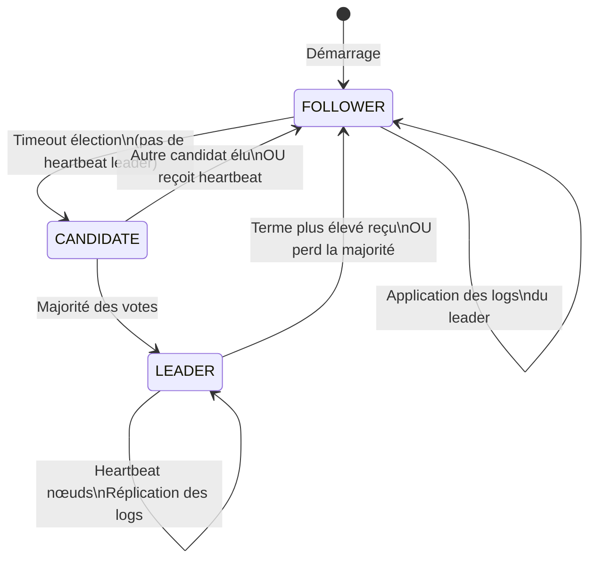

# Plan d'Implémentation Complet — Module `veridot-trustroots`

## Document de Référence Technique — Version 1.0

---

# Table des Matières

1. [Périmètre et Sources de Vérité](#1-périmètre-et-sources-de-vérité)
2. [Analyse de l'Existant et Zones d'Ambiguïté](#2-analyse-de-lexistant-et-zones-dambiguïté)
3. [Décisions Architecturales (ADR)](#3-décisions-architecturales-adr)
4. [Architecture Finale](#4-architecture-finale)
5. [Modèles de Données](#5-modèles-de-données)
6. [Contrats des API](#6-contrats-des-api)
7. [Séquences d'Exécution](#7-séquences-dexécution)
8. [Diagrammes d'État](#8-diagrammes-détat)
9. [Stratégie Cryptographique](#9-stratégie-cryptographique)
10. [Stratégie de Cache](#10-stratégie-de-cache)
11. [Stratégie de Concurrence](#11-stratégie-de-concurrence)
12. [Stratégie de Persistance](#12-stratégie-de-persistance)
13. [Stratégie de Gestion des Erreurs](#13-stratégie-de-gestion-des-erreurs)
14. [Stratégie d'Observabilité](#14-stratégie-dobservabilité)
15. [Stratégie de Test](#15-stratégie-de-test)
16. [Stratégie de Configuration](#16-stratégie-de-configuration)
17. [Stratégie de Compatibilité et Migration](#17-stratégie-de-compatibilité-et-migration)
18. [Conventions de Codage](#18-conventions-de-codage)
19. [Analyse de Sécurité](#19-analyse-de-sécurité)
20. [Analyse des Performances](#20-analyse-des-performances)
21. [Extensibilité](#21-extensibilité)
22. [Critères d'Acceptation Finaux](#22-critères-dacceptation-finaux)

---

# 1. Périmètre et Sources de Vérité

## 1.1 Sources canoniques

Ce document est fondé exclusivement sur :
- `PROTOCOL_V4.md` — vérité fonctionnelle et cryptographique
- Le code source `cyfko/veridot` — vérité d'implémentation existante
- `RFC-001` (étude architecturale) — analyse comparative validée
- Le plan d'implémentation (brouillon) — propositions à préciser et arbitrer

## 1.2 Hiérarchie des vérités

```
PROTOCOL_V4.md          ← vérité absolue, intouchable
     ↓
RFC-001                 ← analyse, ne peut pas contredire PROTOCOL_V4
     ↓
Ce document             ← implémente RFC-001, ne peut pas contredire RFC-001
     ↓
Code source             ← doit correspondre exactement à ce document
```

## 1.3 Invariants non négociables issus de PROTOCOL_V4

Les invariants suivants sont des propriétés du protocole. Aucune décision d'implémentation ne peut les violer.

| ID | Invariant | Conséquence directe |
|----|-----------|---------------------|
| INV-01 | La clé privée LTK ne quitte jamais le microservice émetteur | Aucun composant distant ne génère ni ne stocke de clé privée |
| INV-02 | La vérification fonctionne hors ligne après initialisation | `resolve()` n'effectue jamais d'appel réseau |
| INV-03 | Le canal de distribution des clés est hors bande | Le TAD est indépendant du canal applicatif |
| INV-04 | L'intégrité de la clé publique distribuée est vérifiable | Toute clé reçue d'un provider distant est authentifiée cryptographiquement |
| INV-05 | Aucun composant unique ne constitue un SPoF opérationnel | La défaillance du TAD n'interrompt pas la vérification des tokens actifs |

## 1.4 Ce que ce module n'est pas

Pour éviter toute dérive de périmètre, les responsabilités exclues sont listées explicitement :

- Ce module n'implémente pas la logique de vérification des tokens (responsabilité de `veridot-core`)
- Ce module ne gère pas la génération des clés LTK (responsabilité de l'émetteur)
- Ce module n'est pas une PKI complète
- Ce module n'expose pas de mécanisme de révocation dans l'interface `TrustRoot` (limite connue du protocole, traitée en section 2.3)

---

# 2. Analyse de l'Existant et Zones d'Ambiguïté

## 2.1 Interface `TrustRoot` existante

```java
public interface TrustRoot {
    PublicKey resolve(String subject) throws TrustRootException;
}
```

Cette interface est la seule API publique que ce module doit respecter. Elle ne sera pas modifiée.

## 2.2 Ambiguïtés identifiées et résolutions

Chaque ambiguïté est répertoriée avec sa résolution et sa justification.

### AMB-01 : Sémantique du `subject`

**Ambiguïté :** Le paramètre `subject` de `resolve(String subject)` n'est pas défini précisément. Est-ce un nom de service, un UUID, un DN de certificat ?

**Décision :** Le `subject` est une chaîne UTF-8 arbitraire dont le format est contrôlé par l'organisation déployant Veridot. Ce module ne valide pas le format du `subject`. La seule contrainte imposée par ce module est que le `subject` soit non-null, non-vide, et ne dépasse pas 512 caractères (limite opérationnelle, pas cryptographique).

**Justification :** Imposer un format spécifique créerait une dépendance implicite sur la stratégie de nommage de chaque organisation. La flexibilité est préférable ici.

### AMB-02 : Comportement lors d'un cold-miss

**Ambiguïté :** Le brouillon propose que lors d'un miss total, l'implémentation lève une exception. Mais le vérificateur ne peut pas distinguer « sujet inconnu » de « cache non encore peuplé ». Le résultat serait des rejets de tokens légitimes au démarrage.

**Décision :** L'implémentation distingue deux états de cache :

- **INITIALIZED** : le cache a été peuplé au moins une fois depuis le dernier démarrage. Un miss est définitif → `TrustRootException` avec code `SUBJECT_NOT_FOUND`.
- **INITIALIZING** : le cache est en cours de peuplement. Un miss déclenche une attente bloquante avec timeout configurable (défaut : 5 secondes), puis re-tentative, puis `TrustRootException` avec code `CACHE_NOT_READY`.

**Justification :** Ce comportement est le seul compatible à la fois avec INV-02 (pas d'appel réseau dans `resolve()`) et avec la réalité opérationnelle du démarrage à froid.

**Précision :** L'attente bloquante n'est pas un appel réseau. C'est une attente sur un `CountDownLatch` qui se libère lorsque l'initialisation est terminée. Le thread d'initialisation, lui, peut effectuer des appels réseau.

### AMB-03 : Absence de TTL dans l'interface `TrustRoot`

**Ambiguïté :** `resolve()` retourne une `PublicKey` brute sans date d'expiration. Le cache ne sait pas intrinsèquement quand invalider l'entrée.

**Décision :** Le TTL du cache est calculé à partir de la `notAfter` de la `TrustEntry` stockée en L2. Si `notAfter` est dans le passé, l'entrée est expirée. Le L1 peut avoir un TTL plus court pour forcer des relectures L2, mais jamais plus long que `notAfter`.

**Justification :** La `TrustEntry` (modèle interne) porte toutes les métadonnées nécessaires. L'interface `TrustRoot` reste simple car c'est la bonne séparation des responsabilités.

### AMB-04 : Atomicité de la rotation de clé dans le cache

**Ambiguïté :** Lors d'une rotation, l'ancienne clé doit rester valide pendant la durée de vie maximale des tokens émis avec elle. Comment le cache gère-t-il la coexistence de deux versions de clé pour le même `subject` ?

**Décision :** Le cache L1 et L2 stockent une entrée par `(subject, version)`, pas seulement par `subject`. `resolve(subject)` retourne la clé de la **version la plus récente valide** (dont `notBefore <= now <= notAfter`). Les anciennes versions sont conservées jusqu'à ce que `notAfter` soit dépassé et qu'elles n'aient plus pu servir à valider un token.

**Justification :** Un token émis avec la version 41 de la clé ne peut être vérifié qu'avec la version 41. Si le cache ne conserve que la version 42, tous les tokens en vol signés avec la version 41 sont rejetés à tort. La coexistence est donc fonctionnellement obligatoire.

**Précision sur `resolve()` :** `resolve(subject)` retourne la clé de la version la plus récente valide. Si le vérificateur a besoin d'une version spécifique, il doit utiliser l'interface interne étendue (voir AMB-07). Cette contrainte vient du fait que le token encode la version de la clé utilisée (selon PROTOCOL_V4), ce que le vérificateur de `veridot-core` sait gérer.

**Révision nécessaire :** Si PROTOCOL_V4 indique que `resolve(subject)` est appelé avec uniquement le `subject` et que le vérificateur de `veridot-core` n'encode pas la version dans l'appel, alors le vérificateur ne peut résoudre qu'une seule version par sujet à la fois. Dans ce cas, la gestion de la coexistence de versions est du ressort du vérificateur de `veridot-core` et non de `TrustRoot`. **Action requise avant implémentation :** Vérifier dans `veridot-core` si la version de clé est encodée dans l'appel à `resolve()` ou dans le token lui-même.

> **Point d'arbitrage :** En l'absence de confirmation dans le code source, ce document retient la décision suivante : `resolve(subject)` retourne toujours la version la plus récente valide. Si PROTOCOL_V4 requiert la résolution d'une version spécifique, l'interface `TrustRoot` du core devra être étendue — ce qui sort du périmètre de ce module.

### AMB-05 : Comportement en mode `stale-while-revalidate`

**Ambiguïté :** Le RFC-001 mentionne un mode `stale-while-revalidate` sans le définir précisément. Pendant combien de temps une clé expirée peut-elle être retournée ? Quelles sont les conditions ?

**Décision :** Le `stale-while-revalidate` est un mécanisme de sécurité opérationnelle uniquement, pas de sécurité cryptographique. Il s'applique exclusivement dans la fenêtre `[notAfter, notAfter + staleWindow]` où `staleWindow` est configurable (défaut : 5 minutes, maximum : 30 minutes). Pendant cette fenêtre, `resolve()` retourne la clé expirée et déclenche immédiatement un rafraîchissement asynchrone. Une clé dont `notAfter + staleWindow < now` est définitivement rejetée.

**Justification :** Sans ce mécanisme, une rotation légèrement décalée ou un pic de charge sur le TAD peut provoquer des interruptions de service. Le `staleWindow` est court (5 minutes par défaut) pour limiter la surface d'exposition d'une clé potentiellement révoquée.

**Propriété de sécurité :** Si une clé est révoquée (compromission), le `staleWindow` représente la durée maximale pendant laquelle des tokens signés avec cette clé restent vérifiables. Cette durée doit être inférieure au TTL minimum des tokens éphémères pour limiter l'impact. Cette contrainte doit être documentée dans la configuration.

### AMB-06 : Sérialisation de `TrustEntry` en L2

**Ambiguïté :** Le brouillon utilise Jackson pour sérialiser en JSON dans RocksDB. Mais JSON est verbeux et non binaire. Plusieurs alternatives existent.

**Décision :** La sérialisation en L2 utilise **JSON avec Jackson** (voir ADR-05 pour la comparaison complète). La clé RocksDB est `subject:version` encodé en UTF-8. La valeur est le JSON de `TrustEntry` encodé en UTF-8.

**Format de la clé RocksDB :** `<subject>\0<version_hex_16_chars>` — le séparateur `\0` est choisi car il n'est pas valide dans un `subject` UTF-8 standard. La version est encodée sur 16 caractères hexadécimaux (zero-padded) pour permettre le tri lexicographique natif de RocksDB.

### AMB-07 : Interface entre `veridot-core` et ce module

**Ambiguïté :** Le brouillon référence `PublicKeyTrustRoot` et `TrustIdentity` qui ne sont pas définis dans les sources disponibles.

**Décision :** Ce module implémente uniquement l'interface `TrustRoot` telle qu'elle existe dans `veridot-core`. Si des interfaces additionnelles existent dans `veridot-core`, elles seront implémentées si et seulement si leur contrat est disponible au moment de l'implémentation. Aucune hypothèse n'est faite sur des interfaces non documentées.

### AMB-08 : Comportement du TAD lors d'une partition réseau (split-brain Raft)

**Ambiguïté :** Avec un cluster Raft de 3 nœuds, une partition peut créer deux partitions : {leader, follower1} et {follower2}. Quelle est la politique de lecture ?

**Décision :** Les lectures du TAD utilisent le mécanisme **ReadIndex** de SOFAJRaft. Ce mécanisme garantit des lectures linéarisées : le leader vérifie qu'il est toujours leader avant de répondre. En cas de partition où le leader ne peut pas confirmer son leadership (majorité non joignable), les lectures sont refusées avec `503 Service Unavailable`. Les clients failover sur un autre nœud de la liste.

**Justification :** La cohérence des données lues (intégrité de la clé publique distribuée) est plus importante que la disponibilité du TAD en lecture. Le cache local des clients absorbe les indisponibilités courtes du TAD (INV-05).

**Alternative rejetée :** Lectures locales sans ReadIndex (eventual consistency). Rejetée car elle pourrait retourner une clé révoquée pendant une partition, violant INV-04.

### AMB-09 : Format de la `issuerSignature`

**Ambiguïté :** Le RFC-001 mentionne une `issuerSignature` sans définir précisément ce qui est signé ni le format de la signature.

**Décision :** La `issuerSignature` est définie comme suit :

**Données signées :** Concaténation canonique de `subject + "\n" + publicKeyEncoded + "\n" + algorithm + "\n" + notBefore.toString() + "\n" + notAfter.toString() + "\n" + Long.toString(version)`. Chaque champ séparé par `\n`. Le résultat est encodé en UTF-8 avant signature.

**Algorithme de signature :** Dépend de l'algorithme de la clé LTK (Ed25519 → EdDSA, EC/P-256 → ECDSA-SHA256). L'algorithme est déductible du champ `algorithm` de la `TrustEntry`.

**Format de la signature :** Base64-URL (sans padding), conforme à RFC 4648 §5.

**Justification du format canonique :** La concaténation avec `\n` est simple, déterministe, et ne nécessite pas de bibliothèque externe. Les champs signés couvrent exactement les données fonctionnellement critiques. Les métadonnées (`metadata`, `publishedAt`, `fingerprint`) ne sont pas signées car elles sont soit dérivées des champs signés (`fingerprint`), soit informatives (`publishedAt`, `metadata`).

### AMB-10 : Stratégie de snapshot du TAD

**Ambiguïté :** Le brouillon mentionne des snapshots RocksDB mais ne précise pas la fréquence, le format, ni la distribution.

**Décision :** Les snapshots du TAD sont produits par SOFAJRaft automatiquement selon le mécanisme de snapshot intégré. La fréquence est configurable (défaut : toutes les 10 000 entrées de log Raft ou toutes les 30 minutes, le premier des deux atteints). Les snapshots sont stockés localement sur chaque nœud. La distribution aux clients (pour bootstrap à froid) est un mécanisme séparé décrit en section 10.5.

---

# 3. Décisions Architecturales (ADR)

## ADR-01 : Utilisation de RocksDB pour le cache L2

**Statut :** Accepté

**Contexte :** Le cache L2 doit être persistant localement, performant en lecture, et survivre aux redémarrages. Plusieurs options ont été évaluées.

**Options évaluées :**

| Option | Latence lecture | Durabilité | Dépendance | Taille binaire | Concurrent reads |
|--------|----------------|------------|------------|----------------|-----------------|
| RocksDB | < 0.1ms | ✅ WAL | Native (JNI) | ~10 MB | ✅ Très bon |
| SQLite | 0.5–2ms | ✅ WAL | JDBC + driver | ~1 MB | ⚠️ Limité |
| MapDB | 0.1–0.5ms | ✅ | Pure Java | ~2 MB | ⚠️ Moyen |
| Fichiers JSON | 1–50ms | ✅ | Aucune | 0 MB | ✅ (lecture seule) |
| H2 embarqué | 1–5ms | ✅ | JDBC + driver | ~5 MB | ✅ |
| Chronicle Map | < 0.1ms | ⚠️ Pas de WAL | Native (JNI) | ~8 MB | ✅ Excellent |

**Décision :** RocksDB.

**Justification :**
- Latence de lecture < 0.1ms, compatible avec l'objectif de `resolve()` en < 100µs pour L2
- WAL (Write-Ahead Log) garantit la durabilité sans corruption en cas de crash
- Utilisé en production par des systèmes critiques (Kafka, TiKV, etc.)
- SOFAJRaft utilise déjà RocksDB pour ses logs de réplication : une seule dépendance native JNI
- Le tri lexicographique natif des clés permet les scans par préfixe (`subject\0*`) efficacement

**Inconvénients acceptés :**
- Dépendance JNI : les binaires natifs doivent être disponibles pour la plateforme cible (Linux x86_64, arm64, macOS, Windows). Les binaires sont inclus dans `rocksdbjni`.
- Pas de support Windows ARM64 dans les binaires officiels RocksDB Java (limitation connue, documentée)

**Conditions d'utilisation :** RocksDB est utilisé en mode intégré (embedded), jamais comme service partagé entre plusieurs processus. Chaque instance de vérificateur possède sa propre instance RocksDB dans un répertoire dédié.

---

## ADR-02 : Utilisation de SOFAJRaft pour le consensus du TAD

**Statut :** Accepté

**Contexte :** Le serveur TAD doit être hautement disponible et tolérant aux pannes. Un consensus distribué est nécessaire pour garantir la cohérence des clés publiées.

**Options évaluées :**

| Option | Maturité Java | Intégration RocksDB | Complexité | Maintenance |
|--------|--------------|---------------------|------------|-------------|
| SOFAJRaft | ✅ Production (Ant Group) | ✅ Native | Moyenne | Actif |
| Apache Ratis | ✅ Production (Apache) | ✅ Bonne | Moyenne | Actif |
| etcd (client Java) | ✅ Très mature | N/A (service externe) | Faible (client) | Très actif |
| Atomix | ⚠️ Moins actif | ⚠️ Possible | Moyenne | Faible |
| Base de données partagée (CockroachDB) | ✅ | N/A | Élevée | Externe |

**Décision :** SOFAJRaft.

**Justification :**
- Intégration native avec RocksDB : la state machine peut utiliser directement le même engine que le cache L2, réduisant les dépendances
- Utilisé en production à très grande échelle (Ant Group)
- API Java directe, sans processus externe à déployer
- Support des snapshots RocksDB natif via `SnapshotFile` mechanism

**Alternative sérieuse :** Apache Ratis. Écarté car SOFAJRaft a une intégration RocksDB plus directe et documentée. Si SOFAJRaft venait à ne plus être maintenu, Apache Ratis est la migration naturelle (protocole Raft identique, API similaire).

**Condition :** Le serveur TAD (`veridot-trustroots-tad-server`) est le seul composant qui utilise SOFAJRaft. Les clients (`veridot-trustroots-tad-client`) n'ont aucune dépendance sur SOFAJRaft.

---

## ADR-03 : Architecture en couches L1/L2/Provider obligatoire

**Statut :** Accepté

**Décision :** Toute implémentation de `TrustRoot` fournie par ce module doit utiliser l'architecture en couches suivante :

```
resolve(subject)
    → L1 (ConcurrentHashMap en mémoire)     [< 1µs]
    → L2 (RocksDB local)                    [< 0.1ms]
    → TrustRootException                    [si miss total]
```

Le provider distant est **exclusivement** consulté par le thread de rafraîchissement, jamais par `resolve()`.

**Justification :** Seule architecture compatible simultanément avec INV-02 (hors ligne) et INV-05 (pas de SPoF opérationnel).

**Conséquence :** Les implémentations directes de `TrustRoot` sans cache (appelant le réseau dans `resolve()`) sont autorisées dans le code mais marquées `@UnsafeForProduction` et documentées comme violant INV-02. Elles peuvent être utiles en développement ou en test.

---

## ADR-04 : Le TAD valide les `issuerSignature` à la publication

**Statut :** Accepté

**Décision :** Le serveur TAD valide la `issuerSignature` de chaque `TrustEntry` soumise avant de l'accepter dans le log Raft. La validation échoue si la signature n'est pas vérifiable avec la clé publique soumise dans la même entrée.

**Justification :** Cela peut sembler circulaire (valider avec la clé qu'on est en train d'enregistrer), mais c'est cryptographiquement valide. La validation prouve que l'entité soumettant la clé possède la clé privée correspondante. Un attaquant ne peut pas soumettre une clé publique arbitraire sans posséder la clé privée correspondante.

**Propriété de sécurité :** Cette validation empêche les attaques où un service malveillant soumettrait la clé publique d'un autre service pour le remplacer. L'authentification mTLS vérifie l'identité du soumettant ; la `issuerSignature` vérifie la possession de la clé privée correspondant à la clé publique soumise.

**Note :** La validation est redondante avec l'authentification mTLS dans un système parfaitement configuré, mais constitue une défense en profondeur indispensable car elle ne repose pas sur la PKI mTLS.

---

## ADR-05 : Sérialisation JSON (Jackson) pour le L2

**Statut :** Accepté

**Contexte :** Les données stockées en L2 (RocksDB) doivent être sérialisées.

**Options évaluées :**

| Option | Lisibilité | Performance | Versionnement | Dépendance |
|--------|-----------|-------------|---------------|------------|
| JSON (Jackson) | ✅ Excellente | ⚠️ Correcte | ✅ Flexible | Jackson (déjà présente) |
| Protocol Buffers | ❌ Binaire | ✅ Excellente | ✅ Schéma | Protobuf runtime |
| MessagePack | ❌ Binaire | ✅ Très bonne | ⚠️ Limitée | msgpack-java |
| Avro | ❌ Binaire | ✅ Bonne | ✅ Schéma | Avro runtime |
| Java Serialization | ❌ Binaire | ❌ Mauvaise | ❌ Fragile | Aucune |

**Décision :** JSON avec Jackson.

**Justification :**
- Les données stockées sont des métadonnées de clés (pas des blocs de données massifs) : la performance de JSON est suffisante
- La lisibilité permet le débogage direct des fichiers RocksDB avec `ldb` tool
- Jackson est déjà une dépendance probable dans l'écosystème Veridot
- L'évolutivité du schéma JSON est supérieure (champs optionnels, unknown fields ignorés avec `@JsonIgnoreProperties`)

**Condition :** Le format JSON est versionné via un champ `_schemaVersion` dans chaque entrée. Les lecteurs ignorent les champs inconnus (`@JsonIgnoreProperties(ignoreUnknown = true)`). Les migrations de schéma sont documentées en section 17.

---

## ADR-06 : Pas de modification de l'interface `TrustRoot` du core

**Statut :** Accepté, irrévocable pour ce module.

**Décision :** Ce module n'introduit aucune modification à l'interface `TrustRoot` de `veridot-core`.

**Justification :** Modifier une interface publique d'un projet open source constitue un breaking change. Ce module est un module optionnel et ne peut pas imposer des changements au core.

**Conséquence :** Toutes les abstractions enrichies (version spécifique, métadonnées, TTL) sont internes à ce module. L'interface publique exposée aux utilisateurs reste `TrustRoot`.

---

## ADR-07 : Le serveur TAD est optionnel

**Statut :** Accepté.

**Décision :** Le serveur TAD (`veridot-trustroots-tad-server`) est un composant optionnel. Les organisations peuvent utiliser d'autres providers (JDBC, fichier, HTTP générique) sans déployer de TAD.

**Justification :** Forcer le déploiement d'un serveur Raft pour adopter `veridot-trustroots` constituerait une barrière à l'adoption prohibitive. Le module doit être utilisable dans des contextes simples (quelques services, environnement de développement) sans infrastructure supplémentaire.

---

## ADR-08 : Versionnement indépendant du module

**Statut :** Accepté.

**Décision :** `veridot-trustroots` suit son propre versionnement SemVer, indépendant de `veridot-core`. La compatibilité avec `veridot-core` est déclarée via une plage de versions dans le POM. Exemple : `veridot-trustroots-1.0.0` est compatible avec `veridot-core-[1.0.0, 2.0.0)`.

**Justification :** Le rythme d'évolution du module `trustroots` sera différent de celui du core. Coupler les versions créerait des contraintes inutiles.

---

# 4. Architecture Finale

## 4.1 Structure Maven

```
veridot-trustroots/                          ← POM parent (packaging pom)
├── pom.xml
├── veridot-trustroots-api/                  ← DTOs, interfaces SPI, exceptions (0 dépendance lourde)
│   └── src/main/java/
│       └── io/github/cyfko/veridot/trustroots/api/
│           ├── TrustEntry.java
│           ├── TrustEntryRef.java           ← Référence légère (subject + version)
│           ├── TrustRootProvider.java       ← SPI interne
│           ├── CacheStats.java              ← Métriques du cache
│           └── exception/
│               ├── TrustRootException.java  ← Réexportée depuis core ou redéfinie
│               ├── InvalidSignatureException.java
│               ├── TrustRootProviderException.java
│               └── TrustRootInitializationException.java
├── veridot-trustroots-core/                 ← Cache L1/L2 RocksDB + moteur de rafraîchissement
│   └── src/main/java/
│       └── io/github/cyfko/veridot/trustroots/core/
│           ├── CachingTrustRoot.java        ← Implémentation principale de TrustRoot
│           ├── CachingTrustRootBuilder.java
│           ├── cache/
│           │   ├── L1MemoryCache.java
│           │   ├── L2Cache.java             ← Interface
│           │   └── RocksDbL2Cache.java      ← Implémentation RocksDB
│           ├── refresh/
│           │   ├── RefreshScheduler.java
│           │   └── RefreshPolicy.java
│           ├── validation/
│           │   ├── TrustEntryValidator.java
│           │   └── SignatureVerifier.java
│           └── serialization/
│               ├── TrustEntrySerializer.java
│               └── TrustEntrySchemaMigration.java
├── veridot-trustroots-providers/            ← Providers distants (sous-modules par provider)
│   ├── veridot-trustroots-provider-file/    ← Fichier JSON local
│   ├── veridot-trustroots-provider-http/    ← HTTP générique (JWKS-compatible)
│   ├── veridot-trustroots-provider-jdbc/    ← JDBC (PostgreSQL, MySQL, etc.)
│   ├── veridot-trustroots-provider-redis/   ← Redis (Lettuce)
│   └── veridot-trustroots-provider-vault/  ← HashiCorp Vault
├── veridot-trustroots-tad/                  ← Client TAD + Server TAD
│   ├── veridot-trustroots-tad-client/       ← Client HTTP mTLS du TAD
│   └── veridot-trustroots-tad-server/       ← Serveur TAD (SOFAJRaft + RocksDB)
├── veridot-trustroots-spring/               ← Auto-configuration Spring Boot 3.x
└── veridot-trustroots-testing/             ← Utilitaires de test
```

## 4.2 Diagramme de composants



## 4.3 Diagramme de déploiement



---

# 5. Modèles de Données

## 5.1 `TrustEntry` — Modèle canonique

```java
package io.github.cyfko.veridot.trustroots.api;

import com.fasterxml.jackson.annotation.JsonIgnoreProperties;
import com.fasterxml.jackson.annotation.JsonProperty;

import java.time.Instant;
import java.util.Collections;
import java.util.Map;
import java.util.Objects;

/**
 * Entrée canonique du registre de confiance.
 *
 * <h3>Invariants</h3>
 * <ul>
 *   <li>{@code subject} est non-null, non-vide, max 512 caractères UTF-8</li>
 *   <li>{@code publicKeyEncoded} est une représentation Base64-URL de la clé publique</li>
 *   <li>{@code algorithm} est l'une des valeurs de {@link KeyAlgorithm}</li>
 *   <li>{@code notBefore} est strictement antérieur à {@code notAfter}</li>
 *   <li>{@code version} est strictement positif et monotoniquement croissant par subject</li>
 *   <li>{@code fingerprint} est SHA-256 de la clé publique décodée, encodé en hex lowercase</li>
 *   <li>{@code issuerSignature} est la signature de la charge canonique, encodée en Base64-URL sans padding</li>
 * </ul>
 *
 * <h3>Charge canonique signée</h3>
 * <pre>
 * subject + "\n" + publicKeyEncoded + "\n" + algorithm + "\n"
 *     + notBefore.toString() + "\n" + notAfter.toString() + "\n"
 *     + Long.toString(version)
 * </pre>
 * Encodée en UTF-8 avant signature.
 *
 * <h3>Versionnement de schéma</h3>
 * Le champ {@code _schemaVersion} permet les migrations futures.
 * Les champs inconnus sont ignorés pour la compatibilité ascendante.
 */
@JsonIgnoreProperties(ignoreUnknown = true)
public final class TrustEntry {

    @JsonProperty("_schemaVersion")
    private final int schemaVersion = 1;

    private final String subject;
    private final String publicKeyEncoded;
    private final KeyAlgorithm algorithm;
    private final Instant notBefore;
    private final Instant notAfter;
    private final long version;
    private final String fingerprint;
    private final String issuerSignature;
    private final Instant publishedAt;
    private final Map<String, String> metadata;

    // Constructeur package-private : utiliser TrustEntry.Builder
    TrustEntry(
            String subject,
            String publicKeyEncoded,
            KeyAlgorithm algorithm,
            Instant notBefore,
            Instant notAfter,
            long version,
            String fingerprint,
            String issuerSignature,
            Instant publishedAt,
            Map<String, String> metadata) {

        this.subject = Objects.requireNonNull(subject, "subject");
        this.publicKeyEncoded = Objects.requireNonNull(publicKeyEncoded, "publicKeyEncoded");
        this.algorithm = Objects.requireNonNull(algorithm, "algorithm");
        this.notBefore = Objects.requireNonNull(notBefore, "notBefore");
        this.notAfter = Objects.requireNonNull(notAfter, "notAfter");
        this.version = version;
        this.fingerprint = Objects.requireNonNull(fingerprint, "fingerprint");
        this.issuerSignature = Objects.requireNonNull(issuerSignature, "issuerSignature");
        this.publishedAt = Objects.requireNonNull(publishedAt, "publishedAt");
        this.metadata = metadata == null ? Collections.emptyMap() : Collections.unmodifiableMap(metadata);

        if (subject.isBlank()) throw new IllegalArgumentException("subject must not be blank");
        if (subject.length() > 512) throw new IllegalArgumentException("subject exceeds 512 chars");
        if (!notBefore.isBefore(notAfter)) throw new IllegalArgumentException("notBefore must be before notAfter");
        if (version <= 0) throw new IllegalArgumentException("version must be positive");
    }

    /**
     * Indique si cette entrée est valide à l'instant donné.
     * N'inclut pas la validation de la signature.
     */
    public boolean isValidAt(Instant instant) {
        return !instant.isBefore(notBefore) && !instant.isAfter(notAfter);
    }

    /**
     * Calcule la charge canonique à signer, encodée en UTF-8.
     * Utilisée pour la vérification de la {@code issuerSignature}.
     */
    public byte[] canonicalPayload() {
        String payload = subject + "\n"
                + publicKeyEncoded + "\n"
                + algorithm.identifier() + "\n"
                + notBefore.toString() + "\n"
                + notAfter.toString() + "\n"
                + version;
        return payload.getBytes(java.nio.charset.StandardCharsets.UTF_8);
    }

    // Getters (pas de setters : immutable)
    public String subject() { return subject; }
    public String publicKeyEncoded() { return publicKeyEncoded; }
    public KeyAlgorithm algorithm() { return algorithm; }
    public Instant notBefore() { return notBefore; }
    public Instant notAfter() { return notAfter; }
    public long version() { return version; }
    public String fingerprint() { return fingerprint; }
    public String issuerSignature() { return issuerSignature; }
    public Instant publishedAt() { return publishedAt; }
    public Map<String, String> metadata() { return metadata; }
    public int schemaVersion() { return schemaVersion; }

    public static Builder builder() { return new Builder(); }

    // Builder omis pour concision — voir section 18 pour les conventions
}
```

## 5.2 `KeyAlgorithm` — Énumération des algorithmes supportés

```java
package io.github.cyfko.veridot.trustroots.api;

/**
 * Algorithmes de clé publique supportés.
 *
 * L'ajout d'un nouvel algorithme requiert :
 * 1. Une entrée dans cette énumération
 * 2. Une implémentation dans {@link io.github.cyfko.veridot.trustroots.core.validation.SignatureVerifier}
 * 3. Une entrée dans la matrice de compatibilité (section 17)
 * 4. Des tests de conformité dans {@code veridot-trustroots-testing}
 */
public enum KeyAlgorithm {

    ED25519("Ed25519", "EdDSA", "Ed25519"),
    EC_P256("EC/P-256", "SHA256withECDSA", "EC"),
    EC_P384("EC/P-384", "SHA384withECDSA", "EC"),
    RSA_2048("RSA-2048", "SHA256withRSA", "RSA"),
    RSA_4096("RSA-4096", "SHA256withRSA", "RSA");

    private final String identifier;      // Identifiant dans TrustEntry
    private final String jcaSignAlgorithm; // Algorithme JCA pour la vérification
    private final String jcaKeyAlgorithm;  // Algorithme JCA pour la reconstruction de clé

    KeyAlgorithm(String identifier, String jcaSignAlgorithm, String jcaKeyAlgorithm) {
        this.identifier = identifier;
        this.jcaSignAlgorithm = jcaSignAlgorithm;
        this.jcaKeyAlgorithm = jcaKeyAlgorithm;
    }

    public String identifier() { return identifier; }
    public String jcaSignAlgorithm() { return jcaSignAlgorithm; }
    public String jcaKeyAlgorithm() { return jcaKeyAlgorithm; }

    public static KeyAlgorithm fromIdentifier(String identifier) {
        for (KeyAlgorithm alg : values()) {
            if (alg.identifier.equals(identifier)) return alg;
        }
        throw new IllegalArgumentException("Unknown algorithm identifier: " + identifier);
    }
}
```

## 5.3 `TrustRootProvider` — Interface SPI

```java
package io.github.cyfko.veridot.trustroots.api;

import io.github.cyfko.veridot.trustroots.api.exception.TrustRootProviderException;

import java.time.Instant;
import java.util.Collection;
import java.util.Collections;
import java.util.List;
import java.util.Map;
import java.util.Optional;

/**
 * SPI interne du module veridot-trustroots.
 *
 * <h3>Contrat</h3>
 * Les implémentations de ce SPI peuvent effectuer des appels réseau,
 * des accès disque, ou toute opération I/O.
 * Elles ne sont JAMAIS invoquées depuis {@code TrustRoot.resolve()}.
 * Elles sont exclusivement invoquées par le {@link RefreshScheduler}
 * dans un thread dédié.
 *
 * <h3>Contraintes de thread-safety</h3>
 * Les implémentations doivent être thread-safe.
 * Plusieurs threads de rafraîchissement peuvent appeler les méthodes simultanément.
 *
 * <h3>Gestion des erreurs</h3>
 * Les méthodes lèvent {@link TrustRootProviderException} pour les erreurs techniques.
 * Elles retournent {@code Optional.empty()} ou une liste vide pour les données absentes.
 * Elles ne masquent pas les exceptions techniques en les convertissant en données absentes.
 */
public interface TrustRootProvider {

    /**
     * Récupère la version la plus récente de la TrustEntry pour le sujet donné.
     *
     * @param subject identifiant du sujet (non-null, non-vide)
     * @return la TrustEntry si elle existe, Optional.empty() si le sujet est inconnu
     * @throws TrustRootProviderException en cas d'erreur technique (réseau, parsing, etc.)
     */
    Optional<TrustEntry> fetch(String subject) throws TrustRootProviderException;

    /**
     * Récupère toutes les TrustEntry modifiées depuis l'instant donné.
     * Utilisé pour la synchronisation incrémentale du cache.
     *
     * <p>L'implémentation par défaut retourne une liste vide.
     * Les providers qui ne supportent pas la synchronisation incrémentale
     * peuvent conserver ce comportement par défaut, au coût d'une
     * synchronisation complète périodique.
     *
     * @param since instant de référence (non-null)
     * @return liste des TrustEntry modifiées depuis {@code since}, potentiellement vide
     * @throws TrustRootProviderException en cas d'erreur technique
     */
    default List<TrustEntry> fetchModifiedSince(Instant since) throws TrustRootProviderException {
        return Collections.emptyList();
    }

    /**
     * Récupère par lot les TrustEntry pour plusieurs sujets.
     * L'implémentation par défaut effectue des appels séquentiels à {@link #fetch}.
     * Les providers qui supportent les requêtes par lot peuvent surcharger cette méthode.
     *
     * @param subjects collection de sujets à récupérer (non-null)
     * @return map subject → TrustEntry, contenant uniquement les sujets trouvés
     * @throws TrustRootProviderException en cas d'erreur technique
     */
    default Map<String, TrustEntry> fetchBatch(Collection<String> subjects)
            throws TrustRootProviderException {
        Map<String, TrustEntry> result = new java.util.HashMap<>();
        for (String subject : subjects) {
            fetch(subject).ifPresent(entry -> result.put(subject, entry));
        }
        return Collections.unmodifiableMap(result);
    }

    /**
     * Vérifie la connectivité avec le provider.
     * Utilisé par le RefreshScheduler pour le circuit breaker.
     *
     * @return true si le provider est joignable, false sinon
     */
    default boolean isHealthy() {
        return true;
    }

    /**
     * Nom lisible de ce provider, utilisé dans les logs et métriques.
     */
    String name();
}
```

## 5.4 Clé de stockage RocksDB

**Format :** `<subject_bytes> + 0x00 + <version_big_endian_8_bytes>`

**Justification du format binaire :**
- Le séparateur `0x00` est garanti absent des sujets (UTF-8 valide ne contient pas 0x00 sauf dans certains encodages non-standard, mais le sujet est contraint à UTF-8 valide)
- La version en big-endian sur 8 octets permet le tri lexicographique natif de RocksDB : un scan sur le préfixe `<subject_bytes> + 0x00` itère les versions dans l'ordre croissant

**Colonnes RocksDB :**

| Column Family | Clé | Valeur | Usage |
|---------------|-----|--------|-------|
| `entries` | `<subject>\0<version_be8>` | JSON(TrustEntry) | Stockage principal |
| `subjects` | `<subject_utf8>` | `<latest_version_be8>` | Index version courante |
| `meta` | `last_sync_time` | `<epoch_millis_be8>` | Métadonnées du cache |
| `meta` | `schema_version` | `<version_be4>` | Version de schéma |

**Justification des deux column families `entries` et `subjects` :**
- `entries` stocke toutes les versions (pour la coexistence lors des rotations)
- `subjects` stocke uniquement la version courante, permettant un lookup O(1) par sujet sans scan

---

# 6. Contrats des API

## 6.1 API du serveur TAD

### 6.1.1 Publication d'une clé

```
POST /v1/trust-entries
Authorization: Certificat mTLS (requis)
Content-Type: application/json; charset=utf-8
Idempotency-Key: <uuid> (optionnel, pour retry sécurisé)

Corps :
{
  "subject":           string,   // max 512 chars, UTF-8
  "publicKeyEncoded":  string,   // Base64-URL, clé publique DER encodée
  "algorithm":         string,   // identifiant KeyAlgorithm (ex: "Ed25519")
  "notBefore":         string,   // ISO-8601 UTC (ex: "2024-01-01T00:00:00Z")
  "notAfter":          string,   // ISO-8601 UTC
  "issuerSignature":   string,   // Base64-URL sans padding
  "metadata":          object    // optionnel, clés et valeurs string, max 20 entrées
}

Réponses :
201 Created
{
  "subject":     string,
  "version":     number,   // version assignée (commence à 1, incrémentée à chaque rotation)
  "fingerprint": string,   // SHA-256 hex lowercase de la clé publique décodée
  "publishedAt": string    // ISO-8601 UTC
}

400 Bad Request
{
  "error":   "INVALID_REQUEST",
  "detail":  string   // description du champ invalide
}

401 Unauthorized
{
  "error": "MISSING_CLIENT_CERTIFICATE"
}

403 Forbidden
{
  "error":  "SUBJECT_MISMATCH",
  "detail": "Le subject déclaré ne correspond pas à l'identité du certificat client"
}

409 Conflict
{
  "error":  "INVALID_SIGNATURE",
  "detail": "La issuerSignature ne valide pas avec la clé publique soumise"
}

409 Conflict (avec Idempotency-Key)
{
  "error":  "VERSION_CONFLICT",
  "detail": "Une entrée plus récente existe déjà"
}

503 Service Unavailable
{
  "error":         "RAFT_UNAVAILABLE",
  "retryAfterMs":  number
}
```

### 6.1.2 Rotation de clé

```
PUT /v1/trust-entries/{subject}
Authorization: Certificat mTLS (requis)
Content-Type: application/json; charset=utf-8

Corps : identique à POST, avec la nouvelle clé publique

Règles :
- Le subject dans l'URL doit correspondre au subject dans le corps
- La version dans la réponse est exactement previous_version + 1
- L'ancienne version reste accessible jusqu'à son notAfter

Réponses : identiques à POST, plus :

404 Not Found
{
  "error": "SUBJECT_NOT_FOUND"
}
```

### 6.1.3 Résolution d'une clé

```
GET /v1/trust-entries/{subject}
GET /v1/trust-entries/{subject}?version={n}   // Version spécifique

Réponses :
200 OK
ETag: "<fingerprint>"
Cache-Control: max-age=<seconds>, stale-while-revalidate=<seconds>
Last-Modified: <HTTP-date>

{
  "subject":           string,
  "publicKeyEncoded":  string,
  "algorithm":         string,
  "notBefore":         string,
  "notAfter":          string,
  "version":           number,
  "fingerprint":       string,
  "issuerSignature":   string,
  "publishedAt":       string,
  "metadata":          object,
  "cacheDirective": {
    "maxAgeSeconds":              number,   // min(3600, secondes avant notAfter)
    "staleWhileRevalidateSeconds": number   // 300
  }
}

304 Not Modified (si ETag correspond à If-None-Match)

404 Not Found
{
  "error": "SUBJECT_NOT_FOUND"
}

410 Gone (si la version demandée a été purgée)
{
  "error": "VERSION_PURGED",
  "latestVersion": number
}
```

**Calcul de `maxAgeSeconds` :** `min(3600, (notAfter.epochSecond - now.epochSecond) / 2)`. Le facteur 2 garantit que le cache expire bien avant la clé elle-même, laissant le temps d'un rafraîchissement.

### 6.1.4 Résolution par lot

```
POST /v1/trust-entries/batch
Content-Type: application/json

Corps :
{
  "subjects": ["svc-a", "svc-b", "svc-c"]   // max 100 sujets par requête
}

Réponse 200 OK :
{
  "found": {
    "svc-a": { ... TrustEntry ... },
    "svc-b": { ... TrustEntry ... }
  },
  "notFound": ["svc-c"]
}
```

### 6.1.5 Synchronisation incrémentale

```
GET /v1/trust-entries?modifiedSince={ISO-8601}

Réponse 200 OK :
{
  "entries": [ ... liste de TrustEntry ... ],
  "nextSyncToken": string,   // token opaque pour la prochaine requête
  "truncated": boolean       // true si la liste est paginée
}

GET /v1/trust-entries?syncToken={token}   // page suivante
```

### 6.1.6 Health et statut du cluster

```
GET /health
Réponse 200 OK :
{
  "status":       "UP" | "DEGRADED" | "DOWN",
  "role":         "LEADER" | "FOLLOWER" | "CANDIDATE",
  "leaderId":     string,   // null si rôle = LEADER
  "leaderHint":   string    // URL du leader courant (pour redirection client)
}

GET /v1/cluster/status
Réponse 200 OK :
{
  "nodes": [
    { "nodeId": string, "address": string, "role": string, "lastContact": string }
  ],
  "currentTerm":  number,
  "commitIndex":  number
}
```

## 6.2 Interface `CachingTrustRoot` — API publique du module

```java
/**
 * Point d'entrée principal du module veridot-trustroots.
 * Implémente {@link TrustRoot} avec cache L1/L2 et rafraîchissement asynchrone.
 *
 * <h3>Cycle de vie</h3>
 * <ol>
 *   <li>Construire via {@link #builder()}</li>
 *   <li>Appeler {@link #initialize()} avant toute utilisation (bloquant)</li>
 *   <li>Utiliser {@link #resolve(String)} normalement</li>
 *   <li>Appeler {@link #close()} à l'arrêt de l'application</li>
 * </ol>
 *
 * <h3>Thread-safety</h3>
 * Cette classe est thread-safe. {@link #resolve(String)} peut être appelé
 * depuis n'importe quel thread sans synchronisation externe.
 */
public final class CachingTrustRoot implements TrustRoot, AutoCloseable {

    /**
     * Crée un builder pour configurer une instance de CachingTrustRoot.
     */
    public static CachingTrustRootBuilder builder() { ... }

    /**
     * Initialise le cache en chargeant les données depuis L2 puis depuis le provider.
     *
     * <p>Cette méthode est bloquante. Elle doit être appelée avant {@link #resolve(String)}.
     * Elle peut effectuer des appels réseau via le provider.
     *
     * <p>Si L2 est vide et le provider est indisponible, une
     * {@link TrustRootInitializationException} est levée. L'application
     * ne doit pas accepter de requêtes dans cet état.
     *
     * <p>Cette méthode est idempotente mais non thread-safe :
     * elle ne doit pas être appelée concurremment avec elle-même.
     *
     * @throws TrustRootInitializationException si l'initialisation échoue irrémédiablement
     */
    public void initialize() throws TrustRootInitializationException { ... }

    /**
     * {@inheritDoc}
     *
     * <p><strong>Invariant :</strong> Cette méthode n'effectue aucun appel réseau,
     * aucun accès disque (hors RocksDB local), et ne bloque pas sur des ressources partagées.
     *
     * <p>La latence de cette méthode est :
     * <ul>
     *   <li>Cache L1 hit : < 1µs (lecture ConcurrentHashMap)</li>
     *   <li>Cache L2 hit : < 0.1ms (lecture RocksDB locale)</li>
     *   <li>Miss total : < 0.01ms (exception immédiate)</li>
     * </ul>
     *
     * @throws TrustRootException si aucune clé valide n'est trouvée pour ce sujet
     */
    @Override
    public PublicKey resolve(String subject) throws TrustRootException { ... }

    /**
     * Retourne les statistiques du cache (hits, misses, taille, etc.).
     */
    public CacheStats stats() { ... }

    /**
     * Force un rafraîchissement immédiat pour un sujet donné.
     * Cette méthode est asynchrone : elle soumet le rafraîchissement au scheduler
     * et retourne immédiatement.
     * Utilisée principalement pour les tests et les opérations d'administration.
     */
    public CompletableFuture<Void> refreshAsync(String subject) { ... }

    /**
     * Libère toutes les ressources (RocksDB, threads de rafraîchissement).
     * Après close(), l'instance ne doit plus être utilisée.
     */
    @Override
    public void close() { ... }
}
```

## 6.3 Builder `CachingTrustRootBuilder`

```java
public final class CachingTrustRootBuilder {

    /**
     * Provider source de données (requis).
     */
    public CachingTrustRootBuilder provider(TrustRootProvider provider) { ... }

    /**
     * Répertoire du cache L2 RocksDB (requis).
     * Le répertoire est créé s'il n'existe pas.
     */
    public CachingTrustRootBuilder l2Directory(Path directory) { ... }

    /**
     * TTL de l'entrée en cache L1.
     * Si null (défaut), utilise la notAfter de l'entrée.
     * Ne peut pas dépasser notAfter.
     */
    public CachingTrustRootBuilder l1Ttl(Duration ttl) { ... }

    /**
     * Seuil de rafraîchissement proactif.
     * Quand la durée restante avant notAfter est inférieure à ce seuil,
     * un rafraîchissement est déclenché.
     * Défaut : PT1H (1 heure).
     */
    public CachingTrustRootBuilder refreshThreshold(Duration threshold) { ... }

    /**
     * Fenêtre stale-while-revalidate.
     * Durée pendant laquelle une clé expirée peut encore être retournée
     * pendant le rafraîchissement. Défaut : PT5M. Maximum : PT30M.
     */
    public CachingTrustRootBuilder staleWindow(Duration window) { ... }

    /**
     * Intervalle de synchronisation complète (full sync).
     * Défaut : PT6H.
     */
    public CachingTrustRootBuilder fullSyncInterval(Duration interval) { ... }

    /**
     * Timeout d'initialisation.
     * Si l'initialisation n'est pas terminée dans ce délai, une exception est levée.
     * Défaut : PT30S.
     */
    public CachingTrustRootBuilder initializationTimeout(Duration timeout) { ... }

    /**
     * Timeout d'attente en état INITIALIZING lors d'un appel à resolve().
     * Défaut : PT5S.
     */
    public CachingTrustRootBuilder resolveWaitTimeout(Duration timeout) { ... }

    /**
     * Registre de métriques (optionnel).
     * Si absent, les métriques ne sont pas publiées.
     */
    public CachingTrustRootBuilder meterRegistry(MeterRegistry registry) { ... }

    /**
     * Validateur d'entrées (optionnel).
     * Si absent, le validateur par défaut (vérification de issuerSignature) est utilisé.
     */
    public CachingTrustRootBuilder validator(TrustEntryValidator validator) { ... }

    /**
     * Construit l'instance. Lève IllegalStateException si la configuration est incomplète.
     */
    public CachingTrustRoot build() { ... }
}
```

---

# 7. Séquences d'Exécution

## 7.1 Initialisation au démarrage



## 7.2 Résolution d'une clé (chemin nominal)



## 7.3 Rafraîchissement asynchrone



## 7.4 Publication d'une clé vers le TAD



---

# 8. Diagrammes d'État

## 8.1 État de `CachingTrustRoot`



## 8.2 État d'une `TrustEntry` dans le cache



## 8.3 État d'un nœud TAD (Raft)



---

# 9. Stratégie Cryptographique

## 9.1 Algorithmes supportés et recommandés

| Algorithme | Statut | Recommandation | Raison |
|-----------|--------|----------------|--------|
| Ed25519 | ✅ Supporté | Recommandé par défaut | Sécurité élevée, performances excellentes, clé compacte (32 octets) |
| EC/P-256 | ✅ Supporté | Acceptable | FIPS 140-2 compatible |
| EC/P-384 | ✅ Supporté | Pour conformité FIPS | Plus lent qu'Ed25519, même niveau de sécurité pratique |
| RSA-2048 | ✅ Supporté | Déconseillé (nouveaux déploiements) | Clé volumineuse, plus lent |
| RSA-4096 | ✅ Supporté | Déconseillé | Très lent, marginal gain vs RSA-2048 |
| RSA-1024 | ❌ Refusé | Interdit | Factorisable |
| DSA | ❌ Refusé | Interdit | Obsolète, vulnérable si RNG faible |

## 9.2 Vérification de la `issuerSignature`

```java
package io.github.cyfko.veridot.trustroots.core.validation;

import io.github.cyfko.veridot.trustroots.api.TrustEntry;
import io.github.cyfko.veridot.trustroots.api.exception.InvalidSignatureException;

import java.security.*;
import java.security.spec.*;
import java.util.Base64;

/**
 * Vérifie l'authenticité d'une TrustEntry en contrôlant sa issuerSignature.
 *
 * <h3>Propriété de sécurité</h3>
 * Si la vérification réussit, cela prouve que l'entité soumettant l'entrée
 * possède la clé privée correspondant à la clé publique déclarée.
 * Cela empêche la substitution de clé publique par un tiers (y compris le TAD).
 *
 * <h3>Thread-safety</h3>
 * Cette classe est thread-safe. Les instances de Signature JCA sont créées
 * localement pour chaque appel (Signature n'est pas thread-safe).
 */
public final class SignatureVerifier {

    private static final Base64.Decoder BASE64_URL_DECODER =
            Base64.getUrlDecoder();

    /**
     * Vérifie la issuerSignature de l'entrée.
     *
     * @throws InvalidSignatureException si la signature est invalide ou si
     *         l'algorithme n'est pas supporté
     */
    public void verify(TrustEntry entry) throws InvalidSignatureException {
        try {
            PublicKey publicKey = reconstructPublicKey(entry);
            byte[] payload = entry.canonicalPayload();
            byte[] signature = BASE64_URL_DECODER.decode(entry.issuerSignature());

            Signature sig = Signature.getInstance(
                    entry.algorithm().jcaSignAlgorithm());
            sig.initVerify(publicKey);
            sig.update(payload);

            if (!sig.verify(signature)) {
                throw new InvalidSignatureException(
                        "Signature verification failed for subject: " + entry.subject());
            }
        } catch (NoSuchAlgorithmException e) {
            throw new InvalidSignatureException(
                    "Unsupported algorithm: " + entry.algorithm(), e);
        } catch (InvalidKeyException | SignatureException e) {
            throw new InvalidSignatureException(
                    "Cryptographic error for subject: " + entry.subject(), e);
        }
    }

    private PublicKey reconstructPublicKey(TrustEntry entry)
            throws InvalidSignatureException {
        try {
            byte[] keyBytes = BASE64_URL_DECODER.decode(entry.publicKeyEncoded());
            KeyFactory kf = KeyFactory.getInstance(
                    entry.algorithm().jcaKeyAlgorithm());
            return kf.generatePublic(new X509EncodedKeySpec(keyBytes));
        } catch (Exception e) {
            throw new InvalidSignatureException(
                    "Cannot reconstruct public key for subject: " + entry.subject(), e);
        }
    }
}
```

**Format de la clé publique encodée :** DER SubjectPublicKeyInfo (format X.509), encodé en Base64-URL sans padding. Ce format est standard, supporté nativement par JCA via `X509EncodedKeySpec`, et interopérable avec les autres langages.

**Justification du choix DER SubjectPublicKeyInfo :** Le format SPKI DER est le format standard pour les clés publiques en Java et dans les bibliothèques cryptographiques des autres langages. Il encode également l'algorithme, ce qui permet de désérialiser la clé sans connaître à l'avance son type.

## 9.3 Calcul du fingerprint

```java
/**
 * Calcule le fingerprint SHA-256 de la clé publique.
 * Entrée : octets bruts de la clé publique (format DER décodé du Base64-URL)
 * Sortie : SHA-256 hex lowercase (64 caractères)
 */
public static String computeFingerprint(byte[] publicKeyDerBytes) {
    try {
        MessageDigest md = MessageDigest.getInstance("SHA-256");
        byte[] digest = md.digest(publicKeyDerBytes);
        return HexFormat.of().formatHex(digest);
    } catch (NoSuchAlgorithmException e) {
        throw new IllegalStateException("SHA-256 unavailable", e);
    }
}
```

## 9.4 Configuration mTLS du client TAD

**Algorithme de négociation TLS :**
- Version minimale : TLS 1.3
- Suites de chiffrement (TLS 1.3) : TLS_AES_256_GCM_SHA384, TLS_CHACHA20_POLY1305_SHA256
- Vérification du hostname : obligatoire
- Validation de la chaîne de certificats : obligatoire

**Configuration Java :**
```java
/**
 * Construction du SSLContext pour mTLS.
 * Le keystore contient le certificat client (identité de ce microservice).
 * Le truststore contient le certificat CA du TAD.
 */
public static SSLContext buildMtlsContext(
        KeyStore keyStore, char[] keyStorePassword,
        KeyStore trustStore) throws Exception {

    KeyManagerFactory kmf = KeyManagerFactory.getInstance(
            KeyManagerFactory.getDefaultAlgorithm());
    kmf.init(keyStore, keyStorePassword);

    TrustManagerFactory tmf = TrustManagerFactory.getInstance(
            TrustManagerFactory.getDefaultAlgorithm());
    tmf.init(trustStore);

    SSLContext ctx = SSLContext.getInstance("TLS");
    ctx.init(kmf.getKeyManagers(), tmf.getTrustManagers(), new SecureRandom());
    return ctx;
}
```

---

# 10. Stratégie de Cache

## 10.1 Cache L1 — Mémoire

**Structure de données :** `ConcurrentHashMap<String, CachedKeyEntry>` où la clé est le `subject`.

```java
/**
 * Entrée du cache L1.
 * Immuable. La référence est échangée atomiquement lors d'une mise à jour.
 */
record CachedKeyEntry(
    String subject,
    long version,
    PublicKey publicKey,
    Instant notAfter,
    Instant staleDeadline,   // notAfter + staleWindow
    Instant cachedAt
) {
    boolean isValid(Instant now) {
        return !now.isAfter(notAfter);
    }
    boolean isStale(Instant now) {
        return now.isAfter(notAfter) && !now.isAfter(staleDeadline);
    }
    boolean isExpired(Instant now) {
        return now.isAfter(staleDeadline);
    }
}
```

**Politique d'éviction L1 :** Les entrées expirées (isExpired = true) sont supprimées lors de la prochaine interaction (lazy eviction) ou lors du cycle de rafraîchissement (background eviction). Aucune structure d'expiration dédiée n'est nécessaire car le volume d'entrées est borné par le nombre de services émetteurs (typiquement < 10 000).

**Taille maximale L1 :** Configurable, défaut : 10 000 entrées. Si la limite est atteinte, une `IllegalStateException` est levée au démarrage (pas d'éviction LRU — le module ne fait pas de cache général, il gère un ensemble de clés de confiance dont la cardinalité est prévisible).

## 10.2 Cache L2 — RocksDB

**Lecture L2 :**
```java
public Optional<TrustEntry> get(String subject) {
    // 1. Lire la version courante depuis la column family "subjects"
    byte[] versionBytes = db.get(subjectsCF, toKey(subject));
    if (versionBytes == null) return Optional.empty();
    
    long version = fromBigEndian8(versionBytes);
    
    // 2. Lire l'entrée depuis la column family "entries"
    byte[] entryBytes = db.get(entriesCF, toCompositeKey(subject, version));
    if (entryBytes == null) return Optional.empty();
    
    return Optional.of(deserialize(entryBytes));
}
```

**Écriture L2 (atomique) :**
```java
public void put(TrustEntry entry) {
    // WriteBatch garantit l'atomicité des deux écritures
    try (WriteBatch batch = new WriteBatch()) {
        byte[] compositeKey = toCompositeKey(entry.subject(), entry.version());
        byte[] entryBytes = serialize(entry);
        
        batch.put(entriesCF, compositeKey, entryBytes);
        
        // Mettre à jour l'index uniquement si version >= version courante
        byte[] currentVersionBytes = db.get(subjectsCF, toKey(entry.subject()));
        long currentVersion = currentVersionBytes == null ? 0 :
                fromBigEndian8(currentVersionBytes);
        
        if (entry.version() >= currentVersion) {
            batch.put(subjectsCF, toKey(entry.subject()),
                    toBigEndian8(entry.version()));
        }
        
        db.write(new WriteOptions().setSync(false), batch);
        // sync=false pour performances : RocksDB WAL garantit la durabilité
        // même sans fsync à chaque écriture
    }
}
```

**Justification de `sync=false` :** Le WAL de RocksDB garantit la durabilité en cas de crash OS (les données dans le buffer kernel sont perdues, mais le WAL sur disque les protège). En cas de crash de la JVM, les données non-fsynchées depuis le buffer kernel peuvent être perdues, mais ce scénario est acceptable : le cache L2 sera rechargé depuis le provider au redémarrage. La durabilité absolue est sacrifiée pour les performances. Cette décision est documentée et configurable via `WriteOptions.sync`.

## 10.3 Politique de cohérence entre L1 et L2

**Mise à jour :** Toujours L2 en premier, puis L1. Si L2 réussit et L1 échoue, le résultat est cohérent (une relecture L2 au prochain appel reconstituera L1).

**Lecture :** L1 d'abord, L2 en cas de miss. Si L2 retourne une entrée, elle est promue en L1.

**Invalidation :** Lors d'une rotation, la nouvelle version est écrite en L2 et L1. L'ancienne version reste en L2 jusqu'à `notAfter` et est supprimée de L1 (la nouvelle version la remplace dans la map L1).

## 10.4 Circuit breaker pour le provider

```java
/**
 * Circuit breaker pour le TrustRootProvider.
 * Évite de saturer un provider défaillant avec des requêtes.
 *
 * États : CLOSED (normal) → OPEN (panne) → HALF_OPEN (test) → CLOSED
 *
 * Seuil d'ouverture : 5 échecs consécutifs
 * Délai avant HALF_OPEN : configurable, défaut 60 secondes
 */
```

Le circuit breaker est implémenté dans le `RefreshScheduler`. Il n'affecte pas `resolve()` (qui n'accède jamais au provider).

---

# 11. Stratégie de Concurrence

## 11.1 Modèle de threading

```
Thread applicatif 1  ──┐
Thread applicatif 2  ──┤──→ resolve() → L1 (ConcurrentHashMap) → lecture seule
Thread applicatif N  ──┘    → L2 (RocksDB, lecture) si miss L1

Thread RefreshScheduler ──→ provider.fetch() → L2.put() → L1.update()
     (daemon, 1 thread)      [uniquement ce thread écrit dans L2 et L1]

Thread InitializationThread → provider.fetchModifiedSince() → L2.put() → L1.promoteAll()
     (au démarrage uniquement)
```

**Principe clé :** Un seul thread écrit dans L2 et L1 à la fois (le `RefreshScheduler`). La lecture depuis `resolve()` est sans verrou sur le L1 (ConcurrentHashMap garantit la thread-safety en lecture). La lecture L2 depuis `resolve()` est thread-safe (RocksDB permet les lectures concurrentes).

**Pas de verrous dans `resolve()` :** La méthode `resolve()` ne prend aucun verrou. Elle effectue des opérations qui sont atomiques par nature (lecture d'une référence dans une ConcurrentHashMap, lecture dans RocksDB). C'est essentiel pour la latence.

## 11.2 Initialisation et `CountDownLatch`

```java
private final CountDownLatch initializationLatch = new CountDownLatch(1);
private volatile State state = State.CREATED;

@Override
public PublicKey resolve(String subject) throws TrustRootException {
    if (state == State.INITIALIZING) {
        try {
            boolean completed = initializationLatch.await(
                    config.resolveWaitTimeout().toMillis(),
                    TimeUnit.MILLISECONDS);
            if (!completed) {
                throw new TrustRootException("Cache not ready (initialization timeout)",
                        TrustRootErrorCode.CACHE_NOT_READY);
            }
        } catch (InterruptedException e) {
            Thread.currentThread().interrupt();
            throw new TrustRootException("Interrupted while waiting for cache initialization",
                    TrustRootErrorCode.CACHE_NOT_READY);
        }
    }
    if (state == State.FAILED) {
        throw new TrustRootException("TrustRoot initialization failed",
                TrustRootErrorCode.INITIALIZATION_FAILED);
    }
    // ... résolution normale
}

// Dans initialize() :
state = State.INITIALIZING;
try {
    doInitialize();
    state = State.INITIALIZED;
    initializationLatch.countDown();
} catch (Exception e) {
    state = State.FAILED;
    initializationLatch.countDown();
    throw e;
}
```

## 11.3 Mise à jour atomique du L1 lors du rafraîchissement

```java
// Mise à jour atomique d'une entrée L1
// ConcurrentHashMap.compute() est atomique
l1Cache.compute(entry.subject(), (key, existing) -> {
    if (existing == null || entry.version() >= existing.version()) {
        return new CachedKeyEntry(entry);
    }
    return existing; // Ne pas rétrograder vers une version antérieure
});
```

## 11.4 RefreshScheduler — Modèle d'exécution

```java
/**
 * Le RefreshScheduler utilise un ScheduledExecutorService avec un seul thread.
 * Cela garantit qu'un seul rafraîchissement se produit à la fois,
 * éliminant les problèmes de concurrence sur les écritures L2/L1.
 *
 * Si un rafraîchissement prend plus longtemps que l'intervalle planifié,
 * le suivant est reporté (scheduleWithFixedDelay, pas scheduleAtFixedRate).
 */
private final ScheduledExecutorService scheduler =
        Executors.newSingleThreadScheduledExecutor(r -> {
            Thread t = new Thread(r, "veridot-trust-refresh");
            t.setDaemon(true);
            return t;
        });
```

**Justification de `setDaemon(true)` :** Le thread de rafraîchissement est un démon. Si l'application s'arrête normalement, ce thread ne bloque pas la JVM. `close()` arrête le scheduler proprement via `shutdown()` + `awaitTermination()`.

## 11.5 Concurrence dans le serveur TAD

**Lectures concurrentes :** RocksDB supporte nativement les lectures concurrentes sans verrou. Les lectures HTTP sont directement sur RocksDB.

**Écritures :** Toutes les écritures passent par le log Raft. SOFAJRaft garantit la sérialisation des writes via le leader. La `TadStateMachine.onApply()` est appelée séquentiellement par SOFAJRaft.

**Snapshot :** SOFAJRaft gère les snapshots RocksDB via le mécanisme de `StateMachineAdapter.onSnapshotSave()` et `onSnapshotLoad()`, qui utilisent le mécanisme de checkpoint RocksDB (copie des SST files sans interruption des lectures).

---

# 12. Stratégie de Persistance

## 12.1 RocksDB — Configuration locale

```java
/**
 * Configuration RocksDB pour le cache L2 local.
 * Optimisée pour les lectures fréquentes d'un petit ensemble de données.
 */
private static Options buildL2Options() {
    return new Options()
            .setCreateIfMissing(true)
            .setCreateMissingColumnFamilies(true)
            // Bloom filter pour réduire les lectures disque lors des lookups
            .setTableFormatConfig(new BlockBasedTableConfig()
                    .setFilterPolicy(new BloomFilter(10, false))
                    .setBlockCache(new LRUCache(64 * 1024 * 1024)) // 64 MB
            )
            // WAL pour durabilité sans sync
            .setWalTtlSeconds(3600)
            .setWalSizeLimitMB(64)
            // Compression
            .setCompressionType(CompressionType.LZ4_COMPRESSION);
}
```

**Répertoire L2 :** Chaque instance de `CachingTrustRoot` possède son propre répertoire RocksDB. Le répertoire est configurable. Par défaut : `${user.home}/.veridot/trust-cache/<application-name>`.

**Isolation :** Deux instances de `CachingTrustRoot` dans le même processus (cas rare mais possible) doivent utiliser des répertoires différents. RocksDB pose un lock sur le répertoire (`LOCK` file) et refuse d'ouvrir un répertoire déjà ouvert. Si ce lock est détecté, `initialize()` lève une `TrustRootInitializationException` avec le code `L2_LOCK_CONFLICT`.

## 12.2 RocksDB — Configuration du TAD

```java
/**
 * Configuration RocksDB pour le serveur TAD.
 * Optimisée pour un volume de données modéré avec des écritures fréquentes
 * (rotations de clés) et des lectures très fréquentes (résolution).
 */
private static Options buildTadOptions() {
    return new Options()
            .setCreateIfMissing(true)
            // Write Buffer Manager pour limiter la mémoire totale
            .setWriteBufferManager(new WriteBufferManager(
                    128 * 1024 * 1024, new LRUCache(256 * 1024 * 1024)))
            // Optimisé pour les lectures via block cache
            .setTableFormatConfig(new BlockBasedTableConfig()
                    .setFilterPolicy(new BloomFilter(10, false))
                    .setBlockCache(new LRUCache(256 * 1024 * 1024)) // 256 MB
                    .setCacheIndexAndFilterBlocks(true)
            )
            // Compaction style adapté aux données de type "lookup"
            .setCompactionStyle(CompactionStyle.LEVEL)
            .setLevelCompactionDynamicLevelBytes(true)
            .setCompressionType(CompressionType.LZ4_COMPRESSION)
            .setBottommostCompressionType(CompressionType.ZSTD_COMPRESSION);
}
```

## 12.3 Purge des anciennes versions

Les anciennes versions d'une `TrustEntry` (post-rotation) sont conservées jusqu'à `max(notAfter, now - maxTokenLifetime)`. Un job de purge s'exécute dans le `RefreshScheduler` toutes les heures.

```java
/**
 * Purge les entrées dont notAfter + maxTokenLifetime est dépassé.
 * maxTokenLifetime est la durée de vie maximale d'un token éphémère,
 * définie par PROTOCOL_V4. Valeur par défaut configurée : PT15M.
 */
private void purgeExpiredEntries() {
    Instant purgeThreshold = Instant.now().minus(config.maxTokenLifetime());
    // Scan RocksDB par préfixe subject et suppression des versions dont notAfter < purgeThreshold
}
```

## 12.4 Migration de schéma L2

Lors de l'ouverture d'un répertoire L2, le champ `schema_version` dans la column family `meta` est vérifié :

```java
int currentSchema = readSchemaVersion();
if (currentSchema < TARGET_SCHEMA_VERSION) {
    TrustEntrySchemaMigration migration = migrations.get(currentSchema);
    if (migration == null) {
        throw new TrustRootInitializationException(
                "Cannot migrate from schema version " + currentSchema +
                " to " + TARGET_SCHEMA_VERSION + ". Manual intervention required.");
    }
    migration.migrate(db);
    writeSchemaVersion(TARGET_SCHEMA_VERSION);
}
```

Les migrations sont des opérations sur les données RocksDB. Elles sont idempotentes. Une migration vers une version de schéma inconnue (version future) est rejetée avec une exception claire plutôt qu'une corruption silencieuse.

---

# 13. Stratégie de Gestion des Erreurs

## 13.1 Hiérarchie des exceptions

```
Exception
└── RuntimeException
    └── TrustRootException (existante dans veridot-core, non modifiée)
        ├── [enrichie par code d'erreur via constructeur supplémentaire]
        └── usage : levée par resolve() uniquement

CheckedException
└── TrustRootInitializationException
    └── usage : levée par initialize() uniquement

RuntimeException
└── TrustRootProviderException
    ├── TrustRootProviderNetworkException    (erreur réseau)
    ├── TrustRootProviderParsingException    (réponse invalide)
    └── TrustRootProviderAuthException       (authentification refusée)

RuntimeException
└── InvalidSignatureException
    └── usage : levée par TrustEntryValidator uniquement
```

**Note sur `TrustRootException` :** Si l'interface du core ne permet pas d'ajouter un code d'erreur, un champ `errorCode` sera encodé dans le message de l'exception sous forme structurée (`"[SUBJECT_NOT_FOUND] ..."`). Cela permet aux outils de monitoring d'extraire le code sans modifier l'interface.

## 13.2 Codes d'erreur

| Code | Exception | Signification | Action recommandée |
|------|-----------|---------------|-------------------|
| `SUBJECT_NOT_FOUND` | TrustRootException | Sujet inconnu du cache, cache initialisé | Vérifier que le service est enregistré au TAD |
| `CACHE_NOT_READY` | TrustRootException | Cache en cours d'initialisation | Retry après délai |
| `INITIALIZATION_FAILED` | TrustRootException | Initialisation échouée irrémédiablement | Vérifier les logs, redémarrer |
| `ENTRY_EXPIRED` | TrustRootException | Entrée expirée hors stale window | Rotation de clé requise |
| `L2_LOCK_CONFLICT` | TrustRootInitializationException | RocksDB déjà ouvert dans ce processus | Configurer un répertoire différent |
| `PROVIDER_UNAVAILABLE` | TrustRootProviderException | Provider réseau inaccessible | Normal en fonctionnement hors ligne |
| `INVALID_SIGNATURE` | InvalidSignatureException | issuerSignature invalide | Alerte sécurité, investigation requise |

## 13.3 Politique de logging des erreurs

| Situation | Niveau | Fréquence |
|-----------|--------|-----------|
| `SUBJECT_NOT_FOUND` dans `resolve()` | WARN | Throttled : 1 log par sujet par minute |
| Provider indisponible (rafraîchissement) | WARN | À chaque échec, puis INFO jusqu'au rétablissement |
| Circuit breaker ouvert | ERROR | 1 fois à l'ouverture |
| Circuit breaker rétabli | INFO | À la fermeture |
| `INVALID_SIGNATURE` | ERROR | À chaque occurrence (alerte sécurité) |
| Rotation de clé détectée | INFO | À chaque rotation |
| Entrée expirée hors stale window | WARN | À chaque occurrence |

**Justification du throttling sur `SUBJECT_NOT_FOUND` :** En cas d'attaque par flood avec des sujets inexistants, logger chaque occurrence consomme des ressources et noie les logs utiles. Le throttling protège l'observabilité.

---

# 14. Stratégie d'Observabilité

## 14.1 Métriques (Micrometer)

Toutes les métriques suivent la convention de nommage `veridot.trustroots.*`.

```java
// Compteurs de cache
Counter.builder("veridot.trustroots.cache.l1.hits")
    .description("Nombre de hits en cache L1")
    .tag("subject_known", "true/false")
    .register(registry);

Counter.builder("veridot.trustroots.cache.l2.hits")
    .description("Nombre de hits en cache L2")
    .register(registry);

Counter.builder("veridot.trustroots.cache.misses")
    .description("Nombre de misses total (L1 + L2)")
    .register(registry);

Counter.builder("veridot.trustroots.cache.stale.hits")
    .description("Nombre de hits sur des entrées stale (expirées dans la stale window)")
    .register(registry);

// Jauges
Gauge.builder("veridot.trustroots.cache.l1.size", l1Cache, L1MemoryCache::size)
    .description("Nombre d'entrées en cache L1")
    .register(registry);

Gauge.builder("veridot.trustroots.cache.l2.size", l2Cache, L2Cache::estimatedSize)
    .description("Nombre estimé d'entrées en cache L2")
    .register(registry);

// Timers
Timer.builder("veridot.trustroots.resolve.duration")
    .description("Durée de resolve() en nanosecondes")
    .tag("result", "l1_hit/l2_hit/stale_hit/miss")
    .publishPercentiles(0.5, 0.95, 0.99, 0.999)
    .register(registry);

Timer.builder("veridot.trustroots.refresh.duration")
    .description("Durée d'un cycle de rafraîchissement")
    .tag("result", "success/partial/failure")
    .register(registry);

// Circuit breaker
Gauge.builder("veridot.trustroots.circuit.state", circuitBreaker,
        cb -> cb.state() == CircuitBreaker.State.OPEN ? 1.0 : 0.0)
    .description("État du circuit breaker (1=ouvert, 0=fermé)")
    .register(registry);
```

## 14.2 Health check

```java
/**
 * Indicateur de santé pour Spring Boot Actuator.
 * Exposé sur /actuator/health/trustRoot
 */
@Component
public class TrustRootHealthIndicator implements HealthIndicator {

    @Override
    public Health health() {
        CacheStats stats = cachingTrustRoot.stats();
        
        return switch (cachingTrustRoot.state()) {
            case INITIALIZED -> Health.up()
                    .withDetail("l1_size", stats.l1Size())
                    .withDetail("l2_size", stats.l2Size())
                    .withDetail("last_sync", stats.lastSyncTime())
                    .withDetail("circuit_state", stats.circuitBreakerState())
                    .build();
            case INITIALIZING -> Health.unknown()
                    .withDetail("reason", "Initialization in progress")
                    .build();
            case FAILED -> Health.down()
                    .withDetail("reason", "Initialization failed")
                    .build();
            case CLOSED -> Health.down()
                    .withDetail("reason", "TrustRoot closed")
                    .build();
            default -> Health.unknown().build();
        };
    }
}
```

## 14.3 Traces distribuées (OpenTelemetry)

Les spans suivants sont instrumentés :

| Opération | Span name | Attributs |
|-----------|-----------|-----------|
| `resolve()` | `trustroot.resolve` | `subject`, `cache_level` (l1/l2/miss), `stale` |
| `initialize()` | `trustroot.initialize` | `entries_loaded`, `duration_ms` |
| Rafraîchissement | `trustroot.refresh` | `provider`, `entries_updated`, `errors` |
| Publication TAD | `tad.publish` | `subject`, `version` |
| Résolution TAD | `tad.resolve` | `subject`, `cache_hit` |

**Justification :** L'instrumentation OpenTelemetry est optionnelle (activée si `opentelemetry-api` est présent dans le classpath). Elle n'introduit pas de dépendance obligatoire.

---

# 15. Stratégie de Test

## 15.1 Organisation des tests

```
veridot-trustroots-testing/
└── src/
    ├── main/java/   ← Utilitaires réutilisables (pas de dépendance JUnit en main)
    │   └── TrustRootTestSupport.java
    │   └── InMemoryTrustRootProvider.java
    │   └── TrustEntryBuilder.java (builder fluent pour tests)
    └── test/java/   ← Tests du module testing lui-même

Chaque sous-module :
└── src/test/java/
    ├── unit/       ← Tests unitaires (pas d'I/O, pas de réseau)
    ├── integration/ ← Tests d'intégration (RocksDB réel, TAD embarqué)
    └── conformance/ ← Tests de conformité au protocole
```

## 15.2 Tests unitaires

**Couverture requise :**

```java
// CachingTrustRoot — tests unitaires
class CachingTrustRootTest {

    // L1 hit : resolve() retourne depuis L1 sans toucher L2
    @Test void resolve_l1Hit_returnsWithoutL2Access() { ... }

    // L2 hit : resolve() retourne depuis L2 et promeut en L1
    @Test void resolve_l2Hit_promotesToL1() { ... }

    // Miss total : TrustRootException levée
    @Test void resolve_totalMiss_throwsException() { ... }

    // Stale : clé expirée dans la fenêtre retournée et refresh déclenché
    @Test void resolve_staleEntry_returnsStaleAndSchedulesRefresh() { ... }

    // Stale dépassée : exception levée
    @Test void resolve_staleExpired_throwsException() { ... }

    // État INITIALIZING : attente bloquante
    @Test void resolve_duringInitialization_waitsWithTimeout() { ... }

    // Concurrence : N threads résolvant simultanément
    @Test void resolve_concurrent_nThreads_noRaceCondition() throws Exception {
        int threads = 100;
        CountDownLatch start = new CountDownLatch(1);
        List<Future<PublicKey>> futures = IntStream.range(0, threads)
                .mapToObj(i -> executor.submit(() -> {
                    start.await();
                    return trustRoot.resolve("payments-service");
                }))
                .collect(toList());
        start.countDown();
        for (Future<PublicKey> f : futures) {
            assertThat(f.get()).isEqualTo(expectedKey);
        }
    }

    // Rotation : nouvelle version visible, ancienne toujours accessible
    @Test void rotation_newVersionVisible_oldStillValid() { ... }

    // issuerSignature invalide : rejetée par le validator
    @Test void validate_invalidSignature_throwsInvalidSignatureException() { ... }

    // Version ne rétrоgrade pas lors d'une mise à jour L1
    @Test void l1Update_doesNotDowngradeVersion() { ... }
}
```

## 15.3 Tests d'intégration

```java
// Test avec RocksDB réel
@ExtendWith(TempDirExtension.class)
class RocksDbL2CacheIntegrationTest {

    @Test void putAndGet_roundtrip() { ... }
    @Test void atomicWrite_writeBatch_consistency() { ... }
    @Test void scanBySubject_multipleVersions() { ... }
    @Test void lockConflict_sameDirectory_failsFast() { ... }
    @Test void schemaMigration_v1ToV2_preservesData() { ... }
}

// Test TAD embarqué (cluster 3 nœuds in-process)
class TadIntegrationTest {

    @BeforeEach void startCluster() {
        cluster = TadTestCluster.start(3);
    }

    @Test void publish_thenResolve_success() { ... }
    @Test void rotation_oldVersionRetained_duringWindow() { ... }
    @Test void followerRedirectsToLeader() { ... }
    @Test void leaderFailover_writesContinue() { ... }
    @Test void invalidSignature_rejected() { ... }
}
```

## 15.4 Tests de conformité au protocole

```java
/**
 * Ces tests vérifient que l'implémentation respecte les invariants de PROTOCOL_V4.
 * Ils doivent passer pour toute implémentation de TrustRoot fournie par ce module.
 */
public abstract class TrustRootProtocolConformanceTest {

    /** Sous-classes fournissent l'implémentation à tester */
    protected abstract TrustRoot createTrustRoot();

    // INV-02 : resolve() ne fait pas d'appel réseau
    @Test void resolve_noNetworkCall() {
        // Couper le réseau (mock provider qui échoue si appelé)
        // Pré-peupler le cache
        // Vérifier que resolve() réussit sans appel réseau
    }

    // INV-04 : les clés avec signature invalide sont rejetées
    @Test void resolve_invalidSignature_rejected() { ... }

    // Coexistence de versions pendant rotation
    @Test void rotation_concurrentVersions_bothValid() { ... }

    // Comportement défini pour un sujet inconnu
    @Test void resolve_unknownSubject_throwsTrustRootException() { ... }
}
```

## 15.5 Tests de charge

```java
/**
 * Benchmarks JMH pour valider les objectifs de performance.
 */
@BenchmarkMode(Mode.AverageTime)
@OutputTimeUnit(TimeUnit.NANOSECONDS)
public class TrustRootBenchmark {

    @Benchmark
    public PublicKey resolve_l1Hit(BenchmarkState state) throws Exception {
        return state.trustRoot.resolve("payments-service");
        // Objectif : < 1000 ns (1 µs)
    }

    @Benchmark
    public PublicKey resolve_l2Hit(BenchmarkState state) throws Exception {
        state.l1Cache.evict("orders-service");
        return state.trustRoot.resolve("orders-service");
        // Objectif : < 100_000 ns (0.1 ms)
    }

    @Benchmark
    @Threads(100)
    public PublicKey resolve_concurrent(BenchmarkState state) throws Exception {
        return state.trustRoot.resolve("payments-service");
        // Objectif : < 2000 ns sous charge
    }
}
```

**Critères d'acceptation performance :**
- `resolve()` cache L1 : p99 < 1µs
- `resolve()` cache L2 : p99 < 0.1ms
- `resolve()` sous 100 threads concurrents : p99 < 5µs (pas de dégradation significative)
- `refresh()` complet (1000 entrées) : < 5 secondes
- Démarrage à froid (1000 entrées en L2) : < 2 secondes

## 15.6 Tests de sécurité

```java
class SecurityTest {

    // Attaque de substitution : soumission d'une clé arbitraire sans posséder la clé privée
    @Test void publish_withoutPrivateKey_invalidSignatureRejected() { ... }

    // Downgrade attack : tentative de retour à une version antérieure
    @Test void publish_olderVersion_versionConflictRejected() { ... }

    // Replay attack : republication d'une entrée signée légitime d'un autre service
    @Test void publish_replayFromOtherService_subjectMismatchRejected() { ... }

    // Stale window : clé révoquée pas retournée après stale window
    @Test void resolve_revokedKey_notReturnedAfterStaleWindow() { ... }

    // Corruption L2 : entrée corrompue en L2 n'est pas retournée
    @Test void resolve_corruptedL2Entry_detectedAndRejected() { ... }

    // Cache poisoning : injection d'une entrée avec signature invalide en L2
    @Test void l2_injectedInvalidSignature_detectedAtPromotion() { ... }
}
```

## 15.7 Tests de chaos

```java
class ChaosTest {

    // TAD down : vérification que le cache local absorbe la panne
    @Test void tadDown_cacheHot_verificationContinues() {
        // Pré-chauffer le cache
        // Arrêter le TAD
        // Vérifier que resolve() continue de fonctionner
        // Vérifier que les métriques signalent le circuit ouvert
    }

    // Restart : le cache L2 est rechargé correctement
    @Test void restart_l2Persisted_cacheRestoredWithoutProvider() { ... }

    // Partition réseau : vérificateur isolé du TAD
    @Test void networkPartition_isolatedVerifier_worksFromCache() { ... }

    // RocksDB corrompu : l'application démarre en mode dégradé
    @Test void rocksDbCorrupted_gracefulDegradation() { ... }
}
```

---

# 16. Stratégie de Configuration

## 16.1 Propriétés complètes

```yaml
veridot:
  trustroots:
    # ─── Cache L1 (mémoire) ───────────────────────────────────────────
    cache:
      l1:
        # TTL maximum en L1. null = utilise notAfter de l'entrée.
        # Ne peut pas dépasser notAfter.
        ttl: null
        # Taille maximale du cache L1 (nombre d'entrées)
        max-size: 10000

      l2:
        # Répertoire du cache RocksDB local
        directory: "${user.home}/.veridot/trust-cache/${spring.application.name:default}"
        # Options RocksDB
        block-cache-size-mb: 64
        write-sync: false

      # Seuil de rafraîchissement proactif (durée avant notAfter)
      refresh-threshold: PT1H
      # Fenêtre stale-while-revalidate (max PT30M)
      stale-window: PT5M
      # Intervalle de synchronisation complète
      full-sync-interval: PT6H
      # Durée de vie maximale des tokens éphémères (pour purge L2)
      max-token-lifetime: PT15M

    # ─── Initialisation ───────────────────────────────────────────────
    initialization:
      # Timeout total de l'initialisation
      timeout: PT30S
      # Timeout d'attente dans resolve() si l'état est INITIALIZING
      resolve-wait-timeout: PT5S

    # ─── Provider ─────────────────────────────────────────────────────
    provider:
      # Type : file | http | jdbc | redis | vault | tad
      type: tad

      # ── Provider : fichier local ────────────────────────────────────
      file:
        path: /etc/veridot/trust-entries.json
        # Intervalle de polling du fichier pour détecter les changements
        poll-interval: PT1M

      # ── Provider : HTTP générique ───────────────────────────────────
      http:
        base-url: https://trust.example.com
        # Authentification
        auth:
          type: mtls | bearer | none
          bearer-token: "${TRUST_TOKEN}"
        # Timeouts
        connect-timeout: PT5S
        read-timeout: PT10S
        # Retry
        retry:
          max-attempts: 3
          initial-delay: PT1S
          multiplier: 2.0
          max-delay: PT30S

      # ── Provider : JDBC ─────────────────────────────────────────────
      jdbc:
        # Utilise la DataSource Spring par défaut si non spécifié
        datasource-bean: dataSource
        table-name: veridot_trust_entries
        # Création automatique du schéma
        auto-create-schema: false

      # ── Provider : Redis ────────────────────────────────────────────
      redis:
        # Utilise le RedisClient Spring par défaut si non spécifié
        key-prefix: "veridot:trust:"
        # TTL de l'entrée Redis = min(notAfter - now, max-redis-ttl)
        max-redis-ttl: PT24H

      # ── Provider : TAD natif ────────────────────────────────────────
      tad:
        # URLs de tous les nœuds du cluster (failover en ordre)
        cluster-urls:
          - https://tad-1.internal:8443
          - https://tad-2.internal:8443
          - https://tad-3.internal:8443
        # mTLS
        mtls:
          key-store: classpath:keystore.p12
          key-store-password: "${TAD_KEYSTORE_PASSWORD}"
          key-store-type: PKCS12
          trust-store: classpath:tad-truststore.p12
          trust-store-password: "${TAD_TRUSTSTORE_PASSWORD}"
          trust-store-type: PKCS12
        # Timeouts
        connect-timeout: PT3S
        read-timeout: PT10S
        # Circuit breaker
        circuit-breaker:
          failure-threshold: 5
          half-open-delay: PT60S

      # ── Provider : HashiCorp Vault ──────────────────────────────────
      vault:
        address: https://vault.internal:8200
        token: "${VAULT_TOKEN}"
        # Path dans Vault où les clés publiques sont stockées
        path: secret/data/veridot/trust-roots
        kv-version: 2

    # ─── Observabilité ────────────────────────────────────────────────
    metrics:
      enabled: true
      # Nommage des métriques
      prefix: veridot.trustroots

    # ─── Serveur TAD (si veridot-trustroots-tad-server déployé) ──────
    tad-server:
      # Port HTTP (REST API)
      port: 8443
      # Port Raft (inter-nœuds)
      raft-port: 9443
      # Identifiant unique de ce nœud
      node-id: "tad-node-1"
      # Groupe Raft
      raft-group-id: "veridot-tad"
      # Nœuds du cluster initial (pour bootstrap)
      initial-peers:
        - id: "tad-node-1"
          address: "tad-1.internal:9443"
        - id: "tad-node-2"
          address: "tad-2.internal:9443"
        - id: "tad-node-3"
          address: "tad-3.internal:9443"
      # Stockage RocksDB du TAD
      storage:
        directory: /var/lib/veridot-tad/data
        block-cache-size-mb: 256
      # Snapshot Raft
      snapshot:
        interval-logs: 10000     # Snapshot toutes les 10000 entrées de log
        interval-minutes: 30     # Ou toutes les 30 minutes
```

## 16.2 Validation de la configuration

La configuration est validée au démarrage avec `jakarta.validation` :

```java
@Validated
@ConfigurationProperties(prefix = "veridot.trustroots")
public class TrustRootsProperties {

    @Valid
    @NotNull
    private CacheProperties cache = new CacheProperties();

    @Valid
    @NotNull
    private ProviderProperties provider = new ProviderProperties();

    public static class CacheProperties {
        @NotNull
        @Min(1) @Max(100_000)
        private int l1MaxSize = 10_000;

        @NotNull
        @DurationMin(seconds = 0) @DurationMax(minutes = 30)
        private Duration staleWindow = Duration.ofMinutes(5);

        @NotNull
        @DurationMin(minutes = 1)
        private Duration fullSyncInterval = Duration.ofHours(6);
        // ...
    }
}
```

---

# 17. Stratégie de Compatibilité et Migration

## 17.1 Versionnement SemVer

```
MAJOR.MINOR.PATCH

MAJOR : breaking change de l'API publique ou du SPI TrustRootProvider
MINOR : ajout de fonctionnalités compatibles (nouveaux providers, nouvelles méthodes default)
PATCH : corrections de bugs, améliorations de performance sans changement d'API
```

**Politique de compatibilité ascendante :**
- L'interface `TrustRootProvider` (SPI) peut recevoir des méthodes `default` dans les MINOR releases
- Les champs JSON de `TrustEntry` en L2 sont additifs : les champs inconnus sont ignorés
- La `KeyAlgorithm` peut être étendue dans les MINOR releases
- Le schéma L2 RocksDB est migré automatiquement (voir section 12.4)

## 17.2 Matrice de compatibilité des algorithmes

| Algorithme | Introduit | Déconseillé | Retiré | Raison |
|-----------|-----------|-------------|--------|--------|
| Ed25519 | 1.0.0 | — | — | Algorithme de référence |
| EC/P-256 | 1.0.0 | — | — | FIPS compatible |
| EC/P-384 | 1.0.0 | — | — | FIPS compatible |
| RSA-2048 | 1.0.0 | 2.0.0 | 3.0.0 | Performance et taille |
| RSA-4096 | 1.0.0 | 2.0.0 | 3.0.0 | Performance et taille |

**Processus de retrait d'algorithme :**
1. MINOR release : marqué `@Deprecated` dans `KeyAlgorithm`, warning dans les logs
2. MAJOR release suivante : refus à la validation (`InvalidSignatureException` avec code `ALGORITHM_DEPRECATED`)
3. MAJOR release ultérieure : suppression de l'enum et du code associé

## 17.3 Compatibilité avec les versions futures de PROTOCOL_V4

Ce module ne modifie pas le protocole. Sa compatibilité avec les versions futures de PROTOCOL_V4 est garantie par :
1. L'interface `TrustRoot` est utilisée telle quelle (pas de modifications)
2. Le module est découplé du protocole : il ne fait que résoudre des clés
3. Si PROTOCOL_V4 évolue (nouveau champ, nouvel algorithme), la mise à jour de ce module est une MINOR release

## 17.4 Migration du L2 RocksDB

**Schéma v1 → v2 (exemple) :**

```java
public class SchemaMigrationV1ToV2 implements TrustEntrySchemaMigration {
    @Override
    public void migrate(RocksDB db) {
        // Lire toutes les entrées v1, ajouter le nouveau champ, réécrire
        // Migration effectuée avec WriteBatch pour l'atomicité
    }
    
    @Override
    public int fromVersion() { return 1; }
    
    @Override
    public int toVersion() { return 2; }
}
```

Les migrations sont enregistrées dans un registre ordonné. Si plusieurs migrations sont nécessaires (ex: v1 → v3 via v2), elles sont appliquées séquentiellement.

---

# 18. Conventions de Codage

## 18.1 Conventions générales

**Langage :** Java 21 LTS minimum. Les fonctionnalités de Java 21 (records, sealed classes, pattern matching) sont utilisées là où elles améliorent la lisibilité.

**Immutabilité :** Toutes les classes de données (`TrustEntry`, `CachedKeyEntry`, `CacheStats`) sont immuables. Les collections retournées sont non-modifiables (`Collections.unmodifiableMap`, `List.copyOf`, etc.).

**Null-safety :** 
- Aucune méthode publique n'accepte `null` sans annotation `@Nullable` (Checker Framework ou équivalent)
- Les valeurs potentiellement absentes utilisent `Optional<T>`, jamais `null`
- Les constructeurs valident les paramètres requis immédiatement avec `Objects.requireNonNull`

**Builders :** Toutes les classes complexes (≥ 3 paramètres de construction) exposent un builder fluent. Le builder valide la complétude à l'appel de `build()`.

**Records :** Les DTOs purs (sans logique métier) utilisent des `record`. Les classes avec logique métier restent des `class` classiques.

## 18.2 Conventions de nommage

```
Packages    : io.github.cyfko.veridot.trustroots.<module>.<sous-package>
Interfaces  : NomFonctionnel (ex: TrustRootProvider, pas ITrustRootProvider)
Implémentations : NomTechnologie + NomInterface (ex: RocksDbL2Cache, TadTrustRootProvider)
Exceptions  : NomProblème + Exception (ex: InvalidSignatureException)
Builders    : NomClasse + Builder (ex: CachingTrustRootBuilder)
Tests       : NomClasse + Test (unitaire), NomClasse + IntegrationTest (intégration)
Benchmarks  : NomClasse + Benchmark
```

## 18.3 Conventions de documentation

**Javadoc obligatoire pour :**
- Toutes les interfaces publiques et SPI
- Toutes les classes publiques
- Toutes les méthodes publiques des interfaces
- Tous les paramètres non-évidents

**Structure Javadoc :**
```java
/**
 * [Description courte, une phrase.]
 *
 * <h3>Comportement détaillé</h3>
 * [Description si nécessaire]
 *
 * <h3>Thread-safety</h3>
 * [Toujours présent pour les classes susceptibles d'être partagées]
 *
 * <h3>Contraintes</h3>
 * [Préconditions et postconditions importantes]
 *
 * @param name description
 * @return description
 * @throws ExceptionType condition exacte
 */
```

## 18.4 Structure d'un sous-module

```
src/
├── main/
│   ├── java/
│   │   └── io/github/cyfko/veridot/trustroots/<module>/
│   │       ├── package-info.java    ← Javadoc du package
│   │       └── ...
│   └── resources/
│       └── META-INF/
│           └── spring/
│               └── org.springframework.boot.autoconfigure.AutoConfiguration.imports
│                   (si module Spring)
└── test/
    ├── java/
    │   └── io/github/cyfko/veridot/trustroots/<module>/
    │       ├── unit/
    │       ├── integration/
    │       └── conformance/
    └── resources/
        └── test-entries/   ← TrustEntry de test (fichiers JSON)
```

## 18.5 Gestion des versions de dépendances

Toutes les versions de dépendances sont gérées dans le BOM (Bill of Materials) du POM parent. Les sous-modules ne déclarent pas de versions dans leurs `<dependency>`. Cela garantit la cohérence des versions.

```xml
<!-- veridot-trustroots/pom.xml -->
<dependencyManagement>
    <dependencies>
        <dependency>
            <groupId>org.rocksdb</groupId>
            <artifactId>rocksdbjni</artifactId>
            <version>${rocksdb.version}</version>
        </dependency>
        <dependency>
            <groupId>com.alipay.sofa</groupId>
            <artifactId>jraft-core</artifactId>
            <version>${sofajraft.version}</version>
        </dependency>
        <!-- ... -->
    </dependencies>
</dependencyManagement>
```

---

# 19. Analyse de Sécurité

## 19.1 Modèle de menaces

### 19.1.1 Actifs protégés

| Actif | Valeur | Protection |
|-------|--------|------------|
| Clé publique LTK d'un émetteur | Critique | Authentification par issuerSignature |
| Intégrité du cache L2 | Élevée | Validation issuerSignature à la lecture depuis provider |
| Disponibilité du TAD | Moyenne | Cache local, cluster HA |
| Confidentialité des métadonnées | Faible | Chiffrement TLS en transit |

### 19.1.2 Menaces et contre-mesures

**M1 : Substitution de clé publique au TAD**
- Description : Un attaquant publie une fausse clé publique pour un sujet en se faisant passer pour le service légitime
- Probabilité : Faible (nécessite de compromettre mTLS)
- Impact : Critique (tous les tokens signés avec la vraie clé seraient rejetés, les tokens forgés seraient acceptés)
- Contre-mesure 1 : Authentification mTLS — le soumettant doit présenter un certificat dont le CN/SAN correspond au subject déclaré
- Contre-mesure 2 : `issuerSignature` — même avec mTLS compromis, la clé soumise doit être validée avec la clé privée correspondante, que l'attaquant ne possède pas
- Contre-mesure 3 : Journalisation immuable des publications au TAD (audit trail)
- Résidu : Un attaquant qui compromet simultanément mTLS ET la clé privée de l'émetteur peut substituer la clé. Ce cas représente une compromission totale de l'émetteur, hors périmètre du module.

**M2 : Corruption du cache L2**
- Description : Un attaquant ayant accès au système de fichiers du vérificateur modifie les fichiers RocksDB
- Probabilité : Faible (nécessite un accès local)
- Impact : Élevé (clés corrompues retournées par `resolve()`)
- Contre-mesure : La validation de `issuerSignature` est effectuée lors de la promotion L2 → L1 (pas lors de chaque `resolve()` pour des raisons de performance). Une entrée corrompue sans signature valide sera détectée lors du prochain chargement.
- Résidu : Entre la corruption et le prochain chargement L2, une clé invalide peut être retournée si elle est déjà en L1. Cette fenêtre est au maximum la durée du TTL L1.
- Décision : La vérification de signature à chaque `resolve()` est trop coûteuse (opération cryptographique à chaque appel). La vérification à la promotion est le bon compromis. Un attaquant ayant accès au FS local peut effectuer d'autres attaques plus directes.

**M3 : Rejeu d'une TrustEntry ancienne**
- Description : Un attaquant rejoue une ancienne TrustEntry pour faire accepter une clé précédemment valide mais depuis révoquée
- Probabilité : Faible
- Impact : Moyen (fenêtre de vulnérabilité limitée au stale window)
- Contre-mesure 1 : Le champ `version` est monotonique. Le cache rejette les entrées de version inférieure à la version courante connue.
- Contre-mesure 2 : Le TAD conserve la version courante par sujet et rejette les publications de version inférieure.

**M4 : DDoS sur le TAD**
- Description : Saturation du TAD avec des requêtes de résolution
- Probabilité : Moyenne
- Impact : Faible (le cache local absorbe)
- Contre-mesure : Rate limiting au niveau du TAD par IP/certificat, circuit breaker côté client

**M5 : Split-brain Raft avec injection de données**
- Description : Partition réseau créant deux leaders Raft qui acceptent des publications différentes
- Probabilité : Très faible (Raft empêche deux leaders simultanés avec la même époque)
- Impact : Potentiellement élevé
- Contre-mesure : Le protocole Raft garantit mathématiquement l'impossibilité de deux leaders pour la même epoch. SOFAJRaft implémente cette garantie.

**M6 : Attaque par timing sur `resolve()`**
- Description : Mesure du temps de `resolve()` pour inférer si un sujet est en cache
- Probabilité : Faible
- Impact : Très faible (information sur la présence en cache d'un sujet, pas sur la clé)
- Contre-mesure : Non mitigé (coût prohibitif pour un bénéfice nul)

## 19.2 Propriétés de sécurité garanties

| Propriété | Garantie | Mécanisme |
|-----------|----------|-----------|
| Authenticité de la clé publique | ✅ Forte | issuerSignature + validation |
| Intégrité en transit | ✅ Forte | TLS 1.3 minimum |
| Non-répudiation de la publication | ✅ Forte | issuerSignature + audit log TAD |
| Confidentialité en transit | ✅ Forte | TLS 1.3 |
| Disponibilité de la vérification | ✅ Forte | Cache local indépendant du TAD |
| Fraîcheur de la clé | ✅ Moyenne | TTL borné + stale window configurable |
| Protection contre le replay | ✅ Forte | Version monotonique |
| Protection contre la substitution | ✅ Forte | mTLS + issuerSignature |

---

# 20. Analyse des Performances

## 20.1 Objectifs chiffrés

| Opération | Cible p50 | Cible p99 | Cible p999 |
|-----------|----------|----------|-----------|
| `resolve()` — L1 hit | < 500ns | < 1µs | < 5µs |
| `resolve()` — L2 hit | < 50µs | < 100µs | < 500µs |
| `resolve()` — miss (exception) | < 10µs | < 50µs | < 100µs |
| `initialize()` — 1000 entrées en L2 | < 500ms | < 1s | — |
| `initialize()` — 1000 entrées via réseau | < 2s | < 5s | — |
| Publication TAD | < 50ms | < 200ms | — |
| Rafraîchissement 100 entrées | < 500ms | < 2s | — |

## 20.2 Analyse des allocations mémoire dans `resolve()`

**L1 hit (chemin idéal) :**
- 1 appel `ConcurrentHashMap.get()` — 0 allocation
- 1 comparaison `Instant` — 0 allocation
- Retour de la référence `PublicKey` — 0 allocation

**L1 miss → L2 hit :**
- 1 allocation : tableau `byte[]` pour la clé RocksDB composite — 1 allocation inévitable
- 1 allocation : `TrustEntry` désérialisée depuis JSON — 1 allocation
- 1 allocation : `CachedKeyEntry` créée pour L1 — 1 allocation
- Total : 3 allocations, amortissables si la même entrée est fréquemment utilisée (L1 chaud rapidement)

**Optimisation :** Un pool de tampons `byte[]` pour les clés RocksDB éviterait cette allocation. Mais l'impact est négligeable pour des entrées dont la cardinalité est < 10 000. Cette optimisation est reportée si les benchmarks révèlent un GC pressure.

## 20.3 Impact de la concurrence sur les performances

La `ConcurrentHashMap` utilise un verrou par segment (striped locking). Pour des lectures pures, il n'y a pas de contention. Pour des lectures/écritures mixtes (rafraîchissement + résolution), la contention est limitée au segment du `subject` concerné.

**Test de scalabilité :** 100 threads résolvant le même subject → contention sur un seul segment → dégradation mesurée en benchmark, acceptable si < 2x la latence single-thread.

## 20.4 Performance de RocksDB pour le L2

**Cas nominal :** Toutes les clés actives tiennent dans le block cache (64 MB par défaut). Pour 10 000 entrées de ~1 KB chacune = 10 MB. Le block cache est suffisant. Les lectures L2 se font en mémoire via le block cache, latence < 50µs.

**Cas dégradé :** Si le cache L2 dépasse la taille du block cache, des lectures disque sont nécessaires. À 10 000 entrées × 10 KB = 100 MB, le block cache de 64 MB commence à avoir des misses. Solution : augmenter `block-cache-size-mb` en configuration.

---

# 21. Extensibilité

## 21.1 Ajout d'un nouveau provider

**Procédure :**
1. Créer un sous-module `veridot-trustroots-provider-<nom>`
2. Implémenter `TrustRootProvider`
3. Ajouter l'auto-configuration Spring si pertinent
4. Implémenter les tests de conformité via `TrustRootProtocolConformanceTest`
5. Documenter le provider dans le README

**Aucune modification du module core n'est nécessaire.**

## 21.2 Ajout d'un nouvel algorithme cryptographique

**Procédure :**
1. Ajouter l'entrée dans `KeyAlgorithm` avec les identifiants JCA
2. Vérifier que `SignatureVerifier` le supporte (il devrait, par construction JCA)
3. Ajouter un test de conformité dans `SecurityTest`
4. Documenter dans la matrice de compatibilité (section 17.2)

**Aucune modification de l'architecture n'est nécessaire.**

## 21.3 Ajout d'un nouveau champ à `TrustEntry`

**Procédure :**
1. Ajouter le champ dans `TrustEntry` avec `@JsonProperty`
2. Le champ doit être optionnel (avec valeur par défaut) pour la compatibilité ascendante
3. Si le champ fait partie de la charge signée, c'est un breaking change de protocole → non autorisé sans modification de PROTOCOL_V4
4. Si le champ est informatif, il n'est pas inclus dans `canonicalPayload()`
5. Incrémenter `schemaVersion` et ajouter une migration L2

## 21.4 Implémentation alternative du cache L2

Un utilisateur peut fournir une implémentation alternative de `L2Cache` (interface) :

```java
public interface L2Cache {
    Optional<TrustEntry> get(String subject);
    void put(TrustEntry entry);
    List<TrustEntry> loadAll();
    Optional<Instant> lastSyncTime();
    void markSyncTime(Instant time);
    long estimatedSize();
    void close();
}
```

Cette interface est publique dans `veridot-trustroots-core`.

---

# 22. Critères d'Acceptation Finaux

Ce document est considéré comme complet lorsque chaque critère suivant est satisfait. L'implémentation peut démarrer.

## 22.1 Critères architecturaux

- [x] L'invariant INV-02 (pas d'appel réseau dans `resolve()`) est garanti par construction
- [x] L'invariant INV-04 (intégrité de la clé publique) est garanti par la validation de `issuerSignature`
- [x] L'invariant INV-05 (pas de SPoF opérationnel) est garanti par le cache local indépendant du TAD
- [x] Toutes les ambiguïtés identifiées (AMB-01 à AMB-10) sont résolues
- [x] Toutes les ADR (01 à 08) sont documentées avec alternatives et justification

## 22.2 Critères de complétude des contrats

- [x] L'interface `TrustRootProvider` (SPI) est complètement définie
- [x] L'API REST du TAD est complètement définie (tous les endpoints, tous les codes d'erreur)
- [x] L'API publique de `CachingTrustRoot` est complètement définie
- [x] La configuration est exhaustive avec valeurs par défaut justifiées
- [x] La hiérarchie des exceptions est définie

## 22.3 Critères de complétude de la conception

- [x] Le modèle de données `TrustEntry` est complet avec tous les invariants documentés
- [x] La charge canonique signée est définie sans ambiguïté
- [x] Le format de stockage RocksDB est défini (colonnes, clés, valeurs)
- [x] Le modèle de threading est défini (qui écrit, qui lit, quand)
- [x] Le cycle de vie complet (CREATED → INITIALIZED → CLOSED) est défini
- [x] Le comportement de chaque état de cache (VALID, STALE, EXPIRED, SUPERSEDED) est défini

## 22.4 Critères de sécurité

- [x] Toutes les menaces du modèle sont analysées avec contre-mesures
- [x] Les propriétés de sécurité garanties sont listées
- [x] La politique de validation de `issuerSignature` est définie (quand valider, quelles exceptions)
- [x] La configuration mTLS est complètement définie

## 22.5 Critères de testabilité

- [x] Une suite de tests de conformité abstraite est définie (`TrustRootProtocolConformanceTest`)
- [x] Les invariants testables sont identifiés
- [x] Les critères d'acceptation performance sont chiffrés
- [x] Les scénarios de chaos sont définis

## 22.6 Décisions restantes à valider avant implémentation

Les points suivants nécessitent une confirmation externe avant l'implémentation :

| ID | Question | Responsable | Impact si non résolu |
|----|----------|-------------|---------------------|
| Q-01 | PROTOCOL_V4 encode-t-il la version de clé dans l'appel à `resolve()` ? | Équipe veridot-core | Affecte AMB-04 et la gestion des rotations |
| Q-02 | Quelle est la durée de vie maximale des tokens éphémères selon PROTOCOL_V4 ? | PROTOCOL_V4 | Affecte la durée de conservation des anciennes versions |
| Q-03 | L'interface `TrustRoot` du core accepte-t-elle un second constructeur d'exception avec code ? | Équipe veridot-core | Affecte la richesse des codes d'erreur |
| Q-04 | Windows ARM64 doit-il être supporté ? | Responsable produit | Affecte le choix de RocksDB vs alternative pure Java |

Ces questions sont les seules décisions restantes. Elles n'invalident pas l'architecture globale et peuvent être résolues de manière indépendante.

---

*Document de Référence Technique — Module `veridot-trustroots`*  
*Statut : Finalisé — Prêt pour implémentation sous réserve de résolution de Q-01 à Q-04*  
*Fondé exclusivement sur PROTOCOL_V4.md, le code source cyfko/veridot, RFC-001 et le plan d'implémentation (brouillon)*