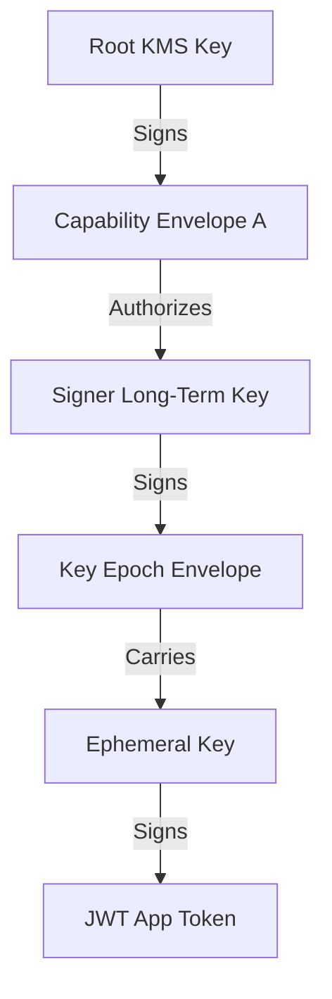

# Operational Procedure: Root and Long-Term Key Rotation

This document outlines the operational procedures for rotating long-term root keys and delegated signer keys within a Veridot V4 deployment.

---

## 1. Architecture Overview

Veridot V4 uses a dual-layer cryptographic hierarchy to guarantee security and performance:
1. **Ephemeral Keys (Short-Lived)**: Rotated automatically in the background (typically every 1–2 hours) by the `KeyRotationService`. These sign individual application payloads.
2. **Long-Term Root Keys (Long-Lived)**: Maintained securely (often in a KMS or HSM) and resolved via a `TrustRoot`. These keys sign `CAPABILITY`, `CONFIG`, and `KEY_EPOCH` envelopes to establish the trust boundary.

Since Veridot relies on a distributed broker (e.g., Kafka) and local verifier caches, long-term root key rotation must be handled sequentially to prevent service interruption.

---

## 2. Planned Root Key Rotation Procedure

To rotate a long-term root identity key without downtime, follow this four-phase protocol:

### Phase 1: Key Generation & Dual Resolution
1. **Generate new key pair**: Create a new root key pair (RSA-PSS `0x03` or Ed25519 `0x02`) in your KMS/Vault.
2. **Configure TrustRoot dual-trust**: Update your `TrustRoot` implementation to resolve and trust **both** the old root public key and the new root public key.
3. **Propagate configurations**: Deploy this trust update to all verifier microservices. Verifiers will now accept envelopes signed by either key.

### Phase 2: Re-issuing Delegations and Configs
1. **Locate active grants**: Identify all active capability chains and global/site configurations signed by the old root key.
2. **Re-sign and publish**:
   - Generate equivalent capability envelopes signed by the **new** root key.
   - For each envelope, increment the `version` counter by at least 1 relative to the old envelope.
   - Publish these envelopes to the broker.
3. **Verify propagation**: Ensure verifiers receive and process the new entries, updating their local watermarks.

### Phase 3: Ephemeral Key / Session Migration
1. **Wait for session rollover**: Ephemeral key epochs have finite validity periods (typically configured via `validity` in `BasicConfigurer`). 
2. **Natural expiration**: Active user sessions will naturally expire or rollover within the validity window.
3. **Enforce rollover (Optional)**: If immediate migration is required, publish a higher version of the corresponding `KEY_EPOCH` signed by the new root key, triggering an automatic eviction of the old epoch on the verifiers.

### Phase 4: Decommissioning the Old Key
1. **Audit metrics**: Check the verifier logs to ensure no active requests are still validating against the old root key.
2. **Remove old key from TrustRoot**: Update the `TrustRoot` mapping to remove the old public key.
3. **Destroy old key**: Permanently disable or delete the old private key in the KMS.

---

## 3. Emergency Key Rotation (Compromise Recovery)

If a root key or a delegated signer's long-term key is compromised:

1. **Immediate Revocation**:
   - Publish a new `LIVENESS` envelope with status `REVOKED` (`0x02`) for all sessions associated with the compromised signer key.
   - Increment the version number to overwrite verifier caches instantly.
2. **Fence Injection**:
   - Issue a new `FENCE` entry to the broker for the affected scopes. This immediately invalidates all active sessions issued before the fence timestamp.
3. **Fast-Track Root Rotation**:
   - Deploy the new `TrustRoot` configuration.
   - Publish the updated capabilities signed by the new root key.
   - Once published, all subsequent requests signed by the compromised key will fail trust resolution (`TRUST_RESOLUTION_FAILED`).

---

## 4. Operational Best Practices

> [!IMPORTANT]
> **Use KMS Integrations**: Never store long-term private keys in plain-text PEM files on local disks in production. Implement `DelegatedTrustRoot` to sign envelopes using cloud KMS providers (Vault, AWS KMS, GCP KMS, Azure Key Vault).

* **Version Monotonicity**: Always increment the version field on any re-signed envelope. Veridot verifiers will reject any incoming entry with a version lower than the currently cached watermark (`STALE_VERSION` error).
* **Monitoring & Alerts**: Set up alerts for `STALE_VERSION` and `TRUST_RESOLUTION_FAILED` errors on verifiers, as these are strong indicators of compromised keys or configuration misalignment.
