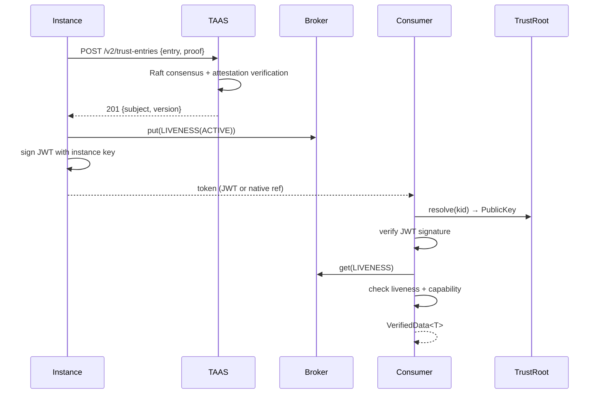

# Veridot Protocol Specification — Version 5

```
Title:        Veridot Protocol v5 — Distributed Authenticity and Integrity
Version:      5.0
Status:       Standards Track
Author:       Frank Cyrille KOSSI KOSSI
Created:      2026-07-11
```

## Status of This Memo

This document specifies the Veridot Protocol version 5 (V5), a
self-describing binary message format for distributing cryptographic
verification metadata across nodes. It defines the wire format,
semantics, state model, and processing rules that all conforming
implementations MUST follow.

## Abstract

The Veridot Protocol is a distributed authenticity and integrity
protocol that enables any participating node to sign arbitrary data
and any other node to verify those signatures without trusting the
transport layer. The protocol is broker-untrusted, attestation-first,
instance-native, and post-quantum ready: security guarantees hold even
when the broker, network, or deployment substrate is fully compromised,
provided the signing private key remains in the custody of its owner.
Data is exchanged as binary envelopes with fixed-offset headers and
TLV-encoded payloads, ensuring deterministic canonical form for
signature computation and O(n) parsing with zero external codec
dependencies. This specification is written for implementers of the
reference implementation and developers of interoperable clients,
libraries, and verification infrastructure.

---

## Table of Contents

1. [Introduction](#1-introduction)
2. [Terminology](#2-terminology)
3. [Binary Envelope Wire Format](#3-binary-envelope-wire-format)
4. [Entry Types and Payloads](#4-entry-types-and-payloads)
5. [Identity Model](#5-identity-model)
6. [Cryptographic Algorithms](#6-cryptographic-algorithms)
7. [Signing Pipeline](#7-signing-pipeline)
8. [Verification Pipeline](#8-verification-pipeline)
9. [Capability System](#9-capability-system)
10. [Liveness System](#10-liveness-system)
11. [Capacity Management](#11-capacity-management)
12. [Version Watermarks](#12-version-watermarks)
13. [Reconciliation](#13-reconciliation)
14. [Encrypted Payloads (E2EE)](#14-encrypted-payloads-e2ee)
15. [Trust Authority & Attestation Service (TAAS)](#15-trust-authority--attestation-service-taas)
16. [Error Codes](#16-error-codes)
17. [Security Considerations](#17-security-considerations)
- [Appendix A: Identifiers Grammar (ABNF)](#appendix-a-identifiers-grammar-abnf--rfc-5234)
- [Appendix B: Test Vectors](#appendix-b-test-vectors)
- [Appendix C: Protocol Registries](#appendix-c-protocol-registries)
- [Appendix D: Metrics Registry](#appendix-d-metrics-registry)
- [Appendix E: Normative References](#appendix-e-normative-references)
- [Appendix F: Informative References](#appendix-f-informative-references)
- [Appendix G: Configuration Constants](#appendix-g-configuration-constants)

---

## 1. Introduction

### 1.1 Purpose

The Veridot Protocol defines a transport-agnostic binary format for
distributing public-key verification metadata, authorization
capabilities, liveness attestations, and capacity-fencing tokens
across a set of cooperating nodes. It enables any node with read
access to the broker to independently verify signed objects produced
by any other node, and to independently determine the current
authoritative state of a session, a configuration scope, or a capacity
quota — without trusting the broker itself, and without requiring the
signer and verifier to communicate directly or share any secret.

The protocol decouples cryptographic identity from the transport
mechanism: an entry signed by a valid identity is equally verifiable
whether it is retrieved from an Apache Kafka topic, a PostgreSQL row,
a Redis key, an S3 object, or a local file. The broker is storage and
delivery only; it holds no authority over the semantics of any byte it
stores or relays.

### 1.2 Scope of This Document

This document is the **NORMATIVE** specification of the Veridot
Protocol version 5. The reference implementation MUST conform to this
document in all respects. In case of discrepancy between this
specification and the behavior of any implementation — including the
reference implementation — this specification takes precedence and the
implementation MUST be corrected.

This specification covers:

- The canonical binary envelope format and the entry-type registry
- Trust Authority (TAAS) and Identity verification
- Capability-based authorization for configuration scopes
- Hierarchical configuration and its resolution rules
- Liveness attestation and revocation semantics
- Session capacity management and fenced eviction
- The state consistency model (monotonicity, idempotence,
  reconciliation)
- Distribution modes (DIRECT, NATIVE, PRIVATE)
- Implementation and broker requirements

This specification does NOT cover:

- Transport-layer implementation details (Kafka, SQL, or otherwise)
- Application-level business rules unrelated to session verification
- Signed object formats (JWT structure, API key encoding, etc.),
  except where referenced by DIRECT distribution mode
- TAAS (Trust Authority and Attestation Service) cluster
  administration and operational procedures
- Root-of-trust key management and provisioning procedures beyond
  the bootstrap protocol defined herein

### 1.3 Design Principles

The following six principles govern every design decision in this
protocol. Each is stated with its rationale.

#### 1.3.1 Attestation-First

Every identity participating in the protocol MUST be backed by an
attestation proof — a cryptographic statement binding the identity to
its key material, verified independently of the identity's own
assertions.

> **Rationale:** Without mandatory attestation, compromise of a
> private key is sufficient for complete identity theft: an attacker
> possessing the key can impersonate the legitimate owner
> indistinguishably. Attestation-first design raises the bar: an
> attacker must compromise *both* the key material *and* the
> attestation infrastructure (e.g., TPM, TAAS, or hardware root of
> trust) to forge an identity. This separation ensures that key
> exfiltration alone — the most common attack vector in cloud
> environments — is insufficient for identity impersonation.

#### 1.3.2 Single Key Per Instance

Each instance generates exactly one asymmetric keypair during its
lifetime. For ephemeral workloads, the keypair is typically not rotated within a running instance;
instead, the instance is replaced (new keypair, new identity, new
registration).

> **Rationale:** Key rotation within a running instance creates
> complex state transitions: the instance must signal which key is
> active, verifiers must track multiple valid keys per identity, and
> the window between old-key retirement and new-key propagation opens
> a denial-of-service or replay surface. By binding one key to one
> instance lifetime, the protocol eliminates rotation complexity
> entirely. If an instance's key is compromised, the blast radius is
> limited to that single instance — it is revoked and replaced, with
> no impact on other instances sharing the same logical service name.

#### 1.3.3 Broker-Untrusted

The broker (the storage and transport layer) is treated as an
adversarial component. The protocol's security guarantees — integrity,
authenticity, ordering, non-repudiation — MUST hold even if the
broker is fully compromised.

> **Rationale:** The transport layer is the most likely attack surface
> in any distributed system. Cloud-managed message brokers, shared
> databases, and networked caches are routinely exposed to credential
> leaks, misconfiguration, and insider threats. By designing the
> protocol to assume the broker is hostile, the protocol's security
> is decoupled from the deployment environment. A Veridot deployment
> on a compromised Kafka cluster provides the same integrity
> guarantees as one on a fully trusted, air-gapped network.

#### 1.3.4 Structural Authorization

Authorization to act on a scope MUST be established by a verifiable,
signed CAPABILITY entry — never by an implementation-defined callback,
an ACL check against an external system, or a deployment-time default.

> **Rationale:** CAPABILITY entries create an auditable, signed,
> replayable authorization trail. Any third party — auditor, incident
> responder, compliance tool — can independently reconstruct the
> complete authorization state at any point in time by replaying the
> CAPABILITY entries in version order. Opaque callbacks and external
> ACLs cannot provide this property: they are not signed, not
> versioned, and not independently verifiable. Structural
> authorization also prevents a class of bugs where a misconfigured
> callback silently grants permissions the operator did not intend.

#### 1.3.5 Instance-Native

The protocol's identity and lifecycle model is designed for ephemeral
compute instances — containers, Kubernetes pods, serverless functions,
VM instances — that start, operate, and terminate on timescales of
seconds to hours.

> **Rationale:** Modern deployments are ephemeral. A Kubernetes pod
> may live for minutes; a serverless function for seconds. Traditional
> identity protocols assume long-lived service identities with
> manually provisioned certificates and multi-year validity windows.
> This mismatch forces operators into complex workarounds: shared
> secrets mounted as volumes, sidecar proxies for mTLS, or
> certificate managers that refresh credentials on a schedule
> orthogonal to the instance lifecycle. By making each instance a
> first-class protocol participant with its own keypair, subject, and
> liveness attestation, the protocol matches the compute lifecycle
> directly, eliminating these workarounds.

#### 1.3.6 Post-Quantum Ready

The protocol's signature algorithm registry and envelope format
accommodate post-quantum signature schemes (ML-DSA per FIPS 204) and
hybrid classical/post-quantum constructions.

> **Rationale:** NIST Post-Quantum Cryptography standards are
> finalized: FIPS 203 (ML-KEM), FIPS 204 (ML-DSA), and FIPS 205
> (SLH-DSA) were published in 2024. While a cryptographically
> relevant quantum computer does not yet exist, the "harvest now,
> decrypt later" threat model means that data signed today with
> classical-only schemes may be forgeable in the future. Hybrid
> schemes (classical signature + PQ signature, both required for
> acceptance) provide defense-in-depth during the transition period:
> if either scheme is broken, the other still protects the envelope.
> The V5 envelope format supports variable-length signatures and a
> u16 flags register with reserved bits for signaling hybrid mode,
> ensuring no envelope-level changes are required when PQ schemes are
> deployed.

### 1.4 Conventions Used in This Document

#### 1.4.1 Pseudo-Code

Pseudo-code in this specification uses the following conventions:

| Convention                           | Meaning                                                                                             |
| ------------------------------------ | --------------------------------------------------------------------------------------------------- |
| `FUNCTION name(params) → ReturnType` | Function definition with typed return                                                               |
| `RAISE ErrorCode NAME("message")`    | Raise a protocol error with code and human-readable message                                         |
| `→`                                  | "returns" (in prose and function signatures)                                                        |
| `‖`                                  | Binary concatenation of byte sequences                                                              |
| `ASSERT condition`                   | If `condition` is false, the operation MUST be aborted with the contextually appropriate error code |

#### 1.4.2 Byte Order

All multi-byte integers in the wire format are encoded in **big-endian
(network byte order)** unless explicitly stated otherwise for a
specific field.

#### 1.4.3 Size Notations

| Notation | Size    | Range                                                  |
| -------- | ------- | ------------------------------------------------------ |
| `u8`     | 1 byte  | 0 – 255                                                |
| `u16`    | 2 bytes | 0 – 65,535                                             |
| `u32`    | 4 bytes | 0 – 4,294,967,295                                      |
| `u64`    | 8 bytes | 0 – 18,446,744,073,709,551,615                         |
| `i64`    | 8 bytes | −9,223,372,036,854,775,808 – 9,223,372,036,854,775,807 |

All size notations refer to unsigned integers unless the `i` prefix
(signed two's-complement) is present. All are big-endian per §1.4.2.

#### 1.4.4 String Encoding

All string fields in the wire format are encoded as **UTF-8** without
a byte-order mark (BOM) and without a null terminator, unless
explicitly stated otherwise for a specific field.

### 1.5 Normative Language

The key words "MUST", "MUST NOT", "REQUIRED", "SHALL", "SHALL NOT",
"SHOULD", "SHOULD NOT", "RECOMMENDED", "MAY", and "OPTIONAL" in this
document are to be interpreted as described in [RFC 2119].

### 1.6 Protocol Overview

The Veridot protocol operates in four phases: Registration, Signing,
Verification, and Revocation. Together, these phases form the complete
lifecycle of a cryptographic identity and its signed artifacts.

#### 1.6.1 Registration

An instance generates an asymmetric keypair and computes its
**subject** — a deterministic, globally unique identifier derived from
the public key. The instance obtains an **attestation proof** binding
its public key to its runtime environment (e.g., a TPM quote, a
Kubernetes service account token, or a platform-specific identity
document). The instance then registers at the **TAAS** (Trust
Authority and Attestation Service) by submitting its trust entry and
attestation proof. The TAAS cluster reaches consensus via Raft,
verifies the attestation proof, and — upon acceptance — stores the
public key and returns the registered subject and version. From this
point, any node that can query the TAAS (or a cached replica) can
resolve the instance's subject to its public key.

#### 1.6.2 Signing

The registered instance signs data using its private key. In
**DIRECT** mode, a standard JWT is produced and returned to the caller
for transmission via any channel. In **NATIVE** mode, the signed
payload is stored as a `SIGNED_DATA` entry in the broker and a
compact reference token (`8:<scope>:<key>`) is returned. In
**PRIVATE** mode, the payload is encrypted with AES-256-GCM for
specific recipients, stored as a `SECURE_PAYLOAD` entry, and a
reference token (`7:<scope>:<key>`) is returned. Regardless of mode,
the instance publishes a `LIVENESS(ACTIVE)` entry to the broker,
attesting that the session is currently valid.

#### 1.6.3 Verification

A verifier receives a token (JWT string, NATIVE reference, or PRIVATE
reference) and performs the following steps in order:

1. **Resolve** the signing identity: extract the key identifier from
   the token, query the TrustRoot (backed by TAAS or a local cache)
   to obtain the signer's public key.
2. **Verify** the cryptographic signature over the token or stored
   entry using the resolved public key.
3. **Check capability**: confirm the signer holds a valid, unexpired
   CAPABILITY entry authorizing it for the relevant scope.
4. **Check liveness**: confirm a fresh `LIVENESS(ACTIVE)` entry
   exists for the signing session.
5. **Deliver** the verified data to the application layer.

Any failure at any step produces rejection. There is no fallback, no
partial acceptance, and no distinction between "absent" and "invalid."

#### 1.6.4 Revocation

An instance that is shutting down, has been compromised, or is being
replaced publishes a `LIVENESS(REVOKED)` entry with a version
strictly greater than its last `ACTIVE` attestation. The monotonic
version invariant ensures that once a `REVOKED` entry is accepted, no
prior `ACTIVE` entry — even one replayed by a compromised broker —
can revert the session to active status. The instance then stops
publishing liveness renewals and destroys its private key. Even
without an explicit `REVOKED` entry, a session whose `LIVENESS(ACTIVE)`
attestation expires (i.e., `now ≥ validUntil`) is treated as not
valid — achieving the same outcome through liveness expiry.

#### 1.6.5 Lifecycle Sequence



#### 1.6.6 Distribution Modes

| Mode    | Token Format      | Storage                    | Use Case                                 |
| ------- | ----------------- | -------------------------- | ---------------------------------------- |
| DIRECT  | JWT string        | None (self-contained)      | Interop with existing JWT infrastructure |
| NATIVE  | `8:<scope>:<key>` | `SIGNED_DATA` in broker    | Veridot-native, no JWT overhead          |
| PRIVATE | `7:<scope>:<key>` | `SECURE_PAYLOAD` in broker | E2EE with recipient-specific encryption  |

> **Note:** There is NO INDIRECT mode. The DIRECT mode covers the
> self-contained token use case (JWT transmitted in HTTP headers,
> cookies, or any text channel), while the NATIVE mode covers the
> broker-mediated use case (compact reference token with payload stored
> in the broker as a first-class signed entry). Between them, DIRECT
> and NATIVE provide complete coverage of all distribution scenarios
> without the ambiguity of an intermediate mode.

---

## 2. Terminology

### 2.1 Key Words

The key words "MUST", "MUST NOT", "REQUIRED", "SHALL", "SHALL NOT",
"SHOULD", "SHOULD NOT", "RECOMMENDED", "MAY", and "OPTIONAL" in this
document are to be interpreted as described in [RFC 2119].

### 2.2 Definitions

**Broker**
:   A transport and storage component providing entry persistence,
    retrieval by key, and full-scope enumeration. The broker is
    responsible for delivery and durability; it is NOT a trusted
    component and holds no authority over the validity of any entry
    it stores or transmits.

**Processor**
:   A software component implementing this protocol. A processor
    performs issuance (creating entries) and/or verification (reading
    and validating entries). A single application MAY contain
    multiple processors.

**TrustRoot**
:   An out-of-band trust store resolving a long-term identifier
    (`issuer`) to a long-term public key, independent of the broker.
    The TrustRoot is the sole source of cryptographic trust in the
    system.

**TAAS** (Trust Authority and Attestation Service)
:   A Raft-replicated cluster that stores long-term public keys,
    verifies attestation proofs at registration time, and serves as
    the backing implementation of the TrustRoot for distributed
    deployments.

**Scope**
:   A typed, hierarchical namespace an entry applies to. A scope is
    one of `group:<groupId>`, `site:<siteId>`, or `global`. A scope
    identifies the set of sessions or configuration targets an entry
    governs.

**Group** (groupId)
:   A logical namespace aggregating related sessions, typically
    mapping to a business entity such as a user account, a service
    instance, an API client, or a device.

**Session** (key)
:   A single verification context within a group, identified by a
    `key` value unique within that group's entry namespace. A
    session is active if and only if a fresh, valid `LIVENESS` entry
    with status `ACTIVE` exists for it.

**Site** (siteId)
:   A logical partition enabling shared configuration across multiple
    groups. A group declares site membership through its `CONFIG`
    payload.

**Entry**
:   A single signed unit of protocol state, conforming to the
    canonical envelope (§3) and belonging to one registered entry type.

**EntryId**
:   The tuple `(scope, entryType, key)` uniquely identifying an entry's
    logical position. The broker storage key is derived deterministically
    from the EntryId (§3.5).

**Version**
:   A 64-bit unsigned integer carried by every entry, strictly
    increasing per EntryId, independent of wall-clock time. Versions
    establish the total order used for monotonic state resolution.


**Capability**
:   A signed grant authorizing a specific issuer identity to act
    (publish configuration or fencing entries) within one or more
    scope patterns.

**Liveness Attestation**
:   A signed, positive statement that a session or scope is in a
    given status (`ACTIVE` or `REVOKED`) as of a given time, valid
    until a given expiry.

**Fence Token**
:   A signed, monotonically increasing counter scoped to a single
    `(scope)`, used to totally order capacity-affecting mutations
    across concurrent processors.

**Snapshot**
:   A complete, point-in-time enumeration of all entries for a given
    scope, used for periodic state reconciliation.

**Distribution Mode**
:   The method by which signed data is delivered to verifiers. The
    protocol defines three modes: **DIRECT** (self-contained JWT
    returned to the caller), **NATIVE** (signed payload stored in
    the broker as a `SIGNED_DATA` entry, compact reference token
    returned), and **PRIVATE** (encrypted payload stored as a
    `SECURE_PAYLOAD` entry, compact reference token returned).

**Trust Bootstrap**
:   The initialization process by which the first trust anchor is
    established in a new deployment. During bootstrap, a root
    identity — whose public key is pre-provisioned in the TrustRoot —
    issues the first CAPABILITY entries, from which all subsequent
    authorization is derived. No CAPABILITY entry is required to
    authorize a root identity; this is the only exception to the
    structural authorization principle, and it exists solely to break
    the circular dependency at deployment genesis.

**Trust Anchor**
:   An identity with `isRoot=true` whose authority is self-derived
    and not delegated via a CAPABILITY chain. A trust anchor's public
    key is pre-provisioned in the TrustRoot by an out-of-band
    mechanism (e.g., KMS registration, PEM file deployment, or HSM
    enrollment). A trust anchor is unconditionally authorized to
    publish CAPABILITY entries for any scope and to issue entries of
    any type without holding a prior CAPABILITY.

---

## 3. Binary Envelope Wire Format

### 3.1 Layout

Every Veridot V5 entry is encoded as a single contiguous binary
envelope with the following layout:

```
 0                   1                   2                   3
 0 1 2 3 4 5 6 7 8 9 0 1 2 3 4 5 6 7 8 9 0 1 2 3 4 5 6 7 8 9 0 1
+-+-+-+-+-+-+-+-+-+-+-+-+-+-+-+-+-+-+-+-+-+-+-+-+-+-+-+-+-+-+-+-+
|     magic[0]  |   magic[1]    | protoVersion  |   entryType   |
+-+-+-+-+-+-+-+-+-+-+-+-+-+-+-+-+-+-+-+-+-+-+-+-+-+-+-+-+-+-+-+-+
|            flags (u16)        |          scopeLen (u16)        |
+-+-+-+-+-+-+-+-+-+-+-+-+-+-+-+-+-+-+-+-+-+-+-+-+-+-+-+-+-+-+-+-+
|                        scope (variable)                       |
+-+-+-+-+-+-+-+-+-+-+-+-+-+-+-+-+-+-+-+-+-+-+-+-+-+-+-+-+-+-+-+-+
|           keyLen (u16)        |         key (variable)        |
+-+-+-+-+-+-+-+-+-+-+-+-+-+-+-+-+-+-+-+-+-+-+-+-+-+-+-+-+-+-+-+-+
|                        version (u64)                          |
|                                                               |
+-+-+-+-+-+-+-+-+-+-+-+-+-+-+-+-+-+-+-+-+-+-+-+-+-+-+-+-+-+-+-+-+
|                       timestamp (i64)                         |
|                                                               |
+-+-+-+-+-+-+-+-+-+-+-+-+-+-+-+-+-+-+-+-+-+-+-+-+-+-+-+-+-+-+-+-+
|         issuerLen (u16)       |       issuer (variable)       |
+-+-+-+-+-+-+-+-+-+-+-+-+-+-+-+-+-+-+-+-+-+-+-+-+-+-+-+-+-+-+-+-+
|                      payloadLen (u32)                         |
+-+-+-+-+-+-+-+-+-+-+-+-+-+-+-+-+-+-+-+-+-+-+-+-+-+-+-+-+-+-+-+-+
|                      payload (variable TLV)                   |
+-+-+-+-+-+-+-+-+-+-+-+-+-+-+-+-+-+-+-+-+-+-+-+-+-+-+-+-+-+-+-+-+
|    sigAlg     |          sigLen (u16)                         |
+-+-+-+-+-+-+-+-+-+-+-+-+-+-+-+-+-+-+-+-+-+-+-+-+-+-+-+-+-+-+-+-+
|                     signature (variable)                      |
+-+-+-+-+-+-+-+-+-+-+-+-+-+-+-+-+-+-+-+-+-+-+-+-+-+-+-+-+-+-+-+-+
```

### 3.2 Field Specifications

| Field          | Offset                                  | Size     | Type       | Description                                                                                       |
| -------------- | --------------------------------------- | -------- | ---------- | ------------------------------------------------------------------------------------------------- |
| `magic`        | 0                                       | 2 bytes  | fixed      | `0x56 0x44` (`"VD"`) — protocol marker                                                            |
| `protoVersion` | 2                                       | 1 byte   | u8         | MUST be `0x05`                                                                                    |
| `entryType`    | 3                                       | 1 byte   | u8         | One of the registered entry types (§4)                                                            |
| `flags`        | 4                                       | 2 bytes  | u16 BE     | Flags register (§3.3)                                                                             |
| `scopeLen`     | 6                                       | 2 bytes  | u16 BE     | Length in bytes of `scope`                                                                        |
| `scope`        | 8                                       | variable | UTF-8      | Typed scope identifier (§3.5)                                                                     |
| `keyLen`       | 8+scopeLen                              | 2 bytes  | u16 BE     | Length in bytes of `key`                                                                          |
| `key`          | 10+scopeLen                             | variable | UTF-8      | Entry key within scope; zero-length permitted for singleton entry types (§4)                      |
| `version`      | 10+scopeLen+keyLen                      | 8 bytes  | u64 BE     | Monotonic version                                                                                 |
| `timestamp`    | 18+scopeLen+keyLen                      | 8 bytes  | i64 BE     | Issuer's wall-clock time, milliseconds since epoch; advisory only — MUST NOT be used for ordering |
| `issuerLen`    | 26+scopeLen+keyLen                      | 2 bytes  | u16 BE     | Length in bytes of `issuer`                                                                       |
| `issuer`       | 28+scopeLen+keyLen                      | variable | UTF-8      | Long-term identifier resolved by the TrustRoot                                                    |
| `payloadLen`   | 28+scopeLen+keyLen+issuerLen            | 4 bytes  | u32 BE     | Length in bytes of `payload`                                                                      |
| `payload`      | 32+scopeLen+keyLen+issuerLen            | variable | binary TLV | Entry-type-specific fields                                                                        |
| `sigAlg`       | 32+scopeLen+keyLen+issuerLen+payloadLen | 1 byte   | u8         | Signature algorithm identifier                                                                    |
| `sigLen`       | 33+scopeLen+keyLen+issuerLen+payloadLen | 2 bytes  | u16 BE     | Length in bytes of `signature`                                                                    |
| `signature`    | 35+scopeLen+keyLen+issuerLen+payloadLen | variable | binary     | Signature over the canonical bytes (§3.4)                                                         |

All multi-byte integers are big-endian. There is no implicit padding
or alignment between fields.

### 3.2.1 RFC-Style Byte Layout (Envelope)

For implementers writing parsers in Rust, Go, or C, the exact byte alignment of the Veridot V5 envelope header is:

```text
 0                   1                   2                   3
 0 1 2 3 4 5 6 7 8 9 0 1 2 3 4 5 6 7 8 9 0 1 2 3 4 5 6 7 8 9 0 1
+-+-+-+-+-+-+-+-+-+-+-+-+-+-+-+-+-+-+-+-+-+-+-+-+-+-+-+-+-+-+-+-+
|          Magic (0x5644)       |    ProtoVersion (0x0005)      |
+-+-+-+-+-+-+-+-+-+-+-+-+-+-+-+-+-+-+-+-+-+-+-+-+-+-+-+-+-+-+-+-+
|   EntryType   |     Flags     |          Scope Length         |
+-+-+-+-+-+-+-+-+-+-+-+-+-+-+-+-+-+-+-+-+-+-+-+-+-+-+-+-+-+-+-+-+
|                                                               |
~                        Scope (Variable)                       ~
|                                                               |
+-+-+-+-+-+-+-+-+-+-+-+-+-+-+-+-+-+-+-+-+-+-+-+-+-+-+-+-+-+-+-+-+
|           Key Length          |                               |
+-+-+-+-+-+-+-+-+-+-+-+-+-+-+-+-+                               +
~                         Key (Variable)                        ~
|                                                               |
+-+-+-+-+-+-+-+-+-+-+-+-+-+-+-+-+-+-+-+-+-+-+-+-+-+-+-+-+-+-+-+-+
|                                                               |
+                    Monotonic Version (u64 BE)                 +
|                                                               |
+-+-+-+-+-+-+-+-+-+-+-+-+-+-+-+-+-+-+-+-+-+-+-+-+-+-+-+-+-+-+-+-+
|                                                               |
+                    Wall-Clock Timestamp (i64 BE)              +
|                                                               |
+-+-+-+-+-+-+-+-+-+-+-+-+-+-+-+-+-+-+-+-+-+-+-+-+-+-+-+-+-+-+-+-+
|         Issuer Length         |                               |
+-+-+-+-+-+-+-+-+-+-+-+-+-+-+-+-+                               +
~                       Issuer (Variable)                       ~
|                                                               |
+-+-+-+-+-+-+-+-+-+-+-+-+-+-+-+-+-+-+-+-+-+-+-+-+-+-+-+-+-+-+-+-+
|                     Payload Length (u32 BE)                   |
+-+-+-+-+-+-+-+-+-+-+-+-+-+-+-+-+-+-+-+-+-+-+-+-+-+-+-+-+-+-+-+-+
|                                                               |
~                  Payload (Binary TLV, Variable)               ~
|                                                               |
+-+-+-+-+-+-+-+-+-+-+-+-+-+-+-+-+-+-+-+-+-+-+-+-+-+-+-+-+-+-+-+-+
|    sigAlg     |            sigLen             |               |
+-+-+-+-+-+-+-+-+-+-+-+-+-+-+-+-+-+-+-+-+-+-+-+-+               +
~                     Signature (Variable)                      ~
|                                                               |
+-+-+-+-+-+-+-+-+-+-+-+-+-+-+-+-+-+-+-+-+-+-+-+-+-+-+-+-+-+-+-+-+
```

**Field validation rules:**

- `magic` and `protoVersion` MUST be validated before any other field
  is interpreted. A mismatch MUST result in immediate rejection with
  error `V5001`, without attempting to parse the remainder of the
  envelope.
- `entryType` MUST be one of the values registered in §4. An
  unregistered value MUST result in rejection with `V5002`.
- `scopeLen` MUST be in the range `1–4096`. `keyLen` MUST be in the
  range `0–4096`. `issuerLen` MUST be in the range `1–4096`. Values
  outside these ranges MUST result in rejection with `V5003`.
- `payloadLen` MUST be in the range `0–65536`. Values outside this
  range MUST result in rejection with `V5004`.
- After consuming all bytes through the end of `signature`, there
  MUST be zero remaining bytes in the envelope buffer. Any trailing
  bytes MUST result in rejection with `V5005`.

> **Rationale — Magic bytes `0x56 0x44`:** ASCII "VD" (Veridot).
> Chosen to not collide with common binary formats: `PK` (ZIP/JAR),
> `GI` (GIF), `BM` (BMP), `7z` (7-Zip), `%P` (PDF). Two bytes
> provide 65,536 possible values, making accidental collision with
> random data negligible.

> **Rationale — Trailing bytes rejection:** Trailing bytes after the
> signature would allow a malicious broker to append data without
> invalidating the signature (since the signature covers only
> canonical bytes). Rejecting any remaining bytes ensures the envelope
> is exactly one complete entry and prevents a compromised transport
> layer from injecting parasitic data alongside a legitimately signed
> envelope.

### 3.3 Flags Register (u16 BE)

The `flags` field is a 16-bit unsigned integer in big-endian byte
order. Bits are numbered 0 (least significant) through 15 (most
significant).

| Bit  | Name               | Description                                                                                                                                                                                                                                                                        |
| ---- | ------------------ | ---------------------------------------------------------------------------------------------------------------------------------------------------------------------------------------------------------------------------------------------------------------------------------- |
| 0    | `COMPACT_SIG`      | MUST be `1` if and only if `sigAlg` indicates a fixed-length signature scheme (Ed25519: `0x04`). MUST be `0` for variable-length schemes (RSA-SHA256: `0x01`, ECDSA-SHA256: `0x02`, RSA-PSS: `0x03`). A mismatch between bit 0 and `sigAlg` MUST result in rejection with `V5005`. |
| 1    | `HYBRID_SIG`       | Reserved for future use: signals that the `signature` field contains a hybrid classical + post-quantum signature. MUST be `0` in this version; if set, MUST result in rejection with `V5005`.                                                                                      |
| 2    | `DETACHED_PAYLOAD` | Reserved for future use: signals that the `payload` field contains a content-address reference to externally stored data rather than inline payload bytes. MUST be `0` in this version; if set, MUST result in rejection with `V5005`.                                             |
| 3    | `COMPRESSED`       | Reserved for future use: signals that the `payload` field is compressed. MUST be `0` in this version; if set, MUST result in rejection with `V5005`.                                                                                                                               |
| 4–15 | *(reserved)*       | MUST be zero. If any reserved bit is set, the envelope MUST be rejected with `V5005`.                                                                                                                                                                                              |

> **Rationale — u16 instead of u8 or u32:** u8 provides only 8 bits
> total; with 4 already defined, only 4 remain for future extensions —
> insufficient for a protocol designed for long-term evolution. u32
> would add 3 bytes of overhead per envelope (vs 1 byte for u16 over
> u8) with no immediate benefit. u16 provides 12 reserved bits (4,096
> possible future flag combinations) while adding only 1 byte of
> overhead — the optimal trade-off between extensibility and wire
> efficiency.

### 3.4 Canonical Signing Bytes

The `signature` field covers every byte of the envelope preceding
`sigAlg`, in encoded order. The signed region comprises, contiguously
and without gaps:

`magic ‖ protoVersion ‖ entryType ‖ flags ‖ scopeLen ‖ scope ‖
keyLen ‖ key ‖ version ‖ timestamp ‖ issuerLen ‖ issuer ‖
payloadLen ‖ payload`

No field is excluded from the signed region, and no field is signed
in isolation from the others. This eliminates any possibility of
relocating a valid signature to a different scope, key, version, or
payload than the one it was produced for.

```
FUNCTION canonicalBytes(envelope) → bytes
    RETURN envelope[0 .. offset(sigAlg) - 1]
```

A processor computing or verifying a signature MUST use exactly these
bytes — no reordering, no field subsetting, no re-encoding. The
signed region is defined positionally, not semantically: it is "every
byte from offset 0 to the byte immediately before `sigAlg`."

### 3.5 Storage Key

The EntryId is the triple `(scope, entryType, key)`. The broker
storage key is computed as:

```
storageKey = scope ‖ 0x00 ‖ u8(entryType) ‖ 0x00 ‖ key
```

where `0x00` is a single NUL byte separator. Because `scope` and
`key` are length-prefixed UTF-8 strings validated against the
identifier constraints below (which exclude NUL), and `entryType` is
a single byte in the range `0x01`–`0xFF`, this construction is
unambiguous and injective.

**Identifier constraints.** `scope` and `key` MUST satisfy:

- **Character set**: any UTF-8 codepoint except `0x00` (NUL) and
  ASCII control characters `0x01`–`0x1F`.

- **Length**: `scope` 1–4096 bytes; `key` 0–4096 bytes (zero
  permitted for singleton entry types per §4).

- **Scope grammar**: `scope` MUST match one of:
  
  - `"group:" 1*125(identifier-char)`
  - `"site:" 1*125(identifier-char)`
  - `"global"`
  
  where `identifier-char` excludes `:` in addition to the constraints
  above. A scope not matching this grammar MUST be rejected with
  `V5006`.

### 3.6 Design Rationale — Size Constraints

| Constraint           | Value  | Rationale                                                                                                                                                                                                |
| -------------------- | ------ | -------------------------------------------------------------------------------------------------------------------------------------------------------------------------------------------------------- |
| ScopeLen max         | 4096   | One memory page. Sufficient for any reasonable hierarchical scope identifier. Scopes beyond this length indicate a design problem in the deployment.                                                     |
| KeyLen max           | 4096   | Symmetric with ScopeLen. Keys are typically UUIDs (36 bytes) or short identifiers.                                                                                                                       |
| IssuerLen max        | 4096   | Subject format is `CN@hash[0:32]` — typically 40–80 bytes. 4096 provides extreme headroom.                                                                                                               |
| PayloadLen max       | 65536  | Fits within common buffer sizes. Payloads are typically serialized JSON of a few KB. For larger data, use `DETACHED_PAYLOAD` flag (reserved for future use) with external storage.                       |
| Version = 0 rejected | Always | Prevents initial-state replay: a watermark defaulting to 0 would accept version 0, allowing an attacker to publish a "genesis" entry at any time. Rejecting 0 ensures the first accepted version is ≥ 1. |

### 3.7 Design Rationale — TLV Codec

The `payload` field of every entry type is encoded as a contiguous
sequence of TLV (Tag–Length–Value) fields. Each TLV field has the
following structure:

| Sub-field | Size     | Type   | Description                                                                   |
| --------- | -------- | ------ | ----------------------------------------------------------------------------- |
| `tag`     | 1 byte   | u8     | Field identifier, entry-type-specific; `0x00` is reserved and MUST NOT appear |
| `len`     | 2 bytes  | u16 BE | Length in bytes of `value`                                                    |
| `value`   | variable | binary | Field value, big-endian for numeric types, UTF-8 for strings                  |

Processing rules:

- A `tag` value of `0x00` MUST result in rejection with `V5007`.
- All REQUIRED fields for the entry type MUST be present; a missing
  REQUIRED field MUST result in rejection with `V5007`.
- OPTIONAL fields MAY be absent; their absence is equivalent to
  applying the documented default.
- A `tag` not recognized by the processor for the current entry type
  MUST be silently ignored (forward compatibility). This applies only
  to payload fields, not to entry types themselves (§4).
- A `tag` appearing more than once within the same payload MUST
  result in rejection with `V5007`.
- All fixed-width numeric `value` fields (u8, u16, u32, u64, i64)
  are big-endian.
- String `value` fields are UTF-8 encoded without a null terminator.
- List-of-string fields are encoded as a concatenation of
  `(u16 length ‖ UTF-8 bytes)` pairs; the outer `len` covers the
  entire serialized list.

Tags `0xF0`–`0xFF` within any entry type are reserved for future
extension and MUST be ignored if unknown.

> **Rationale — Custom TLV instead of Protocol Buffers, CBOR, or
> MessagePack:** The payload is embedded in a binary envelope whose
> canonical signing bytes must be computed deterministically. Protocol
> Buffers use variable-length integers (varints) that make offset
> calculation non-trivial. CBOR and MessagePack have multiple valid
> encodings for the same value (e.g., integer packing), breaking
> canonical form. The custom TLV format (tag: u8 fixed, length: u16
> fixed, value: variable) guarantees:
> 
> 1. **Deterministic encoding** — identical data always produces
>    identical bytes
> 2. **O(n) parsing** — no backtracking, no varint decoding
> 3. **Zero external dependencies** — no protobuf compiler, no CBOR
>    library
> 4. **Simple tag space** — 255 tags per payload type (0x00
>    forbidden), more than sufficient

## 4. Entry Types and Payloads

### 4.1 TLV Codec

All structured payloads in V5 are encoded using a Tag-Length-Value (TLV) codec. Each TLV
field is encoded as:

```
┌──────────┬──────────────┬──────────────────┐
│ Tag (u8) │ Length (u16) │ Value (variable) │
│ 1 byte   │ 2 bytes, BE  │ Length bytes     │
└──────────┴──────────────┴──────────────────┘
```

**Codec rules:**

1. **Tag 0x00 is forbidden.** An encoder MUST NOT emit tag 0x00. A decoder that encounters
   tag 0x00 MUST raise `V5007 INVALID_TLV("Tag 0x00 is reserved as a sentinel")`.

2. **Duplicate tags are forbidden.** If a decoder encounters the same tag value more than
   once within a single TLV payload, it MUST raise `V5007 INVALID_TLV("Duplicate tag")`.

3. **Length is unsigned 16-bit big-endian.** The maximum value field length is 65 535 bytes.
   Payloads requiring larger values MUST use chunked encoding at the application layer.

4. **Unknown tags MUST be preserved.** A compliant implementation that encounters a tag it
   does not recognize MUST retain the tag-length-value triple in its in-memory
   representation and re-emit it on serialization. This ensures forward compatibility when
   new tags are added in future revisions.

5. **Ordering is not significant.** Tags MAY appear in any order. Implementations MUST NOT
   depend on tag ordering for correctness.

> **Rationale:** See §3.7.

#### §4.1.1 Type Readers

The following primitive type readers are defined. Each reader consumes exactly the number
of bytes indicated by the Length field and interprets them as specified:

| Type     | Length   | Encoding                                        |
| -------- | -------- | ----------------------------------------------- |
| `u8`     | 1        | Unsigned 8-bit integer                          |
| `u16`    | 2        | Unsigned 16-bit integer, big-endian             |
| `u32`    | 4        | Unsigned 32-bit integer, big-endian             |
| `u64`    | 8        | Unsigned 64-bit integer, big-endian             |
| `i64`    | 8        | Signed 64-bit integer, big-endian (two's comp.) |
| `string` | variable | UTF-8 encoded string. MUST be valid UTF-8.      |
| `bytes`  | variable | Opaque byte sequence. No encoding constraints.  |

A type reader that receives a value whose byte length does not match the expected length
for fixed-width types MUST raise `V5007 INVALID_TLV("Type length mismatch")`.

#### §4.1.2 String List Sub-Encoding

When a TLV value contains a list of strings, it is encoded as a concatenation of
length-prefixed UTF-8 strings:

```abnf
string-list   = *string-entry
string-entry  = string-len string-data
string-len    = 2OCTET              ; u16 big-endian, length of string-data
string-data   = *OCTET              ; UTF-8 encoded string
```

The total byte length of all `string-entry` elements MUST equal the TLV Length field.
If the byte stream is exhausted mid-entry (i.e., the remaining bytes are fewer than
`string-len` indicates), the decoder MUST raise `V5007 INVALID_TLV("Truncated string list")`.

---

### 4.2 Entry Type Registry

| Code   | Name             | Key Constraint | Singleton | Description                         |
| ------ | ---------------- | -------------- | --------- | ----------------------------------- |
| `0x01` | *(reserved)*     | —              | —         | Reserved. MUST be rejected → V5002. |
| `0x02` | CAPABILITY       | Non-empty      | No        | Authorization grants                |
| `0x03` | CONFIG           | Must be empty  | Yes       | Scope-level configuration           |
| `0x04` | LIVENESS         | Non-empty      | No        | Session liveness                    |
| `0x05` | FENCE            | Must be empty  | Yes       | Concurrency fencing                 |
| `0x06` | SNAPSHOT_MARKER  | Must be empty  | Yes       | Reconciliation boundaries           |
| `0x07` | SECURE_PAYLOAD   | Non-empty      | No        | E2EE payloads                       |
| `0x08` | SIGNED_DATA      | Non-empty      | No        | Native mode signed data             |
| `0x09` | AUDIT_ANCHOR     | Non-empty      | No        | Merkle audit proofs                 |
| `0x0A` | TRUST_REVOCATION | Non-empty      | No        | Identity revocation broadcasts      |

**General rules:**

- An implementation that receives an entry with type code `0x01` MUST raise
  `V5002 UNSUPPORTED_ENTRY_TYPE("Entry type 0x01 is reserved")`.

- An implementation that receives an entry with an unrecognized type code (≥ `0x0B`)
  MUST raise `V5002 UNSUPPORTED_ENTRY_TYPE`.

- **Key Constraint — "Non-empty":** The entry's key field MUST contain at least one byte.
  An empty key MUST cause `V5006 INVALID_KEY("Key is required for this entry type")`.

- **Key Constraint — "Must be empty":** The entry's key field MUST be exactly zero bytes.
  A non-empty key MUST cause `V5006 INVALID_KEY("Key must be empty for singleton entry type")`.

- **Singleton:** At most one entry of this type MAY exist per scope. Publishing a new
  entry of a singleton type within the same scope replaces the previous entry.

> **Rationale — 0x01 reserved:** Code `0x01` was historically allocated. Reserving it
> prevents confusion if old entries are encountered in shared storage and ensures a clean
> namespace.

---

### 4.3 CAPABILITY (0x02)

A CAPABILITY entry grants authorization to a subject (or subject pattern) within a scope.

#### §4.3.1 TLV Tags

| Tag    | Name            | Type        | Required | Description                                                 |
| ------ | --------------- | ----------- | -------- | ----------------------------------------------------------- |
| `0x01` | subjectSid      | `string`    | ①        | Exact subject identifier to authorize                       |
| `0x02` | permissions     | string list | Yes      | List of permission strings                                  |
| `0x03` | notBefore       | `i64`       | Yes      | Validity start (epoch milliseconds)                         |
| `0x04` | notAfter        | `i64`       | Yes      | Validity end (epoch milliseconds)                           |
| `0x05` | subjectPattern  | `string`    | ①        | Wildcard subject pattern                                    |
| `0x06` | delegationDepth | `u8`        | No       | Maximum delegation chain depth. Default: 0 (no delegation). |

**① Mutual exclusivity:** Exactly one of `subjectSid` (tag `0x01`) or `subjectPattern`
(tag `0x05`) MUST be present. If both are present, the decoder MUST raise
`V5007 INVALID_TLV("subjectSid and subjectPattern are mutually exclusive")`. If neither
is present, the decoder MUST raise
`V5007 INVALID_TLV("Either subjectSid or subjectPattern is required")`.

#### §4.3.2 Subject Pattern Grammar

```abnf
subject-pattern = cn-part "@" hash-part
cn-part         = 1*( ALPHA / DIGIT / "-" / "_" / "." / "*" )
hash-part       = 1*( ALPHA / DIGIT / "-" / "_" / "*" )
```

The wildcard character `"*"` matches zero or more characters within the component it
appears in. Examples:

| Pattern                 | Matches                                   |
| ----------------------- | ----------------------------------------- |
| `orders-service@*`      | All instances of `orders-service`         |
| `*@*`                   | All subjects (use with extreme caution)   |
| `orders-*@*`            | All services with CN prefix `orders-`     |
| `admin@abc123def456...` | Exactly the subject with that hash suffix |

> **Rationale — subjectPattern:** In an instance-native model, each instance has a unique
> subject (`CN@hash`). Creating one CAPABILITY entry per instance is operationally expensive
> and fragile (new instances require new CAPABILITYs before they can operate).
> `subjectPattern` with wildcard `"orders-service@*"` authorizes all instances of a service
> class with a single entry.

#### §4.3.3 Validation Rules

1. `notBefore` MUST be strictly less than `notAfter`. Otherwise → `V5007`.
2. `permissions` MUST contain at least one entry. Otherwise → `V5007`.
3. Each permission string MUST be non-empty and MUST NOT exceed 255 bytes when
   UTF-8 encoded. Otherwise → `V5007`.
4. If `delegationDepth` is present and greater than 0, the subject named in this
   CAPABILITY MAY create derivative CAPABILITYs whose `delegationDepth` is strictly
   less than this entry's `delegationDepth`.

---

### 4.4 CONFIG (0x03)

A CONFIG entry holds scope-level configuration parameters. It is a singleton: at most one
CONFIG entry exists per scope.

#### §4.4.1 TLV Tags

| Tag    | Name                 | Type        | Required | Description                                                                                                                   |
| ------ | -------------------- | ----------- | -------- | ----------------------------------------------------------------------------------------------------------------------------- |
| `0x01` | maxEnvelopeSizeBytes | `u32`       | No       | Maximum envelope size in bytes. Default: 65 536.                                                                              |
| `0x02` | maxTtlSeconds        | `u32`       | No       | Maximum TTL for entries in this scope. Default: 86 400.                                                                       |
| `0x03` | requireLiveness      | `u8`        | No       | If `0x01`: LIVENESS entries are mandatory for signing.                                                                        |
| `0x04` | allowedAlgorithms    | string list | No       | Allowed algorithm names. If absent: all algorithms allowed.                                                                   |
| `0x05` | maxPayloadSizeBytes  | `u32`       | No       | Maximum payload size. Default: 32 768.                                                                                        |
| `0x06` | fenceTimeoutSeconds  | `u32`       | No       | FENCE expiration timeout. Default: 30.                                                                                        |
| `0x07` | maxInstanceLifetime  | `u64`       | No       | Maximum instance lifetime in milliseconds. Default: unlimited (`0`).                                                          |
| `0x08` | attestationPlugin    | `string`    | No       | Name of the required attestation plugin for this scope. If present, instances registering in this scope MUST use this plugin. |

#### §4.4.2 Validation Rules

1. The entry key MUST be empty. Otherwise → `V5006`.
2. `maxEnvelopeSizeBytes`, if present, MUST be ≥ 1024 and ≤ 16 777 216 (16 MiB).
   Otherwise → `V5007`.
3. `maxTtlSeconds`, if present, MUST be ≥ 1 and ≤ 31 536 000 (1 year). Otherwise → `V5007`.
4. `requireLiveness`, if present, MUST be `0x00` or `0x01`. Otherwise → `V5007`.
5. `maxInstanceLifetime`, if present, MUST be ≥ 60 000 (1 minute) or `0` (unlimited).
   Otherwise → `V5007`.
6. `attestationPlugin`, if present, MUST be a non-empty UTF-8 string matching the
   pattern `[a-zA-Z][a-zA-Z0-9_-]{0,63}`. Otherwise → `V5007`.

---

### 4.5 LIVENESS (0x04)

A LIVENESS entry represents a session heartbeat. The signing pipeline checks for an active
LIVENESS entry when `requireLiveness` is enabled in the scope's CONFIG.

#### §4.5.1 TLV Tags

| Tag    | Name        | Type     | Required | Description                                   |
| ------ | ----------- | -------- | -------- | --------------------------------------------- |
| `0x01` | sessionId   | `string` | Yes      | Unique session identifier                     |
| `0x02` | heartbeatAt | `i64`    | Yes      | Last heartbeat timestamp (epoch milliseconds) |
| `0x03` | ttlSeconds  | `u32`    | Yes      | Seconds after `heartbeatAt` until expiration  |
| `0x04` | metadata    | `bytes`  | No       | Opaque session metadata                       |

#### §4.5.2 Validation Rules

1. `sessionId` MUST be non-empty and MUST NOT exceed 255 bytes. Otherwise → `V5007`.
2. `ttlSeconds` MUST be ≥ 1 and ≤ 86 400 (24 hours). Otherwise → `V5007`.
3. A LIVENESS entry is considered **active** if and only if:
   `heartbeatAt + (ttlSeconds × 1000) > now`
   where `now` is the current wall-clock time in epoch milliseconds.

---

### 4.6 FENCE (0x05)

A FENCE entry provides concurrency fencing within a scope. It is a singleton.

#### §4.6.1 TLV Tags

FENCE carries no TLV payload. The entry's value field MUST be zero bytes.

#### §4.6.2 Semantics

1. The entry key MUST be empty (singleton constraint). Otherwise → `V5006`.
2. When a FENCE entry is present in a scope, only the instance whose subject matches
   the FENCE entry's `createdBy` field MAY write to that scope.
3. A FENCE entry expires after `fenceTimeoutSeconds` (from CONFIG, default 30 seconds)
   from its creation timestamp.
4. An expired FENCE MUST be treated as absent.

---

### 4.7 SNAPSHOT_MARKER (0x06)

A SNAPSHOT_MARKER entry marks a reconciliation boundary in a scope. It is a singleton.

#### §4.7.1 TLV Tags

SNAPSHOT_MARKER carries no TLV payload. The entry's value field MUST be zero bytes.

#### §4.7.2 Semantics

1. The entry key MUST be empty (singleton constraint). Otherwise → `V5006`.
2. A SNAPSHOT_MARKER indicates that all entries created before this marker's timestamp
   have been reconciled and MAY be compacted.
3. Implementations SHOULD NOT delete entries newer than the latest SNAPSHOT_MARKER.

---

### 4.8 SECURE_PAYLOAD (0x07)

A SECURE_PAYLOAD entry carries end-to-end encrypted data. This is the storage format for
Private (E2EE) mode. See §14 for encryption details.

#### §4.8.1 TLV Tags

| Tag    | Name          | Type     | Required | Description                                 |
| ------ | ------------- | -------- | -------- | ------------------------------------------- |
| `0x01` | ciphertext    | `bytes`  | Yes      | Encrypted payload                           |
| `0x02` | senderSubject | `string` | Yes      | Subject of the sender                       |
| `0x03` | recipientHash | `bytes`  | Yes      | SHA-256 hash of recipient subject           |
| `0x04` | ephemeralPub  | `bytes`  | Yes      | Ephemeral public key (ECIES)                |
| `0x05` | nonce         | `bytes`  | Yes      | AEAD nonce                                  |
| `0x06` | groupId       | `string` | No       | Group identifier for multi-party encryption |

#### §4.8.2 Validation Rules

1. `ciphertext` MUST be non-empty. Otherwise → `V5007`.
2. `senderSubject` MUST conform to the subject format (§5.1). Otherwise → `V5007`.
3. `recipientHash` MUST be exactly 32 bytes. Otherwise → `V5007`.
4. `nonce` length MUST match the AEAD algorithm's nonce size (12 bytes for AES-256-GCM,
   24 bytes for XChaCha20-Poly1305). Otherwise → `V5007`.

---

### 4.9 SIGNED_DATA (0x08)

A SIGNED_DATA entry carries natively signed data. This is the envelope format for Native
mode — the envelope IS the token.

#### §4.9.1 TLV Tags

| Tag    | Name        | Type     | Required | Description                                                                          |
| ------ | ----------- | -------- | -------- | ------------------------------------------------------------------------------------ |
| `0x01` | data        | `bytes`  | Yes      | The signed data payload                                                              |
| `0x02` | contentType | `string` | No       | MIME type of `data` (e.g., `application/json`). Default: `application/octet-stream`. |
| `0x03` | validUntil  | `i64`    | Yes      | Expiration timestamp (epoch milliseconds)                                            |
| `0x04` | groupId     | `string` | No       | Logical grouping identifier                                                          |
| `0x05` | sequenceId  | `string` | No       | Ordering identifier within a group                                                   |

#### §4.9.2 Validation Rules

1. `data` MUST be non-empty. Otherwise → `V5007`.
2. `validUntil` MUST be in the future at the time of creation. Otherwise → `V5007`.
3. `contentType`, if present, MUST be a valid MIME type string per RFC 6838.
   Otherwise → `V5007`.
4. `groupId`, if present, MUST be non-empty and MUST NOT exceed 255 bytes.
   Otherwise → `V5007`.
5. `sequenceId`, if present, MUST be non-empty and MUST NOT exceed 255 bytes.
   Otherwise → `V5007`.

> **Rationale — Native mode envelope:** In Native mode the V5 envelope is the token
> itself. There is no JWT wrapping, no base64url encoding, and no JSON parsing. The
> SIGNED_DATA entry is stored directly in the broker. Verification retrieves the entry,
> checks the envelope signature, and reads the TLV payload — a single decode path with
> minimal overhead.

---

### 4.10 AUDIT_ANCHOR (0x09)

An AUDIT_ANCHOR entry records a Merkle audit proof linking a set of entries to an
externally verifiable hash chain.

#### §4.10.1 TLV Tags

| Tag    | Name       | Type     | Required | Description                                     |
| ------ | ---------- | -------- | -------- | ----------------------------------------------- |
| `0x01` | merkleRoot | `bytes`  | Yes      | Root hash of the Merkle tree                    |
| `0x02` | treeSize   | `u64`    | Yes      | Number of leaves in the Merkle tree             |
| `0x03` | timestamp  | `i64`    | Yes      | Anchor creation timestamp (epoch milliseconds)  |
| `0x04` | proof      | `bytes`  | No       | Inclusion proof (concatenated 32-byte hashes)   |
| `0x05` | anchorRef  | `string` | No       | External reference (e.g., transparency log URL) |

#### §4.10.2 Validation Rules

1. `merkleRoot` MUST be exactly 32 bytes (SHA-256). Otherwise → `V5007`.
2. `treeSize` MUST be ≥ 1. Otherwise → `V5007`.
3. `proof`, if present, MUST have a length that is a multiple of 32. Otherwise → `V5007`.

---

### 4.11 TRUST_REVOCATION (0x0A)

A TRUST_REVOCATION entry broadcasts the revocation of a previously trusted identity.

#### §4.11.1 TLV Tags

| Tag    | Name           | Type     | Required | Description                               |
| ------ | -------------- | -------- | -------- | ----------------------------------------- |
| `0x01` | revokedSubject | `string` | Yes      | Subject being revoked                     |
| `0x02` | reason         | `string` | No       | Human-readable revocation reason          |
| `0x03` | revokedAt      | `i64`    | Yes      | Revocation timestamp (epoch milliseconds) |
| `0x04` | revokerSubject | `string` | Yes      | Subject of the revoking authority         |

#### §4.11.2 Validation Rules

1. `revokedSubject` MUST conform to the subject format (§5.1). Otherwise → `V5007`.
2. `revokerSubject` MUST conform to the subject format (§5.1). Otherwise → `V5007`.
3. `revokedAt` MUST be ≤ current time + `MAX_CLOCK_DRIFT_SECONDS × 1000`. Otherwise → `V5007`.
4. The TRUST_REVOCATION entry MUST be signed by the `revokerSubject`. A verifier MUST
   confirm that the revoker has the `revoke` permission in the applicable scope's
   CAPABILITY chain. Otherwise → `V5301 UNAUTHORIZED`.

---

## 5. Identity Model

### 5.1 Subject Format

Every instance in V5 is identified by a **subject** — a string that binds a human-readable
Common Name (CN) to the cryptographic identity of the instance's keypair.

**Subject construction:**

```
subject = CN + "@" + base64url(SHA-256(publicKeyBytes))[0:32]
```

Where:

- `CN` is the instance's Common Name: a non-empty UTF-8 string of 1–64 bytes matching
  the pattern `[a-zA-Z0-9][a-zA-Z0-9._-]{0,63}`.
- `publicKeyBytes` is the raw public key in its canonical encoding (per §6).
- `SHA-256(publicKeyBytes)` produces a 32-byte (256-bit) digest.
- `base64url(...)` encodes the digest per RFC 4648 §5 (no padding).
- `[0:32]` truncates the base64url string to the first 32 characters.

**ABNF:**

```abnf
subject        = cn "@" key-hash
cn             = 1*64cn-char
cn-char        = ALPHA / DIGIT / "." / "_" / "-"
key-hash       = 32base64url-char
base64url-char = ALPHA / DIGIT / "-" / "_"
```

**Examples:**

| CN               | Subject                                           |
| ---------------- | ------------------------------------------------- |
| `orders-service` | `orders-service@a1B2c3D4e5F6g7H8i9J0k1L2m3N4o5P6` |
| `admin`          | `admin@x9Y8w7V6u5T4s3R2q1P0o9N8m7L6k5J4`          |

> **Rationale — SHA-256 truncated to 32 chars (192 bits):** 192 bits provide collision
> resistance of 2^96 under the birthday bound — far beyond any practical attack, including
> quantum (Grover's algorithm halves preimage resistance but does not affect collision
> resistance). 32 base64url characters is the maximum length that, combined with a typical
> CN of 20–40 characters and the `"@"` separator, stays within the 125-character identifier
> limit.

> **Rationale — "@" separator:** The colon `":"` is the scope delimiter (`group:xxx`,
> `site:xxx`) and the messageId delimiter (`3:group:seq`). Using `":"` for the subject
> would create parsing ambiguity. `"@"` is universally understood as "identity within"
> (email, XMPP, Matrix) and is not used elsewhere in the protocol.

---

### 5.2 Single-Key Architecture

Each V5 instance possesses exactly **one** asymmetric keypair. There is no key rotation
service, no epoch management, and no shared keys between instances.

```
┌─────────────────────────────────────────────────────────┐
│                   Instance "orders-A"                   │
│                                                         │
│  ┌─────────────┐     ┌──────────────────────────────┐   │
│  │ Private Key │────▶│ sign(), decrypt()            │   │
│  │ (never      │     │                              │   │
│  │  exported)  │     │ Subject:                     │   │
│  └─────────────┘     │ orders-service@a1B2c3D4...   │   │
│                      └──────────────────────────────┘   │
│  ┌─────────────┐     ┌──────────────────────────────┐   │
│  │ Public Key  │────▶│ verify(), encrypt()          │   │
│  │ (registered │     │                              │   │
│  │  at TAAS)   │     │ Registered in TrustEntry     │   │
│  └─────────────┘     └──────────────────────────────┘   │
└─────────────────────────────────────────────────────────┘

┌─────────────────────────────────────────────────────────┐
│                   Instance "orders-B"                   │
│                                                         │
│  ┌─────────────┐     ┌──────────────────────────────┐   │
│  │ Private Key │────▶│ INDEPENDENT keypair          │   │
│  │ (different!)│     │                              │   │
│  └─────────────┘     │ Subject:                     │   │
│                      │ orders-service@x9Y8w7V6...   │   │
│  ┌─────────────┐     │                              │   │
│  │ Public Key  │────▶│ Compromise of orders-A does  │   │
│  │             │     │ NOT affect orders-B.         │   │
│  └─────────────┘     └──────────────────────────────┘   │
└─────────────────────────────────────────────────────────┘
```

> **Rationale:** Binding trust to a specific keyhash eliminates implicit key rotation ambiguity (no
> rotation service, no epoch management, no key synchronization). The compromise radius is
> structurally bounded: compromising one instance's key compromises exactly that instance.
> Sister instances hold independent keys and are unaffected. This is the fundamental
> security improvement over shared-key models.

---

### 5.3 Instance Lifecycle

An instance progresses through the following steps from creation to operational readiness:

| Step | Action                                           | Actor    |
| ---- | ------------------------------------------------ | -------- |
| 1    | Generate asymmetric keypair                      | Instance |
| 2    | Compute subject from CN and public key (§5.1)    | Instance |
| 3    | Build TrustEntry (§5.4)                          | Instance |
| 4    | Perform attestation (plugin-dependent)           | Instance |
| 5    | Register at TAAS via REST API                    | Instance |
| 6    | Receive registration confirmation                | TAAS     |
| 7    | Fetch CAPABILITY entries for the target scope(s) | Instance |
| 8    | Verify that a matching CAPABILITY exists         | Instance |
| 9    | Begin signing and verifying                      | Instance |

**Failure handling:**

- **Step 5 failure — attestation rejected:** The instance MUST retry with exponential
  backoff using the schedule: 1s, 2s, 4s, 8s, …, capped at 60s. After 10 consecutive
  failures, the instance SHOULD log a critical alert and shut down. The instance MUST NOT
  begin signing until registration succeeds.
  
  ```
  FUNCTION registerWithRetry(taasClient, trustEntry) → void:
      attempts = 0
      delay = 1000    // milliseconds
      WHILE attempts < 10:
          result = taasClient.register(trustEntry)
          IF result.success:
              RETURN
          attempts = attempts + 1
          sleep(delay)
          delay = min(delay * 2, 60000)
      LOG_CRITICAL("TAAS registration failed after 10 attempts")
      RAISE V5102 REGISTRATION_FAILED("Attestation rejected after retries")
  ```

- **Step 5 failure — TAAS unreachable:** The instance MUST retry with the same exponential
  backoff schedule. The instance MUST NOT begin signing until registration is confirmed.
  Network-level timeouts SHOULD be set to 5 seconds per attempt.

- **Step 7 failure — no matching CAPABILITY:** The instance MUST log a warning and
  SHOULD retry periodically (every 30 seconds) in case a CAPABILITY is published
  asynchronously. The instance MUST NOT sign entries for scopes in which it has no
  confirmed CAPABILITY.

---

### 5.4 TrustEntry Record

A TrustEntry is the canonical record of a registered identity in the TAAS.

#### §5.4.1 Schema

| Field             | Type      | Required | Description                                             |
| ----------------- | --------- | -------- | ------------------------------------------------------- |
| schemaVersion     | `u8`      | Yes      | MUST be `2`.                                            |
| subject           | `string`  | Yes      | Subject identifier (§5.1)                               |
| publicKeyEncoded  | `bytes`   | Yes      | Public key in canonical encoding                        |
| algorithm         | `u8`      | Yes      | Algorithm code (§6)                                     |
| isRoot            | `boolean` | Yes      | `true` if this is a root trust anchor                   |
| isInstanceScoped  | `boolean` | Yes      | `true` if this identity is instance-scoped (single-key) |
| notBefore         | `i64`     | Yes      | Validity start (epoch milliseconds)                     |
| notAfter          | `i64`     | Yes      | Validity end (epoch milliseconds)                       |
| attestationPlugin | `string`  | Yes      | Name of the attestation plugin used during registration |
| attestationRef    | `string`  | No       | Opaque reference to the attestation evidence            |
| kemPublicKey      | `bytes`   | ①        | ML-KEM-768 encapsulation key (1184 bytes)               |

① REQUIRED if the instance intends to receive SECURE_PAYLOAD entries with `encAlg = 0x03` (HYBRID_ASYMMETRIC). If absent, senders MUST NOT use HYBRID_ASYMMETRIC for this recipient and SHOULD fall back to the classical `encAlg` matching the recipient's signing Algorithm.

#### §5.4.2 Canonical Payload

For signature verification of the TrustEntry itself (e.g., TAAS-to-TAAS replication),
the canonical payload is computed as:

```
canonical = schemaVersion ‖ subject.utf8() ‖ publicKeyEncoded ‖ algorithm
            ‖ isRoot.byte() ‖ isInstanceScoped.byte()
            ‖ notBefore.be8() ‖ notAfter.be8()
            ‖ attestationPlugin.utf8()
```

Where:

- `‖` denotes binary concatenation.
- `.utf8()` is the UTF-8 encoding prefixed by its u16 BE length.
- `.byte()` is `0x01` for `true`, `0x00` for `false`.
- `.be8()` is the 8-byte big-endian encoding.

#### §5.4.3 Validation Rules

1. `schemaVersion` MUST be `2`. Otherwise → `V5101 TRUST_RESOLUTION_FAILED`.
2. `subject` MUST conform to §5.1. Otherwise → `V5101`.
3. `publicKeyEncoded` MUST be a valid public key for the declared `algorithm`. Otherwise → `V5101`.
4. `notBefore` MUST be strictly less than `notAfter`. Otherwise → `V5101`.
5. `isRoot` MUST NOT be `true` unless the entry was inserted through the bootstrap
   procedure (§5.7). Otherwise → `V5101`.
6. `attestationPlugin` MUST be non-empty. Otherwise → `V5101`.

---

### 5.5 TrustRoot Resolution

The TrustRoot resolution function maps a subject string to a `TrustIdentity` record that
contains the public key, root status, and algorithm needed for verification.

#### §5.5.1 TrustIdentity Record

```
TrustIdentity(PublicKey publicKey, boolean isRoot, Algorithm algorithm)
```

All three fields MUST NOT be null. A `TrustIdentity` with any null field is a programming
error and MUST cause an immediate assertion failure.

#### §5.5.2 Resolution Function

```
FUNCTION resolve(subject: String) → TrustIdentity:
    entry = trustRootProvider.fetch(subject)
    IF entry is absent:
        RAISE V5101 TRUST_RESOLUTION_FAILED("No TrustEntry for subject: " + subject)
    IF NOT entry.isValidAt(now):
        RAISE V5101 TRUST_RESOLUTION_FAILED("TrustEntry expired or not yet valid")
    publicKey = decodePublicKey(entry.publicKeyEncoded, entry.algorithm)
    RETURN TrustIdentity(publicKey, entry.isRoot, entry.algorithm)
```

Where:

- `trustRootProvider.fetch(subject)` queries the two-level cache (§5.6), falling through
  to the TAAS REST API on cache miss.
- `entry.isValidAt(now)` returns `true` if and only if `entry.notBefore ≤ now ≤ entry.notAfter`.
- `decodePublicKey(bytes, algorithm)` interprets the raw bytes according to the algorithm's
  key encoding rules (§6). If decoding fails → `V5101`.

---

### 5.6 Two-Level Trust Cache

TrustRoot resolution is a latency-critical operation (it occurs on every verification). To
minimize latency and provide resilience against TAAS outages, implementations MUST
maintain a two-level cache.

#### §5.6.1 Cache Architecture

```
┌────────────────┐      miss       ┌─────────────────┐      miss       ┌────────┐
│  L1: In-Memory │ ──────────────▶ │  L2: Persistent │ ──────────────▶ │  TAAS  │
│  (thread-safe) │ ◀────────────── │  (persistent)   │ ◀────────────── │  REST  │
│  TTL: 60s      │      fill       │  TTL: 3600s     │      fill       │  API   │
└────────────────┘                 └─────────────────┘                 └────────┘
```

#### §5.6.2 Cache Behavior

| Property        | L1 (Memory)                   | L2 (Persistent)            |
| --------------- | ----------------------------- | -------------------------- |
| Storage         | Thread-safe map or equivalent | Persistent key-value store |
| TTL             | 60 seconds                    | 3600 seconds (1 hour)      |
| Persistence     | No (lost on restart)          | Yes (survives restart)     |
| Eviction        | TTL-based + LRU               | TTL-based                  |
| Maximum entries | Implementation-defined        | Implementation-defined     |

#### §5.6.3 Stale Window

Entries that are past their `notAfter` timestamp but within `CAPABILITY_CACHE_TTL_SECONDS`
are considered **stale but usable**. When a stale entry is served from cache:

1. The implementation MUST trigger an asynchronous refresh from TAAS.
2. The stale entry MAY be used for the current verification.
3. If the asynchronous refresh succeeds, the cache entry MUST be updated.
4. If the asynchronous refresh fails (TAAS unreachable), the stale entry continues
   to be served until `CAPABILITY_CACHE_TTL_SECONDS` expires.

> **Rationale:** The stale window provides graceful degradation when TAAS is temporarily
> unreachable. Without it, a brief TAAS outage would cause all verifications to fail
> immediately, even for recently-validated identities. The asynchronous refresh ensures
> that the cache converges to the authoritative state once TAAS recovers.

#### §5.6.4 TAAS Unreachable Behavior

When TAAS is unreachable, L1 and L2 caches provide continued operation:

- **Cache hit (fresh):** Verification succeeds normally.
- **Cache hit (stale):** Verification succeeds with a logged warning. Async refresh is
  retried with exponential backoff.
- **Cache miss:** `V5101 TRUST_RESOLUTION_FAILED` is raised. The caller MUST handle this
  error according to its degradation policy.

---

### 5.7 Trust Bootstrap

A new deployment requires at least one trust anchor to bootstrap the authorization chain.

#### §5.7.1 Bootstrap Procedure

1. The TAAS cluster is initialized with a **bootstrap keypair** — the root trust anchor.
   This keypair MUST be generated using a cryptographically secure random number generator
   and SHOULD be generated on an air-gapped system or HSM.

2. The bootstrap key's TrustEntry has `isRoot=true` and is inserted directly into TAAS
   storage (not via the REST API). The insertion mechanism is implementation-defined but
   MUST ensure atomicity and MUST log the insertion as an auditable event.

3. The bootstrap identity publishes the initial CAPABILITY entries into the broker,
   authorizing service-level CAPABILITYs. Example:
   
   ```
   CAPABILITY {
       subjectPattern: "orders-service@*"
       permissions: ["read", "write", "sign"]
       notBefore: <deployment-time>
       notAfter: <deployment-time + 1 year>
   }
   scope: global
   signedBy: bootstrap@<bootstrap-key-hash>
   ```

4. New instances register at TAAS with `isRoot=false` and `isInstanceScoped=true`.

5. When a non-root instance's capability chain is walked (§9), the recursion terminates
   at a root identity. A root identity has implicit authorization for all scopes and
   all permissions.

> **Rationale:** The bootstrap keypair is analogous to a CA root certificate. It must be
> generated and stored securely (offline, HSM-backed). Once initial CAPABILITYs are
> published, the bootstrap key can be taken offline. The protocol does not define the
> bootstrap key management lifecycle — that is a deployment concern.

#### §5.7.2 Security Constraints

- The bootstrap key's attestation MAY use `NoneAttestor` (since the bootstrap identity
  is typically created by an administrator, not by an automated instance).
- All subsequent (non-root) identities MUST use a real attestation plugin. The TAAS
  MUST reject registration of a non-root identity with `attestationPlugin = "NoneAttestor"`.
- The number of root identities SHOULD be minimized. Implementations SHOULD support
  alerting when more than 3 root identities exist.

---

### 5.8 Graceful Degradation

The following table summarizes failure modes, their impact, and required mitigations:

| Failure                               | Impact                                          | Mitigation                                                                                                                                             |
| ------------------------------------- | ----------------------------------------------- | ------------------------------------------------------------------------------------------------------------------------------------------------------ |
| TAAS unreachable at registration      | Instance cannot sign                            | Retry with exponential backoff (1s, 2s, 4s, …, max 60s). Do not begin signing until registered.                                                        |
| TAAS unreachable at verification      | `TrustRoot.resolve()` may fail                  | L1 (memory) and L2 (persistent) caches serve stale entries. Verification succeeds if the entry is cached and within the stale window (§5.6.3).         |
| Broker unreachable                    | `sign()` and `verify()` fail                    | RAISE `V5401 BROKER_UNREACHABLE`. No fallback — the broker is the data plane.                                                                          |
| Clock drift > MAX_CLOCK_DRIFT_SECONDS | Entries may be accepted or rejected incorrectly | Log warning. Implementations SHOULD use NTP or equivalent time synchronization. Implementations MAY expose a clock-drift health check endpoint.        |
| L2 cache corruption                   | Cache miss on restart                           | L2 MUST be treated as a best-effort cache. On corruption, L2 SHOULD be wiped and rebuilt from TAAS. No data loss occurs — TAAS is the source of truth. |

---

## 6. Cryptographic Algorithms

### 6.1 Algorithm Registry

| Code   | Name              | Key Size     | Signature Size | Status                                       |
| ------ | ----------------- | ------------ | -------------- | -------------------------------------------- |
| `0x01` | ED25519           | 32 bytes     | 64 bytes       | Default                                      |
| `0x02` | RSA_PSS_SHA256    | 2048+ bits   | key-size/8     | Default                                      |
| `0x03` | ECDSA_P256_SHA256 | 32 bytes (x) | 64 bytes (r‖s) | Supported                                    |
| `0x04` | ECDSA_P384_SHA384 | 48 bytes (x) | 96 bytes (r‖s) | Supported                                    |
| `0x05` | RSA_PSS_SHA384    | 3072+ bits   | key-size/8     | Supported                                    |
| `0x06` | RSA_PSS_SHA512    | 4096+ bits   | key-size/8     | Supported                                    |
| `0x07` | ML_DSA_65         | 1952 bytes   | 3309 bytes     | Supported                                    |
| `0x08` | *(reserved)*      | —            | —              | Reserved for future threshold signature RFC. |

- **Default** algorithms MUST be supported by all compliant implementations.
- **Supported** algorithms SHOULD be supported. An implementation that does not support a
  **Supported** algorithm MUST raise `V5201 UNSUPPORTED_ALGORITHM` if an entry using that
  algorithm is encountered.
- Code `0x08` is reserved and MUST NOT be used. An implementation that encounters algorithm
  code `0x08` MUST raise `V5201 UNSUPPORTED_ALGORITHM("Algorithm 0x08 is reserved")`.

> **Rationale — FROST reserved:** The FROST threshold signature scheme requires specifying
> key generation (DKG protocol), signing rounds (number of rounds, broadcast requirements),
> and aggregated key storage in TrustEntry. These are complex protocol interactions that
> warrant a dedicated extension RFC. Reserving the code ensures forward compatibility.

### 6.2 Key Encoding

Each algorithm defines a canonical public key encoding:

| Algorithm         | Encoding                                                |
| ----------------- | ------------------------------------------------------- |
| ED25519           | 32-byte raw public key per RFC 8032 §5.1.5              |
| RSA_PSS_*         | DER-encoded `RSAPublicKey` per PKCS#1 (RFC 8017 §A.1.1) |
| ECDSA_P256_SHA256 | 33-byte SEC1 compressed point (0x02 or 0x03 prefix)     |
| ECDSA_P384_SHA384 | 49-byte SEC1 compressed point (0x02 or 0x03 prefix)     |
| ML_DSA_65         | 1952-byte raw public key per FIPS 204                   |

### 6.3 Signature Encoding

| Algorithm         | Encoding                                                          |
| ----------------- | ----------------------------------------------------------------- |
| ED25519           | 64-byte raw signature per RFC 8032                                |
| RSA_PSS_*         | Big-endian integer, zero-padded to key size / 8 bytes             |
| ECDSA_P256_SHA256 | 64 bytes: `r` (32 bytes, big-endian) ‖ `s` (32 bytes, big-endian) |
| ECDSA_P384_SHA384 | 96 bytes: `r` (48 bytes, big-endian) ‖ `s` (48 bytes, big-endian) |
| ML_DSA_65         | 3309-byte raw signature per FIPS 204                              |

> **Note:** ECDSA signatures use fixed-width concatenation (IEEE P1363 format), NOT
> DER-encoded ASN.1. This simplifies parsing and ensures deterministic signature size.

### 6.4 JWT Algorithm Mapping

Each V5 algorithm maps to a JWT `alg` header value:

| V5 Algorithm      | JWT `alg`                  |
| ----------------- | -------------------------- |
| ED25519           | `EdDSA`                    |
| RSA_PSS_SHA256    | `PS256`                    |
| RSA_PSS_SHA384    | `PS384`                    |
| RSA_PSS_SHA512    | `PS512`                    |
| ECDSA_P256_SHA256 | `ES256`                    |
| ECDSA_P384_SHA384 | `ES384`                    |
| ML_DSA_65         | *(N/A — Native mode only)* |

ML_DSA_65 MUST NOT be used in JWT (DIRECT) mode, as no standardized JWT `alg` identifier
exists. An attempt to use ML_DSA_65 in JWT mode MUST raise
`V5201 UNSUPPORTED_ALGORITHM("ML-DSA-65 is not supported in JWT mode")`.

### 6.5 RSA Key Size Constraints

| Algorithm      | Minimum Key Size | Recommended Key Size |
| -------------- | ---------------- | -------------------- |
| RSA_PSS_SHA256 | 2048 bits        | 2048 bits            |
| RSA_PSS_SHA384 | 3072 bits        | 3072 bits            |
| RSA_PSS_SHA512 | 4096 bits        | 4096 bits            |

An RSA public key whose bit length is below the minimum for its algorithm MUST be rejected
with `V5201 UNSUPPORTED_ALGORITHM("RSA key size below minimum")`.

### 6.6 ECDSA Nonce Requirements

ECDSA signing implementations MUST use deterministic nonces per RFC 6979. Implementations
MUST NOT use random nonces for ECDSA. A failure to use deterministic nonces can lead to
private key recovery if the same nonce is used twice (the Sony PS3 ECDSA attack).

### 6.7 Algorithm Selection Rationale

> **Rationale — Default set {ED25519, RSA_PSS}:**
> 
> - **Ed25519:** Deterministic signatures (no nonce to leak), fast (62,000 signatures/sec
>   on modern hardware), compact (64-byte signatures), standardized (RFC 8032).
> - **RSA-PSS:** Backward compatibility with PKI infrastructure that uses RSA keys. PSS is
>   the provably-secure RSA padding (vs PKCS#1 v1.5 which has known vulnerabilities).
> - **ECDSA** is supported but not in the default set because its nonce-dependent signing
>   is a side-channel risk unless using RFC 6979 deterministic nonces.

> **Rationale — ML-DSA-65 (NIST security level 3):**
> ML-DSA-44 (level 2, ~128-bit classical) is considered marginal for long-term protocols.
> ML-DSA-87 (level 5) produces ~4.6 KB signatures, too large for a protocol targeting
> ~1–10 KB envelopes. ML-DSA-65 (level 3, ~192-bit classical) provides a strong security
> margin with ~3.3 KB signatures — the best balance for this protocol.

### 6.8 HKDF Key Derivation

V5 uses HKDF (RFC 5869) with SHA-256 for all key derivation operations.

```
derivedKey = HKDF-Expand(
    HKDF-Extract(salt, IKM),
    info,
    outputLength
)
```

| Parameter     | Value                                     |
| ------------- | ----------------------------------------- |
| Hash          | SHA-256                                   |
| Salt          | Context-dependent (see below)             |
| IKM           | Input keying material (context-dependent) |
| Info          | Context-dependent (see below)             |
| Output Length | Context-dependent (16 or 32 bytes)        |

**Watermark HMAC derivation:**

| Parameter     | Value                                             |
| ------------- | ------------------------------------------------- |
| Salt          | `"veridot-watermark-v5"` (UTF-8 encoded, no null) |
| IKM           | The signing private key's raw bytes               |
| Info          | `"hmac-key"` (UTF-8 encoded)                      |
| Output Length | 32 bytes                                          |

> **Rationale — HKDF salt "veridot-watermark-v5":** Domain separation ensures that key
> material derived for watermark HMAC cannot be confused with key material derived for
> other purposes (ECIES wrapping, future extensions). The version suffix `"v5"` ensures
> that protocol version upgrades produce different derived keys even from the same IKM.

---

## 7. Signing Pipeline

The signing pipeline transforms application data into a verifiable token. V5 supports
three signing modes, each producing a different token format.

### 7.1 JWT Mode (DIRECT — Interoperability)

JWT mode produces a standard JSON Web Token (RFC 7519) suitable for consumption by any
JWT-compatible verifier.

#### §7.1.1 Signing Function

```
FUNCTION signJwt(
    data:       Bytes,
    scope:      Scope,
    privateKey: PrivateKey,
    subject:    String,
    algorithm:  Algorithm,
    ttlSeconds: u32
) → String:

    // 1. Check LIVENESS if required
    config = fetchConfig(scope)
    IF config.requireLiveness:
        liveness = fetchLiveness(scope, subject)
        IF liveness is absent OR NOT liveness.isActive(now):
            RAISE V5301 UNAUTHORIZED("No active LIVENESS session")

    // 2. Build JWT header
    header = {
        "alg": algorithm.jwtAlg(),
        "typ": "JWT",
        "kid": subject
    }

    // 3. Build JWT payload
    payload = {
        "sub":   subject,
        "iss":   "veridot-v5",
        "iat":   now / 1000,                     // seconds
        "exp":   (now / 1000) + ttlSeconds,
        "scope": scope.value(),
        "data":  base64url(data)
    }

    // 4. Compute signature
    signingInput = base64url(json(header)) + "." + base64url(json(payload))
    signature = algorithm.sign(privateKey, signingInput.utf8())

    // 5. Assemble JWT
    jwt = signingInput + "." + base64url(signature)

    // 6. Return token
    RETURN jwt
```

> **Rationale — JWT mode:** JWT (RFC 7519) is the dominant token format in web and
> microservice architectures. JWT mode provides zero-friction interoperability with
> existing verification libraries, API gateways, and service meshes that already
> understand JWT.

#### §7.1.2 JWT Header Fields

| Field | Type     | Required | Description                                      |
| ----- | -------- | -------- | ------------------------------------------------ |
| `alg` | `string` | Yes      | JWT algorithm (§6.4)                             |
| `typ` | `string` | Yes      | MUST be `"JWT"`                                  |
| `kid` | `string` | Yes      | The signer's subject (§5.1), used for key lookup |

#### §7.1.3 JWT Payload Fields

| Field   | Type     | Required | Description                                      |
| ------- | -------- | -------- | ------------------------------------------------ |
| `sub`   | `string` | Yes      | Signer's subject                                 |
| `iss`   | `string` | Yes      | MUST be `"veridot-v5"`                           |
| `iat`   | `number` | Yes      | Issued-at timestamp (seconds since epoch)        |
| `exp`   | `number` | Yes      | Expiration timestamp (seconds since epoch)       |
| `scope` | `string` | Yes      | Scope value (e.g., `"global"`, `"group:orders"`) |
| `data`  | `string` | Yes      | Base64url-encoded application data               |

---

### 7.2 Native Mode (SIGNED_DATA)

Native mode stores signed data directly in a V5 SIGNED_DATA envelope. The envelope IS
the token — there is no JWT wrapping.

#### §7.2.1 Signing Function

```
FUNCTION signNative(
    data:        Bytes,
    scope:       Scope,
    privateKey:  PrivateKey,
    subject:     String,
    algorithm:   Algorithm,
    ttlSeconds:  u32,
    contentType: String,        // optional, default "application/octet-stream"
    groupId:     String,        // optional
    sequenceId:  String         // optional, generated if absent
) → String:

    // 1. Check LIVENESS if required
    config = fetchConfig(scope)
    IF config.requireLiveness:
        liveness = fetchLiveness(scope, subject)
        IF liveness is absent OR NOT liveness.isActive(now):
            RAISE V5301 UNAUTHORIZED("No active LIVENESS session")

    // 2. Generate sequenceId if not provided
    IF sequenceId is absent:
        sequenceId = generateUniqueId()

    // 3. Build SIGNED_DATA TLV payload
    payload = TLV.encode(
        0x01 → data,
        0x02 → contentType,
        0x03 → now + (ttlSeconds * 1000),   // validUntil, i64
        0x04 → groupId,                      // omit if absent
        0x05 → sequenceId
    )

    // 4. Build V5 envelope with signature
    envelope = buildEnvelope(
        entryType:  SIGNED_DATA,
        scope:      scope,
        key:        sequenceId,
        payload:    payload,
        privateKey: privateKey,
        subject:    subject,
        algorithm:  algorithm
    )

    // 5. Publish envelope to broker
    broker.publish(scope, sequenceId, envelope)

    // 6. Return opaque token
    RETURN "8:" + scope.value() + ":" + sequenceId
```

> **Rationale — Native mode:** JWT introduces overhead: base64url encoding (~33% bloat),
> JSON header/payload, and a separate LIVENESS check. Native mode embeds the signed data
> directly in a V5 envelope — the envelope IS the token. This eliminates base64 overhead
> and JWT parsing. Preferred for Veridot-to-Veridot communication.

---

### 7.3 Private Mode (E2EE — SECURE_PAYLOAD)

Private mode encrypts data end-to-end using the recipient's public key and stores it in a
SECURE_PAYLOAD envelope. The encryption protocol is specified in §14.

#### §7.3.1 Signing Function (Summary)

```
FUNCTION signPrivate(
    data:             Bytes,
    scope:            Scope,
    privateKey:       PrivateKey,
    subject:          String,
    recipientSubject: String,
    algorithm:        Algorithm
) → String:

    // 1. Resolve recipient's public key
    recipientIdentity = trustRoot.resolve(recipientSubject)

    // 2. Encrypt data (§14)
    encryptedPayload = eciesEncrypt(data, recipientIdentity.publicKey)

    // 3. Build SECURE_PAYLOAD TLV and envelope
    key = generateUniqueId()
    // ... (see §14 for full encryption pipeline)

    // 4. Publish to broker
    broker.publish(scope, key, envelope)

    // 5. Return opaque token
    RETURN "7:" + scope.value() + ":" + key
```

Full encryption and decryption procedures are specified in §14.

---

### 7.4 Token Format Specification

The signing pipeline produces tokens in one of three formats. Each format is
unambiguously identifiable by its prefix:

| Mode    | Format                          | Example                   | Identification Rule |
| ------- | ------------------------------- | ------------------------- | ------------------- |
| DIRECT  | JWT (3 `.`-separated base64url) | `eyJhbGciOi...`           | Contains `"."`      |
| NATIVE  | `8:<scope>:<key>`               | `8:group:orders:sess-abc` | Starts with `"8:"`  |
| PRIVATE | `7:<scope>:<key>`               | `7:group:orders:msg-123`  | Starts with `"7:"`  |

**Identification precedence:** The prefix check (`"8:"`, `"7:"`) MUST be performed before
the `"."` check. This prevents false positives if a scope or key happens to contain a
period character.

---

### 7.5 Token Parsing Algorithm

The following algorithm parses an opaque token string into a structured `TokenInfo` object.

```
FUNCTION parseToken(token: String) → TokenInfo:
    IF token starts with "8:":
        RETURN parseOpaqueToken(token, SIGNED_DATA)
    IF token starts with "7:":
        RETURN parseOpaqueToken(token, SECURE_PAYLOAD)
    IF token contains ".":
        // JWT: extract kid and sub from header/payload
        parts = token.split("\.")
        IF parts.length < 3:
            RAISE V5001 INVALID_ENVELOPE("Malformed JWT: fewer than 3 parts")
        header = jsonDecode(base64urlDecode(parts[0]))
        payload = jsonDecode(base64urlDecode(parts[1]))
        IF header.kid is absent:
            RAISE V5001 INVALID_ENVELOPE("JWT header missing 'kid'")
        IF header.alg is absent:
            RAISE V5001 INVALID_ENVELOPE("JWT header missing 'alg'")
        IF payload.sub is absent:
            RAISE V5001 INVALID_ENVELOPE("JWT payload missing 'sub'")
        IF payload.exp is absent:
            RAISE V5001 INVALID_ENVELOPE("JWT payload missing 'exp'")
        RETURN JwtTokenInfo(
            kid   = header.kid,
            alg   = header.alg,
            sub   = payload.sub,
            data  = payload.data,
            exp   = payload.exp
        )
    RAISE V5001 INVALID_ENVELOPE("Unrecognized token format")
```

#### §7.5.1 Opaque Token Parser

```
FUNCTION parseOpaqueToken(token: String, expectedType: EntryType) → OpaqueTokenInfo:
    // Token format: "<typeCode>:<scope>:<key>"
    // Scope is ALWAYS one of: "global", "group:<id>", "site:<id>"
    // Parsing strategy: the scope grammar is unambiguous.
    prefix = token.substring(0, 2)          // "7:" or "8:"
    remainder = token.substring(2)          // e.g., "group:orders:sess-abc"

    IF remainder starts with "global:":
        scope = Scope.global()
        key = remainder.substring(7)        // after "global:"
    ELSE IF remainder starts with "group:":
        // Find the SECOND colon after "group:"
        afterGroupPrefix = remainder.substring(6)   // "orders:sess-abc"
        colonIdx = afterGroupPrefix.indexOf(':')
        IF colonIdx < 0:
            RAISE V5006 INVALID_SCOPE_GRAMMAR("Missing key delimiter in group scope")
        groupId = afterGroupPrefix.substring(0, colonIdx)       // "orders"
        key = afterGroupPrefix.substring(colonIdx + 1)          // "sess-abc"
        scope = Scope.group(groupId)
    ELSE IF remainder starts with "site:":
        afterSitePrefix = remainder.substring(5)    // "<siteId>:<key>"
        colonIdx = afterSitePrefix.indexOf(':')
        IF colonIdx < 0:
            RAISE V5006 INVALID_SCOPE_GRAMMAR("Missing key delimiter in site scope")
        siteId = afterSitePrefix.substring(0, colonIdx)
        key = afterSitePrefix.substring(colonIdx + 1)
        scope = Scope.site(siteId)
    ELSE:
        RAISE V5006 INVALID_SCOPE_GRAMMAR("Unrecognized scope prefix")

    IF key is empty:
        RAISE V5006 INVALID_SCOPE_GRAMMAR("Key must be non-empty")

    RETURN OpaqueTokenInfo(scope, key, expectedType)
```

> **Rationale:** The scope grammar (`global`, `group:<id>`, `site:<id>`) is context-free
> and unambiguous. By exploiting the known prefixes, the parser can determine exactly
> where the scope ends and the key begins, even though both may contain colons within
> their structure. The `groupId` and `siteId` themselves MUST NOT contain colons (this
> constraint is enforced at scope creation time), ensuring the first colon after the
> scope prefix is always the delimiter.

---

## 8. Verification Pipeline

The verification pipeline is the inverse of the signing pipeline. It accepts a token,
resolves the signer's identity, verifies the cryptographic signature, and returns the
authenticated data.

### 8.1 Token Dispatch

```
FUNCTION verify(token: String) → VerificationResult:
    IF token starts with "8:":
        RETURN verifyNative(token)
    IF token starts with "7:":
        RETURN verifySecurePayload(token)
    IF token contains ".":
        RETURN verifyJwt(token)
    RAISE V5001 INVALID_ENVELOPE("Unrecognized token format")
```

The dispatch order (prefix checks before `"."` check) MUST match the parsing order
in §7.5.

---

### 8.2 JWT Verification — 7 Steps

JWT verification proceeds in exactly 7 steps. Each step MUST be performed in order. If
any step fails, the verification MUST be aborted and the specified error code raised.

```
FUNCTION verifyJwt(token: String) → VerificationResult:

    // ── Step 1: Parse ──────────────────────────────────────────────────
    // Split the JWT into its three parts and decode header + payload.
    parts = token.split("\.")
    IF parts.length < 3:
        RAISE V5001 INVALID_ENVELOPE("Malformed JWT")
    headerJson  = base64urlDecode(parts[0])
    payloadJson = base64urlDecode(parts[1])
    signatureBytes = base64urlDecode(parts[2])
    header  = jsonDecode(headerJson)
    payload = jsonDecode(payloadJson)

    // ── Step 2: Validate claims ────────────────────────────────────────
    // Ensure all required claims are present and well-formed.
    IF payload.iss ≠ "veridot-v5":
        RAISE V5203 INVALID_ISSUER("Expected issuer 'veridot-v5'")
    IF payload.sub is absent:
        RAISE V5001 INVALID_ENVELOPE("Missing 'sub' claim")
    IF payload.exp is absent:
        RAISE V5001 INVALID_ENVELOPE("Missing 'exp' claim")
    IF payload.scope is absent:
        RAISE V5001 INVALID_ENVELOPE("Missing 'scope' claim")
    IF header.kid is absent:
        RAISE V5001 INVALID_ENVELOPE("Missing 'kid' in header")

    // ── Step 3: Resolve identity ───────────────────────────────────────
    // Extract kid from JWT header and resolve directly — no indirection.
    kid = header.kid
    identity = trustRoot.resolve(kid)
    // identity is TrustIdentity(publicKey, isRoot, algorithm)

    // ── Step 4: Algorithm match ────────────────────────────────────────
    // The JWT alg header MUST match the algorithm declared in TrustIdentity.
    jwtAlg = header.alg
    expectedAlg = identity.algorithm.jwtAlg()
    IF jwtAlg ≠ expectedAlg:
        RAISE V5201 ALGORITHM_MISMATCH(
            "JWT alg '" + jwtAlg + "' does not match identity alg '" + expectedAlg + "'"
        )

    // ── Step 5: Verify signature ───────────────────────────────────────
    signingInput = parts[0] + "." + parts[1]
    valid = identity.algorithm.verify(
        identity.publicKey,
        signingInput.utf8(),
        signatureBytes
    )
    IF NOT valid:
        RAISE V5202 SIGNATURE_INVALID("JWT signature verification failed")

    // ── Step 6: Check expiration (with clock drift tolerance) ──────────
    // Distributed systems have imperfect clocks. Allow a tolerance window.
    expirationMs = payload.exp * 1000
    IF now > expirationMs + MAX_CLOCK_DRIFT_SECONDS * 1000:
        RAISE V5203 TOKEN_EXPIRED(
            "JWT expired at " + payload.exp + ", now is " + (now / 1000) +
            " (drift tolerance: " + MAX_CLOCK_DRIFT_SECONDS + "s)"
        )

    // ── Step 7: Authorize ──────────────────────────────────────────────
    // Walk the CAPABILITY chain to confirm the subject is authorized
    // in the declared scope. See §9.
    scope = parseScope(payload.scope)
    authorized = authorizeSubject(payload.sub, scope)
    IF NOT authorized:
        RAISE V5301 UNAUTHORIZED("Subject not authorized in scope")

    // ── Return ─────────────────────────────────────────────────────────
    RETURN VerificationResult(
        subject = payload.sub,
        scope   = scope,
        data    = base64urlDecode(payload.data),
        algorithm = identity.algorithm,
        isRoot  = identity.isRoot
    )
```

> **Rationale — Clock drift tolerance in JWT verification:** Distributed systems have
> imperfect clock synchronization. Rejecting a JWT whose `exp` is 1 second in the past
> when the verifier's clock is 2 seconds ahead would cause false negatives.
> `MAX_CLOCK_DRIFT_SECONDS` (default 300 = 5 minutes) provides a generous tolerance.
> NTP-synchronized systems typically have <100ms drift.

#### §8.2.1 Verification Constants

| Constant                  | Type  | Default | Description                            |
| ------------------------- | ----- | ------- | -------------------------------------- |
| `MAX_CLOCK_DRIFT_SECONDS` | `u32` | 300     | Maximum allowed clock drift in seconds |

Implementations MAY make this configurable but MUST NOT set it below 5 seconds or
above 600 seconds.

---

### 8.3 Native Verification — 6 Steps

Native verification retrieves the SIGNED_DATA envelope from the broker and verifies it
in place.

```
FUNCTION verifyNative(token: String) → VerificationResult:

    // ── Step 1: Parse opaque token ─────────────────────────────────────
    tokenInfo = parseOpaqueToken(token, SIGNED_DATA)
    // tokenInfo.scope, tokenInfo.key, tokenInfo.expectedType

    // ── Step 2: Fetch envelope from broker ─────────────────────────────
    envelope = broker.fetch(tokenInfo.scope, tokenInfo.key)
    IF envelope is absent:
        RAISE V5001 INVALID_ENVELOPE("No envelope found for token")
    IF envelope.entryType ≠ SIGNED_DATA:
        RAISE V5002 UNSUPPORTED_ENTRY_TYPE("Expected SIGNED_DATA, got " + envelope.entryType)

    // ── Step 3: Resolve signer identity ────────────────────────────────
    subject = envelope.createdBy
    identity = trustRoot.resolve(subject)
    // identity is TrustIdentity(publicKey, isRoot, algorithm)

    // ── Step 4: Verify envelope signature ──────────────────────────────
    canonicalBytes = envelope.canonicalPayload()
    valid = identity.algorithm.verify(
        identity.publicKey,
        canonicalBytes,
        envelope.signature
    )
    IF NOT valid:
        RAISE V5202 SIGNATURE_INVALID("Envelope signature verification failed")

    // ── Step 5: Check expiration ───────────────────────────────────────
    payload = TLV.decode(envelope.value)
    validUntil = payload.getI64(0x03)       // tag 0x03 = validUntil
    IF now > validUntil + MAX_CLOCK_DRIFT_SECONDS * 1000:
        RAISE V5203 TOKEN_EXPIRED("SIGNED_DATA expired")

    // ── Step 6: Authorize ──────────────────────────────────────────────
    authorized = authorizeSubject(subject, tokenInfo.scope)
    IF NOT authorized:
        RAISE V5301 UNAUTHORIZED("Subject not authorized in scope")

    // ── Return ─────────────────────────────────────────────────────────
    data = payload.getBytes(0x01)           // tag 0x01 = data
    contentType = payload.getString(0x02)   // tag 0x02, optional
    RETURN VerificationResult(
        subject     = subject,
        scope       = tokenInfo.scope,
        data        = data,
        contentType = contentType,
        algorithm   = identity.algorithm,
        isRoot      = identity.isRoot
    )
```

#### §8.3.1 Native Mode — No Clock Drift Double-Dipping

The clock drift tolerance MUST be applied to `validUntil` in Step 5 using the same
`MAX_CLOCK_DRIFT_SECONDS` constant as JWT verification (§8.2.1). This ensures consistent
expiration semantics across both modes.

---

### 8.4 Secure Payload Verification

SECURE_PAYLOAD verification follows the same 6-step structure as Native verification,
with an additional decryption step. The full procedure is specified in §14.

```
FUNCTION verifySecurePayload(token: String) → VerificationResult:

    // ── Step 1: Parse opaque token ─────────────────────────────────────
    tokenInfo = parseOpaqueToken(token, SECURE_PAYLOAD)

    // ── Step 2: Fetch envelope from broker ─────────────────────────────
    envelope = broker.fetch(tokenInfo.scope, tokenInfo.key)
    IF envelope is absent:
        RAISE V5001 INVALID_ENVELOPE("No envelope found for token")
    IF envelope.entryType ≠ SECURE_PAYLOAD:
        RAISE V5002 UNSUPPORTED_ENTRY_TYPE("Expected SECURE_PAYLOAD")

    // ── Step 3: Resolve sender identity ────────────────────────────────
    subject = envelope.createdBy
    identity = trustRoot.resolve(subject)

    // ── Step 4: Verify envelope signature ──────────────────────────────
    valid = identity.algorithm.verify(
        identity.publicKey,
        envelope.canonicalPayload(),
        envelope.signature
    )
    IF NOT valid:
        RAISE V5202 SIGNATURE_INVALID("Envelope signature verification failed")

    // ── Step 5: Decrypt (§14) ──────────────────────────────────────────
    payload = TLV.decode(envelope.value)
    plaintext = eciesDecrypt(payload, recipientPrivateKey)

    // ── Step 6: Authorize ──────────────────────────────────────────────
    authorized = authorizeSubject(subject, tokenInfo.scope)
    IF NOT authorized:
        RAISE V5301 UNAUTHORIZED("Subject not authorized in scope")

    RETURN VerificationResult(
        subject   = subject,
        scope     = tokenInfo.scope,
        data      = plaintext,
        algorithm = identity.algorithm,
        isRoot    = identity.isRoot
    )
```

---

### 8.5 Error Code Summary

The following error codes are raised during verification:

| Code  | Name                    | Cause                                             |
| ----- | ----------------------- | ------------------------------------------------- |
| V5001 | INVALID_ENVELOPE        | Malformed token or envelope                       |
| V5002 | UNSUPPORTED_ENTRY_TYPE  | Entry type mismatch or reserved type              |
| V5006 | INVALID_SCOPE_GRAMMAR   | Opaque token scope cannot be parsed               |
| V5101 | TRUST_RESOLUTION_FAILED | Subject not found or TrustEntry invalid/expired   |
| V5201 | UNSUPPORTED_ALGORITHM   | Algorithm not supported or algorithm mismatch     |
| V5202 | SIGNATURE_INVALID       | Cryptographic signature verification failed       |
| V5203 | TOKEN_EXPIRED           | Token past expiration (including drift tolerance) |
| V5301 | UNAUTHORIZED            | Subject lacks CAPABILITY in the declared scope    |
| V5401 | BROKER_UNREACHABLE      | Broker not available for envelope fetch/publish   |

All error codes MUST include a human-readable message. Implementations SHOULD include
the subject, scope, and algorithm in the error message to aid debugging. Implementations
MUST NOT include private key material, raw signatures, or cached TrustEntry contents in
error messages.

## 9. Capability System

The capability system governs authorization within Veridot V5. A CAPABILITY entry grants a subject the right to perform operations (sign, verify, publish, consume) within one or more scope patterns. Capabilities MAY be delegated: a subject holding a CAPABILITY with `maxDelegationDepth > 0` MAY mint a child CAPABILITY for another subject, decrementing `maxDelegationDepth` by one.

### 9.1 Chain Walking Algorithm

To verify that a subject `S` holds a valid CAPABILITY for scope `targetScope` and operation `op`, the verifier MUST walk the delegation chain from `S` back to a root authority.

```
FUNCTION walkCapabilityChain(subject, targetScope, op, broker, taas) → CapabilityResult
  MAX_DEPTH ← 10
  visited  ← ∅
  current  ← subject
  depth    ← 0

  LOOP:
    IF depth > MAX_DEPTH THEN
      RAISE V5401 DELEGATION_DEPTH_EXCEEDED(
        "Delegation chain exceeded maximum depth of 10"
      )
    END IF

    IF current ∈ visited THEN
      RAISE V5402 CIRCULAR_DELEGATION(
        "Circular delegation detected at subject: " ‖ current
      )
    END IF

    visited ← visited ∪ {current}

    cap ← broker.lookupCapability(current, targetScope)
    IF cap = NULL THEN
      RAISE V5403 NO_CAPABILITY(
        "No capability found for subject: " ‖ current ‖ " scope: " ‖ targetScope
      )
    END IF

    ; Verify the capability envelope signature
    trustEntry ← taas.resolve(cap.signerSubject)
    IF trustEntry = NULL THEN
      RAISE V5101 TRUST_RESOLUTION_FAILED(
        "Cannot resolve trust for signer: " ‖ cap.signerSubject
      )
    END IF

    valid ← verifySignature(cap.envelope, trustEntry.publicKey, trustEntry.algorithm)
    IF NOT valid THEN
      RAISE V5102 SIGNATURE_INVALID(
        "Capability signature verification failed"
      )
    END IF

    ; Check operation permission
    IF op NOT IN cap.allowedOperations THEN
      RAISE V5404 OPERATION_DENIED(
        "Operation " ‖ op ‖ " not permitted by capability"
      )
    END IF

    ; Check scope pattern match
    IF NOT matchesScopePattern(targetScope, cap.scopePatterns) THEN
      RAISE V5405 SCOPE_MISMATCH(
        "Target scope does not match any capability scope pattern"
      )
    END IF

    ; Check expiry
    IF now() > cap.validUntil THEN
      RAISE V5406 CAPABILITY_EXPIRED(
        "Capability expired at: " ‖ cap.validUntil
      )
    END IF

    ; If the signer is a root authority, the chain is valid
    IF taas.isRoot(cap.signerSubject) THEN
      RETURN CapabilityResult(GRANTED, depth, cap)
    END IF

    ; Otherwise, walk up to the signer
    current ← cap.signerSubject
    depth   ← depth + 1
  END LOOP
END FUNCTION
```

> **Rationale — Max delegation depth = 10:** Empirically, microservice delegation chains rarely exceed 3–4 levels (service → team-admin → platform-admin → root). 10 provides generous headroom while bounding computational cost (each level = 1 broker read + 1 signature verification + 1 TrustRoot resolution ≈ 3 ms per level). Beyond 10, the risk of circular delegation laundering (where a chain obscures the true authority) grows unacceptably.

### 9.2 Capability Resolution

When resolving a capability for a subject and scope, implementations MUST apply the following lookup order:

1. **Exact match** — The scope string matches a `scopePattern` entry exactly.
2. **Prefix match** — The scope string starts with a `scopePattern` that ends with `:*` (wildcard suffix).
3. **Subject pattern match** — The capability's `subjectPattern` field uses the
   wildcard grammar defined in §4.3.2 to match subjects by component.

#### 9.2.1 Scope Pattern Matching

```
FUNCTION matchesScopePattern(targetScope, patterns) → boolean
  FOR EACH pattern IN patterns DO
    IF pattern = targetScope THEN
      RETURN true
    END IF
    IF pattern ends with ":*" THEN
      prefix ← pattern[0 .. len(pattern) - 2]   ; strip trailing "*"
      IF targetScope starts with prefix THEN
        RETURN true
      END IF
    END IF
  END FOR
  RETURN false
END FUNCTION
```

#### 9.2.2 Subject Pattern Matching

The wildcard `*` matches zero or more characters within the component it
appears in. The pattern MUST contain exactly one `@` separator. Each
component (`cn-part` and `hash-part`) is matched independently:

- If a component is exactly `"*"`, it matches any value.
- If a component ends with `"*"`, it matches any value that starts with
  the prefix preceding `"*"`.
- Otherwise, the component is compared by exact string equality.

Examples:

| `subjectPattern`           | `candidateSubject`            | Result |
|----------------------------|-------------------------------|--------|
| `orders-service@*`         | `orders-service@a1B2c3D4...` | MATCH  |
| `orders-*@*`               | `orders-api@x9Y8z7...`       | MATCH  |
| `orders-*@*`               | `billing-svc@a1B2...`        | NO     |
| `*@*`                      | (any valid subject)           | MATCH  |
| `admin@abc123`             | `admin@abc123`                | MATCH  |
| `admin@abc123`             | `admin@xyz789`                | NO     |

```
FUNCTION matchesSubjectPattern(candidateSubject, subjectPattern) → boolean
  ; Split both on "@"
  patternParts  ← split(subjectPattern, "@")
  candidateParts ← split(candidateSubject, "@")

  IF len(patternParts) ≠ 2 OR len(candidateParts) ≠ 2 THEN
    RETURN false    ; malformed — reject
  END IF

  RETURN matchesComponent(candidateParts[0], patternParts[0])
     AND matchesComponent(candidateParts[1], patternParts[1])
END FUNCTION

FUNCTION matchesComponent(value, pattern) → boolean
  IF pattern = "*" THEN
    RETURN true
  END IF
  IF pattern ends with "*" THEN
    prefix ← pattern[0 .. len(pattern) - 2]   ; strip trailing "*"
    RETURN value starts with prefix
  END IF
  RETURN value = pattern
END FUNCTION
```

Implementations MUST check `subjectPattern` before checking `subjectSid`. If `subjectPattern` is present and non-empty, it takes precedence as the authorization target. If both are present, the entry authorizes the specific `subjectSid` AND any subject matching `subjectPattern`.

### 9.3 Caching

Implementations SHOULD cache resolved capabilities to avoid repeated chain walks. The cache operates at two levels:

| Cache Level  | Key                    | Value              | TTL                                                 | Eviction   |
| ------------ | ---------------------- | ------------------ | --------------------------------------------------- | ---------- |
| **Positive** | `(subject, scope, op)` | `CapabilityResult` | `min(cap.validUntil - now(), CAPABILITY_CACHE_TTL)` | Time-based |
| **Negative** | `(subject, scope, op)` | `DENIED`           | `CAPABILITY_NEGATIVE_CACHE_TTL` (default: 30 s)     | Time-based |

Negative cache entries MUST have a short TTL (≤ 60 s) to avoid stale denials after capability grants. Implementations MUST invalidate positive cache entries when:

1. A TRUST_REVOCATION entry is received for any subject in the cached chain.
2. A reconciliation cycle detects a newer CAPABILITY version for any subject in the cached chain.
3. The entry's `validUntil` timestamp is reached.

Cache writes MUST use atomic compare-and-set operations to prevent race conditions between concurrent verifications.

---

## 10. Liveness System

The liveness system provides real-time presence and revocation signaling. Each instance periodically publishes a LIVENESS entry proving it is active and has not been revoked. Verifiers check liveness to reject entries from compromised or decommissioned instances.

### 10.1 Verification

The liveness verification pipeline consists of 8 steps, executed in order. If any step fails, the entire verification MUST be rejected.

```
FUNCTION verifyLiveness(entry, taas, broker, watermarks) → LivenessResult
  ; Step 1: Parse the LIVENESS payload
  payload ← parseLivenessPayload(entry)
  IF payload = NULL THEN
    RAISE V5201 MALFORMED_LIVENESS("Cannot parse LIVENESS payload")
  END IF

  ; Step 2: Verify entry type
  IF entry.entryType ≠ LIVENESS (0x04) THEN
    RAISE V5202 WRONG_ENTRY_TYPE("Expected LIVENESS entry type")
  END IF

  ; Step 3: Resolve trust for the signer
  trustEntry ← taas.resolve(entry.signerSubject)
  IF trustEntry = NULL THEN
    RAISE V5101 TRUST_RESOLUTION_FAILED(
      "Cannot resolve trust for: " ‖ entry.signerSubject
    )
  END IF

  ; Step 4: Verify the envelope signature
  valid ← verifySignature(entry.envelope, trustEntry.publicKey, trustEntry.algorithm)
  IF NOT valid THEN
    RAISE V5102 SIGNATURE_INVALID("LIVENESS signature verification failed")
  END IF

  ; Step 5: Check status field
  IF payload.status = REVOKED THEN
    RETURN LivenessResult(REVOKED, entry.signerSubject)
  END IF

  ; Step 6: Check freshness — asOf timestamp
  age ← now() - payload.asOf
  IF age > MAX_LIVENESS_AGE_SECONDS THEN
    RAISE V5203 LIVENESS_STALE(
      "LIVENESS entry is " ‖ age ‖ "s old, max=" ‖ MAX_LIVENESS_AGE_SECONDS
    )
  END IF

  ; Step 7: Check validUntil
  IF now() > payload.validUntil THEN
    RAISE V5204 LIVENESS_EXPIRED("LIVENESS entry has expired")
  END IF

  ; Step 8: Version watermark check
  accepted ← watermarks.accept(
    watermarkKey("liveness", entry.signerSubject, entry.scope),
    entry.version
  )
  IF NOT accepted THEN
    RAISE V5301 VERSION_REJECTED("LIVENESS version rejected by watermark")
  END IF

  RETURN LivenessResult(ALIVE, entry.signerSubject)
END FUNCTION
```

Implementations MUST execute all 8 steps in the specified order. Short-circuit evaluation (returning early on the first failure) is permitted and encouraged.

### 10.2 Publication

An instance MUST publish a LIVENESS entry upon successful boot and registration. The publication process is:

1. Construct a LIVENESS payload with:
   - `status` = ALIVE (0x01)
   - `asOf` = current wall-clock time (milliseconds since epoch)
   - `validUntil` = `asOf` + `LIVENESS_VALIDITY_SECONDS × 1000`
2. Wrap the payload in an envelope with a monotonically increasing version.
3. Sign the envelope with the instance's private key.
4. Publish to the broker on the scope the instance is registered for.

The first LIVENESS entry published after boot MUST have a version strictly greater than any previously published version for the same `(subject, scope)` pair. Implementations SHOULD persist the last published version to stable storage to survive restarts.

### 10.3 Renewal Loop

After initial publication, the instance MUST enter a renewal loop:

```
FUNCTION livenessRenewalLoop(instance, broker, scope)
  validity ← LIVENESS_VALIDITY_SECONDS
  renewAt  ← validity × 0.80          ; 80% of validity duration

  LOOP FOREVER:
    sleep(renewAt seconds)

    IF instance.isRevoked() THEN
      ; Publish a final REVOKED entry and exit
      publishLiveness(instance, broker, scope, REVOKED)
      RETURN
    END IF

    publishLiveness(instance, broker, scope, ALIVE)
  END LOOP
END FUNCTION
```

If a renewal attempt fails (network error, broker unavailable), the implementation MUST retry with exponential backoff:

| Retry | Delay         |
| ----- | ------------- |
| 1     | 1 s           |
| 2     | 2 s           |
| 3     | 4 s           |
| 4     | 8 s           |
| 5+    | 16 s (capped) |

If renewal has not succeeded by the time `validUntil` is reached, the instance MUST cease publishing signed entries (except a final REVOKED liveness entry if connectivity is restored) and MUST log a security alert.

> **Rationale — 80% renewal threshold:** 80% leaves 20% of the validity duration as a grace window for network failures or scheduling delays. This is a standard practice: TLS OCSP stapling renews at ~50%, ACME (Let's Encrypt) recommends ~66%. 80% minimizes unnecessary renewals (compared to 50%) while maintaining a comfortable margin for 1–2 retry attempts before expiration.

---

## 11. Capacity Management

Capacity management controls how many concurrent sessions (instances) may operate within a given scope. The FENCE entry type provides distributed mutual exclusion, and the CONFIG entry's `max` field defines the session limit.

### 11.1 Enforcement Flow

When an instance attempts to join a scope, the capacity enforcement flow executes:

```
FUNCTION enforceCapacity(instance, scope, broker, config) → EnforcementResult
  MAX_RETRIES  ← 3
  BASE_BACKOFF ← 50   ; milliseconds

  FOR attempt ← 1 TO MAX_RETRIES DO
    ; Read the current FENCE entry for this scope
    fence ← broker.readFence(scope)

    ; Read the CONFIG entry for this scope
    maxSessions ← config.max
    IF maxSessions = 0 THEN
      RAISE V5301 CAPACITY_DISABLED("Capacity management disabled for scope")
    END IF

    ; Count active sessions (those with valid, non-revoked LIVENESS)
    activeSessions ← countActiveSessions(scope, broker)

    IF activeSessions < maxSessions THEN
      ; Attempt to acquire a slot
      newFence ← fence.incrementCounter()
      newFence.grantedTo ← instance.subject
      newFence.validUntil ← now() + FENCE_VALIDITY_SECONDS

      success ← broker.compareAndSwapFence(scope, fence, newFence)
      IF success THEN
        RETURN EnforcementResult(GRANTED, newFence.fenceCounter)
      END IF
      ; CAS failed — another instance raced us; retry
    ELSE
      ; At capacity — attempt eviction per policy
      evicted ← applyEvictionPolicy(scope, config.evictionPolicy, broker)
      IF NOT evicted THEN
        IF config.evictionPolicy = REJECT THEN
          RAISE V5302 CAPACITY_EXCEEDED(
            "Scope " ‖ scope ‖ " at capacity (" ‖ maxSessions ‖ ")"
          )
        END IF
      END IF
      ; Eviction succeeded — retry acquisition
    END IF

    sleep(BASE_BACKOFF × attempt)   ; linear backoff: 50ms, 100ms, 150ms
  END FOR

  RAISE V5303 CAPACITY_CONTENTION(
    "Failed to acquire capacity after " ‖ MAX_RETRIES ‖ " retries"
  )
END FUNCTION
```

> **Rationale — 3 retries, 50 ms × attempt backoff:** FENCE contention is rare (requires two instances writing the same scope simultaneously). 3 retries with linear backoff (50 ms + 100 ms + 150 ms = 300 ms total worst case) resolves contention without blocking the calling thread excessively. Exponential backoff (50 ms, 100 ms, 200 ms = 350 ms) provides marginal improvement for a window this short.

### 11.2 Eviction Policies

When a scope reaches its session capacity and a new instance requests admission, the eviction policy determines which existing session (if any) is removed.

| Code   | Policy     | Description                                                                |
| ------ | ---------- | -------------------------------------------------------------------------- |
| `0x01` | **FIFO**   | Evict the **oldest** session (earliest `grantedAt` timestamp).             |
| `0x02` | **LIFO**   | Evict the **newest** session (latest `grantedAt` timestamp).               |
| `0x03` | **LRU**    | Evict the **least recently active** session (oldest last-LIVENESS `asOf`). |
| `0x04` | **REJECT** | Do not evict. Reject the incoming instance with `V5302 CAPACITY_EXCEEDED`. |

The eviction policy is specified in the CONFIG entry's `pol` field. If `pol` is absent or unrecognized, implementations MUST default to **REJECT**.

When evicting a session, the implementation MUST:

1. Publish a LIVENESS entry with `status = REVOKED` on behalf of the evicted instance (signed by the scope administrator or TAAS).
2. Update the FENCE entry to remove the evicted instance from `grantedTo`.
3. Log the eviction event including the evicted subject, scope, and policy applied.

### 11.3 FENCE Acquisition

The FENCE entry provides distributed compare-and-swap semantics. The wire format of the FENCE payload is:

| Tag  | Field          | Type   | Required | Description                                                    |
| ---- | -------------- | ------ | -------- | -------------------------------------------------------------- |
| 0x01 | `fenceCounter` | u64 BE | Yes      | Monotonically increasing counter.                              |
| 0x02 | `grantedTo`    | UTF-8  | Yes      | Subject identifier of the instance holding the fence.          |
| 0x03 | `validUntil`   | u64 BE | Yes      | Expiry timestamp (ms since epoch).                             |
| 0x04 | `anchoredAt`   | u64 BE | No       | Timestamp of latest known TAAS digest (§18.3). RECOMMENDED for high-stakes capacity operations. |

FENCE acquisition is atomic at the broker level. The broker MUST support a compare-and-swap operation on the FENCE entry: the write succeeds only if the current `fenceCounter` matches the expected value. If the CAS fails, the broker MUST return a contention error, and the client MUST retry per §11.1.

A FENCE entry MUST be signed by the instance acquiring it. The broker MUST verify the signature before accepting the CAS operation. This prevents an attacker from forging a FENCE entry to steal another instance's slot.

FENCE entries expire at `validUntil`. Expired FENCE entries MUST be treated as released slots. Implementations SHOULD set `validUntil` to be slightly longer than the LIVENESS validity period to avoid premature slot release during liveness renewal.

---

## 12. Version Watermarks

Version watermarks are the primary defense against replay attacks. Each verifier maintains a set of watermarks keyed by `(entryType, subject, scope)` tuples, recording the highest version number accepted for each combination.

### 12.1 Invariants

The watermark system enforces three invariants:

1. **Monotonicity** — For any given watermark key, the accepted version MUST be strictly greater than the previously recorded version. Versions that are equal to or less than the recorded watermark MUST be rejected with `V5301 VERSION_REJECTED`.

2. **Atomicity** — Watermark reads and writes MUST be atomic. A version check and subsequent watermark update MUST execute as a single indivisible operation. Implementations MUST use atomic compare-and-swap or equivalent primitives to prevent TOCTOU races.

3. **Version 0 rejection** — Version 0 MUST be unconditionally rejected, regardless of the current watermark state.

```
FUNCTION watermarkAccept(watermarks, key, version) → boolean
  IF version = 0 THEN
    RETURN false    ; Invariant 3
  END IF

  RETURN watermarks.compute(key, λ(currentVersion) →
    IF currentVersion = NULL THEN
      ; First entry for this key — accept
      RETURN version
    END IF
    IF version > currentVersion THEN
      ; Monotonicity satisfied — accept and update
      RETURN version
    ELSE
      ; Replay or stale — reject (keep current)
      RETURN currentVersion
    END IF
  ) = version       ; Returns true only if the value was updated to `version`
END FUNCTION
```

> **Rationale — Version 0 unconditionally rejected:** See §3.6. If version 0 were accepted, an uninitialized watermark (default 0) would accept a version-0 replay, allowing an attacker to insert a "genesis" entry at any time.

### 12.2 Watermark Key Format

The watermark key is a composite string constructed as:

```
watermarkKey = entryTypeName ":" subject ":" scope
```

Where:

| Component       | Type               | Example                                       |
| --------------- | ------------------ | --------------------------------------------- |
| `entryTypeName` | ASCII string       | `"liveness"`, `"signed_data"`, `"capability"` |
| `subject`       | Subject identifier | `"myservice@a1b2c3d4..."`                     |
| `scope`         | Scope string       | `"group:payments"`, `"global"`                |

Examples:

- `liveness:myservice@a1b2c3d4e5f6g7h8i9j0k1l2m3n4o5p6:group:payments`
- `signed_data:gateway@x9y8z7w6v5u4t3s2r1q0p9o8n7m6l5k4:global`

The key format MUST be deterministic: the same `(entryType, subject, scope)` triple MUST always produce the same key string. Implementations MUST NOT include trailing whitespace or normalize Unicode.

### 12.3 Persistence

Watermark state MUST survive process restarts. Implementations MUST persist watermarks to stable storage. The following persistence strategies are acceptable:

| Strategy              | Durability                                 | Performance | Suitability                                         |
| --------------------- | ------------------------------------------ | ----------- | --------------------------------------------------- |
| **Write-ahead log**   | High                                       | High        | Production deployments                              |
| **Periodic snapshot** | Medium (up to 1 snapshot interval of loss) | High        | Acceptable if replay of a small window is tolerable |
| **Synchronous write** | Highest                                    | Low         | High-security deployments                           |

If watermark state is lost (e.g., due to unrecoverable storage failure), the instance MUST perform a full reconciliation (§13) before accepting any new entries. Until reconciliation completes, the instance MUST reject all entries with `V5304 WATERMARK_RECOVERY_IN_PROGRESS`.

Implementations SHOULD use a compact binary format for watermark storage. A recommended layout is:

```
[keyLenU16 BE] [key: UTF-8] [version: u64 BE]
```

Entries are stored sequentially. On startup, the implementation reads all entries into an in-memory thread-safe map.

---

## 13. Reconciliation

Reconciliation is the process by which a verifier synchronizes its local state with the broker to recover from missed entries, network partitions, or restarts.

### 13.1 Trigger Conditions

Reconciliation MUST be triggered when:

1. **Instance startup** — After boot, before accepting any entries.
2. **Gap detection** — A version gap is detected (received version `n+k` where `k > 1` and version `n` was the last accepted).
3. **Periodic schedule** — At intervals defined by `RECONCILIATION_INTERVAL_SECONDS`.
4. **Manual trigger** — An operator explicitly requests reconciliation via the management API.

### 13.2 Reconciliation Protocol

```
FUNCTION reconcile(scope, broker, watermarks, taas) → ReconciliationResult
  ; Step 1: Fetch the latest SNAPSHOT for this scope (if available)
  snapshot ← broker.latestSnapshot(scope)

  ; Step 2: Determine the starting point
  IF snapshot ≠ NULL AND snapshot.version > watermarks.get("snapshot:" ‖ scope) THEN
    ; Apply snapshot — bulk-load watermarks
    FOR EACH (key, version) IN snapshot.watermarkEntries DO
      watermarks.computeIfGreater(key, version)
    END FOR
    startVersion ← snapshot.snapshotAt
  ELSE
    ; No usable snapshot — start from last known watermark
    startVersion ← watermarks.maxVersionForScope(scope)
    IF startVersion = NULL THEN
      startVersion ← 0
    END IF
  END IF

  ; Step 3: Fetch all entries after startVersion
  entries ← broker.fetchEntriesAfter(scope, startVersion)

  ; Step 4: Verify and apply each entry in order
  applied ← 0
  skipped ← 0
  FOR EACH entry IN entries (ordered by version ascending) DO
    result ← verifyEntry(entry, taas, watermarks)
    IF result.accepted THEN
      applied ← applied + 1
    ELSE
      skipped ← skipped + 1
      log.warn("Reconciliation skipped entry: " ‖ entry.version ‖
               " reason: " ‖ result.errorCode)
    END IF
  END FOR

  RETURN ReconciliationResult(applied, skipped, startVersion, entries.lastVersion)
END FUNCTION
```

### 13.3 Snapshot Entries

A SNAPSHOT entry is a point-in-time capture of all watermark state for a scope. SNAPSHOT entries are published by authorized instances (those holding a CAPABILITY with snapshot-publish permission).

| Tag  | Field        | Type   | Description                                         |
| ---- | ------------ | ------ | --------------------------------------------------- |
| 0x01 | `snapshotAt` | u64 BE | The version number at which the snapshot was taken. |
| 0x02 | `entryCount` | u32 BE | Number of watermark entries in the snapshot.        |

The snapshot body follows the TLV header and contains `entryCount` watermark entries in the format defined in §12.3.

Implementations SHOULD publish SNAPSHOT entries periodically (e.g., every `SNAPSHOT_INTERVAL_ENTRIES` entries) to bound reconciliation time for new joiners.

### 13.4 Consistency Guarantees

Reconciliation provides **eventual consistency**. After a successful reconciliation cycle:

- All entries published before the reconciliation start time and still retained by the broker are reflected in the local watermark state.
- No replay of a previously-accepted entry is possible (watermark monotonicity is preserved).
- Entries published during reconciliation MAY be missed and will be caught by the next reconciliation cycle or by normal verification flow.

Reconciliation does NOT provide:

- **Strong consistency** — Two verifiers may temporarily disagree on which entries have been accepted.
- **Total ordering across scopes** — Reconciliation is per-scope. Cross-scope ordering is not guaranteed.

---

## 14. Encrypted Payloads (E2EE)

Veridot V5 supports end-to-end encryption of entry payloads, ensuring that the broker and intermediate infrastructure cannot read payload contents. Encryption is applied at the application layer, above the signing layer: the encrypted payload is the data that gets signed.

### 14.1 Modes

Veridot V5 supports three encryption modes:

| Mode           | Description                                                                                                            | Use Case                                           |
| -------------- | ---------------------------------------------------------------------------------------------------------------------- | -------------------------------------------------- |
| **NONE**       | No encryption. Payload is plaintext.                                                                                   | Public data, non-sensitive configuration.          |
| **SYMMETRIC**  | Payload encrypted with a shared symmetric key. All authorized recipients possess the key.                              | Group communication where all members share a key. |
| **ASYMMETRIC** | Payload encrypted with a per-message symmetric key, which is then wrapped (encrypted) for each recipient's public key. | Point-to-point or selective-disclosure scenarios.  |

The encryption mode is indicated by the `encAlg` field (tag 0x01) in the SECURE_PAYLOAD entry type:

| Value | Mode                 | Algorithm                                         |
| ----- | -------------------- | ------------------------------------------------- |
| 0x00  | NONE                 | —                                                 |
| 0x01  | SYMMETRIC            | AES-256-GCM                                       |
| 0x02  | ASYMMETRIC           | AES-256-GCM + per-recipient key wrapping          |
| 0x03  | HYBRID_ASYMMETRIC    | Classical + ML-KEM-768, then AES-256-GCM          |
| 0x04+ | (reserved)           | MUST reject with V5007 if encountered             |

> **Rationale — HYBRID_ASYMMETRIC:** The signature layer already provides post-quantum agility via HYBRID_SIG (§6.2). Without an equivalent for key encapsulation, a harvest-now-decrypt-later adversary can capture SECURE_PAYLOAD entries today and recover the symmetric key when a cryptographically relevant quantum computer exists — an *irreversible* compromise. HYBRID_ASYMMETRIC closes this asymmetry by combining classical ECDH/RSA with ML-KEM-768 (NIST FIPS 203), following the dual-component principle of TLS 1.3 hybrid key exchange (X25519Kyber768).

### 14.2 Symmetric Encryption

When `encAlg = 0x01`, the payload is encrypted using AES-256-GCM:

| Field      | Size     | Description                                      |
| ---------- | -------- | ------------------------------------------------ |
| `nonce`    | 12 bytes | Unique nonce for this encryption operation.      |
| `data`     | variable | AES-256-GCM ciphertext.                          |
| (trailing) | 16 bytes | GCM authentication tag (appended to ciphertext). |

The symmetric key is distributed out-of-band (e.g., via TAAS key distribution or a shared secret protocol). The key MUST be 256 bits (32 bytes).

Encryption:

```
FUNCTION symmetricEncrypt(plaintext, key) → EncryptedPayload
  nonce ← CSPRNG(12)                       ; 12 bytes from secure random
  ciphertext ‖ tag ← AES-256-GCM.encrypt(key, nonce, plaintext, aad="")
  RETURN EncryptedPayload(nonce, ciphertext ‖ tag)
END FUNCTION
```

Decryption:

```
FUNCTION symmetricDecrypt(payload, key) → bytes
  plaintext ← AES-256-GCM.decrypt(key, payload.nonce, payload.data, aad="")
  IF plaintext = FAILURE THEN
    RAISE V5501 DECRYPTION_FAILED("AES-256-GCM decryption or authentication failed")
  END IF
  RETURN plaintext
END FUNCTION
```

> **Security note — Nonce reuse:** AES-256-GCM with a reused (key, nonce) pair is catastrophically broken: the authentication tag becomes forgeable and plaintext can be recovered via XOR of ciphertexts. The 12-byte nonce MUST be generated from a cryptographically secure pseudorandom number generator (CSPRNG). With random nonces, the birthday bound limits safe usage to approximately 2³² encryptions per key before nonce collision probability exceeds 2⁻³². For high-volume producers, implementations SHOULD rotate the symmetric key after 2³⁰ encryptions.

### 14.3 RecipientBlock Wire Format

When `encAlg = 0x02` (ASYMMETRIC), the SECURE_PAYLOAD contains one or more `RecipientBlock` structures. Each block wraps the per-message symmetric key for a single recipient.

```
RecipientBlock ::=
  [recipientSidLen: u16 BE] [recipientSid: UTF-8]
  [recipientTrustVersion: u64 BE]
  [encryptedKeyLen: u16 BE] [encryptedKey: bytes]
```

| Field                   | Type   | Description                                                                          |
| ----------------------- | ------ | ------------------------------------------------------------------------------------ |
| `recipientSidLen`       | u16 BE | Length of the `recipientSid` field in bytes.                                         |
| `recipientSid`          | UTF-8  | Subject identifier of the intended recipient.                                        |
| `recipientTrustVersion` | u64 BE | The `TrustEntry.version` of the recipient at the time of encryption.                 |
| `encryptedKeyLen`       | u16 BE | Length of the `encryptedKey` field in bytes.                                         |
| `encryptedKey`          | bytes  | The per-message symmetric key, encrypted (wrapped) using the recipient's public key. |

`recipientTrustVersion` is the `TrustEntry.version` of the recipient at the time of encryption. The decrypting recipient uses this to resolve the correct private key if multiple key versions exist.

> **Rationale:** Each instance has a single keypair, but key rotation (re-registration with a new keypair) produces a new TrustEntry version. The trust version allows the recipient to identify which of its historical keypairs was used for wrapping, enabling decryption of messages encrypted before a key rotation.

The `recipients` field (tag 0x03) in the SECURE_PAYLOAD TLV contains the concatenation of all `RecipientBlock` structures, prefixed by a recipient count:

```
recipients ::=
  [recipientCount: u16 BE]
  RecipientBlock{recipientCount}
```

### 14.4 Key Wrapping

The per-message symmetric key is wrapped using the recipient's public key. The wrapping algorithm depends on the recipient's registered algorithm:

| Recipient Algorithm | Key Wrap Method                                       |
| ------------------- | ----------------------------------------------------- |
| Ed25519 (0x01)      | X25519 ECDH + HKDF-SHA-256, then AES-256-GCM key-wrap |
| ECDSA-P256 (0x02)   | ECDH-P256 + HKDF-SHA-256, then AES-256-GCM key-wrap   |
| RSA-PSS (0x04)      | RSA-OAEP with SHA-256                                 |
| ML-DSA-65 (0x10)    | ML-KEM-768 (companion KEM for ML-DSA)                 |

For Ed25519 recipients, the sender MUST convert the Ed25519 public key to an X25519 public key (per RFC 7748) before performing the ECDH exchange. The HKDF info string MUST be `"veridot-v5-key-wrap"`.

```
FUNCTION wrapKey(symmetricKey, recipientPublicKey, recipientAlgorithm) → bytes
  SWITCH recipientAlgorithm:
    CASE Ed25519:
      x25519Pub ← ed25519ToX25519(recipientPublicKey)
      ephemeralPriv, ephemeralPub ← X25519.generateKeypair()
      sharedSecret ← X25519.exchange(ephemeralPriv, x25519Pub)
      wrapKey ← HKDF-SHA-256(
        salt = ephemeralPub,
        ikm  = sharedSecret,
        info = "veridot-v5-key-wrap",
        len  = 32
      )
      nonce ← CSPRNG(12)
      wrapped ← AES-256-GCM.encrypt(wrapKey, nonce, symmetricKey, aad="")
      RETURN ephemeralPub ‖ nonce ‖ wrapped

    CASE ECDSA-P256:
      ephemeralPriv, ephemeralPub ← ECDH-P256.generateKeypair()
      sharedSecret ← ECDH-P256.exchange(ephemeralPriv, recipientPublicKey)
      wrapKey ← HKDF-SHA-256(
        salt = ephemeralPub,
        ikm  = sharedSecret,
        info = "veridot-v5-key-wrap",
        len  = 32
      )
      nonce ← CSPRNG(12)
      wrapped ← AES-256-GCM.encrypt(wrapKey, nonce, symmetricKey, aad="")
      RETURN ephemeralPub ‖ nonce ‖ wrapped

    CASE RSA-PSS:
      RETURN RSA-OAEP-SHA256.encrypt(recipientPublicKey, symmetricKey)

    CASE ML-DSA-65:
      ciphertext, wrappedKey ← ML-KEM-768.encapsulate(recipientPublicKey)
      RETURN ciphertext ‖ wrappedKey
  END SWITCH
END FUNCTION
```

### 14.5 Hybrid Key Wrapping (encAlg = 0x03)

When `encAlg = 0x03` (HYBRID_ASYMMETRIC), the key wrapping procedure combines a classical asymmetric component with a post-quantum KEM component. Both MUST succeed for the wrapping to complete.

```
FUNCTION wrapKeyHybrid(symmetricKey, recipientPub) → bytes
  ; Step 1 — Classical component (determined by recipient's Algorithm)
  ;   Ed25519/ECDSA-P256 → X25519/ECDH-P256 ephemeral key exchange
  ;   RSA-PSS            → RSA-OAEP-SHA-256
  classicalShared, classicalCiphertext ← performClassicalWrap(recipientPub)

  ; Step 2 — Post-quantum component
  ;   Recipient MUST have published a kemPublicKey in their TrustEntry (§5.4.1).
  ;   If kemPublicKey is absent → RAISE V5601 PQ_KEY_MISSING
  kemCiphertext, kemSharedSecret ← ML-KEM-768.encapsulate(recipientPub.kemPublicKey)

  ; Step 3 — Combined key derivation
  ;   Security: recovering symmetricKey requires breaking BOTH
  ;   the classical component AND ML-KEM-768.
  combinedKey ← HKDF-SHA-256(
    salt = "veridot-v5-hybrid-wrap",
    ikm  = classicalShared ‖ kemSharedSecret,
    info = classicalCiphertext ‖ kemCiphertext,
    len  = 32
  )

  ; Step 4 — Symmetric wrapping
  nonce ← CSPRNG(12)
  wrapped ← AES-256-GCM.encrypt(combinedKey, nonce, symmetricKey,
              aad = 0x03)   ; encAlg byte as AAD for domain separation

  RETURN classicalCiphertext ‖ kemCiphertext ‖ nonce ‖ wrapped
END FUNCTION

FUNCTION unwrapKeyHybrid(blob, recipientPriv) → bytes
  ; Parse blob — sizes depend on the classical algorithm:
  ;   Ed25519:    classicalCiphertext = 32 bytes (ephemeral X25519 pubkey)
  ;   ECDSA-P256: classicalCiphertext = 65 bytes (uncompressed P-256 point)
  ;   RSA-PSS:    classicalCiphertext = modulus_bytes
  ;   kemCiphertext: 1088 bytes (ML-KEM-768 fixed)
  ;   nonce: 12 bytes
  ;   wrapped: 32 + 16 bytes (AES-256-GCM encrypted key + tag)
  classicalCiphertext, kemCiphertext, nonce, wrapped ← parseBlob(blob)

  classicalShared ← performClassicalUnwrap(classicalCiphertext, recipientPriv)
  kemSharedSecret ← ML-KEM-768.decapsulate(kemCiphertext, recipientPriv.kemPrivateKey)

  combinedKey ← HKDF-SHA-256(
    salt = "veridot-v5-hybrid-wrap",
    ikm  = classicalShared ‖ kemSharedSecret,
    info = classicalCiphertext ‖ kemCiphertext,
    len  = 32
  )

  symmetricKey ← AES-256-GCM.decrypt(combinedKey, nonce, wrapped, aad = 0x03)
  IF decryption fails → RAISE V5602 HYBRID_UNWRAP_FAILED
  RETURN symmetricKey
END FUNCTION
```

> **Compatibility:** HYBRID_ASYMMETRIC is additif — implementations that do not support `0x03` reject it via the standard unknown-encAlg path. Existing `encAlg = 0x01` and `0x02` flows are entirely unaffected.

### 14.6 Asymmetric Encryption Flow

The full asymmetric encryption flow for a sender:

```
FUNCTION asymmetricEncrypt(plaintext, recipients, taas) → SecurePayload
  ; Generate a random per-message symmetric key
  messageKey ← CSPRNG(32)

  ; Encrypt the plaintext
  nonce ← CSPRNG(12)
  ciphertext ‖ tag ← AES-256-GCM.encrypt(messageKey, nonce, plaintext, aad="")

  ; Wrap the message key for each recipient
  recipientBlocks ← []
  FOR EACH recipient IN recipients DO
    trustEntry ← taas.resolve(recipient.subject)
    IF trustEntry = NULL THEN
      RAISE V5101 TRUST_RESOLUTION_FAILED(
        "Cannot resolve trust for recipient: " ‖ recipient.subject
      )
    END IF
    encryptedKey ← wrapKey(messageKey, trustEntry.publicKey, trustEntry.algorithm)
    recipientBlocks.append(RecipientBlock(
      recipientSid         = recipient.subject,
      recipientTrustVersion = trustEntry.version,
      encryptedKey         = encryptedKey
    ))
  END FOR

  ; Zero the message key
  zeroMemory(messageKey)

  RETURN SecurePayload(
    encAlg     = 0x02,
    nonce      = nonce,
    recipients = recipientBlocks,
    data       = ciphertext ‖ tag
  )
END FUNCTION
```

### 14.6 Decryption Flow

```
FUNCTION asymmetricDecrypt(payload, mySubject, myKeyStore) → bytes
  ; Find our RecipientBlock
  block ← NULL
  FOR EACH rb IN payload.recipients DO
    IF rb.recipientSid = mySubject THEN
      block ← rb
      BREAK
    END IF
  END FOR

  IF block = NULL THEN
    RAISE V5502 NOT_A_RECIPIENT("No RecipientBlock found for subject: " ‖ mySubject)
  END IF

  ; Resolve the correct private key using the trust version
  privateKey ← myKeyStore.getKeyForTrustVersion(block.recipientTrustVersion)
  IF privateKey = NULL THEN
    RAISE V5503 KEY_VERSION_NOT_FOUND(
      "No private key for trust version: " ‖ block.recipientTrustVersion
    )
  END IF

  ; Unwrap the message key
  messageKey ← unwrapKey(block.encryptedKey, privateKey, myAlgorithm)

  ; Decrypt the payload
  plaintext ← AES-256-GCM.decrypt(messageKey, payload.nonce, payload.data, aad="")
  IF plaintext = FAILURE THEN
    RAISE V5501 DECRYPTION_FAILED("Payload decryption failed")
  END IF

  ; Zero the message key
  zeroMemory(messageKey)

  RETURN plaintext
END FUNCTION
```

---

## 15. Trust Authority & Attestation Service (TAAS)

TAAS is the centralized trust anchor for Veridot V5. It stores the mapping from subject identifiers to public keys, manages key lifecycle (registration, rotation, revocation), and optionally verifies hardware/software attestation during registration.

### 15.1 Data Model

The core data structure is the `TrustEntry`:

| Field          | Type   | Description                                                                                          |
| -------------- | ------ | ---------------------------------------------------------------------------------------------------- |
| `subject`      | string | Subject identifier (`CN@base64url(SHA-256(pk))[0:32]`).                                              |
| `publicKey`    | bytes  | The instance's public key (DER-encoded).                                                             |
| `algorithm`    | u8     | Signature algorithm identifier (see §6).                                                             |
| `version`      | u64    | Monotonically increasing version. Incremented on each mutation (registration, rotation, revocation). |
| `status`       | enum   | `ACTIVE`, `ROTATED`, `REVOKED`.                                                                      |
| `registeredAt` | u64    | Timestamp of initial registration (ms since epoch).                                                  |
| `notAfter`     | u64    | Expiry timestamp. After this time, the entry SHOULD NOT be used for new operations.                  |
| `attestation`  | bytes  | Optional. Attestation evidence provided during registration.                                         |

The `TrustIdentity` is the public-facing projection of a `TrustEntry`, containing:

| Field       | Type    | Description                                |
| ----------- | ------- | ------------------------------------------ |
| `publicKey` | bytes   | The instance's public key.                 |
| `isRoot`    | boolean | Whether this identity is a root authority. |
| `algorithm` | enum    | The signature algorithm.                   |

### 15.2 Registration

An instance registers with TAAS by calling the Registration API. For interoperability, TAAS implementations MUST expose the following HTTP endpoint:

`POST /v2/trust-entries`
**Content-Type:** `application/json`

**Request Schema:**
```json
{
  "cn": "string (Required) - Desired common name",
  "publicKey": "string (Required) - Base64 encoded DER public key",
  "algorithm": "number (Required) - Signature algorithm code (§6)",
  "attestationPlugin": "string (Required) - Registered plugin ID (Appendix C.3)",
  "attestationProof": "string (Optional) - Base64 encoded attestation evidence"
}
```

Upon receiving a registration request, TAAS MUST perform the following:

1. Validate the `publicKey` format for the declared `algorithm`.
2. Compute the subject identifier: `CN@base64url(SHA-256(publicKey))[0:32]`.
3. Dispatch the `attestationProof` to the module matching `attestationPlugin`. The plugin MUST cryptographically verify the proof AND guarantee that the proof was issued specifically for the submitted `publicKey`. If verification fails, reject with `V5102 REGISTRATION_FAILED`.
4. Check that no `ACTIVE` entry exists for the same subject. If one exists, reject with `V5103 DUPLICATE_SUBJECT`.
5. Assign a version (starting at 1 for new subjects).
6. Persist the `TrustEntry` via Raft consensus.
7. Return HTTP `201 Created` with the `TrustIdentity` and initial CAPABILITY (if configured).

### 15.3 Key Rotation

Key rotation replaces an instance's keypair while preserving its logical identity (common name). The rotation process:

1. The instance generates a new keypair.
2. The instance calls TAAS `rotate(oldSubject, newPublicKey, proofOfPossession)`.
3. `proofOfPossession` is a signature over `"rotate:" ‖ oldSubject ‖ ":" ‖ newPublicKey` using the **old** private key.
4. TAAS verifies the proof of possession using the old public key.
5. TAAS computes the new subject: `CN@base64url(SHA-256(newPublicKey))[0:32]`.
6. TAAS marks the old `TrustEntry` as `ROTATED` and creates a new `TrustEntry` with `version = oldVersion + 1`.
7. TAAS publishes a TRUST_REVOCATION entry for the old subject.

After rotation, the old private key SHOULD be destroyed. The old `TrustEntry` (status `ROTATED`) MUST be retained for the duration of `TRUST_STALE_WINDOW_SECONDS` to allow in-flight verifications and encrypted-message decryption to complete.

### 15.4 Follower Re-validation

In a Raft-based TAAS cluster, only the leader accepts writes. Followers serve reads. To detect a Byzantine leader that might accept invalid registrations, followers MUST re-validate entries upon replication:

```
FUNCTION followerRevalidate(entry) → boolean
  ; Re-check public key format
  IF NOT isValidPublicKey(entry.publicKey, entry.algorithm) THEN
    log.alert("Byzantine leader: invalid public key in TrustEntry " ‖ entry.subject)
    RETURN false
  END IF

  ; Re-check subject computation
  expectedSubject ← computeSubject(entry.cn, entry.publicKey)
  IF entry.subject ≠ expectedSubject THEN
    log.alert("Byzantine leader: subject mismatch in TrustEntry " ‖ entry.subject)
    RETURN false
  END IF

  ; Re-check attestation (if plugin configured)
  IF entry.attestation ≠ NULL THEN
    IF NOT verifyAttestation(entry.attestation, entry.publicKey) THEN
      log.alert("Byzantine leader: attestation failure in TrustEntry " ‖ entry.subject)
      RETURN false
    END IF
  END IF

  RETURN true
END FUNCTION
```

If re-validation fails, the follower MUST:

1. Log a security alert.
2. Refuse to serve the entry to clients.
3. Notify the cluster's administrative channel.

### 15.5 Resolution (Read Path)

Trust resolution is a read operation. The verifier queries TAAS with a subject identifier and receives the corresponding `TrustIdentity`. Resolution uses a tiered cache:

| Tier                  | Storage           | Latency | TTL                           |
| --------------------- | ----------------- | ------- | ----------------------------- |
| **L1 — In-process**   | Thread-safe map   | < 1 μs  | `TRUST_CACHE_TTL_SECONDS`     |
| **L2 — Shared cache** | Redis / Memcached | < 1 ms  | `TRUST_CACHE_TTL_SECONDS × 2` |
| **Remote — TAAS**     | Raft read         | 1–10 ms | Authoritative                 |

Resolution algorithm:

```
FUNCTION resolve(subject) → TrustIdentity
  ; L1 lookup
  entry ← l1Cache.get(subject)
  IF entry ≠ NULL AND NOT isExpired(entry) THEN
    RETURN entry.identity
  END IF

  ; L2 lookup
  entry ← l2Cache.get(subject)
  IF entry ≠ NULL AND NOT isExpired(entry) THEN
    l1Cache.put(subject, entry)
    RETURN entry.identity
  END IF

  ; Remote lookup
  entry ← taasClient.lookup(subject)
  IF entry = NULL THEN
    RETURN NULL
  END IF

  IF entry.status = REVOKED THEN
    RETURN NULL     ; Revoked entries are not resolvable
  END IF

  l2Cache.put(subject, entry)
  l1Cache.put(subject, entry)
  RETURN entry.identity
END FUNCTION
```

### 15.6 Revocation

Revocation permanently disables a `TrustEntry`. Revocation is triggered by:

1. **Explicit revocation** — An administrator or the instance itself calls `revoke(subject)`.
2. **Key rotation** — The old entry is marked `ROTATED` (a form of soft revocation).
3. **Attestation failure** — Periodic re-attestation fails.
4. **Expiry** — The entry's `notAfter` timestamp is reached.

Upon revocation, TAAS MUST:

1. Update the `TrustEntry` status to `REVOKED`.
2. Increment the version.
3. Publish a TRUST_REVOCATION entry to all scopes where the subject had active CAPABILITYs.
4. Invalidate L2 cache entries for the subject.

### 15.7 Attestation Plugins

TAAS supports pluggable attestation verifiers. The attestation plugin is specified per-scope in the CONFIG entry (`attestationPlugin` field, tag 0x08).

| Plugin    | Attestation Type   | Description                                                                                         |
| --------- | ------------------ | --------------------------------------------------------------------------------------------------- |
| `none`    | —                  | No attestation required.                                                                            |
| `tpm2`    | TPM 2.0 Quote      | Verifies a TPM 2.0 attestation quote, including PCR values and the AIK certificate chain.           |
| `sgx`     | Intel SGX Quote    | Verifies an SGX DCAP quote, including MRENCLAVE/MRSIGNER and Intel's attestation service signature. |
| `sev-snp` | AMD SEV-SNP Report | Verifies a SEV-SNP attestation report, including measurement and VCEK certificate.                  |
| `custom`  | Custom             | Delegates to a user-provided attestation verifier implementing the `AttestationVerifier` interface. |

Attestation verification MUST occur during registration (§15.2). Implementations MAY additionally perform periodic re-attestation at intervals defined by `CONFIG.maxInstanceLifetime`.

### 15.8 Raft Consensus

TAAS nodes form a Raft consensus group. The following Raft parameters are recommended:

| Parameter                | Recommended Value | Description                                 |
| ------------------------ | ----------------- | ------------------------------------------- |
| Election timeout         | 150–300 ms        | Time before a follower becomes a candidate. |
| Heartbeat interval       | 50 ms             | Leader heartbeat frequency.                 |
| Log compaction threshold | 10,000 entries    | Snapshot after this many log entries.       |
| Maximum batch size       | 100 entries       | Maximum entries per AppendEntries RPC.      |

Write operations (register, rotate, revoke) are committed via Raft log replication. A write is considered durable when a majority of nodes have persisted the log entry.

Read operations MAY use one of two consistency levels:

| Level            | Mechanism                                        | Staleness               |
| ---------------- | ------------------------------------------------ | ----------------------- |
| **Linearizable** | Leader read with ReadIndex or lease-based reads. | None.                   |
| **Stale**        | Follower read without leader confirmation.       | Up to election timeout. |

For trust resolution, **stale reads** are acceptable because the L1/L2 cache already introduces bounded staleness. For revocation checks, **linearizable reads** are RECOMMENDED to minimize the window during which a revoked key is still trusted.

> **Rationale — Raft consensus (not Paxos or PBFT):** Raft is chosen for implementation simplicity and operational maturity (used by etcd, CockroachDB, TiKV). Paxos provides equivalent safety guarantees but is notoriously difficult to implement correctly. PBFT tolerates Byzantine faults but requires O(n²) message complexity per consensus round, disproportionate for TAAS's write volume (~1 write per instance boot, O(minutes) interval). The follower re-validation mechanism (§15.4) compensates for Raft's lack of Byzantine tolerance with minimal overhead.

---

## 16. Error Codes

All Veridot V5 error codes are in the V5xxx namespace. Implementations MUST use these codes in error responses and log messages.

### 16.1 Trust Errors (V51xx)

| Code  | Name                          | Description                                                                       | Severity |
| ----- | ----------------------------- | --------------------------------------------------------------------------------- | -------- |
| V5101 | `TRUST_RESOLUTION_FAILED`     | The subject's public key could not be resolved from TAAS or any cache tier.       | ERROR    |
| V5102 | `SIGNATURE_INVALID`           | The envelope signature did not verify against the resolved public key.            | ERROR    |
| V5103 | `DUPLICATE_SUBJECT`           | A registration was attempted for a subject that already has an ACTIVE TrustEntry. | ERROR    |
| V5104 | `TRUST_ENTRY_REVOKED`         | The resolved TrustEntry has status REVOKED.                                       | ERROR    |
| V5105 | `TRUST_ENTRY_EXPIRED`         | The resolved TrustEntry's `notAfter` timestamp has passed.                        | WARN     |
| V5106 | `ATTESTATION_FAILED`          | The attestation evidence provided during registration failed verification.        | ERROR    |
| V5107 | `PROOF_OF_POSSESSION_INVALID` | The proof-of-possession signature during key rotation did not verify.             | ERROR    |
| V5108 | `ALGORITHM_MISMATCH`          | The declared algorithm does not match the public key format.                      | ERROR    |
| V5109 | `ALGORITHM_RESERVED`          | The declared algorithm identifier is reserved and not supported.                  | ERROR    |

### 16.2 Parsing Errors (V52xx)

| Code  | Name                     | Description                                                                                                      | Severity |
| ----- | ------------------------ | ---------------------------------------------------------------------------------------------------------------- | -------- |
| V5201 | `MALFORMED_ENVELOPE`     | The envelope binary could not be parsed (truncated, invalid lengths, etc.).                                      | ERROR    |
| V5202 | `WRONG_ENTRY_TYPE`       | The entry type does not match the expected type for the operation.                                               | ERROR    |
| V5203 | `LIVENESS_STALE`         | The LIVENESS entry's `asOf` timestamp is older than `MAX_LIVENESS_AGE_SECONDS`.                                  | WARN     |
| V5204 | `LIVENESS_EXPIRED`       | The LIVENESS entry's `validUntil` timestamp has passed.                                                          | ERROR    |
| V5205 | `UNKNOWN_ENTRY_TYPE`     | The entry type byte is not recognized.                                                                           | ERROR    |
| V5206 | `RESERVED_ENTRY_TYPE`    | The entry type byte is in a reserved range (0x00, 0xFF).                                                         | ERROR    |
| V5207 | `TLV_PARSE_ERROR`        | A TLV field could not be parsed (invalid tag, truncated value, etc.).                                            | ERROR    |
| V5208 | `DUPLICATE_TLV_TAG`      | A TLV tag appeared more than once in a payload where duplicates are not permitted.                               | ERROR    |
| V5209 | `TRAILING_BYTES`         | Unexpected bytes remain after parsing the complete envelope.                                                     | ERROR    |
| V5210 | `INVALID_SUBJECT_FORMAT` | The subject identifier does not conform to the `cn-part "@" hash-part` format.                                   | ERROR    |
| V5211 | `INVALID_SCOPE_FORMAT`   | The scope string does not conform to the `scope` ABNF rule.                                                      | ERROR    |
| V5212 | `COMPACT_SIG_MISMATCH`   | The COMPACT_SIG flag is set but the signature length does not match the expected compact size for the algorithm. | ERROR    |

### 16.3 Version & Watermark Errors (V53xx)

| Code  | Name                             | Description                                                                           | Severity |
| ----- | -------------------------------- | ------------------------------------------------------------------------------------- | -------- |
| V5301 | `VERSION_REJECTED`               | The entry's version was rejected by the watermark (replay or regression).             | WARN     |
| V5302 | `CAPACITY_EXCEEDED`              | The scope has reached its maximum session capacity and the eviction policy is REJECT. | ERROR    |
| V5303 | `CAPACITY_CONTENTION`            | Failed to acquire a capacity slot after the maximum number of retries.                | ERROR    |
| V5304 | `WATERMARK_RECOVERY_IN_PROGRESS` | Watermark state is being recovered; entry verification is temporarily unavailable.    | WARN     |

### 16.4 Capability Errors (V54xx)

| Code  | Name                        | Description                                                             | Severity |
| ----- | --------------------------- | ----------------------------------------------------------------------- | -------- |
| V5401 | `DELEGATION_DEPTH_EXCEEDED` | The capability delegation chain exceeded the maximum depth of 10.       | ERROR    |
| V5402 | `CIRCULAR_DELEGATION`       | A circular reference was detected in the delegation chain.              | ERROR    |
| V5403 | `NO_CAPABILITY`             | No capability was found for the subject and scope.                      | ERROR    |
| V5404 | `OPERATION_DENIED`          | The capability does not permit the requested operation.                 | ERROR    |
| V5405 | `SCOPE_MISMATCH`            | The target scope does not match any of the capability's scope patterns. | ERROR    |
| V5406 | `CAPABILITY_EXPIRED`        | The capability's `validUntil` timestamp has passed.                     | ERROR    |

### 16.5 Encryption Errors (V55xx)

| Code  | Name                    | Description                                                         | Severity |
| ----- | ----------------------- | ------------------------------------------------------------------- | -------- |
| V5501 | `DECRYPTION_FAILED`     | AES-256-GCM decryption or authentication tag verification failed.   | ERROR    |
| V5502 | `NOT_A_RECIPIENT`       | No RecipientBlock was found for the decrypting subject.             | ERROR    |
| V5503 | `KEY_VERSION_NOT_FOUND` | No private key was found for the specified `recipientTrustVersion`. | ERROR    |

---

## 17. Security Considerations

This section enumerates the security properties of the Veridot V5 protocol, attack surface analysis, and recommended mitigations.

### 17.1 Threat Model

Veridot V5 assumes the following threat model:

| Entity        | Trust Level                                                                                                       |
| ------------- | ----------------------------------------------------------------------------------------------------------------- |
| **TAAS**      | Trusted (integrity and availability). Byzantine leader detection via §15.4.                                       |
| **Broker**    | Semi-trusted. The broker faithfully delivers messages but may be compromised to observe, replay, or drop entries. |
| **Network**   | Untrusted. All communication is assumed to traverse adversary-controlled networks.                                |
| **Instances** | Mutually distrustful. Each instance trusts only its own private key and TAAS-resolved public keys of peers.       |

### 17.2 Signature Security

All entries are signed. The signature covers the canonical signing bytes (§3.4), which include:

- Protocol magic, version, and entry type.
- Signer subject, scope, and version number.
- Flags and payload.

This ensures that:

1. **Integrity** — Any modification to the entry is detected.
2. **Authentication** — The entry can only have been produced by the holder of the corresponding private key.
3. **Non-repudiation** — The signer cannot deny having produced the entry (assuming private key confidentiality).

Algorithm-specific considerations:

| Algorithm         | Key Size  | Security Level  | Notes                                                                |
| ----------------- | --------- | --------------- | -------------------------------------------------------------------- |
| Ed25519 (0x01)    | 256-bit   | ~128-bit        | Deterministic signatures. No nonce generation required.              |
| ECDSA-P256 (0x02) | 256-bit   | ~128-bit        | Requires secure nonce generation. Use RFC 6979 deterministic nonces. |
| RSA-PSS (0x04)    | 2048+ bit | ~112-bit (2048) | Use salt length = hash length (32 bytes for SHA-256).                |
| ML-DSA-65 (0x10)  | —         | NIST Level 3    | Post-quantum. Large signatures (~3,309 bytes).                       |
| FROST (0x08)      | —         | —               | **RESERVED** for future RFC. MUST NOT be used.                       |

### 17.3 Replay Protection

Replay attacks are mitigated by three mechanisms:

1. **Version watermarks (§12)** — Each verifier tracks the highest accepted version per `(entryType, subject, scope)`. Replayed entries have a version ≤ the watermark and are rejected.

2. **Liveness freshness (§10)** — LIVENESS entries include `asOf` and `validUntil` timestamps. Stale entries are rejected even if the version is novel (e.g., from a restored backup).

3. **FENCE counters (§11)** — FENCE entries use monotonic counters with compare-and-swap semantics. Replaying an old FENCE entry fails the CAS check at the broker.

### 17.4 Key Compromise Recovery

If an instance's private key is compromised:

1. The operator MUST immediately revoke the corresponding `TrustEntry` via TAAS (§15.6).
2. TAAS publishes TRUST_REVOCATION entries to all relevant scopes.
3. Verifiers receiving the revocation invalidate cached trust entries and reject future entries from the compromised subject.
4. The operator SHOULD register a new instance with a fresh keypair.

The window of vulnerability is bounded by:

- **Revocation propagation delay** — Time for TRUST_REVOCATION entries to reach all verifiers. Bounded by broker delivery latency + reconciliation interval.
- **Cache TTL** — Stale L1/L2 cache entries may continue to resolve the compromised key for up to `TRUST_CACHE_TTL_SECONDS`.

To minimize this window, implementations SHOULD use short cache TTLs (≤ 300 s) and trigger immediate cache invalidation upon receiving TRUST_REVOCATION entries.

### 17.5 Cryptographic Agility

Veridot V5 supports multiple signature algorithms (§6) and provides a hybrid signature mode (§6.2) for post-quantum transition. The HYBRID_SIG flag (bit 1) allows an entry to carry both a classical signature (e.g., Ed25519) and a post-quantum signature (e.g., ML-DSA-65). Verifiers that support the post-quantum algorithm verify both; verifiers that do not MAY fall back to verifying only the classical signature.

This design enables a gradual migration path:

1. **Phase 1** — All entries use classical algorithms only.
2. **Phase 2** — Signers begin producing hybrid signatures. Verifiers that support PQ algorithms verify both; others verify only the classical component.
3. **Phase 3** — Once all verifiers support PQ algorithms, the classical component MAY be dropped (by defining a new algorithm code for standalone ML-DSA).

> **Note:** Phase 3 requires a future specification update. Veridot V5 does not define standalone post-quantum algorithm codes.

### 17.6 Concurrency Model

The following table specifies the thread-safety guarantees that all conforming implementations MUST provide:

| Operation        | Thread Safety   | Required Guarantee                                                                                                                                                |
| ---------------- | --------------- | ----------------------------------------------------------------------------------------------------------------------------------------------------------------- |
| `sign()`         | Thread-safe     | Per-group mutual exclusion. Only one thread signs for a given groupId at a time. The lock is scoped per `groupId` to avoid contention between independent groups. |
| `verify()`       | Thread-safe     | Read-only except for watermark update, which MUST use an atomic compare-and-swap or equivalent primitive.                                                         |
| `revoke()`       | Thread-safe     | Acquires the per-group lock, publishes LIVENESS(REVOKED), stops renewal loop.                                                                                     |
| Watermark read   | Lock-free       | Concurrent reads MUST NOT block.                                                                                                                                  |
| Watermark write  | Atomic          | A version check and subsequent watermark update MUST execute as a single indivisible operation to prevent TOCTOU races.                                           |
| Capability cache | Lock-free reads | Reads MUST NOT block. Writes MUST be atomic.                                                                                                                      |
| Liveness renewal | Non-blocking    | Scheduled asynchronously, with per-entry cancellation support.                                                                                                    |
| Reconciliation   | Non-blocking    | Scheduled asynchronously, with per-scope scheduling.                                                                                                              |

The per-group mutual exclusion for `sign()` prevents two threads from simultaneously incrementing the version counter for the same group, which could produce duplicate versions or version gaps.

### 17.7 Known Limitations and Mitigations

| Limitation                            | Description                                                                                                                                                                                | Mitigation                                                                                                                                                                                   |
| ------------------------------------- | ------------------------------------------------------------------------------------------------------------------------------------------------------------------------------------------ | -------------------------------------------------------------------------------------------------------------------------------------------------------------------------------------------- |
| **DoS via capacity exhaustion**       | An attacker with a valid CAPABILITY can create `max` sessions, forcing legitimate instances into eviction or rejection (V5302).                                                            | Deploy per-subject session quotas at the broker or TAAS level. The protocol itself does not enforce per-subject limits — this is a deployment concern.                                       |
| **Timing side-channel on watermarks** | `watermark.accept()` execution time may vary depending on whether the key exists.                                                                                                          | Watermarks are not secrets. The information leakage (whether a watermark exists for a given entry) is equivalent to knowing whether the entry has been verified before — public information. |
| **Key material zeroing**              | Managed-memory runtimes (garbage-collected, reference-counted) do not guarantee memory zeroing. Private key objects may be copied by the runtime, leaving residual key material in memory. | Implementations SHOULD store sensitive key material in mutable buffers and zero them explicitly after use. For highest assurance, use hardware-backed keys (HSM, TPM, secure enclave).       |
| **Clock synchronization**             | Version watermarks and LIVENESS freshness depend on wall-clock time. Clock skew > `MAX_CLOCK_DRIFT_SECONDS` may cause false rejections.                                                    | Deploy NTP or PTP. The default `MAX_CLOCK_DRIFT_SECONDS` = 300 (5 minutes) accommodates typical cloud environments.                                                                          |

---

## 18. State Transparency (RECOMMENDED)

This section defines RECOMMENDED mechanisms for detecting broker omission attacks (§17.1, threat: selective omission by a compromised broker). These mechanisms are not required for basic protocol correctness but SHOULD be implemented by deployments where broker compromise is within the threat model.

### 18.1 Entry Classification

Entries are classified by their verification authority:

| Class          | Entry Types                                              | Authority |
| -------------- | -------------------------------------------------------- | --------- |
| TAAS-committed | TrustEntry (implicit), TRUST_REVOCATION                  | TAAS      |
| Broker-only    | CAPABILITY, LIVENESS, SIGNED_DATA, SECURE_PAYLOAD,       | Broker    |
|                | FENCE, CONFIG, SNAPSHOT_MARKER, AUDIT_ANCHOR             |           |

TAAS-committed entries are those that TAAS stores internally via Raft consensus (§15). TAAS maintains the authoritative mapping from subject identifiers to public keys (TrustEntry) and emits TRUST_REVOCATION entries upon revocation (§15.6). These entries are available through TAAS independently of the broker.

Broker-only entries exist exclusively in the broker and cannot be independently verified for completeness.

> **Rationale — CAPABILITY is broker-only:** CAPABILITYs are published into the broker by subjects (§5.7, §9.1). The chain walking algorithm (§9.1) reads CAPABILITYs from the broker via `broker.lookupCapability()`. TAAS MAY emit an initial CAPABILITY during registration (§15.2) but does NOT maintain a persistent CAPABILITY store. Delegated CAPABILITYs (§4.3, `delegationDepth > 0`) are minted by ordinary subjects without TAAS involvement. Elevating CAPABILITY to TAAS-committed would require every delegation to write to Raft — changing TAAS from an identity store to an identity + authorization store, degrading delegation availability when TAAS is unreachable, and contradicting the graceful degradation principle (§5.8).

### 18.2 TAAS-Proactive Verification

For TAAS-committed entries (TrustEntry and TRUST_REVOCATION only), TAAS SHOULD periodically compute and publish a signed state digest:

```
FUNCTION computeTaasDigest(scope) → SignedDigest
  trustEntries ← taasStore.allActiveTrustEntries(scope)
  revocations  ← taasStore.allRevocations(scope)
  leaves ← []
  FOR EACH entry IN trustEntries DO
    leafKey ← SHA-256(entry.subject ‖ "TRUST_ENTRY")
    leafVal ← SHA-256(entry.subject ‖ entry.version ‖ entry.publicKeyHash)
    leaves.append((leafKey, leafVal))
  END FOR
  FOR EACH rev IN revocations DO
    leafKey ← SHA-256(rev.subject ‖ "TRUST_REVOCATION")
    leafVal ← SHA-256(rev.subject ‖ rev.version ‖ rev.reason)
    leaves.append((leafKey, leafVal))
  END FOR
  root ← SparseMerkleTree.computeRoot(leaves)
  digest ← SignedDigest(
    scope:     scope,
    root:      root,
    entryCount: len(leaves),
    timestamp:  now(),
    taasNodeId: self.nodeId
  )
  RETURN taas.sign(digest)
END FUNCTION
```

Publication interval: `TAAS_DIGEST_INTERVAL_SECONDS` (default: 3600).

Instances SHOULD retrieve the latest SignedDigest via a direct TAAS endpoint (`GET /v2/digest?scope=<scope>`), NOT via the broker, to avoid the circular dependency where the broker filters the very mechanism designed to detect its omissions.

#### 18.2.1 Instance-Side Verification

Upon receiving a SignedDigest, an instance:

1. Verifies the TAAS signature.
2. Compares the `entryCount` with its own count of TrustEntry + TRUST_REVOCATION entries for that scope.
3. If counts diverge beyond `DIGEST_TOLERANCE` (default: 2), initiates a full reconciliation against TAAS directly (not the broker).

```
FUNCTION verifyTaasDigest(digest, localState, taasClient)
  IF NOT verifyTaasSignature(digest) THEN
    RAISE V5701 DIGEST_SIGNATURE_INVALID
  END IF
  localCount ← localState.countTrustEntries(digest.scope)
             + localState.countRevocations(digest.scope)
  IF abs(digest.entryCount - localCount) > DIGEST_TOLERANCE THEN
    log.critical("TAAS digest divergence detected",
      scope=digest.scope, expected=digest.entryCount, local=localCount)
    taasClient.fullReconciliation(digest.scope)    ; direct to TAAS
    publishSecurityAlert(V5702, "BROKER_OMISSION_SUSPECTED", digest.scope)
  END IF
END FUNCTION
```

#### 18.2.2 Security Consideration: CAPABILITY Omission

CAPABILITY entries are broker-only. The TAAS digest mechanism (§18.2) does NOT detect omission of CAPABILITY entries. A compromised broker MAY selectively hide a CAPABILITY update (e.g., a more restrictive version v2) from a targeted verifier, causing it to evaluate authorization against an older, more permissive version v1.

This attack is bounded by three existing mitigations:

1. **Trust resolution via TAAS** — The chain walk (§9.1) verifies each signer's identity through `taas.resolve()`. If the signer is revoked (TRUST_REVOCATION, TAAS-committed), the chain walk fails regardless of which CAPABILITY version the broker serves.

2. **Temporal bound** — CAPABILITYs have `notAfter` (§4.3.1). The attack window is bounded by `[publication of v2, expiration of v1]`. Operators SHOULD set short CAPABILITY validity periods for high-sensitivity scopes.

3. **Watermark regression detection** — If the broker later serves the newer CAPABILITY v2 (e.g., to a different verifier), the watermark system (§12) prevents regression: an instance that accepted v2 will reject a subsequent presentation of v1.

Deployments requiring stronger CAPABILITY integrity guarantees SHOULD implement cross-instance CAPABILITY comparison: instances periodically exchange CAPABILITY version vectors out-of-band and alert on inconsistencies. This is left to deployment-specific policy rather than protocol mandate, because mandating CAPABILITY registration through TAAS would change TAAS's architectural role (§18.1 rationale).

### 18.3 Anchored FENCE (RECOMMENDED)

The FENCE payload (§11.3) MAY include an optional tag `0x04 anchoredAt` binding the acquisition to a known state (see §11.3 updated table).

If present, verifiers SHOULD check that the `anchoredAt` timestamp is within `FENCE_ANCHOR_MAX_AGE_SECONDS` (default: 600) of the current time. A FENCE with a stale or absent `anchoredAt` is still valid but provides weaker guarantees against split-brain attacks.

### 18.4 Broker-Only Entry Monitoring

For broker-only entries, implementations SHOULD implement cross-instance monitoring:

- Each instance periodically publishes a LIVENESS entry (§10).
- Each instance monitors that LIVENESS entries from known peers are received within the expected renewal window (§10.3, 80% of validity).
- If a peer's LIVENESS is not received within 2× the expected interval, the instance SHOULD query TAAS to verify the peer is still registered and publish a `V5703 LIVENESS_GAP_DETECTED` alert.
- For CAPABILITY entries specifically: instances sharing a scope SHOULD periodically compare their highest known CAPABILITY version for each subject. A persistent version mismatch across 3+ digest cycles (`3 × TAAS_DIGEST_INTERVAL_SECONDS`) SHOULD trigger a `V5704 CAPABILITY_VERSION_MISMATCH` alert.

These mechanisms do not prove broker omission (peers might genuinely be down, or version propagation might be delayed), but persistent gaps for multiple peers or multiple CAPABILITY version mismatches suggest systematic omission.

---

# Appendices

---

## Appendix A: Identifiers Grammar (ABNF — RFC 5234)

The following grammar defines all identifier formats used in Veridot V5. The grammar conforms to RFC 5234 (Augmented BNF for Syntax Specifications).

```abnf
; ==========================================================
; Veridot V5 Identifier Grammar
; RFC 5234 ABNF
; ==========================================================

; ----------------------------------------------------------
; Core character classes
; ----------------------------------------------------------

identifier-char  = %x21-39 / %x3B-FF
                 ; All octets except NUL (%x00), controls (%x01-1F),
                 ; space (%x20), and colon (%x3A)

base64url-char   = ALPHA / DIGIT / "-" / "_"
                 ; RFC 4648 Section 5, no padding ("=" omitted)

; ----------------------------------------------------------
; Identifiers
; ----------------------------------------------------------

identifier       = 1*125identifier-char

; ----------------------------------------------------------
; Scopes
; ----------------------------------------------------------

scope            = "global" / group-scope / site-scope
group-scope      = "group:" identifier
site-scope       = "site:" identifier

; ----------------------------------------------------------
; Subjects
; ----------------------------------------------------------

subject          = cn-part "@" hash-part
cn-part          = 1*92identifier-char
                 ; max 92 chars so that total subject <= 125
hash-part        = 32base64url-char
                 ; base64url(SHA-256(publicKey))[0:32]

; ----------------------------------------------------------
; Message IDs
; ----------------------------------------------------------

message-id       = "3:" group-id ":" sequence-id
group-id         = identifier
sequence-id      = identifier

; ----------------------------------------------------------
; Tokens
; ----------------------------------------------------------

direct-token     = jwt-token
native-token     = "8:" scope ":" key
private-token    = "7:" scope ":" key
key              = identifier

jwt-token        = 1*base64url-char "." 1*base64url-char "." 1*base64url-char
                 ; Three base64url-encoded segments separated by "."
                 ; (header.payload.signature per RFC 7519)

; ----------------------------------------------------------
; Reserved sequences
; ----------------------------------------------------------

reserved-seq     = "__" identifier "__"
                 ; Double-underscore-wrapped identifiers are reserved
                 ; for protocol-internal use. Implementations MUST NOT
                 ; use reserved sequences in user-facing identifiers.
```

> **Note:** The constraint that `len(cn-part) + 1 + 32 <= 125` means `cn-part` can be at most 92 characters. This is a prose rule that cannot be expressed in pure ABNF, since ABNF repeat operators (`1*92`) specify *repetition counts*, not *byte lengths*. For single-byte characters in the `identifier-char` range, the two are equivalent.

---

## Appendix B: Test Vectors

Each conformance test vector MUST include:

1. **Signing keypair** — Private key and public key in hex-encoded DER format.
2. **Subject** — Computed from CN + public key per the subject format: `CN@base64url(SHA-256(pk))[0:32]`.
3. **Raw envelope bytes** — The complete binary envelope in hex encoding.
4. **Canonical signing bytes** — The byte sequence that is input to the signature algorithm, in hex encoding.
5. **Signature** — The signature value in hex encoding.
6. **Expected parse result** — All parsed fields with their types and values.
7. **Expected verification result** — `ACCEPT` or `REJECT` with the specific error code.

Test vectors SHALL be provided for the following cases:

### B.1 Positive Cases (Algorithm × EntryType)

| Algorithm         | Entry Types                       |
| ----------------- | --------------------------------- |
| Ed25519 (0x01)    | CAPABILITY, LIVENESS, SIGNED_DATA |
| ECDSA-P256 (0x02) | CAPABILITY, LIVENESS, SIGNED_DATA |
| RSA-PSS (0x04)    | CAPABILITY, LIVENESS, SIGNED_DATA |

### B.2 Hybrid Cases

| Classical      | Post-Quantum     | Entry Type                             |
| -------------- | ---------------- | -------------------------------------- |
| Ed25519 (0x01) | ML-DSA-65 (0x10) | SIGNED_DATA (with HYBRID_SIG flag set) |

### B.3 Negative Cases

| Case                                            | Expected Error                 |
| ----------------------------------------------- | ------------------------------ |
| Version = 0                                     | V5301 `VERSION_REJECTED`       |
| Trailing bytes after envelope                   | V5209 `TRAILING_BYTES`         |
| COMPACT_SIG flag set but wrong signature length | V5212 `COMPACT_SIG_MISMATCH`   |
| Entry type = 0x01 (reserved)                    | V5206 `RESERVED_ENTRY_TYPE`    |
| Singleton scope entry with non-empty key        | V5211 `INVALID_SCOPE_FORMAT`   |
| Duplicate TLV tag in payload                    | V5208 `DUPLICATE_TLV_TAG`      |
| Corrupted signature (bit flip)                  | V5102 `SIGNATURE_INVALID`      |
| Expired LIVENESS entry                          | V5204 `LIVENESS_EXPIRED`       |
| Subject format violation (missing `@`)          | V5210 `INVALID_SUBJECT_FORMAT` |

Test vectors will be published in a companion document: **`test-vectors-v5.json`**.

---

## Appendix C: Protocol Registries

This appendix defines registries for all extensible protocol elements. Implementations MUST reject values in reserved ranges unless a future specification assigns them.

### C.1 Entry Type Registry

| Range     | Allocation Policy                                    |
| --------- | ---------------------------------------------------- |
| 0x01–0x3F | Standards Track (this specification and future RFCs) |
| 0x40–0x7F | Reserved for future standards                        |
| 0x80–0xFE | Experimental / Private Use                           |
| 0xFF      | Reserved (MUST NOT be used)                          |
| 0x00      | Reserved (MUST NOT be used)                          |

Currently assigned entry types:

| Code | Name             | Specification |
| ---- | ---------------- | ------------- |
| 0x02 | CAPABILITY       | §5.1          |
| 0x03 | CONFIG           | §5.2          |
| 0x04 | LIVENESS         | §5.3          |
| 0x05 | FENCE            | §5.4          |
| 0x06 | SNAPSHOT         | §5.5          |
| 0x07 | SECURE_PAYLOAD   | §14           |
| 0x08 | SIGNED_DATA      | §5.6          |
| 0x09 | AUDIT_ANCHOR     | §5.7          |
| 0x0A | TRUST_REVOCATION | §5.8          |

### C.2 Signature Algorithm Registry

| Range      | Allocation Policy             |
| ---------- | ----------------------------- |
| 0x01–0x1F  | Standards Track               |
| 0x20–0x7F  | Reserved for future standards |
| 0x80–0xFE  | Experimental / Private Use    |
| 0x00, 0xFF | Reserved (MUST NOT be used)   |

### C.3 Attestation Plugin Registry

To ensure interoperability between client instances and TAAS implementations, the `attestationPlugin` string MUST be drawn from this registry or follow the experimental URI format.

| Plugin ID    | Description                                              | Proof Format                               |
| ------------ | -------------------------------------------------------- | ------------------------------------------ |
| `kubernetes` | Kubernetes Service Account Token (Projected Volume)      | Base64 encoded K8s JWT                     |
| `tpm`        | Trusted Platform Module (TPM 2.0) Quote                  | Base64 encoded TPM2B_ATTEST + Signature    |
| `spiffe`     | SPIFFE Verifiable Identity Document (SVID)               | Base64 encoded X.509 SVID                  |
| `aws-nitro`  | AWS Nitro Enclaves Attestation Document                  | Base64 encoded CBOR object                 |
| `gcp-vtpm`   | Google Cloud Shielded VM vTPM Attestation                | Base64 encoded Google Attestation response |
| `none`       | No attestation (ONLY permitted for root trust bootstrap) | Null or Empty string                       |

Custom or experimental plugins MUST use a reverse-domain URI format (e.g., `com.example.attestation.custom-v1`) to prevent namespace collisions.

Currently assigned algorithms:

| Code | Name           | Specification               |
| ---- | -------------- | --------------------------- |
| 0x01 | Ed25519        | §6.1, RFC 8032              |
| 0x02 | ECDSA-P256     | §6.1, FIPS 186-5            |
| 0x04 | RSA-PSS-SHA256 | §6.1                        |
| 0x08 | FROST          | **RESERVED** for future RFC |
| 0x10 | ML-DSA-65      | §6.1, FIPS 204              |

### C.3 TLV Tag Cross-Reference

The following table lists all TLV tags across all payload types. Tags are scoped per entry type; the same tag value in different entry types denotes unrelated fields.

| Tag  | CAPABILITY         | CONFIG              | LIVENESS   | FENCE        | SNAPSHOT   | SECURE_PAYLOAD | SIGNED_DATA | AUDIT_ANCHOR | TRUST_REVOCATION |
| ---- | ------------------ | ------------------- | ---------- | ------------ | ---------- | -------------- | ----------- | ------------ | ---------------- |
| 0x01 | subjectSid         | max                 | status     | fenceCounter | snapshotAt | encAlg         | data        | merkleRoot   | revokedSubject   |
| 0x02 | scopePatterns      | pol                 | asOf       | grantedTo    | entryCount | nonce          | contentType | treeSize     | revokedAt        |
| 0x03 | maxDelegationDepth | dttl                | validUntil | validUntil   | —          | recipients     | validUntil  | anchoredAt   | reason           |
| 0x04 | validUntil         | name                | —          | —            | —          | data           | groupId     | —            | —                |
| 0x05 | subjectPattern     | description         | —          | —            | —          | payloadType    | sequenceId  | —            | —                |
| 0x06 | —                  | validity            | —          | —            | —          | —              | —           | —            | —                |
| 0x07 | —                  | maxInstanceLifetime | —          | —            | —          | —              | —           | —            | —                |
| 0x08 | —                  | attestationPlugin   | —          | —            | —          | —              | —           | —            | —                |

> **Note:** Tags are scoped per entry type. Tag 0x01 in CAPABILITY (`subjectSid`) is unrelated to tag 0x01 in CONFIG (`max`). There is no cross-type tag collision concern. This table is provided solely as an implementation aid to detect accidental reuse when extending payload types.

### C.4 Flags Bit Registry

| Bit  | Name               | Specification                                   |
| ---- | ------------------ | ----------------------------------------------- |
| 0    | `COMPACT_SIG`      | §3.3                                            |
| 1    | `HYBRID_SIG`       | §3.3, §6.2                                      |
| 2    | `DETACHED_PAYLOAD` | §3.3                                            |
| 3    | `INSTANCE_SCOPED`  | §3.3, §5.1                                      |
| 4–15 | *(reserved)*       | MUST be zero on write; MUST be ignored on read. |

Implementations MUST reject envelopes where any reserved flag bit (4–15) is set to 1, unless a future specification assigns meaning to that bit. This ensures forward-compatible evolution: old implementations fail loudly on new flags rather than silently ignoring them.

### C.5 Error Code Registry

The complete set of error codes is defined in §16. The table is reproduced here for single-point reference.

| Code  | Name                             | Section |
| ----- | -------------------------------- | ------- |
| V5101 | `TRUST_RESOLUTION_FAILED`        | §16.1   |
| V5102 | `SIGNATURE_INVALID`              | §16.1   |
| V5103 | `DUPLICATE_SUBJECT`              | §16.1   |
| V5104 | `TRUST_ENTRY_REVOKED`            | §16.1   |
| V5105 | `TRUST_ENTRY_EXPIRED`            | §16.1   |
| V5106 | `ATTESTATION_FAILED`             | §16.1   |
| V5107 | `PROOF_OF_POSSESSION_INVALID`    | §16.1   |
| V5108 | `ALGORITHM_MISMATCH`             | §16.1   |
| V5109 | `ALGORITHM_RESERVED`             | §16.1   |
| V5201 | `MALFORMED_ENVELOPE`             | §16.2   |
| V5202 | `WRONG_ENTRY_TYPE`               | §16.2   |
| V5203 | `LIVENESS_STALE`                 | §16.2   |
| V5204 | `LIVENESS_EXPIRED`               | §16.2   |
| V5205 | `UNKNOWN_ENTRY_TYPE`             | §16.2   |
| V5206 | `RESERVED_ENTRY_TYPE`            | §16.2   |
| V5207 | `TLV_PARSE_ERROR`                | §16.2   |
| V5208 | `DUPLICATE_TLV_TAG`              | §16.2   |
| V5209 | `TRAILING_BYTES`                 | §16.2   |
| V5210 | `INVALID_SUBJECT_FORMAT`         | §16.2   |
| V5211 | `INVALID_SCOPE_FORMAT`           | §16.2   |
| V5212 | `COMPACT_SIG_MISMATCH`           | §16.2   |
| V5301 | `VERSION_REJECTED`               | §16.3   |
| V5302 | `CAPACITY_EXCEEDED`              | §16.3   |
| V5303 | `CAPACITY_CONTENTION`            | §16.3   |
| V5304 | `WATERMARK_RECOVERY_IN_PROGRESS` | §16.3   |
| V5401 | `DELEGATION_DEPTH_EXCEEDED`      | §16.4   |
| V5402 | `CIRCULAR_DELEGATION`            | §16.4   |
| V5403 | `NO_CAPABILITY`                  | §16.4   |
| V5404 | `OPERATION_DENIED`               | §16.4   |
| V5405 | `SCOPE_MISMATCH`                 | §16.4   |
| V5406 | `CAPABILITY_EXPIRED`             | §16.4   |
| V5501 | `DECRYPTION_FAILED`              | §16.5   |
| V5502 | `NOT_A_RECIPIENT`                | §16.5   |
| V5503 | `KEY_VERSION_NOT_FOUND`          | §16.5   |
| V5601 | `PQ_KEY_MISSING`                 | §14.5   |
| V5602 | `HYBRID_UNWRAP_FAILED`           | §14.5   |
| V5701 | `DIGEST_SIGNATURE_INVALID`       | §18.2.1 |
| V5702 | `BROKER_OMISSION_SUSPECTED`      | §18.2.1 |
| V5703 | `LIVENESS_GAP_DETECTED`          | §18.4   |
| V5704 | `CAPABILITY_VERSION_MISMATCH`    | §18.4   |

### C.6 Eviction Policy Registry

| Code      | Name         | Specification |
| --------- | ------------ | ------------- |
| 0x01      | FIFO         | §11.2         |
| 0x02      | LIFO         | §11.2         |
| 0x03      | LRU          | §11.2         |
| 0x04      | REJECT       | §11.2         |
| 0x05–0xFF | *(reserved)* | —             |

---

## Appendix D: Metrics Registry

Implementations SHOULD expose the following metrics using a Prometheus-compatible format. Metric names use the `veridot_` prefix to avoid collisions with other instrumentation.

| Metric Name                                 | Type      | Unit    | Labels                                    | Description                                                                   |
| ------------------------------------------- | --------- | ------- | ----------------------------------------- | ----------------------------------------------------------------------------- |
| `veridot_envelopes_accepted_total`          | Counter   | —       | `scope`, `entry_type`                     | Envelopes that passed full verification pipeline.                             |
| `veridot_envelopes_rejected_total`          | Counter   | —       | `scope`, `entry_type`, `error_code`       | Envelopes that failed verification, labeled by error code.                    |
| `veridot_reconciliations_total`             | Counter   | —       | `scope`                                   | Completed reconciliation cycles.                                              |
| `veridot_liveness_renewals_total`           | Counter   | —       | `scope`                                   | Liveness renewal publications (both successful and failed).                   |
| `veridot_capability_cache_hits_total`       | Counter   | —       | `cache_level` (`positive`, `negative`)    | Capability cache hits, by cache level.                                        |
| `veridot_capability_cache_misses_total`     | Counter   | —       | —                                         | Capability cache misses requiring chain walk.                                 |
| `veridot_trust_resolution_duration_seconds` | Histogram | seconds | `source` (`l1`, `l2`, `remote`)           | TrustRoot resolution latency, by cache tier.                                  |
| `veridot_attestation_verifications_total`   | Counter   | —       | `plugin`, `result` (`success`, `failure`) | Attestation verification outcomes, by plugin and result.                      |
| `veridot_security_alerts_total`             | Counter   | —       | `reason`                                  | Security alerts generated (e.g., Byzantine leader detection, key compromise). |

### D.1 Label Cardinality Guidelines

Implementations MUST bound label cardinality to prevent metric explosion:

- `scope` — Bound by the number of scopes the instance participates in (typically < 100).
- `entry_type` — Bound by the entry type registry (currently 9 assigned types).
- `error_code` — Bound by the error code registry (currently 30 codes).
- `plugin` — Bound by the attestation plugin registry (currently 5 plugins).

Implementations MUST NOT use unbounded values (e.g., subject identifiers, message IDs) as metric labels.

---

## Appendix E: Normative References

| Reference         | Title                                                                                                                                                                                               |
| ----------------- | --------------------------------------------------------------------------------------------------------------------------------------------------------------------------------------------------- |
| [RFC 2119]        | Bradner, S., "Key words for use in RFCs to Indicate Requirement Levels", BCP 14, RFC 2119, March 1997.                                                                                              |
| [RFC 4648]        | Josefsson, S., "The Base16, Base32, and Base64 Data Encodings", RFC 4648, October 2006.                                                                                                             |
| [RFC 5234]        | Crocker, D., Ed. and P. Overell, "Augmented BNF for Syntax Specifications: ABNF", STD 68, RFC 5234, January 2008.                                                                                   |
| [RFC 5869]        | Krawczyk, H. and P. Eronen, "HMAC-based Extract-and-Expand Key Derivation Function (HKDF)", RFC 5869, May 2010.                                                                                     |
| [RFC 7519]        | Jones, M., Bradley, J., and N. Sakimura, "JSON Web Token (JWT)", RFC 7519, May 2015.                                                                                                                |
| [RFC 7748]        | Langley, A., Hamburg, M., and S. Turner, "Elliptic Curves for Security", RFC 7748, January 2016.                                                                                                    |
| [RFC 8032]        | Josefsson, S. and I. Liusvaara, "Edwards-Curve Digital Signature Algorithm (EdDSA)", RFC 8032, January 2017.                                                                                        |
| [FIPS 180-4]      | National Institute of Standards and Technology, "Secure Hash Standard (SHS)", FIPS PUB 180-4, August 2015.                                                                                          |
| [FIPS 186-5]      | National Institute of Standards and Technology, "Digital Signature Standard (DSS)", FIPS PUB 186-5, February 2023.                                                                                  |
| [FIPS 197]        | National Institute of Standards and Technology, "Advanced Encryption Standard (AES)", FIPS PUB 197, November 2001.                                                                                  |
| [FIPS 204]        | National Institute of Standards and Technology, "Module-Lattice-Based Digital Signature Standard", FIPS PUB 204, August 2024.                                                                       |
| [NIST SP 800-38D] | Dworkin, M., "Recommendation for Block Cipher Modes of Operation: Galois/Counter Mode (GCM) and GMAC", NIST SP 800-38D, November 2007.                                                              |
| [NIST SP 800-56A] | Barker, E., Chen, L., Roginsky, A., Vassilev, A., and R. Davis, "Recommendation for Pair-Wise Key-Establishment Schemes Using Discrete Logarithm Cryptography", NIST SP 800-56A Rev. 3, April 2018. |

---

## Appendix F: Informative References

| Reference  | Title                                                                                                                                                     |
| ---------- | --------------------------------------------------------------------------------------------------------------------------------------------------------- |
| [Raft]     | Ongaro, D. and Ousterhout, J., "In Search of an Understandable Consensus Algorithm", USENIX ATC 2014.                                                     |
| [RocksDB]  | Facebook, "RocksDB: A Persistent Key-Value Store for Fast Storage Environments", https://rocksdb.org/.                                                    |
| [FROST]    | Komlo, C. and Goldberg, I., "FROST: Flexible Round-Optimized Schnorr Threshold Signatures", SAC 2020.                                                     |
| [RFC 6979] | Pornin, T., "Deterministic Usage of the Digital Signature Algorithm (DSA) and Elliptic Curve Digital Signature Algorithm (ECDSA)", RFC 6979, August 2013. |

---

## Appendix G: Configuration Constants

The following table lists all configurable constants, their environment variable overrides, default values, and valid ranges.

| Constant                                | Environment Variable                    | Default | Valid Range | Description                                                                                                                                                             |
| --------------------------------------- | --------------------------------------- | ------- | ----------- | ----------------------------------------------------------------------------------------------------------------------------------------------------------------------- |
| `MAX_DELEGATION_DEPTH`                  | `VDOT_MAX_DELEGATION_DEPTH`             | 10      | 1–255       | Maximum capability delegation chain depth.                                                                                                                              |
| `MAX_LIVENESS_AGE_SECONDS`              | `VDOT_MAX_LIVENESS_AGE_SECONDS`         | 120     | ≥ 10        | Maximum age (in seconds) of a LIVENESS `asOf` timestamp before it is considered stale.                                                                                  |
| `LIVENESS_VALIDITY_SECONDS`             | `VDOT_LIVENESS_VALIDITY_SECONDS`        | 300     | ≥ 60        | Duration (in seconds) for which a LIVENESS entry is valid after publication.                                                                                            |
| `LIVENESS_RENEWAL_RATIO`                | `VDOT_LIVENESS_RENEWAL_RATIO`           | 0.80    | 0.50–0.95   | Fraction of `LIVENESS_VALIDITY_SECONDS` at which renewal is triggered.                                                                                                  |
| `FENCE_VALIDITY_SECONDS`                | `VDOT_FENCE_VALIDITY_SECONDS`           | 600     | ≥ 60        | Duration (in seconds) for which a FENCE entry is valid.                                                                                                                 |
| `RECONCILIATION_INTERVAL_SECONDS`       | `VDOT_RECONCILIATION_INTERVAL_SECONDS`  | 60      | ≥ 10        | Interval (in seconds) between periodic reconciliation cycles.                                                                                                           |
| `SNAPSHOT_INTERVAL_ENTRIES`             | `VDOT_SNAPSHOT_INTERVAL_ENTRIES`        | 10000   | ≥ 100       | Number of entries between automatic SNAPSHOT publications.                                                                                                              |
| `TRUST_CACHE_TTL_SECONDS`               | `VDOT_TRUST_CACHE_TTL_SECONDS`          | 300     | ≥ 0         | Time-to-live (in seconds) for L1 trust cache entries. 0 disables caching.                                                                                               |
| `CAPABILITY_CACHE_TTL_SECONDS`          | `VDOT_CAPABILITY_CACHE_TTL_SECONDS`     | 300     | ≥ 0         | Time-to-live (in seconds) for positive capability cache entries.                                                                                                        |
| `CAPABILITY_NEGATIVE_CACHE_TTL_SECONDS` | `VDOT_CAPABILITY_NEG_CACHE_TTL_SECONDS` | 30      | 0–60        | Time-to-live (in seconds) for negative capability cache entries.                                                                                                        |
| `MAX_CLOCK_DRIFT_SECONDS`               | `VDOT_MAX_CLOCK_DRIFT_SECONDS`          | 300     | ≥ 0         | Maximum tolerated clock skew (in seconds) between instances.                                                                                                            |
| `CAPACITY_MAX_RETRIES`                  | `VDOT_CAPACITY_MAX_RETRIES`             | 3       | 1–10        | Maximum retries for capacity slot acquisition.                                                                                                                          |
| `CAPACITY_BASE_BACKOFF_MS`              | `VDOT_CAPACITY_BASE_BACKOFF_MS`         | 50      | 10–1000     | Base backoff (in milliseconds) for capacity contention retries.                                                                                                         |
| `MAX_ENVELOPE_SIZE_BYTES`               | `VDOT_MAX_ENVELOPE_SIZE_BYTES`          | 1048576 | ≥ 4096      | Maximum envelope size (in bytes). Envelopes exceeding this size MUST be rejected.                                                                                       |
| `TRUST_CACHE_SYNC_HOURS`                | `VDOT_TRUST_CACHE_SYNC_HOURS`           | 6       | ≥ 1         | Periodic sync interval (in hours) for L2 cache refresh from TAAS.                                                                                                       |
| `TRUST_STALE_WINDOW_SECONDS`            | `VDOT_TRUST_STALE_WINDOW_SECONDS`       | 3600    | ≥ 0         | Duration (in seconds) after `notAfter` during which stale entries are still served from cache. Allows in-flight verifications to complete after key rotation or expiry. |
| `TAAS_DIGEST_INTERVAL_SECONDS`          | `VDOT_TAAS_DIGEST_INTERVAL`             | 3600    | ≥ 60        | Interval (in seconds) between TAAS digest publications (§18.2).                                                                                                         |
| `DIGEST_TOLERANCE`                      | `VDOT_DIGEST_TOLERANCE`                 | 2       | 0–10        | Maximum allowed entry count divergence before triggering reconciliation (§18.2.1).                                                                                       |
| `FENCE_ANCHOR_MAX_AGE_SECONDS`          | `VDOT_FENCE_ANCHOR_MAX_AGE`             | 600     | ≥ 60        | Maximum age (in seconds) of a FENCE `anchoredAt` timestamp before it is considered stale (§18.3).                                                                        |

Implementations MUST use the default values if the corresponding environment variable is not set. Implementations MUST validate that configured values fall within the valid range and MUST reject out-of-range values at startup with a clear error message.

---

## Appendix H: Design Rationale — Binary Format Choice

This protocol uses a custom TLV binary format (§3) rather than COSE (CBOR Object Signing and Encryption, RFC 9052) or Protobuf. This decision is justified by three factors:

1. **Fixed-offset access** — The Veridot envelope header (§3.1) provides O(1) access to all fixed fields (magic, protoVersion, flags, entryType, scopeLength). CBOR requires sequential parsing of indefinite-length maps, imposing O(n) worst-case for field access.

2. **Zero external dependency** — The TLV codec (§3.4) is implementable in ~200 lines in any language. COSE requires a compliant CBOR parser, which adds a non-trivial dependency.

3. **Deterministic encoding** — Veridot's TLV encoding is canonical by construction (tags in ascending order, no optional representations). CBOR requires explicit canonical encoding rules (RFC 8949 §4.2) and validation that implementations comply.

The tradeoff is interoperability: Veridot envelopes are not directly consumable by COSE-native tooling. This is acceptable because the protocol's primary deployment context is closed-ecosystem microservices, not open federation with heterogeneous COSE consumers.

If future standardization targets IETF adoption in a broader context, a COSE profile mapping MAY be defined as a separate companion document.
