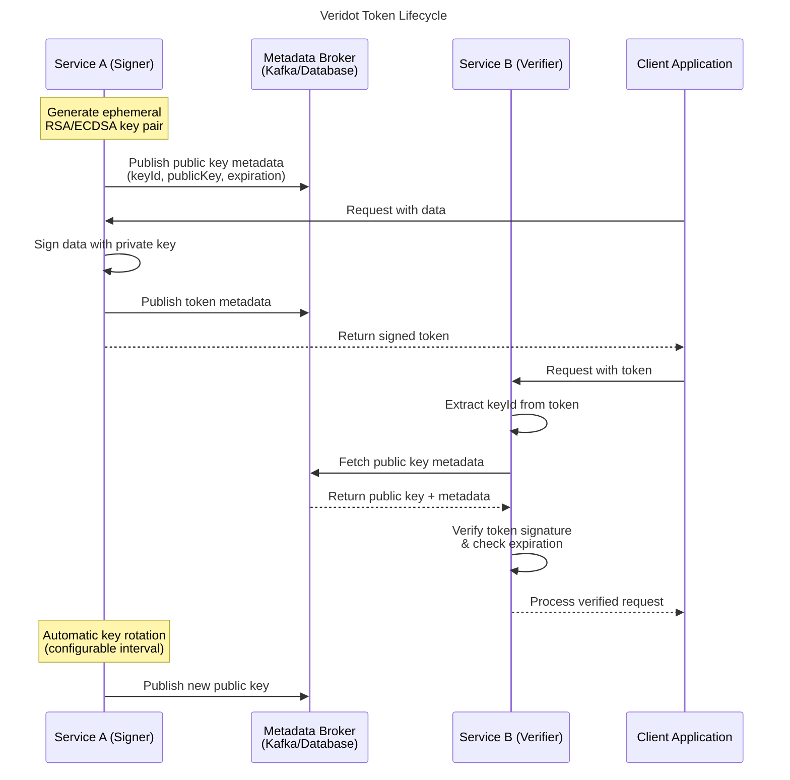

# Veridot - Enterprise-Grade Distributed Token Verification

[](https://openjdk.java.net/)
[](https://nodejs.org/)
[](https://opensource.org/licenses/MIT)
[](https://central.sonatype.com/search?q=io.github.cyfko.veridot)
[](https://www.npmjs.com/package/dverify)

**Veridot** is a production-ready, multi-language library for secure, distributed token verification in microservices architectures. Built for enterprise environments where services need to verify cryptographically signed tokens without shared secrets or centralized infrastructure.

## 🎯 Why Veridot?

### The Problem
In distributed systems, traditional token verification approaches fall short:
- **Shared secrets** create security vulnerabilities and management overhead
- **Centralized auth services** become bottlenecks and single points of failure
- **Manual key distribution** is error-prone and doesn't scale

### The Solution
Veridot provides **ephemeral asymmetric cryptography** combined with **distributed metadata propagation**:
- **Zero shared secrets** - Each service generates its own short-lived key pairs
- **Automatic key distribution** - Public keys propagated via Kafka or database brokers
- **Self-contained tokens** - Services verify tokens independently without external dependencies
- **Built for scale** - Handles high-throughput, low-latency verification in production

## ✨ Key Features

- 🔐 **Cryptographically Secure** - RSA/ECDSA signing with automatic key rotation
- ⚡ **High Performance** - Sub-millisecond verification with local key caching
- 🌐 **Distributed by Design** - No centralized dependencies or single points of failure
- 🔄 **Automatic Key Management** - Ephemeral keys with configurable rotation intervals
- 📡 **Pluggable Brokers** - Support for Kafka, databases, or custom metadata transport
- 🎛️ **Flexible Token Modes** - JWT embedding or external reference patterns
- 🔧 **Production Ready** - Comprehensive error handling, logging, and monitoring hooks

## 🏢 Enterprise Use Cases

### 1. **Microservices Authentication**
```
Service A → [Sign Request] → Service B → [Verify + Process]
```
Eliminate service-to-service API keys and enable zero-trust inter-service communication.

### 2. **Distributed Session Management**
```
User → Web App → [Generate Token] → Mobile App → [Verify Session]
```
Share authenticated sessions across multiple applications without centralized session storage.

### 3. **Secure File Access**
```
Email Link → [Token Verification] → Document Download
```
Enable secure, time-limited access to resources outside of web applications.

### 4. **Event-Driven Authorization**
```
Event Publisher → [Sign Event] → Message Queue → Event Consumer → [Verify + Process]
```
Ensure message authenticity and prevent tampering in event-driven architectures.

## 🏗 Architecture Overview

Veridot operates on a simple but powerful principle: **asymmetric signing with distributed public key propagation**.



### Core Components

- **DataSigner** - Creates cryptographically signed tokens with configurable expiration
- **TokenVerifier** - Validates token signatures using distributed public keys  
- **MetadataBroker** - Handles public key distribution (Kafka, Database, Custom)
- **TokenRevoker** - Enables immediate token invalidation for security incidents

## 📦 Language Support

| Language | Status | Package | Installation |
|----------|--------|---------|--------------|
| **Java** | ✅ Production Ready | [`veridot-core`](https://central.sonatype.com/search?q=io.github.cyfko.veridot) | `Maven/Gradle` |
| **Node.js/TypeScript** | ✅ Production Ready | [`dverify`](https://www.npmjs.com/package/dverify) | `npm install dverify` |
| **Python** | 🚧 In Development | `veridot-python` | Coming Soon |
| **C# (.NET)** | 📋 Planned | `Veridot.Core` | Coming Soon |
| **Rust** | 📋 Planned | `veridot-rs` | Coming Soon |
| **Go** | 📋 Planned | `veridot-go` | Coming Soon |

---

## 🚀 Quick Start

### Java (Maven)

**1. Add Dependencies**
```xml
<dependencies>
    <!-- Core API -->
    <dependency>
        <groupId>io.github.cyfko</groupId>
        <artifactId>veridot-core</artifactId>
        <version>2.0.1</version>
    </dependency>
    
    <!-- Kafka Broker Implementation -->
    <dependency>
        <groupId>io.github.cyfko</groupId>
        <artifactId>veridot-kafka</artifactId>
        <version>2.0.1</version>
    </dependency>
</dependencies>
```

**2. Configure Kafka Properties**
```properties
# application.properties
bootstrap.servers=localhost:9092
embedded.db.path=./veridot-keys
```

**3. Sign and Verify Tokens**
```java
// Initialize signer/verifier
Properties kafkaProps = new Properties();
kafkaProps.setProperty("bootstrap.servers", "localhost:9092");
kafkaProps.setProperty("embedded.db.path", "./veridot-keys");

MetadataBroker broker = KafkaMetadataBrokerAdapter.of(kafkaProps);
GenericSignerVerifier veridot = new GenericSignerVerifier(broker);

// Sign data
UserData userData = new UserData("john.doe@example.com", "premium");
BasicConfigurer config = BasicConfigurer.builder()
    .useMode(TokenMode.jwt)
    .trackedBy(12345L)
    .validity(3600) // 1 hour
    .build();

String token = veridot.sign(userData, config);

// Verify token (in another service)
UserData verified = veridot.verify(token, 
    BasicConfigurer.deserializer(UserData.class));
    
System.out.println("Verified user: " + verified.getEmail());
```

### Node.js/TypeScript

**1. Install Package**
```bash
npm install dverify
```

**2. Environment Configuration**
```bash
# .env
KAFKA_BROKER=localhost:9092
DVERIFY_KAFKA_TOPIC=veridot_keys
DVERIFY_DB_PATH=./veridot-keys
```

**3. Sign and Verify Tokens**
```typescript
import { DVerify } from 'dverify';

const dverify = new DVerify();

// Sign data
const { token } = await dverify.sign({ 
    userId: 123, 
    role: 'admin' 
}, 3600);

// Verify token
const result = await dverify.verify<{userId: number, role: string}>(token);
if (result.valid) {
    console.log('User ID:', result.data.userId);
    console.log('Role:', result.data.role);
}
```

---

## 🔧 Installation & Configuration

### Java Implementation

The Java implementation provides a modular architecture with pluggable broker backends:

#### Core Dependencies
```xml
<!-- Required: Core API definitions -->
<dependency>
    <groupId>io.github.cyfko</groupId>
    <artifactId>veridot-core</artifactId>
    <version>2.0.1</version>
</dependency>

<!-- Choose your broker implementation: -->

<!-- Option 1: Kafka-based metadata distribution -->
<dependency>
    <groupId>io.github.cyfko</groupId>
    <artifactId>veridot-kafka</artifactId>
    <version>2.0.1</version>
</dependency>

<!-- Option 2: Database-based metadata storage -->
<dependency>
    <groupId>io.github.cyfko</groupId>
    <artifactId>veridot-databases</artifactId>
    <version>2.0.1</version>
</dependency>
```

#### Configuration Examples

**Kafka Broker Configuration:**
```java
Properties props = new Properties();
props.setProperty("bootstrap.servers", "kafka-cluster:9092");
props.setProperty("embedded.db.path", "/app/data/veridot");
props.setProperty("security.protocol", "SASL_SSL"); // Optional: for secure clusters

MetadataBroker broker = KafkaMetadataBrokerAdapter.of(props);
```

**Database Broker Configuration:**
```java
Properties props = new Properties();
props.setProperty("jdbc.url", "jdbc:postgresql://db:5432/veridot");
props.setProperty("jdbc.username", "veridot_user");
props.setProperty("jdbc.password", "secure_password");

MetadataBroker broker = DatabaseMetadataBroker.of(props);
```

### Node.js Implementation

#### Installation
```bash
npm install dverify
# or
pnpm add dverify
```

#### Configuration
The Node.js implementation uses environment variables with sensible defaults:

```bash
# Required: Kafka configuration
KAFKA_BROKER=localhost:9092
DVERIFY_KAFKA_TOPIC=veridot_public_keys

# Optional: Advanced configuration
DVERIFY_DB_PATH=./data/veridot              # LMDB storage path
DVERIFY_KEY_ROTATION_MS=3600000             # 1 hour key rotation
DVERIFY_CLEANUP_INTERVAL_MS=1800000         # 30 min cleanup interval
```

---

## 💡 Usage Examples

### Basic Token Operations

#### Java: JWT Mode
```java
// Service A: Sign user session data
UserSession session = new UserSession("user123", List.of("READ", "WRITE"));

BasicConfigurer config = BasicConfigurer.builder()
    .useMode(TokenMode.jwt)        // Embed data in JWT
    .trackedBy(session.getUserId().hashCode())
    .validity(7200)                // 2 hours
    .build();

String sessionToken = dataSigner.sign(session, config);

// Service B: Verify and extract session
UserSession verified = tokenVerifier.verify(sessionToken, 
    BasicConfigurer.deserializer(UserSession.class));
    
if (verified.hasPermission("WRITE")) {
    // Process write operation
}
```

#### Java: ID Mode (External Reference)
```java
// Service A: Sign large payload with external reference
LargeDocument document = new LargeDocument(/* large data */);

BasicConfigurer config = BasicConfigurer.builder()
    .useMode(TokenMode.id)         // Return reference ID only
    .trackedBy(document.getId())
    .validity(1800)                // 30 minutes
    .build();

String documentId = dataSigner.sign(document, config); // Returns short ID

// Service B: Verify and extract document
LargeDocument verified = tokenVerifier.verify(documentId, 
    BasicConfigurer.deserializer(LargeDocument.class));
```

#### Node.js: Advanced Usage
```typescript
import { DataSigner, DataVerifier } from 'dverify';

// Separate signer and verifier for microservice architecture
const signer = new DataSigner();
const verifier = new DataVerifier();

// Service A: Sign order data
const orderData = {
    orderId: 'ORD-12345',
    customerId: 'CUST-789',
    items: [{ sku: 'PROD-001', quantity: 2 }],
    total: 99.99
};

const token = await signer.sign(orderData, 3600); // 1 hour validity

// Service B: Verify order token
try {
    const order = await verifier.verify<OrderData>(token);
    console.log(`Processing order ${order.orderId} for ${order.customerId}`);
    // Process order...
} catch (error) {
    console.error('Invalid order token:', error.message);
}
```

### Advanced Configuration

#### Custom Serialization (Java)
```java
// Custom serializer for specific data formats
Function<Object, String> customSerializer = data -> {
    if (data instanceof SpecialData) {
        return ((SpecialData) data).toCustomFormat();
    }
    return new ObjectMapper().writeValueAsString(data);
};

BasicConfigurer config = BasicConfigurer.builder()
    .useMode(TokenMode.jwt)
    .serializedBy(customSerializer)
    .trackedBy(123L)
    .validity(1800)
    .build();
```

#### Token Revocation
```java
// Revoke by tracking ID
TokenRevoker revoker = (TokenRevoker) veridot;
revoker.revoke(12345L); // Revoke all tokens with tracking ID 12345

// Revoke specific token
revoker.revoke("eyJ0eXAiOiJKV1QiLCJhbGciOiJSUzI1NiJ9...");
```

### Production Deployment

#### Docker Compose Example
```yaml
version: '3.8'
services:
  zookeeper:
    image: confluentinc/cp-zookeeper:latest
    environment:
      ZOOKEEPER_CLIENT_PORT: 2181

  kafka:
    image: confluentinc/cp-kafka:latest
    depends_on: [zookeeper]
    environment:
      KAFKA_ZOOKEEPER_CONNECT: zookeeper:2181
      KAFKA_ADVERTISED_LISTENERS: PLAINTEXT://kafka:9092
      KAFKA_OFFSETS_TOPIC_REPLICATION_FACTOR: 1

  user-service:
    build: ./user-service
    depends_on: [kafka]
    environment:
      KAFKA_BROKERS: kafka:9092
      VERIDOT_TOPIC: user_tokens
      VERIDOT_DB_PATH: /app/data/veridot
    volumes:
      - user_data:/app/data

  order-service:
    build: ./order-service  
    depends_on: [kafka]
    environment:
      KAFKA_BROKERS: kafka:9092
      VERIDOT_TOPIC: user_tokens
      VERIDOT_DB_PATH: /app/data/veridot
    volumes:
      - order_data:/app/data

volumes:
  user_data:
  order_data:
```

---

## 📖 API Reference

### Java API

#### Core Interfaces

**`DataSigner`** - Primary interface for token creation
```java
public interface DataSigner {
    String sign(Object data, Configurer configurer) 
        throws DataSerializationException, BrokerTransportException;
        
    interface Configurer {
        TokenMode getMode();      // jwt or id
        long getTracker();        // Revocation tracking ID
        long getDuration();       // Validity in seconds
        Function<Object, String> getSerializer();
    }
}
```

**`TokenVerifier`** - Primary interface for token validation
```java
public interface TokenVerifier {
    <T> T verify(String token, Function<String, T> deserializer) 
        throws BrokerExtractionException, DataDeserializationException;
}
```

**`TokenRevoker`** - Interface for token invalidation
```java
public interface TokenRevoker {
    void revoke(Object target); // Token string or tracking ID
}
```

**`MetadataBroker`** - Pluggable metadata distribution
```java
public interface MetadataBroker {
    CompletableFuture<Void> send(String key, String message);
    String get(String key) throws BrokerExtractionException;
}
```

#### Implementation Classes

**`GenericSignerVerifier`** - Default implementation
```java
// Constructor with custom salt
public GenericSignerVerifier(MetadataBroker broker, String salt)

// Constructor with default salt
public GenericSignerVerifier(MetadataBroker broker)
```

**`BasicConfigurer`** - Builder-pattern configuration
```java
BasicConfigurer config = BasicConfigurer.builder()
    .useMode(TokenMode.jwt)           // or TokenMode.id
    .trackedBy(12345L)                // Required: tracking ID
    .validity(3600)                   // Required: seconds
    .serializedBy(customSerializer)   // Optional: custom serializer
    .build();
```

**`KafkaMetadataBrokerAdapter`** - Kafka-based broker
```java
Properties props = new Properties();
props.put("bootstrap.servers", "localhost:9092");
props.put("embedded.db.path", "./data");

MetadataBroker broker = KafkaMetadataBrokerAdapter.of(props);
```

### Node.js/TypeScript API

#### Main Classes

**`DVerify`** - Unified signing and verification
```typescript
class DVerify {
    async sign(
        message: Record<string, any>, 
        duration?: number
    ): Promise<SignResponse>
    
    async verify<T>(token: string): Promise<VerifyResponse<T>>
}

interface SignResponse {
    token: string;
}

interface VerifyResponse<T> {
    valid: boolean;
    data: T;
}
```

**`DataSigner`** - Dedicated signing service
```typescript
class DataSigner {
    async sign<T>(data: T, durationSeconds: number): Promise<string>
}
```

**`DataVerifier`** - Dedicated verification service  
```typescript
class DataVerifier {
    async verify<T>(token: string): Promise<T>
}
```

#### Configuration Options

Environment variables for Node.js implementation:

| Variable | Description | Default |
|----------|-------------|---------|
| `KAFKA_BROKER` | Kafka broker URL | `localhost:9093` |
| `DVERIFY_KAFKA_TOPIC` | Topic for key exchange | `public_keys_topic` |
| `DVERIFY_DB_PATH` | LMDB storage path | `./signer-db` |
| `DVERIFY_KEY_ROTATION_MS` | Key rotation interval | `3600000` (1h) |
| `DVERIFY_CLEANUP_INTERVAL_MS` | Expired key cleanup | `1800000` (30min) |

---

## 🛡️ Security Considerations

### Cryptographic Standards
- **Java**: RSA-2048 with SHA-256 signature algorithm
- **Node.js**: ECDSA P-256 (ES256) with automatic key rotation
- **Key Rotation**: Configurable intervals (default: 1 hour)
- **Token Expiration**: Enforced at both signing and verification stages

### Best Practices

#### 1. **Short Token Lifetimes**
```java
// Recommended: Short-lived tokens
.validity(300)  // 5 minutes for high-security operations
.validity(3600) // 1 hour for user sessions
.validity(86400) // 24 hours maximum for background processes
```

#### 2. **Proper Error Handling**
```java
try {
    UserData user = verifier.verify(token, UserData.class);
    // Process verified data
} catch (BrokerExtractionException e) {
    // Token invalid, expired, or key not found
    log.warn("Token verification failed: {}", e.getMessage());
    return ResponseEntity.status(401).body("Invalid token");
} catch (DataDeserializationException e) {
    // Token valid but payload corrupted
    log.error("Token payload corruption: {}", e.getMessage());
    return ResponseEntity.status(500).body("Internal error");
}
```

#### 3. **Network Security**
- Use TLS/SSL for all Kafka communications
- Secure database connections with proper authentication
- Implement network segmentation for broker infrastructure

#### 4. **Monitoring & Alerting**
```java
// Log all token operations for security monitoring
logger.info("Token signed for user={}, tracker={}, expires={}", 
    userId, trackingId, expiration);
    
logger.warn("Token verification failed for keyId={}, reason={}", 
    keyId, failureReason);

// Monitor key rotation events
logger.info("Key rotation completed, previous keys expired");
```

### Threat Model & Mitigations

| Threat | Mitigation |
|--------|------------|
| **Token Replay** | Short expiration times + unique tracking IDs |
| **Key Compromise** | Automatic key rotation + immediate revocation |
| **Man-in-the-Middle** | TLS encryption for all broker communications |
| **Metadata Tampering** | Cryptographic signing of metadata messages |
| **Denial of Service** | Rate limiting + broker connection pooling |

---

## 🚀 Best Practices

### Production Deployment

#### 1. **High Availability Setup**
```yaml
# Kafka cluster configuration
kafka:
  replication.factor: 3
  min.insync.replicas: 2
  unclean.leader.election.enable: false
  
# Database setup (if using DB broker)
database:
  connection_pool_size: 20
  read_replicas: 2
  backup_strategy: continuous
```

#### 2. **Performance Optimization**
```java
// Java: Optimize broker connections
Properties props = new Properties();
props.put("batch.size", 16384);
props.put("linger.ms", 5);
props.put("compression.type", "snappy");

// Node.js: Configure LMDB for performance
const db = open({ 
    path: dbPath, 
    compression: true,
    maxDbs: 10,
    mapSize: 2 * 1024 * 1024 * 1024 // 2GB
});
```

#### 3. **Monitoring Integration**
```java
// Micrometer metrics integration
@Component
public class VeridotMetrics {
    private final Counter signCounter;
    private final Counter verifyCounter;
    private final Timer verificationLatency;
    
    public VeridotMetrics(MeterRegistry registry) {
        this.signCounter = Counter.builder("veridot.tokens.signed")
            .description("Total tokens signed")
            .register(registry);
            
        this.verifyCounter = Counter.builder("veridot.tokens.verified")
            .tag("status", "success")
            .register(registry);
            
        this.verificationLatency = Timer.builder("veridot.verification.duration")
            .description("Token verification latency")
            .register(registry);
    }
}
```

### Development Guidelines

#### 1. **Token Design Patterns**

**Stateless Service Tokens:**
```java
public class ServiceRequest {
    private String serviceId;
    private String operation;
    private Map<String, Object> parameters;
    private String requestId; // For deduplication
}
```

**User Session Tokens:**
```typescript
interface UserSession {
    userId: string;
    roles: string[];
    permissions: string[];
    sessionId: string;
    clientInfo: {
        userAgent: string;
        ipAddress: string;
    };
}
```

#### 2. **Error Recovery Strategies**
```java
@Retryable(value = {BrokerTransportException.class}, maxAttempts = 3)
public String signWithRetry(Object data, Configurer config) {
    try {
        return dataSigner.sign(data, config);
    } catch (BrokerTransportException e) {
        log.warn("Broker communication failed, retrying: {}", e.getMessage());
        throw e; // Will trigger retry
    }
}
```

#### 3. **Testing Strategies**
```java
@TestConfiguration
public class VeridotTestConfig {
    
    @Bean
    @Primary
    public MetadataBroker mockBroker() {
        return new InMemoryMetadataBroker(); // For unit tests
    }
    
    @Bean
    public EmbeddedKafka embeddedKafka() {
        return new EmbeddedKafka(); // For integration tests
    }
}
```

---

## ❓ FAQ

### General Questions

**Q: How does Veridot differ from traditional JWT implementations?**
A: Traditional JWT relies on shared secrets or centralized key management. Veridot uses ephemeral asymmetric keys with distributed public key propagation, eliminating shared secrets and centralized dependencies.

**Q: What happens if the metadata broker (Kafka/Database) is temporarily unavailable?**
A: Services cache public keys locally and can continue verifying tokens for previously seen keys. New token signing will fail gracefully until broker connectivity is restored.

**Q: Can I use Veridot without Kafka?**
A: Yes! Veridot supports pluggable brokers. You can use the database implementation, implement a custom broker, or even use Redis, HTTP APIs, or other transports.

**Q: How do I handle token revocation in emergency situations?**
A: Use the `TokenRevoker` interface to immediately invalidate tokens by tracking ID or token value. Revocation is propagated through the same broker mechanism.

### Performance & Scalability

**Q: What's the expected latency for token verification?**
A: With local key caching, verification typically takes <1ms. Initial key retrieval may take 10-50ms depending on broker latency.

**Q: How many tokens per second can Veridot handle?**
A: Java implementation: 10,000+ verifications/sec per instance. Node.js: 5,000+ verifications/sec. Signing is limited by broker throughput (~1,000/sec for Kafka).

**Q: Does Veridot support horizontal scaling?**
A: Yes, completely. Each service instance operates independently with its own key pairs. Broker infrastructure scales horizontally using standard patterns.

### Security

**Q: What cryptographic algorithms does Veridot use?**
A: Java uses RSA-2048 with SHA-256. Node.js uses ECDSA P-256 (ES256). Both provide >128-bit security strength and are FIPS 140-2 compliant.

**Q: How often should keys be rotated?**
A: Default is 1 hour. For high-security environments, consider 15-30 minutes. For high-throughput systems, 2-4 hours may be acceptable.

**Q: Is Veridot quantum-resistant?**
A: Current implementations use RSA and ECDSA, which are not quantum-resistant. We're evaluating post-quantum algorithms for future versions.

### Integration

**Q: Can I integrate Veridot with existing auth systems?**
A: Absolutely. Veridot handles token transport security, while your existing systems manage authentication and authorization logic.

**Q: Does Veridot work in serverless environments?**
A: Yes, but with considerations. Kafka connections may timeout in serverless functions. Consider using HTTP-based brokers or implementing connection pooling.

**Q: How do I migrate from existing JWT implementations?**
A: Implement Veridot alongside existing systems, gradually migrate services, and use feature flags to control rollout. Both systems can coexist during transition.

---


---

##  Language-Specific Documentation

For detailed implementation guides, advanced configuration, and language-specific examples:

- **[Java Implementation Guide](java/README.md)** - Maven setup, Spring integration, database brokers
- **[Node.js Implementation Guide](nodejs/README.md)** - npm setup, environment configuration, TypeScript usage
- **[Interoperability Guide](docs/INTEROPERABILITY.md)** - Cross-language token compatibility

---

##  Contributing

We welcome contributions from the open-source community! Veridot thrives on collaboration and diverse perspectives.

### How to Contribute

1. **Fork the Repository**
   `ash
   git clone https://github.com/cyfko/veridot.git
   cd veridot
   `

2. **Set Up Development Environment**
   `ash
   # Java development
   cd java && ./mvnw clean compile
   
   # Node.js development  
   cd nodejs && npm install && npm run build
   `

3. **Create Feature Branch**
   `ash
   git checkout -b feature/your-awesome-feature
   `

4. **Make Your Changes**
   - Add tests for new functionality
   - Update documentation as needed
   - Follow existing code style and conventions

5. **Test Your Changes**
   `ash
   # Java tests
   cd java && ./mvnw test
   
   # Node.js tests
   cd nodejs && npm test
   `

6. **Submit Pull Request**
   `ash
   git add .
   git commit -m "feat: add awesome new feature"
   git push origin feature/your-awesome-feature
   `

### Contribution Areas

-  **New Language Implementations** - Help us expand to Python, Rust, Go, C#
-  **Broker Implementations** - Redis, HTTP API, gRPC, or custom transport layers
-  **Documentation** - Examples, tutorials, deployment guides
-  **Testing** - Integration tests, performance benchmarks, security audits
-  **Bug Fixes** - Issue resolution and stability improvements

### Development Guidelines

- **Code Quality**: Maintain high standards with comprehensive tests
- **Documentation**: Update relevant docs for any API changes
- **Backward Compatibility**: Avoid breaking changes in minor versions
- **Security First**: All crypto operations must follow best practices

 **Detailed Guidelines**: [CONTRIBUTING.md](CONTRIBUTING.md)

---

##  Roadmap & Vision

### Current Focus (2025)
-  **Production-Ready Java & Node.js** implementations
-  **Python Implementation** (Q2 2025)
-  **Enhanced Monitoring & Observability** features
-  **Performance Optimizations** for high-throughput scenarios

### Future Priorities
-  **C# (.NET) Implementation** - Enterprise Windows environments
-  **Rust Implementation** - Ultra-high performance use cases  
-  **Go Implementation** - Cloud-native and Kubernetes ecosystems
-  **Post-Quantum Cryptography** - Future-proof security standards

### Enterprise Features
-  **HSM Integration** - Hardware security module support
-  **Advanced Analytics** - Token usage patterns and security insights
-  **Multi-Region Deployment** - Global distribution with consistency
-  **Compliance Certifications** - SOC 2, FIPS 140-2, Common Criteria

---

##  Community & Support

### Get Help
-  **[GitHub Discussions](https://github.com/cyfko/veridot/discussions)** - Community Q&A and feature requests
-  **[Issue Tracker](https://github.com/cyfko/veridot/issues)** - Bug reports and feature requests
-  **Email Support**: [frank.kossi@kunrin.com](mailto:frank.kossi@kunrin.com)

### Stay Connected
-  **GitHub**: [@cyfko/veridot](https://github.com/cyfko/veridot)
-  **Updates**: Follow [@kunrin_sa](https://twitter.com/kunrin_sa) for announcements
-  **Enterprise**: [Kunrin SA](https://www.kunrin.com) for commercial support

### Recognition
Special thanks to our contributors and the open-source community for making Veridot possible:
- **Frank KOSSI** - Creator and lead maintainer
- **Darlinho T.** - Node.js implementation and TypeScript expertise
- **Community Contributors** - Bug reports, feature requests, and code contributions

---

##  License

This project is licensed under the **MIT License** - see the [LICENSE](LICENSE) file for details.

### What this means:
-  **Commercial Use** - Use Veridot in commercial applications
-  **Modification** - Adapt the code to your needs
-  **Distribution** - Share and redistribute freely
-  **Private Use** - Use in private/internal projects
-  **Liability** - No warranty provided, use at your own risk

---

##  Get Started Today

Ready to secure your distributed system with Veridot?

**Java Developers:**
`ash
# Add to your pom.xml and start coding!
mvn archetype:generate -DgroupId=com.example \
  -DartifactId=veridot-demo -DarchetypeArtifactId=maven-archetype-quickstart
`

**Node.js Developers:**
`ash
# Install and try it out!
npm install dverify && node -e "console.log('Veridot ready!')"
`

**Enterprise Teams:**
Contact [frank.kossi@kunrin.com](mailto:frank.kossi@kunrin.com) for deployment consulting, training, and commercial support.

---

*Built with  by the open-source community. Securing distributed systems, one token at a time.*
