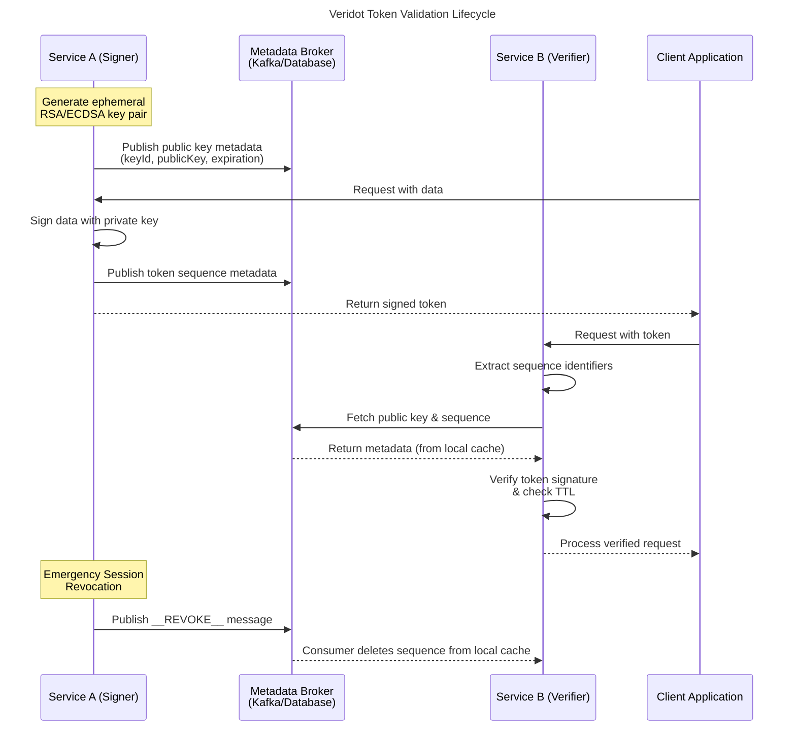

# Veridot — Distributed Token Verification Protocol

**Veridot** is a protocol and multi-language ecosystem for secure, distributed token verification in zero-trust microservice architectures. It fundamentally eliminates the need for shared secrets while enabling instant, network-wide token revocation without relying on a centralized authentication chokepoint.

---

## 🎯 The Distributed Auth Trilemma

In microservice architectures, traditional token verification forces you to compromise:
1. **Shared Secrets (Symmetric JWT)**: Sharing a secret (e.g., HMAC) across dozens of services is a massive security risk. If one service is compromised, the entire system falls.
2. **Stateless Asymmetric JWT**: Using RSA/ECDSA solves the secret-sharing problem, but makes *instant revocation* impossible. Banned users or expired sessions remain valid until the token physically expires.
3. **Centralized Verification**: Forcing every microservice to call an API Gateway or an Identity Provider to validate a token creates massive latency, network overhead, and a critical single point of failure.

### The Veridot Solution
Veridot shatters this trilemma by blending **ephemeral asymmetric cryptography** with a **pluggable metadata broker architecture**.

- **Zero Shared Secrets**: Every service instance dynamically generates its own short-lived RSA/ECDSA key pairs.
- **Distributed Trust**: Public keys, configuration, and revocation events are continuously propagated across the cluster via an event broker (e.g., Kafka) or a shared database.
- **Sub-Millisecond Verification**: Services cache public metadata locally (e.g., via RocksDB). When an API request arrives, the token is verified locally in under `1ms` with absolute certainty regarding its authenticity and revocation status.

---

## ⚖️ Scope: What Veridot IS and IS NOT

To understand Veridot, it is crucial to understand its architectural boundaries.

### ✅ What Veridot IS
- **An Interoperable Protocol**: A standard defining canonical binary-safe verification messages (`Protocol V2`) ensuring a Node.js verifier can instantly validate a token signed by a Java service.
- **A Distributed Session Manager**: Veridot enforces cluster-wide limits on concurrent user sessions (e.g., Max 5 active devices per user) using FIFO, LIFO, LRU, or REJECT eviction strategies.
- **An Instant Revocation Engine**: Generating a `__REVOKE__` sequence instantly invalidates the token across all local caches in the cluster.

### ❌ What Veridot IS NOT
- **Not an Identity Provider (IdP)**: Veridot does not replace Keycloak, Auth0, or Cognito. It handles *verification transport*, not user registration or standard OAuth2 flows.
- **Not a User Database**: Veridot stores cryptographic keys and session sequences. It does not permanently store emails, passwords, or persistent generic user objects.
- **Not a Protocol for Frontends**: Veridot brokers operate server-to-server. Frontends or mobile applications safely consume the resulting JWTs / Object IDs, entirely unaware of the underlying broker mechanisms.

---

## 🏗 Architecture & Token Lifecycle

Veridot operates on asymmetric signing combined with distributed metadata propagation.

```mermaid
sequenceDiagram
    title Veridot Token Validation Lifecycle

    participant ServiceA as Service A (Signer)
    participant Broker as Metadata Broker<br/>(Kafka/Database)
    participant ServiceB as Service B (Verifier)
    participant Client as Client Application

    %% Key Generation & Registration
    Note over ServiceA: Generate ephemeral<br/>RSA/ECDSA key pair
    ServiceA->>Broker: Publish public key metadata<br/>(keyId, publicKey, expiration)

    %% Token Signing
    Client->>ServiceA: Request with data
    ServiceA->>ServiceA: Sign data with private key
    ServiceA->>Broker: Publish token sequence metadata
    ServiceA-->>Client: Return signed token

    %% Token Verification
    Client->>ServiceB: Request with token
    ServiceB->>ServiceB: Extract sequence identifiers
    ServiceB->>Broker: Fetch public key & sequence
    Broker-->>ServiceB: Return metadata (from local cache)
    ServiceB->>ServiceB: Verify token signature<br/>& check TTL
    ServiceB-->>Client: Process verified request

    %% Revocation (Cross-Cluster)
    Note over ServiceA: Emergency Session<br/>Revocation
    ServiceA->>Broker: Publish __REVOKE__ message
    Broker-->>ServiceB: Consumer deletes sequence from local cache
```

---

## 📖 The Protocol Specification (V2)

Veridot is heavily driven by its specification. The **Protocol V2** ensures:
- **Canonical Message Formatting**: `2:<groupId>:<sequenceId>|<metadata>` encoded via Base64url (RFC 4648 §5).
- **Clock Drift Tolerance**: System-wide protection against server clock drifts (±5 minutes windowing).
- **Hierarchical Configuration**: Configuration fallback handling (`Local` → `Site` → `Global` → `Default`).
- **Structured Interoperability**: Strict enforcement of data separation between payloads and cryptographic metadata.

🔗 **[Read the Full Protocol V2 Specification](PROTOCOL_V2.md)**

---

## 📦 Language Ecosystem & SDKs

Veridot is available across multiple environments. Choose your tech stack to access implementation details, installation instructions, and code snippets.

| Language / Platform | Status | Component | Description |
|-------------------|----------|-------------|-------------|
| **Java (JDK 17+)** | ✅ Production Ready | [📁 `veridot-core`](java/veridot-core) | Core Protocol V2 API & Generic Impl. |
| **Java (JDK 17+)** | ✅ Production Ready | [📁 `veridot-kafka`](java/veridot-kafka) | Kafka + RocksDB Broker integration |
| **Java (JDK 17+)** | ✅ Production Ready | [📁 `veridot-databases`](java/veridot-databases) | SQL Database Broker integration |
| **Node.js (TS)** | ⚠️ Protocole V1 (Legacy) | [📁 `nodejs`](nodejs) | `dverify` - Native JS Implementation |
| **Python** | 📋 Planned | `veridot-python` | Coming Soon |
| **Go** | 📋 Planned | `veridot-go` | Coming Soon |
| **Rust** | 📋 Planned | `veridot-rs` | Coming Soon |

> **Note**: To see code examples (`sign()`, `verify()`, `revoke()`), specific configuration structures or framework attachments, please consult the respective sub-directories listed above.

---

## 📄 License

Veridot is Open Source and distributed under the **[MIT License](LICENSE)**.

**Maintained by** [Frank KOSSI](mailto:frank.kossi@kunrin.com) — [Kunrin SA](https://www.kunrin.com)
