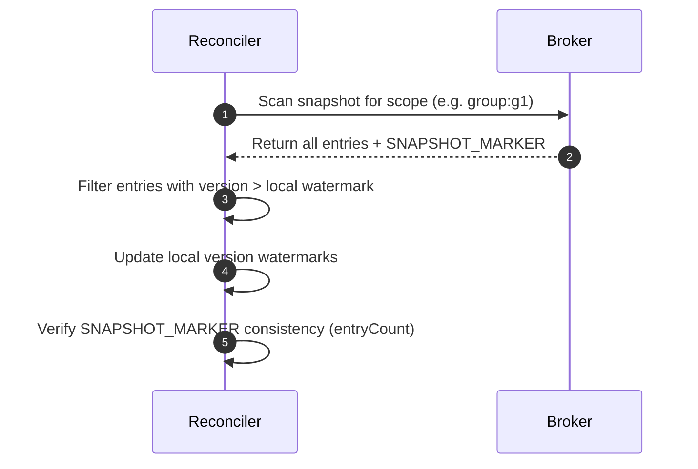

# State Consistency & Monotonicity

Veridot V4 operates under a hybrid consistency model designed to deliver **eventual consistency** for high-volume reads and **strong ordering** for capacity mutations, all without requiring a synchronous central lock.

---

## 1. Monotonic Version Invariant

To defend against replay attacks and state rollbacks, the protocol defines the **Monotonic Version Invariant**:

- Every entry has a unique logical key (EntryId) represented by the tuple `(scope, entryType, key)`.
- For each EntryId, a verifier maintains a local, running watermark representing the highest `version` it has accepted.
- When an entry is retrieved from the broker, the verifier validates the version:

$$\text{version}_{\text{incoming}} > \text{version}_{\text{watermark}}$$

- If the incoming version is less than or equal to the watermark, the entry is rejected with **`V4201 (STALE_VERSION)`**.
- This check is executed before the payload is decrypted or semantic checks are run, preventing older states from ever being reapplied.

---

## 2. Persistent Watermark Store

If a microservice restarts, losing its local watermark state, it could become vulnerable to state rollbacks (e.g. an attacker replaying an old active session entry issued prior to the restart).

To mitigate this, Veridot uses a **`WatermarkStore`**:
- **Persistence**: Realized via `FileWatermarkStore` (writing to a local file configured via `VDOT_WATERMARK_PERSISTENCE_FILE`) or by leveraging the broker storage directly.
- **Integrity Protection**: The serialized watermark snapshot is cryptographically signed or HMAC'ed. The HMAC key is derived by hashing the processor's long-term private key (`SHA-256` digest).
- **Fail-Safe**: If the watermark file is tampered with or corrupted, the integrity check fails, the local watermark cache is discarded, and the processor triggers a full reconciliation snapshot scan.

---

## 3. Periodic Reconciliation via Snapshots

Because network failures or Broker glitches can cause individual message updates to be lost in transit, verifiers run a periodic **Reconciliation Loop**:



- **Frequency**: Every 15 minutes by default (configured via `VDOT_RECONCILIATION_INTERVAL_MINUTES`).
- **Maximum Staleness**: If the local cache has not successfully reconciled within 60 minutes (`VDOT_RECONCILIATION_MAX_STALENESS_MINUTES`), the verifier fails closed and throws a **`RECONCILIATION_STALE`** exception, rejecting any verification requests for that scope.
- **Snapshot Markers**: A `SNAPSHOT_MARKER` entry (type `0x06`) is published by the coordinator, providing the `entryCount` and `snapshotAt` timestamp. The reconciler uses this to detect if a snapshot is partial or corrupted.

---

## 4. Cloisonned Session Capacity & Eviction

Veridot allows setting maximum concurrent active sessions per group (e.g. max 3 devices signed in at once). When this quota is reached, new sign-in requests trigger **Eviction Policies** (defined in `EvictionPolicy` enum):

| Policy | Behavior |
|---|---|
| **`FIFO`** (First-In-First-Out) | Evicts the active session with the oldest `asOf` liveness timestamp. |
| **`LIFO`** (Last-In-First-Out) | Evicts the active session with the newest `asOf` liveness timestamp. |
| **`LRU`** (Least Recently Used) | Evicts the session with the oldest activity updates. |
| **`REJECT`** | Refuses the login request outright; throws `SessionCapacityExceededException`. |

---

## 5. Concurrency Fencing via Fence Tokens

In a distributed environment, two independent Issuer instances could attempt to issue a session for the same group simultaneously, exceeding the quota. Veridot prevents this using **`FENCE` Entries**:

- A `FENCE` entry (type `0x05`) acts as a distributed epoch ticket. It carries a `fenceCounter` that must be strictly increasing per scope.
- A capacity-affecting mutation (quota eviction or new session issuance) must be accompanied by a `FENCE` write.
- If two nodes attempt concurrent writes, the Broker accepts the first write and rejects the second because its fence token is now stale (`V4301`).

```
Issuer A (fenceCounter = 10) ---> COMMITTED (Success)
Issuer B (fenceCounter = 10) ---> REJECTED (V4301 - Stale)
```
- The failed Issuer must fetch the new `fenceCounter`, re-evaluate the capacity count, and retry the mutation.
