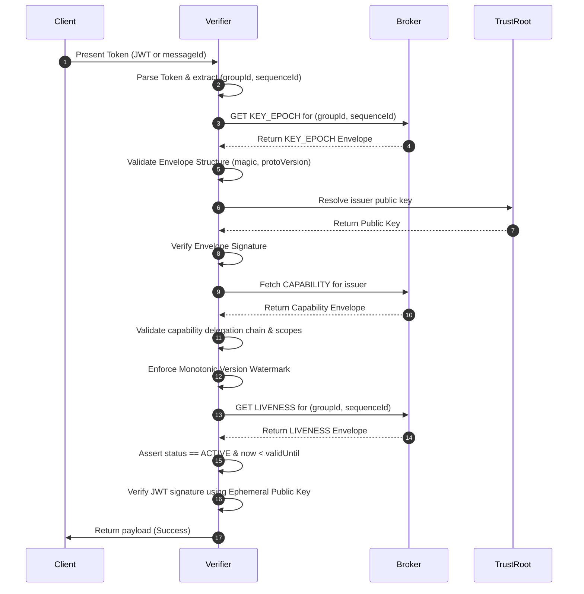

# Protocol V4 Specification

The Veridot Protocol Version 4 (V4) defines a **self-describing binary envelope format** and the state machine rules for distributing cryptographically secure verification metadata.

---

## 1. Wire Format: The Canonical Envelope

Every entry published to the Broker must conform to the canonical binary envelope structure. This guarantees that all metadata (configs, capabilities, key epochs, liveness) share a single parsing and signature verification pipeline.

### Binary Layout

| Field | Size (Bytes) | Type | Description |
|---|---|---|---|
| `magic` | 2 | Fixed | `0x56 0x44` (`"VD"`) — Protocol marker |
| `protoVersion` | 1 | u8 | MUST be `0x04` |
| `entryType` | 1 | u8 | Entry type code (see registry below) |
| `flags` | 1 | Bitfield | Bit 0: `COMPACT_SIG` (1 for Ed25519, 0 for RSA). Bits 1-7: Reserved |
| `scopeLen` | 2 | u16, BE | Byte length of `scope` |
| `scope` | variable | UTF-8 | Scope string (e.g. `group:g1`, `site:s1`, `global`) |
| `keyLen` | 2 | u16, BE | Byte length of `key` |
| `key` | variable | UTF-8 | Entry subkey (empty for singletons) |
| `version` | 8 | u64, BE | Monotonic version number |
| `timestamp` | 8 | i64, BE | Advisory timestamp in milliseconds since epoch |
| `issuerLen` | 2 | u16, BE | Byte length of `issuer` |
| `issuer` | variable | UTF-8 | Issuer ID, resolved via the `TrustRoot` |
| `payloadLen` | 4 | u32, BE | Byte length of `payload` |
| `payload` | variable | TLV | Field tags and values (see TLV structure below) |
| `sigAlg` | 1 | u8 | `0x01` = RSA-SHA256, `0x02` = ECDSA, `0x03` = RSA-PSS, `0x04` = Ed25519 |
| `sigLen` | 2 | u16, BE | Byte length of `signature` |
| `signature` | variable | Binary | Cryptographic signature over all preceding bytes |

---

## 2. TLV Payload Encoding

Within the `payload` field, data is organized as a sequence of **Tag-Length-Value (TLV)** blocks:

```
+----------+--------------------+-------------------------+
| Tag (1B) | Length (2B, BE)   | Value (variable length) |
+----------+--------------------+-------------------------+
```

- **Rules**:
  - Tag `0x00` is invalid and triggers immediate rejection (`V4007`).
  - Unrecognized tags within a payload are silently ignored (allowing forward compatibility).
  - Duplicate tags within the same payload trigger rejection (`V4007`).

---

## 3. Entry Type Registry

Veridot registers six entry types:

| Code | Type Name | Singleton? | Purpose |
|---|---|---|---|
| `0x01` | `KEY_EPOCH` | No (by key) | Distributes ephemeral public key and TTL |
| `0x02` | `CAPABILITY` | No (by subject) | Authorizes an identity to write to a scope |
| `0x03` | `CONFIG` | Yes | Scope-level capacity and eviction config |
| `0x04` | `LIVENESS` | Yes (by key) | Session status: `ACTIVE` or `REVOKED` |
| `0x05` | `FENCE` | Yes | Orders capacity mutations concurrently |
| `0x06` | `SNAPSHOT_MARKER` | Yes | Bounds staleness windows during reconciliation |

---

## 4. Verification Sequence Flow

This diagram illustrates the step-by-step verification pipeline executed by `TokenVerifier` when a client presents a token:



---

## 5. Security Codes (Appendix B)

Every protocol violation is logged with a specific error code. Developers must map these codes for monitoring:

- **`V4001`**: Magic or protocol version mismatch.
- **`V4002`**: Unregistered `entryType` code.
- **`V4003`**: Identifier length boundary violation (scope/key > 4096 bytes).
- **`V4005`**: Inconsistent flags (e.g. `COMPACT_SIG` set for RSA key).
- **`V4006`**: Scope grammar violation. Must match `group:<id>`, `site:<id>`, or `global`.
- **`V4101`**: Signature check failed or issuer not resolvable.
- **`V4102`**: Issuer has no capability for this scope.
- **`V4201`**: Version regression detected (`version <= current watermark`).
- **`V4202`**: No fresh `ACTIVE` liveness entry found.
- **`V4203`**: Token presented outside `KEY_EPOCH` temporal validity window.
- **`V4301`**: FENCE token is stale.
