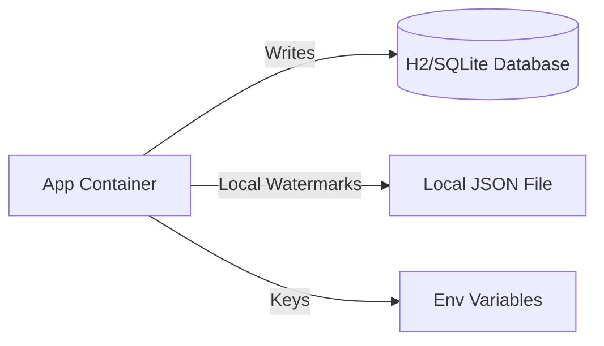
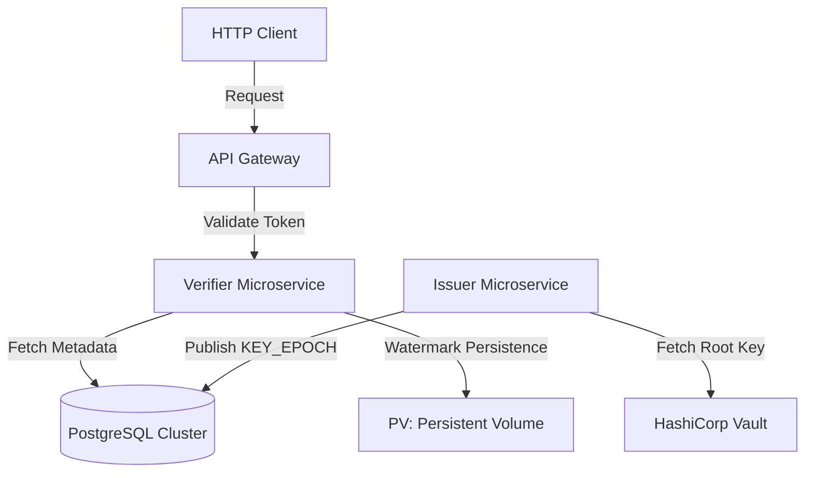
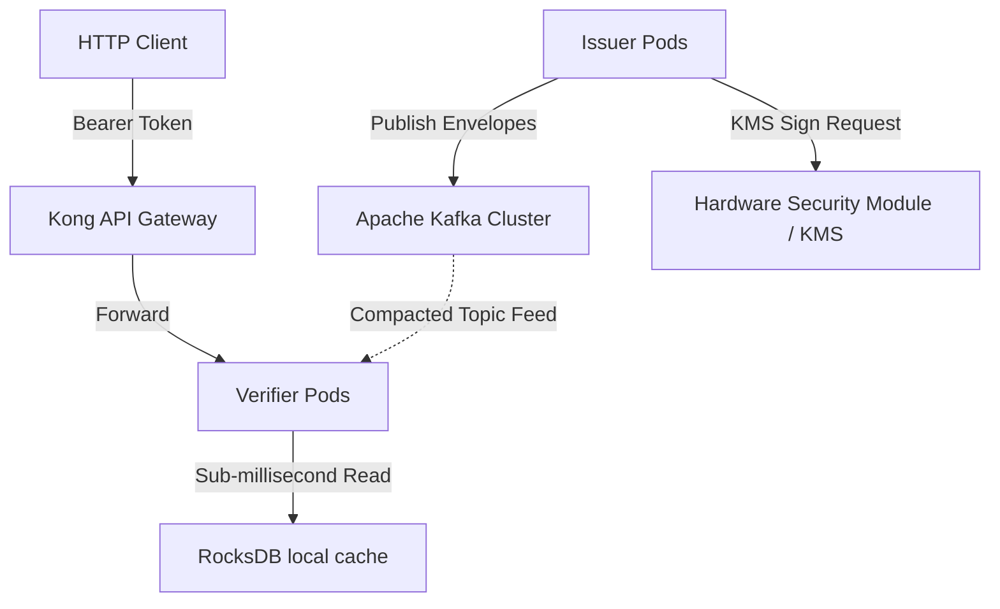

# Architecture Blueprints

This guide details the deployment blueprints for Veridot V4. Every architectural component is justified directly from the requirements defined in the Protocol Specification (`PROTOCOL_V4.md`).

---

## 1. Core Component Justification Matrix

Veridot does not dictate a single deployment model. Instead, infrastructure choices depend on how the Broker, TrustRoot, and WatermarkStore are implemented.

### A. The Broker: Relational Database vs. Apache Kafka
- **PostgreSQL / MySQL / Oracle (`veridot-databases`)**:
  - *Why it exists*: Provides durable, ACID-compliant storage of binary envelopes.
  - *Role*: Stores envelopes in a database table using database upserts (`ON CONFLICT`, `DUPLICATE KEY`).
  - *Cons of Absence*: Without a broker, verifiers cannot resolve ephemeral keys or liveness status.
  - *Consequence & Tradeoff*: Simplifies operations for small-to-midscale deployments, but database read throughput is a performance bottleneck.
- **Apache Kafka + RocksDB (`veridot-kafka`)**:
  - *Why it exists*: Combines distributed event streaming with local verifier caches.
  - *Role*: Broadcasts envelopes via a compacted topic. Verifier pods consume this topic and write metadata directly to their local RocksDB instance.
  - *Cons of Absence*: Verifiers must query the database synchronously, increasing latency.
  - *Consequence & Tradeoff*: Delivers sub-millisecond local lookups. Operates on eventual consistency for reads, using version watermarks to guarantee safety.

### B. Secret Management: HashiCorp Vault / Cloud KMS vs. PEM Files
- *Why it exists*: Veridot long-term root keys must never be stored in plain text on disks (§13.4).
- *Role*: Holds the root private key and performs delegation signing operations (KMS signing).
- *Status*: **Highly Recommended** for production.
- *Cons of Absence*: PEM files on server disks can be leaked or stolen, compromising the entire trust boundary.
- *Alternatives*: Hardware Security Modules (HSMs) for air-gapped or high-security banking environments.

### C. Watermark Store: File System vs. Shared DB
- *Why it exists*: Enforces the Monotonic Version Invariant (§11.1) to prevent rollback attacks after a verifier node restarts.
- *Role*: Persists the latest accepted versions for each `EntryId`.
- *Status*: **Mandatory** for rollback resistance.
- *Cons of Absence*: A restarted pod starts with watermark 0, allowing an attacker to replay a revoked session issued prior to the restart.
- *Alternatives*: `FileWatermarkStore` (fast, local disk) or database-backed storage.

---

## 2. Architecture Tiers

### Tier 1: Local Development / Sandbox
Ideal for developers running tests locally.

- **Broker**: H2 or SQLite database using `DatabaseBroker`.
- **TrustRoot**: `PublicKeyTrustRoot` with keys loaded from environment variables.
- **Watermark Store**: File-based persistence on local filesystem.

---

### Tier 2: SME Production Deployment (SQL-Backed)
Suitable for small-to-medium businesses running on Kubernetes.

- **Broker**: PostgreSQL cluster with write-replicas.
- **Secret Manager**: HashiCorp Vault KV Engine.
- **Watermarks**: Written to an encrypted Persistent Volume (PV) on Kubernetes using `FileWatermarkStore`.
- **Network Flow**:
  1. Issuer service retrieves the long-term private key from Vault.
  2. Issuer publishes `KEY_EPOCH` and `LIVENESS` to the PostgreSQL Database.
  3. Verifier services query the PostgreSQL replicas to resolve session state.

---

### Tier 3: Enterprise High-Availability (Kafka + RocksDB + HSM)
Designed for low-latency, high-throughput, and high-availability enterprise environments.

- **Broker**: Apache Kafka cluster with a compacted, replication-factor-3 topic (`veridot-tokens`).
- **Verifier Cache**: Each verifier pod runs RocksDB embedded in-process (`veridot-kafka`). Reads bypass the network completely.
- **Root of Trust**: Hardware Security Module (HSM) reachable via PKCS#11 or AWS/GCP KMS.
- **Supervision & Monitoring**: Prometheus monitors `VDOT_STALE_VERSION` and `VDOT_TRUST_RESOLUTION_FAILED` metrics. Grafana triggers alerts.
- **Disaster Recovery**: Kafka topic compaction retains the last state of every session. On disaster recovery, a new cluster is spun up, and verifiers replay the topic from offset 0 to reconstruct the RocksDB cache.

---

### Tier 4: Hardened Zero-Trust & Air-Gap
For military, banking, or critical infrastructure operations requiring zero network exposure of root key materials.

- **Air-Gapped Root CA**: Key generation occurs on a physically isolated laptop. Root capabilities are generated and signed off-line, then imported via USB or optical data diode to the production Broker.
- **Mutual TLS**: All communication between verifiers, issuers, and Kafka is encrypted with mTLS enforced by a Service Mesh (Linkerd/Istio).
- **Strict Fencing**: Evictions are managed by a dedicated, single-pod Fencing Coordinator elected via Kubernetes Lease API to guarantee strong capacity ordering.
