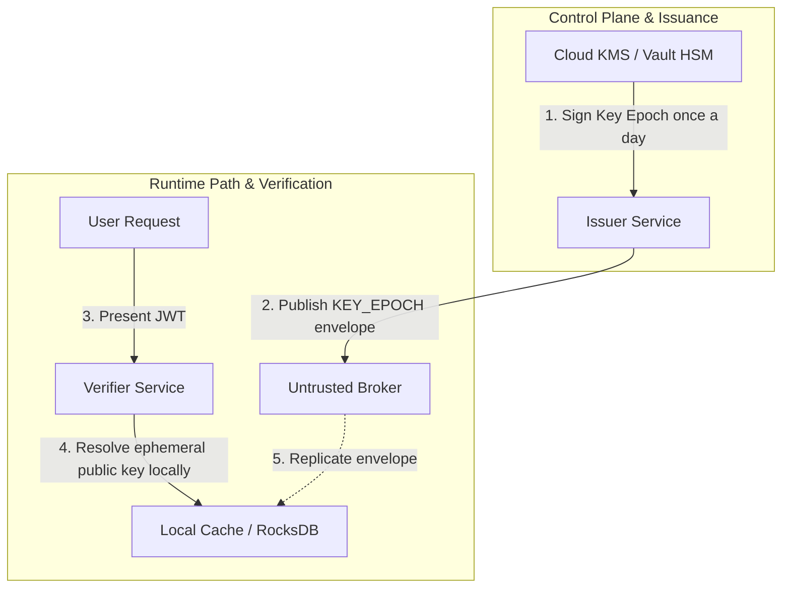
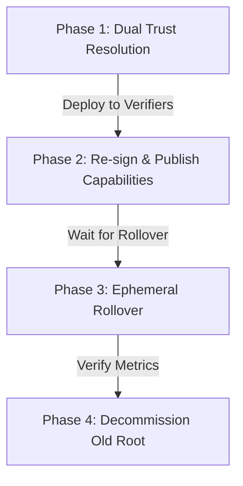

# Key & Trust Management

Veridot's security model depends on the integrity of its key hierarchy and the strict execution of key rotation procedures.

---

## 1. Key Roles & Lifespans

| Key Type | Storage Location | Lifetime | Signing Scope |
|---|---|---|---|
| **Root Trust Key** | Hardware Security Module (HSM) / Cloud KMS | 1–3 Years | `CAPABILITY`, `CONFIG`, `KEY_EPOCH` (bootstrap) |
| **Delegated Signer Key** | Secure KMS Key Store (e.g. HashiCorp Vault) | 3–6 Months | `KEY_EPOCH`, `LIVENESS`, `FENCE` |
| **Ephemeral Key** | In-Memory (rotated by `KeyRotationService`) | 24 Hours | Application Payload (JWT) |

---

## 2. Decoupled KMS Architecture: Eliminating the SPoF

A primary concern in cryptographically secured distributed systems is that the Key Management Service (KMS) or Hardware Security Module (HSM) holding the root private keys becomes a runtime **Single Point of Failure (SPoF)**. An outage of the KMS could theoretically halt authentication across the entire company.

Veridot's architecture explicitly prevents this through **cryptographic decoupling**:

### Why the KMS is NOT a SPoF:

1. **Path Isolation**: The hot runtime path (token verification by verifier microservices) never communicates with the KMS. The verifier only needs the public keys, which are distributed via `KEY_EPOCH` envelopes published to the Broker.
2. **Asymmetric Verification**: Verifiers validate signatures against their local `TrustRoot` public key store (e.g. static configuration or cached public keys). They do not call Vault or KMS to verify signatures.
3. **Temporal Buffering**: The Issuer node only contacts the KMS to sign a new `KEY_EPOCH` envelope during key rotation (e.g., once every 24 hours). Once a `KEY_EPOCH` is published to the Broker, the Issuer signs user JWTs using the active **ephemeral key pair** held entirely in-memory.
4. **Resiliency to KMS Outages**: If the KMS goes down completely:
   - Already-issued active tokens continue to verify successfully on the verifier nodes.
   - The Issuer can continue to issue new tokens for active sessions using the current ephemeral key until the current epoch validity window (`validUntil`) expires.
   - Operations teams have a comfortable window (often 24 hours) to restore KMS availability before any user-facing authentication failure occurs.

---

## 3. Planned Root Key Rotation (Zero Downtime)

To rotate a long-term root key without causing authentication failures, operations teams must execute the following four-phase protocol:

### Phase 1: Dual Trust Resolution
1. **Generate New Key**: Create a new root key (RSA-PSS `0x03` or Ed25519 `0x04`) in your HSM/KMS.
2. **Dual-Trust Configuration**: Update the `TrustRoot` implementation across all verifiers to trust **both** the old root public key and the new root public key.
3. **Deploy**: Restart verifier microservices with the updated configuration.

### Phase 2: Re-signing Capabilities
1. **Locate Active Grants**: Scan the Broker for all active `CAPABILITY` entries signed by the old root.
2. **Re-sign and Publish**: Generate equivalent capabilities signed by the **new** root key. For each entry, increment the `version` field relative to the old entry to bypass version watermarks (§11.1).
3. **Confirm**: Audit verifier logs to ensure no `STALE_VERSION` rejections occur.

### Phase 3: Ephemeral Key Rollover
1. **Rollover Window**: Wait for active ephemeral key epochs to naturally expire.
2. **Rollover**: Issuer services will automatically spin up new ephemeral keys and publish `KEY_EPOCH` entries signed by the new capabilities.

### Phase 4: Decommissioning
1. **Audit Logs**: Ensure no active requests are validating against the old root key.
2. **Remove**: Update the `TrustRoot` mapping to remove the old public key.
3. **Purge**: Disable or destroy the old private key in the HSM.

---

## 4. Emergency Key Rotation (Compromise Recovery)

If a root key or delegated signer key is compromised:

1. **Immediate Revocation**: Publish a `LIVENESS` envelope with status `REVOKED` (`0x02`) for all active sessions under the compromised signer. Make sure to increment the version number to overwrite verifier caches instantly.
2. **Fence Injection**: Issue a new `FENCE` entry with an incremented counter to block any new session creation attempts from the compromised signer.
3. **Fast-Track Trust update**: Immediately update the `TrustRoot` configuration to remove the compromised key and deploy it. Once deployed, any envelope signed by the compromised key will fail trust verification (`V4101`).

---

## 5. Key Management Metrics

Verifier instances expose the following Prometheus metrics to assist operations teams in monitoring key rotation events:

- **`veridot_watermark_staleness_ms`**: Tracks delay between local version watermarks and Broker snapshots.
- **`veridot_rejections_total{error="V4101"}`**: Count of trust resolution or envelope signature failures (often indicates a key rotation sync issue).
- **`veridot_rejections_total{error="V4201"}`**: Count of stale version rejections (often indicates key re-signing was published with a low version).
- **`veridot_fence_contention_total`**: Count of fence token collisions, indicating concurrent write races.
