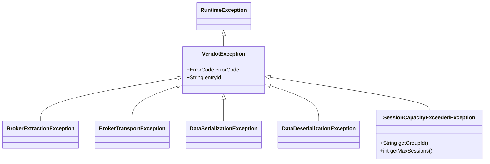

# Java API Reference

This section documents the complete public API surface of Veridot's Java implementation.

## Core Interfaces

| Interface | Description |
|-----------|-------------|
| [`DataSigner`](#datasigner) | Signs a payload → returns a token (JWT or messageId) |
| [`TokenVerifier`](#tokenverifier) | Verifies a token → returns `VerifiedData<T>` |
| [`TokenRevoker`](#tokenrevoker) | Revokes a session or all sessions of a group |
| [`TokenTracker`](#tokentracker) | Checks whether a session is still active |
| [`Broker`](#broker) | Transports protocol envelopes between service instances |
| [`TrustRoot`](#trustroot) | Validates key announcements — ensures the broker cannot forge keys |

---

## DataSigner

```java
@FunctionalInterface
public interface DataSigner {
    String sign(Object data, Configurer configurer);
}
```

Signs an arbitrary payload and returns either a JWT token (DIRECT mode), a broker reference (INDIRECT mode), or an encrypted reference (PRIVATE mode).

### Inner Interface: `DataSigner.Configurer`

| Method | Return | Description |
|--------|--------|-------------|
| `getGroupId()` | `String` | Logical group (e.g., userId) |
| `getSequenceId()` | `String` | Session ID within group (UUID if null) |
| `getDistribution()` | `DistributionMode` | DIRECT, INDIRECT, or PRIVATE |
| `getDuration()` | `long` | Token TTL in seconds |
| `getSerializer()` | `Function<Object, String>` | Custom payload serializer |
| `getRecipients()` | `List<String>` | Authorized recipients (PRIVATE mode) |
| `getMimeType()` | `String` | Payload MIME type (PRIVATE mode) |

---

## TokenVerifier

```java
@FunctionalInterface
public interface TokenVerifier {
    <T> VerifiedData<T> verify(String token, Function<String, T> deserializer);
}
```

Verifies a token through the [9-step verification pipeline](../guides/verifying-tokens.md) and returns the deserialized payload with its protocol identifiers.

---

## TokenRevoker

```java
public interface TokenRevoker {
    void revoke(String groupId, String sequenceId);
}
```

- `revoke("user-alice", "session-1")` — revokes a specific session
- `revoke("user-alice", null)` — revokes **all** sessions for the group

---

## TokenTracker

```java
public interface TokenTracker {
    boolean hasActiveToken(Object target);
}
```

Accepts a `groupId` (String), a JWT token, or a messageId. Returns `true` if any active session matches.

---

## Broker

```java
public interface Broker {
    CompletableFuture<Void> put(byte[] storageKey, byte[] envelopeBytes);
    byte[] get(byte[] storageKey);
    List<BrokerEntry> snapshot(Scope scope);
    default void putLocal(byte[] storageKey, byte[] envelopeBytes) {}

    record BrokerEntry(byte[] storageKey, byte[] envelopeBytes) {}
}
```

Implementations: `KafkaBroker` (veridot-kafka), `DatabaseBroker` (veridot-databases).

---

## TrustRoot

```java
public sealed interface TrustRoot permits PublicKeyTrustRoot, DelegatedTrustRoot {
    TrustIdentity resolve(String issuer);
}
```

### PublicKeyTrustRoot

You load the public key; Veridot verifies signatures in-process.

### DelegatedTrustRoot

You delegate signature verification to an external HSM or hardware security module. Note: using cloud KMS providers directly on the verification path is discouraged — see [TAD Architecture](../architecture/tad-architecture.md) for the recommended production approach.

```java
public non-sealed interface DelegatedTrustRoot extends TrustRoot {
    boolean verifySignature(String issuer, byte[] data, byte[] signature, Algorithm sigAlg);
}
```

---

## Key Records

### VerifiedData\<T\>

```java
public record VerifiedData<T>(T data, String groupId, String sequenceId) {}
```

### TrustIdentity

```java
public record TrustIdentity(PublicKey publicKey, boolean isRoot) {}
```

---

## Enums

### Algorithm

| Value | Code | JCA Signature | Recommended |
|-------|:----:|---------------|:-----------:|
| `RSA_SHA256` | `0x01` | `SHA256withRSA` | ❌ |
| `ECDSA_SHA256` | `0x02` | `SHA256withECDSA` | ❌ |
| `RSA_PSS` | `0x03` | `SHA256withRSAandMGF1` | ⚠️ |
| `ED25519` | `0x04` | `Ed25519` | ✅ |

:::tip
Prefer **ED25519** for all new deployments. It is constant-time by design and immune to timing attacks.
:::

### DistributionMode

| Value | Description |
|-------|-------------|
| `DIRECT` | JWT returned to caller (default) |
| `INDIRECT` | Payload stored in broker; caller receives reference |
| `PRIVATE` | E2EE hybrid encryption (AES-256-GCM + RSA/ECDH) |

### EvictionPolicy

| Value | Behavior when `maxSessions` reached |
|-------|--------------------------------------|
| `FIFO` | Evicts the **oldest** session |
| `LIFO` | Evicts the **newest** session |
| `LRU` | Evicts the **least recently used** session |
| `REJECT` | Throws `SessionCapacityExceededException` |

### ConfigScope

| Value | Precedence | Applies to |
|-------|:----------:|------------|
| `LOCAL` | 1 (highest) | Specific group only |
| `SITE` | 2 | All groups in a site |
| `GLOBAL` | 3 (lowest) | All groups |

---

## Exceptions

All Veridot exceptions extend `VeridotException` (unchecked).



| Exception | When thrown |
|-----------|------------|
| `BrokerExtractionException` | Token expired, revoked, tampered, or TrustRoot validation failed |
| `BrokerTransportException` | Kafka/DB infrastructure unavailable |
| `DataSerializationException` | Payload serialization to String failed |
| `DataDeserializationException` | String to payload deserialization failed |
| `SessionCapacityExceededException` | `maxSessions` reached with `REJECT` policy |

---

## GenericSignerVerifier

The default implementation of all four core interfaces (`DataSigner`, `TokenVerifier`, `TokenRevoker`, `TokenTracker`). Also implements `AutoCloseable`.

### Constructors

```java
// Minimal — no session limit
new GenericSignerVerifier(Broker, TrustRoot, String issuerId, PrivateKey, Algorithm)

// With watermark persistence
new GenericSignerVerifier(Broker, TrustRoot, String, PrivateKey, Algorithm, WatermarkStore)

// With session capacity management
new GenericSignerVerifier(Broker, TrustRoot, String, PrivateKey, Algorithm, int maxSessions, EvictionPolicy)

// Capacity + watermark persistence
new GenericSignerVerifier(Broker, TrustRoot, String, PrivateKey, Algorithm, int, EvictionPolicy, WatermarkStore)
```

### Additional Methods

```java
// Publish dynamic configuration to the broker
void publishConfig(ConfigScope scope, String scopeId,
                   int maxSessions, EvictionPolicy policy,
                   long defaultTtlSeconds, long validitySeconds)
```
