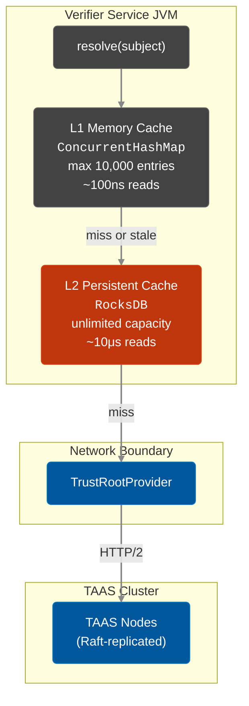

# CachingTrustRoot Architecture

`CachingTrustRoot` is the client-side caching layer that sits between your verifier services and the [TAAS cluster](./taas-architecture.md). It implements the `TrustRoot` resolution logic and provides:

- **Sub-microsecond key resolution** via an in-memory L1 cache
- **Offline resilience** via a persistent RocksDB L2 cache
- **Zero-downtime key propagation** via stale windows and async refresh
- **Automatic incremental synchronization** with the TAAS cluster

## Two-Tier Cache Architecture



### L1: In-Memory Cache

The L1 cache stores **decoded** `PublicKey` instances, eliminating the need to parse raw `publicKeyEncoded` bytes on every verification.

### L2: Persistent RocksDB Cache

The L2 cache ensures that a verifier service can start and verify tokens **even if the TAAS cluster is temporarily unreachable**, as long as the local RocksDB contains valid or stale-tolerant entries from a previous sync.

## Resolution Cycle

The core `resolve()` method is entirely **lock-free** on the critical path. It resolves a subject (format: `CN@hash`) into a `TrustIdentity` record containing the `PublicKey`, `isRoot`, and `Algorithm`.

### Stale Window: Graceful Degradation

The **stale window** (configured via `CAPABILITY_CACHE_TTL_SECONDS`) provides resilience against TAAS cluster outages, network partitions, and clock drift.

```
│◄──────── Key Validity ────────►│◄── Stale Window ──►│
│                                │                     │
notBefore                    notAfter            staleDeadline
```

When a stale key is served, `CachingTrustRoot` **simultaneously** triggers an asynchronous refresh to fetch the latest `TrustEntry`.

## Background Synchronization

`CachingTrustRoot` runs a background process that periodically fetches all modified entries from the TAAS cluster. The sync is **incremental** (differential): it only fetches entries modified since the last successful sync.

## Performance

| Scenario | Without CachingTrustRoot | With CachingTrustRoot |
|----------|:------------------------:|:---------------------:|
| Key resolution | Network call to TAAS per verify | ~100ns L1 hit |
| TAAS cluster down | ❌ All verification fails | ✅ Serves from L1/L2 for hours |
| JVM restart + TAAS down | ❌ Cannot start | ✅ Warm start from L2 |

## See Also

- [TAAS Architecture](./taas-architecture.md) — The server-side Raft cluster
- [Trust Hierarchy](./trust-hierarchy.md) — Trust model
