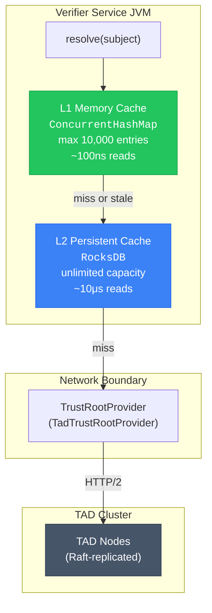
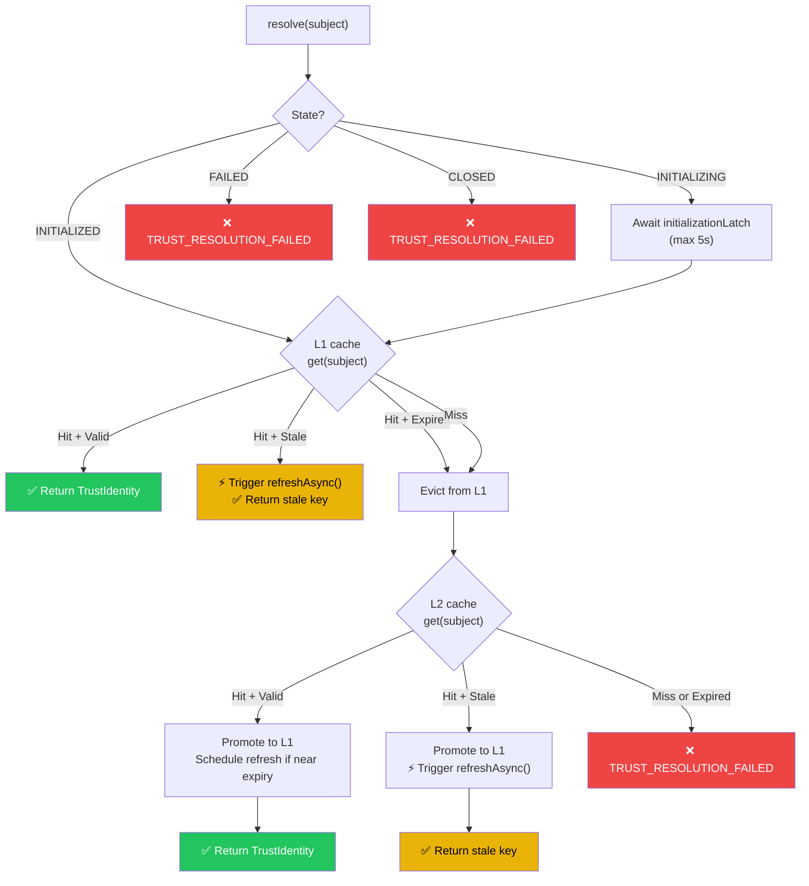
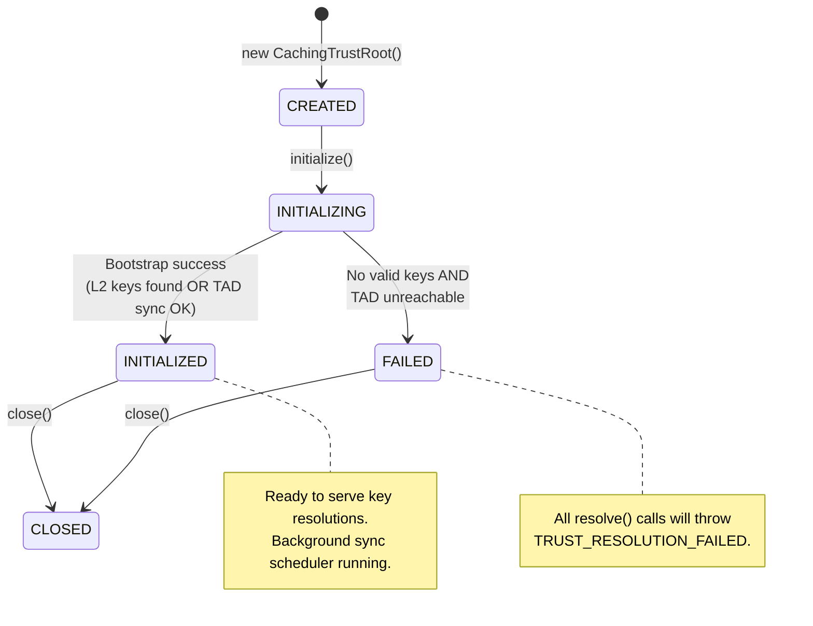

# CachingTrustRoot Architecture

`CachingTrustRoot` is the client-side caching layer that sits between your verifier services and the [TAD cluster](./tad-architecture.md). It implements the `PublicKeyTrustRoot` interface and provides:

- **Sub-microsecond key resolution** via an in-memory L1 cache
- **Offline resilience** via a persistent RocksDB L2 cache
- **Zero-downtime key rotation** via stale windows and async refresh
- **Automatic incremental synchronization** with the TAD cluster

## Two-Tier Cache Architecture



### L1: In-Memory Cache

| Property | Value |
|----------|-------|
| Implementation | `ConcurrentHashMap<String, CachedKeyEntry>` |
| Default max size | **10,000 entries** |
| Read latency | **~100 nanoseconds** (lock-free) |
| Concurrency | Lock-free via `ConcurrentHashMap.compute()` |
| Eviction | Size-bounded; stale/expired entries evicted on access |
| Data | Decoded `PublicKey` objects (ready for crypto ops) |

The L1 cache stores **decoded** `PublicKey` instances, eliminating the need to parse base64-encoded key bytes on every verification. The `CachedKeyEntry` record holds:

```java
record CachedKeyEntry(
    String subject,
    long version,
    PublicKey publicKey,      // Pre-decoded, ready for signature verification
    Instant validUntil,       // Nominal expiry
    Instant staleDeadline,    // validUntil + staleWindow
    Instant fetchedAt         // When this entry was last refreshed
) {
    boolean isValid(Instant now)  { return now.isBefore(validUntil); }
    boolean isStale(Instant now)  { return now.isBefore(staleDeadline); }
}
```

### L2: Persistent RocksDB Cache

| Property | Value |
|----------|-------|
| Implementation | `RocksDbL2Cache` |
| Capacity | Unlimited (disk-bounded) |
| Read latency | **~10 microseconds** |
| Persistence | Survives JVM restarts |
| Data | JSON-serialized `TrustEntry` objects |
| Sync tracking | `lastSyncTime` metadata for incremental sync |

The L2 cache ensures that a verifier service can start and verify tokens **even if the TAD cluster is temporarily unreachable**, as long as the local RocksDB contains valid or stale-tolerant entries from a previous sync.

## Resolution Cycle



### Resolution Code Walkthrough

The core `resolve()` method is entirely **lock-free** on the critical path:

```java
@Override
public TrustIdentity resolve(String subject) {
    // Step 0: Wait if initialization is in progress
    if (state == State.INITIALIZING) {
        boolean completed = initializationLatch.await(
            resolveWaitTimeout.toMillis(), TimeUnit.MILLISECONDS);
        if (!completed) throw ...;
    }

    Instant now = Instant.now();

    // Step 1: L1 lookup (ConcurrentHashMap — lock-free)
    Optional<CachedKeyEntry> l1Opt = l1Cache.get(subject);
    if (l1Opt.isPresent()) {
        CachedKeyEntry entry = l1Opt.get();
        if (entry.isValid(now)) {
            return new TrustIdentity(entry.publicKey(), false); // HOT PATH
        }
        if (entry.isStale(now)) {
            refreshAsync(subject);  // Fire-and-forget background refresh
            return new TrustIdentity(entry.publicKey(), false);
        }
        l1Cache.evict(subject);  // Fully expired
    }

    // Step 2: L2 fallback (RocksDB — ~10μs)
    Optional<TrustEntry> l2Opt = l2Cache.get(subject);
    if (l2Opt.isPresent()) {
        TrustEntry entry = l2Opt.get();
        if (entry.isValidAt(now)) {
            CachedKeyEntry promoted = promoteToL1(entry);
            scheduleRefreshIfNeeded(entry);  // Proactive refresh
            return new TrustIdentity(promoted.publicKey(), false);
        }
        if (entry.isValidAt(now.minus(staleWindow))) {
            CachedKeyEntry promoted = promoteToL1(entry);
            refreshAsync(subject);
            return new TrustIdentity(promoted.publicKey(), false);
        }
    }

    throw new VeridotException(TRUST_RESOLUTION_FAILED, subject, ...);
}
```

## Lifecycle State Machine



### Bootstrap Sequence

During `initialize()`, `CachingTrustRoot` executes the following bootstrap:

1. **Load L2 cache**: Read all `TrustEntry` records from the local RocksDB
2. **Validate entries**: Verify signature and temporal validity (including stale window tolerance)
3. **Promote valid entries to L1**: Decode public keys and populate the in-memory cache
4. **Cold start check**: If no valid entries exist locally, attempt a full synchronization with the TAD cluster
5. **Start background scheduler**: Schedule periodic incremental synchronization

```java
public void initialize() throws TrustRootInitializationException {
    state = State.INITIALIZING;

    List<TrustEntry> l2Entries = l2Cache.loadAll();
    boolean hasValidEntry = false;

    for (TrustEntry entry : l2Entries) {
        signatureVerifier.verify(entry);
        if (entry.isValidAt(now) || entry.isValidAt(now.minus(staleWindow))) {
            promoteToL1(entry);
            hasValidEntry = true;
        }
    }

    if (hasValidEntry) {
        state = State.INITIALIZED;       // Warm start
    } else {
        synchronizeFromProvider();        // Cold start — fetch from TAD
        state = State.INITIALIZED;
    }

    startScheduler();  // Periodic incremental sync
}
```

:::tip Warm vs Cold Start
- **Warm start**: The local RocksDB already has valid keys from a previous run. Initialization is instantaneous (~10ms). The service can verify tokens immediately, even if TAD is down.
- **Cold start**: First deployment or after data loss. Requires a successful TAD sync before the service can operate.
:::

## Stale Window: Graceful Degradation

The **stale window** is the grace period after a key's nominal expiry during which it is still accepted for verification. This provides resilience against:

- Temporary TAD cluster outages
- Network partitions
- Clock drift between services

```
│◄──────── Key Validity ────────►│◄── Stale Window ──►│
│                                │                     │
notBefore                    notAfter            staleDeadline
                                 │                     │
   ✅ Valid — return immediately   ⚠️ Stale — return    ❌ Expired
                                     + async refresh      evict
```

**Default values:**

| Parameter | Default | Purpose |
|-----------|---------|---------|
| `staleWindow` | **5 minutes** | Grace period after nominal expiry |
| `refreshThreshold` | **1 hour** | Proactive refresh before expiry |

When a stale key is served, `CachingTrustRoot` **simultaneously** triggers an asynchronous refresh via the single-threaded `veridot-trust-refresh` daemon thread:

```java
public CompletableFuture<Void> refreshAsync(String subject) {
    return CompletableFuture.runAsync(() -> {
        Optional<TrustEntry> entryOpt = provider.fetch(subject);
        if (entryOpt.isPresent()) {
            TrustEntry entry = entryOpt.get();
            signatureVerifier.verify(entry);
            l2Cache.put(entry);        // Persist to L2
            promoteToL1(entry);        // Update L1
        }
    }, scheduler);
}
```

## Background Synchronization

`CachingTrustRoot` runs a background `ScheduledExecutorService` that periodically fetches all modified entries from the TAD cluster:

```java
scheduler.scheduleWithFixedDelay(() -> {
    if (provider.isHealthy()) {
        synchronizeFromProvider();
    }
}, fullSyncInterval.toMillis(), fullSyncInterval.toMillis(), TimeUnit.MILLISECONDS);
```

The sync is **incremental** (differential): it only fetches entries modified since the last successful sync, using the `modifiedSince` timestamp tracked in L2:

```java
private void synchronizeFromProvider() throws Exception {
    Instant lastSync = l2Cache.lastSyncTime().orElse(Instant.EPOCH);
    List<TrustEntry> updates = provider.fetchModifiedSince(lastSync);

    for (TrustEntry entry : updates) {
        signatureVerifier.verify(entry);
        l2Cache.put(entry);
        if (entry.isValidAt(now) || entry.isValidAt(now.minus(staleWindow))) {
            promoteToL1(entry);
        }
    }
    l2Cache.markSyncTime(Instant.now());
}
```

**Default sync interval**: 6 hours. This acts as a safety net — most key updates are picked up proactively via the `refreshThreshold` mechanism during normal `resolve()` calls.

## L1 Promotion: From TrustEntry to PublicKey

When an entry is promoted from L2 to L1, the raw base64-encoded public key is decoded into a JCA `PublicKey` object:

```java
private CachedKeyEntry promoteToL1(TrustEntry entry) {
    byte[] keyBytes = Base64.getUrlDecoder().decode(entry.publicKeyEncoded());
    KeyFactory kf = KeyFactory.getInstance(entry.algorithm().jcaKeyAlgorithm());
    PublicKey publicKey = kf.generatePublic(new X509EncodedKeySpec(keyBytes));

    Instant staleDeadline = entry.notAfter().plus(staleWindow);
    CachedKeyEntry cached = new CachedKeyEntry(
        entry.subject(), entry.version(), publicKey,
        entry.notAfter(), staleDeadline, Instant.now()
    );

    // Atomic compare-and-swap: only promote if version >= existing
    l1Cache.compute(entry.subject(), (k, existing) -> {
        if (existing == null || entry.version() >= existing.version()) {
            return cached;
        }
        return existing;  // Keep newer version
    });
    return cached;
}
```

:::info Version Monotonicity
The `compute()` call ensures that an older key version can never overwrite a newer one in L1. This prevents race conditions during concurrent async refreshes.
:::

## Performance: Why L1/L2 Eliminates External Dependencies as a SPoF

| Scenario | Without CachingTrustRoot | With CachingTrustRoot |
|----------|:------------------------:|:---------------------:|
| Key resolution | Network call to TAD per verify (without cache) | ~100ns L1 hit |
| TAD cluster down | ❌ All verification fails | ✅ Serves from L1/L2 for hours |
| 100K verifications/sec | 100K network calls/sec | 0 network calls (all L1) |
| JVM restart + TAD down | ❌ Cannot start | ✅ Warm start from L2 |
| Key rotation | Immediate (network) | < 1h (refreshThreshold) |

The critical insight is that **public key material changes infrequently** (hours/days) but is **read extremely frequently** (every token verification). A two-tier cache converts an O(network) operation into an O(1) memory lookup.

## Tuning Guide

### Builder Configuration

```java
CachingTrustRoot trustRoot = CachingTrustRoot.builder()
    .provider(tadProvider)                     // Required: TrustRootProvider
    .l2Directory(Path.of("/var/lib/veridot/l2"))  // Required: RocksDB path
    .l1MaxSize(10_000)                         // Default: 10,000
    .refreshThreshold(Duration.ofHours(1))     // Default: 1 hour
    .staleWindow(Duration.ofMinutes(5))        // Default: 5 minutes
    .fullSyncInterval(Duration.ofHours(6))     // Default: 6 hours
    .resolveWaitTimeout(Duration.ofSeconds(5)) // Default: 5 seconds
    .build();

trustRoot.initialize();
```

### Parameter Reference

| Parameter | Default | Range | Effect |
|-----------|---------|-------|--------|
| `l1MaxSize` | 10,000 | 100 – 1,000,000 | Memory usage ≈ `l1MaxSize × 2KB` |
| `refreshThreshold` | 1 hour | 5 min – 24 hours | Lower = fresher keys, more TAD calls |
| `staleWindow` | 5 minutes | 0 – 1 hour | Higher = more resilience, slightly stale keys |
| `fullSyncInterval` | 6 hours | 30 min – 24 hours | Safety-net sync frequency |
| `resolveWaitTimeout` | 5 seconds | 1 – 30 seconds | Max wait during cold boot |

### Tuning Strategies

:::tip High-Throughput Microservice (> 50K req/s)
```java
.l1MaxSize(50_000)           // More keys in memory
.refreshThreshold(Duration.ofMinutes(30))  // More aggressive refresh
.staleWindow(Duration.ofMinutes(10))       // Longer grace period
```
:::

:::tip Edge / IoT Service (unreliable network)
```java
.l1MaxSize(1_000)            // Fewer keys, less memory
.staleWindow(Duration.ofHours(1))  // Very long grace period
.fullSyncInterval(Duration.ofHours(1))     // Sync more often when possible
```
:::

:::warning Memory Sizing
Each L1 entry consumes approximately 2 KB (PublicKey + metadata). With `l1MaxSize=10,000`, the L1 cache uses ~20 MB of heap. Plan your JVM heap accordingly.
:::

## Spring Boot Integration

The `veridot-trustroots-spring` module provides auto-configuration:

```yaml
veridot:
  trust-roots:
    tad-cluster-urls:
      - "https://tad-1.internal:8443"
      - "https://tad-2.internal:8443"
      - "https://tad-3.internal:8443"
    l2-directory: "/var/lib/veridot/trustroot-l2"
    l1-max-size: 10000
    refresh-threshold: PT1H
    stale-window: PT5M
    full-sync-interval: PT6H
```

## See Also

- [TAD Architecture](./tad-architecture.md) — The server-side Raft cluster that CachingTrustRoot connects to
- [Trust Hierarchy](./trust-hierarchy.md) — Where CachingTrustRoot fits in the overall trust model
- [veridot-core Module](../modules/veridot-core.md) — How `GenericSignerVerifier` uses `TrustRoot`
