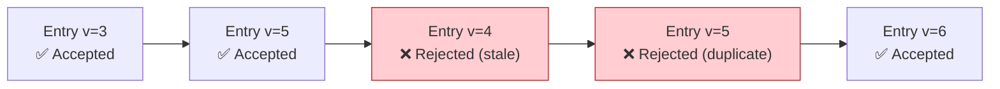
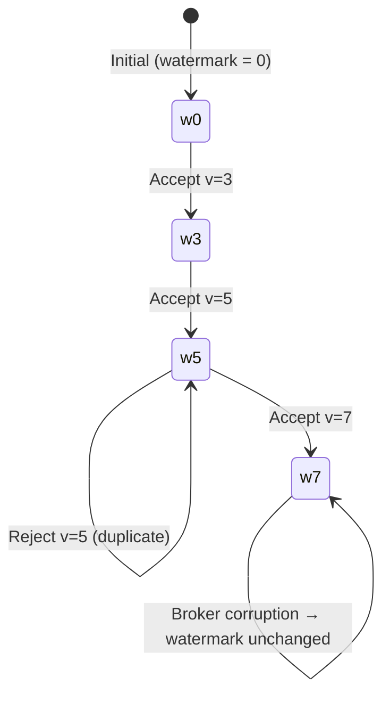
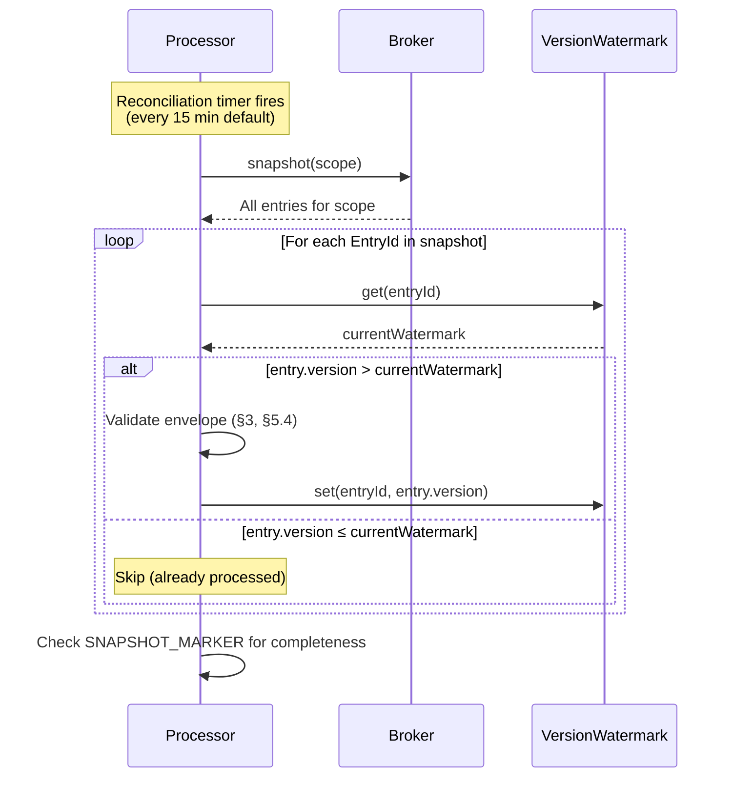
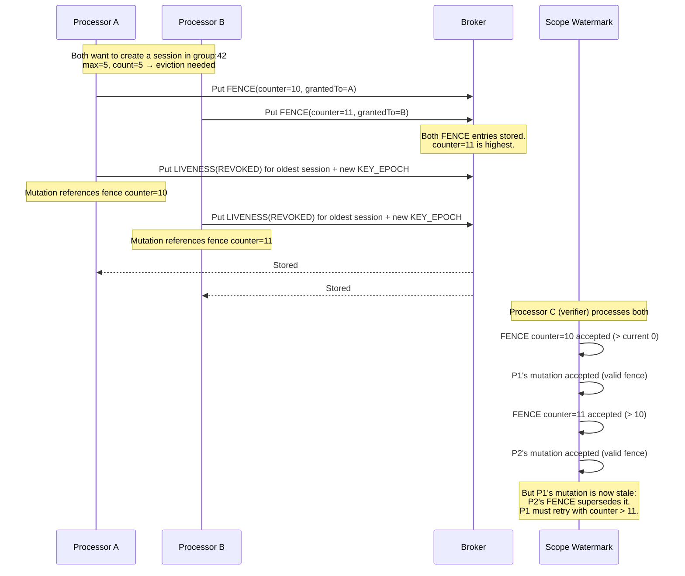

# Distributed Consistency

Veridot achieves strong consistency guarantees without requiring a strongly consistent broker. The protocol's state model is built on four invariants — monotonic versions, idempotent application, non-rollback watermarks, and periodic reconciliation — plus a fencing mechanism for capacity-affecting mutations.

## Invariant 1: Monotonic Version

For every `EntryId` (the triple `(scope, entryType, key)`), a conforming processor maintains the highest `version` it has accepted. An incoming entry is accepted **only if** its `version` is strictly greater than the currently recorded value.



**Rules:**
- The initial recorded version for an unseen `EntryId` is `0`
- The minimum valid `version` for any entry is `1` (version `0` → rejected with `V4201`)
- This check is evaluated **before** any semantic interpretation of the payload
- This applies uniformly across all entry types (`KEY_EPOCH`, `LIVENESS`, `CAPABILITY`, `CONFIG`, `FENCE`, etc.)

:::info Why not timestamps?
Versions are 64-bit unsigned integers, independent of wall-clock time. This eliminates clock synchronization issues between services. The `timestamp` field in envelopes is advisory-only — it is never used for ordering or conflict resolution.
:::

## Invariant 2: Idempotent Application

Applying an already-accepted entry a second time has **no additional effect** beyond the first application. Implementation uses an **upsert gated by version**, not an unconditional merge:

```java
// Pseudocode for idempotent entry processing
void processEntry(EntryId id, Envelope envelope) {
    long currentWatermark = watermark.get(id);      // 0 if unseen
    if (envelope.version() <= currentWatermark) {
        return; // Idempotent: already processed or stale
    }
    // Accept and apply
    store.upsert(id, envelope);
    watermark.set(id, envelope.version());           // Atomic with upsert
}
```

This matters for:
- **Snapshot reconciliation** — re-processing entries from a full scope scan is safe
- **Broker redelivery** — duplicate deliveries (Kafka at-least-once) are harmless
- **Crash recovery** — replaying the log from a checkpoint produces the same state

## Invariant 3: Non-Rollback

The highest recorded `version` for an `EntryId` **never decreases**. This holds independent of broker behavior:

| Scenario | Broker state | Processor watermark | Outcome |
|---|---|:---:|---|
| Normal update | Entry v=5 stored | 5 | ✅ Accepted |
| Broker overwrite by attacker | Entry v=3 replaces v=5 | 5 | ❌ Rejected (v=3 < watermark 5) |
| Broker data loss | Entry deleted | 5 | ❌ No entry to read; session treated as not valid |
| Corrupt entry delivered | Garbage bytes | 5 | ❌ Envelope validation fails |



### Watermark Persistence

Watermarks are persisted across restarts when a `WatermarkStore` is configured:

```bash
# Enable watermark persistence
export VDOT_WATERMARK_PERSISTENCE_FILE=/var/lib/veridot/watermarks.dat
```

The persisted snapshot is **cryptographically protected** (HMAC'ed using a key derived from the processor's long-term private key) to prevent local tampering and rollback attacks. If the integrity check fails, the snapshot is discarded and a full reconciliation is triggered.

:::warning Without persistent watermarks
If no `WatermarkStore` is configured, a processor restart resets all watermarks to `0`. Combined with fail-closed liveness semantics (§8.3), this defaults to **rejection** (not acceptance) until fresh entries are observed — which is the safe behavior.
:::

## Reconciliation via Snapshot

A processor periodically retrieves a full snapshot of each scope and reconciles its local watermarks against the highest `version` observed for each `EntryId`:



**Reconciliation closes the gap** when an individual entry delivery is lost in transit (e.g., Kafka consumer lag, network partition). It is a recommended operational safeguard.

**Recommended frequency:**
- At most the minimum `validUntil − now` across all held `LIVENESS(ACTIVE)` entries
- In any case, at least every 60 minutes per scope
- Default: every 15 minutes (`VDOT_RECONCILIATION_INTERVAL_MINUTES`)

### SNAPSHOT_MARKER Entries

A `SNAPSHOT_MARKER` entry records that a complete enumeration was performed:

| Field | Type | Description |
|---|---|---|
| `snapshotAt` | i64 | Wall-clock time the snapshot was initiated |
| `entryCount` | u32 | Number of distinct EntryIds in the snapshot |

Processors use these markers to detect incomplete or superseded snapshots.

## Fencing for Capacity Mutations

When a group has a `max` session limit configured, creating new sessions or evicting old ones is a **capacity-affecting mutation**. To prevent two processors from simultaneously admitting a session for the same slot, Veridot uses **fence tokens**.

### FENCE Entry Structure

| Field | Type | Description |
|---|---|---|
| `fenceCounter` | u64 | Strictly increasing per scope |
| `grantedTo` | string | Processor instance that holds this grant |
| `validUntil` | i64 | Expiry of the grant |

### Fencing Race: Sequence Diagram



### Fencing Rules

1. The `FENCE` entry MUST be durably stored **before** the mutation entry is submitted
2. If the mutation fails after the `FENCE` is committed, the consumed `fenceCounter` MUST NOT be reused
3. A mutation without a valid `FENCE`, or with a stale one, is rejected with `V4301`
4. This holds regardless of the broker's consistency model

:::tip Why fencing works without strong consistency
The protocol's ordering guarantee doesn't depend on the broker providing strong consistency. Two processors cannot both succeed for the same admission slot because exactly one holds the next valid `fenceCounter`, and the other's attempt is rejected and must be retried.
:::

## Consistency Properties Summary

| Property | Scope | Guarantee |
|---|---|---|
| **Monotonic version** | Per EntryId | State only moves forward; stale/duplicate entries silently rejected |
| **Idempotent application** | Per EntryId | Re-applying an entry is a no-op |
| **Non-rollback** | Per EntryId | Watermark never decreases, independent of broker state |
| **Eventual consistency** | Broker reads | Single-entry reads may be stale; reconciliation closes the gap |
| **Strong ordering** | Capacity mutations | Fence tokens provide total order, independent of broker consistency |
| **Bounded staleness** | Per scope | Snapshot reconciliation bounds the duration of undetected missed deliveries |

## Configuration Reference

| Parameter | Default | Environment Variable |
|---|:---:|---|
| Reconciliation interval | 15 min | `VDOT_RECONCILIATION_INTERVAL_MINUTES` |
| Max staleness before rejection | 60 min | `VDOT_RECONCILIATION_MAX_STALENESS_MINUTES` |
| Watermark persistence file | disabled | `VDOT_WATERMARK_PERSISTENCE_FILE` |

## Next Steps

- [Security Model](./security-model.md) — how monotonicity prevents state rollback attacks
- [Trust Hierarchy](./trust-hierarchy.md) — capability verification in the context of entry acceptance
- [Performance](./performance.md) — how local watermarks enable sub-ms verification
