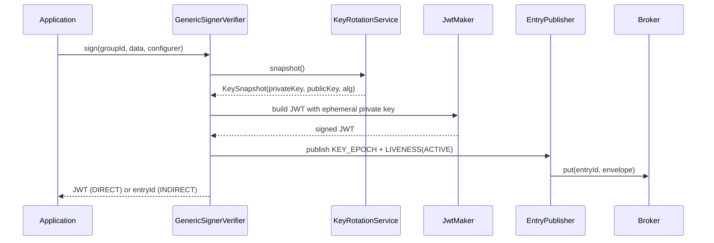
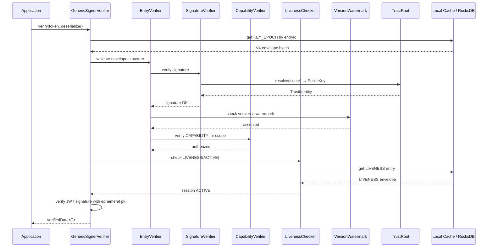
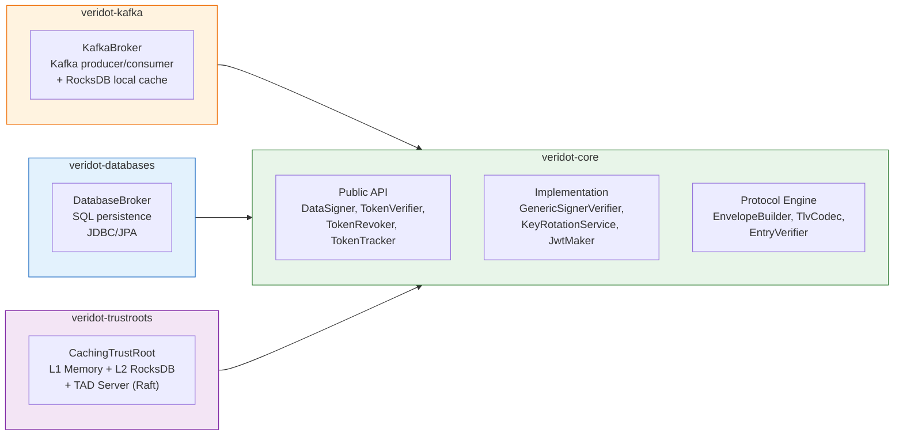

# Architecture Overview

Veridot is a distributed token verification protocol that solves the authentication trilemma: **sub-millisecond verification**, **instant revocation**, and **zero shared secrets** between services. This page describes the system architecture, its internal components, and how data flows through the signing and verification hot paths.

## Global Event-Driven & Trust Architecture

In a production event-driven microservices environment, Veridot separates business payload delivery, cryptographic metadata propagation, and long-term trust resolution into three distinct, decoupled paths:

```text
┌──────────────────────────────────────────────────────────────────────────────────┐
│                                   TAD Cluster                                    │
│                                                                                  │
│      ┌───────────┐           ┌───────────┐           ┌───────────┐               │
│      │   TAD-1   │◄─────────►│   TAD-2   │◄─────────►│   TAD-3   │  (Raft)       │
│      └─────┬─────┘           └─────┬─────┘           └─────┬─────┘               │
│            │                       │                       │                     │
│            └───────────────┬───────┴───────────────────────┘                     │
│                            ▼                                                     │
│                    Distributed Store                                             │
│               (clés publiques + métadonnées)                                     │
└────────────────────────────▲───────────────────────────────┬─────────────────────┘
                             │                               │
    mTLS Publication (HTTPS) │                               │ HTTPS/2 Resolution
                             │                               │ (Cache Miss Path)
              ┌──────────────┴───────────────┐               │
              │  Publisher (Orders Service)  │               │
              │                              │               │
              │   ┌──────────────────────┐   │               │
              │   │   🔐 LTK Private     │   │               │
              │   └──────────────────────┘   │               │
              │   ┌──────────────────────┐   │               │
              │   │   🔑 Ephemeral Key   │   │               │
              │   └──────────┬───────────┘   │               │
              │              │ sign          │               │
              │              ▼               │               │
              │   ┌──────────────────────┐   │               │
              │   │   Application Logic  │   │               │
              │   └──────┬────────┬──────┘   │               │
              └──────────┼────────┼──────────┘               │
                         │        │                          ▼
          Business Event │        │ Async metadata     ┌─────┴─────────────────────┐
        (OrderCreated +  │        │ (KEY_EPOCH,        │ Verifier (Shipping Svc)   │
             JWT Token)  │        │  LIVENESS, etc.)   │                           │
                         │        │                    │   ┌───────────────────┐   │
                         ▼        ▼                    │   │ TadTrustRootProv  │◄──┘
              ┌──────────────────────────┐             │   └─────────┬─────────┘   │
              │   Message Broker (Kafka) │             │             │             │
              │                          │             │   ┌─────────▼─────────┐   │
              │  ┌────────────────────┐  │             │   │ CachingTrustRoot  │   │
              │  │  orders-topic      │  │             │   │   (L1/L2 Cache)   │   │
              │  └─────────┬──────────┘  │             │   └─────────┬─────────┘   │
              │            │             │             │             │ resolve     │
              │  ┌─────────┼──────────┐  │             │   ┌─────────▼─────────┐   │
              │  │  veridot-topic     │  │             │   │ Veridot Verifier  │   │
              │  └─────────┼──────────┘  │             │   └─────────▲─────────┘   │
              └────────────┼─────────────┘             │             │               │
                           │                           │   ┌─────────┴─────────┐   │
                           │                           │   │  Local RocksDB    │   │
            Consume Event  │                           │   └─────────▲─────────┘   │
                           │                           │             │ async sync  │
                           │                           │             │ from topic  │
                           └───────────────────────────┼─────────────┘             │
                                                       │                           │
                                                       │   ┌───────────────────┐   │
                                                       │   │ Application Logic │   │
                                                       │   └───────────────────┘   │
                                                       └───────────────────────────┘
```

### Key Architectural Characteristics:

1. **Separated Kafka Topics**: The message broker manages two logically isolated topics. The business topic (e.g., `orders-topic`) carries the application events along with the JWT. The Veridot metadata topic (e.g., `veridot-entries-topic`) is used exclusively for propagating canonical binary envelopes containing ephemeral public keys and liveness updates.
2. **Decoupled Async Flows**: Signers generate an **ephemeral Ed25519 key pair** per session. They sign the JWT with the private key and immediately publish the public key metadata to the Veridot topic. The verifier service processes incoming business events and validates the token locally against its RocksDB instance, which is synchronized asynchronously by a background thread polling the Veridot topic.
3. **Out-of-Band Trust Root**: Ephemeral keys are verified by resolving the publisher's long-term public key (LTK) from the **Trust Authority Directory (TAD)** cluster, which maintains consistent records across multiple nodes using Raft consensus. To protect the critical verification path from network latency, the verifier uses `CachingTrustRoot` (L1 memory cache and L2 RocksDB persistent cache). The TAD is only queried on cache misses or during background revalidation cycles.


## Three Separated Paths

Veridot's architecture cleanly separates three operational concerns. Each path has different latency characteristics, failure modes, and consistency requirements.

### 1. Signing Hot Path

The signing hot path runs when a service creates a new token. It is latency-sensitive but tolerates brief broker unavailability (the token can be returned to the caller before the broker write completes).



**Key components on the signing path:**

| Component | Responsibility |
|---|---|
| `GenericSignerVerifier` | Main orchestrator implementing `DataSigner`, `TokenVerifier`, `TokenRevoker`, `TokenTracker` |
| `KeyRotationService` | Manages ephemeral key pairs with atomic `KeySnapshot` rotation (default: every 24h) |
| `JwtMaker` | Produces deterministic, canonically-serialized JWTs |
| `EntryPublisher` | Builds V4 binary envelopes via `EnvelopeBuilder` and publishes them to the broker |
| `CapacityManager` | Enforces `max` session limits with eviction policies before creating new sessions |
| `FenceManager` | Acquires `FENCE` tokens for capacity-affecting mutations |
| `LivenessManager` | Publishes `LIVENESS(ACTIVE)` attestations and schedules periodic renewals |

### 2. Verification Hot Path

The verification hot path runs when a service validates an incoming token. It is designed for **sub-millisecond latency** by reading exclusively from local state (RocksDB cache when using `KafkaBroker`), with **zero network calls** on the critical path.



**Verification pipeline (Protocol V4 §5.4):**

1. **Structural validation** — parse envelope per binary format (§3)
2. **Trust validation** — resolve `issuer` via `TrustRoot`, verify envelope `signature`
3. **Version watermark** — reject if `version ≤ recorded watermark` (§11.1)
4. **Capability validation** — confirm issuer holds valid `CAPABILITY` for scope (§6.4)
5. **Temporal validation** — confirm `KEY_EPOCH` is within `[validFrom, validUntil)` (§5.3)
6. **Liveness validation** — confirm fresh `LIVENESS(ACTIVE)` exists (§8.3)
7. **JWT signature verification** — verify the application token using the ephemeral `pk`
8. **Business validation** — application-level rules (JWT `exp`, claims, permissions)

:::warning[Fail-closed semantics]
Every step independently produces rejection on failure. Missing data, expired attestations, broker unavailability, and TrustRoot resolution failures all result in the same outcome: **rejection**. There is no fallback to a permissive mode.
:::

### 3. Control Plane

The control plane handles configuration changes, capability delegation, reconciliation, and key rotation. It operates on a slower cadence and prioritizes correctness over latency.

| Operation | Frequency | Component |
|---|---|---|
| Ephemeral key rotation | Every `VDOT_KEYS_ROTATION_MINUTES` (default: 24h) | `KeyRotationService` |
| LIVENESS renewal | Before each attestation's `validUntil` (last 20% of window) | `LivenessManager` |
| Version watermark reconciliation | Every `VDOT_RECONCILIATION_INTERVAL_MINUTES` (default: 15min) | `ReconciliationManager` |
| Configuration resolution | Cached with 60s TTL | `ConfigResolver` |
| Capability verification | Cached with 10s positive / 5s negative TTL | `CapabilityVerifier` |
| Snapshot reconciliation | Per §11.4, at least every 60 minutes per scope | `ReconciliationManager` |

## Module Map

The Java implementation is organized into focused modules:



| Module | Maven Artifact | Purpose |
|---|---|---|
| `veridot-core` | `io.github.cyfko:veridot-core` | Protocol engine, public API, all entry types |
| `veridot-kafka` | `io.github.cyfko:veridot-kafka` | Kafka broker + RocksDB local cache |
| `veridot-databases` | `io.github.cyfko:veridot-databases` | SQL-based broker (JDBC) |
| `veridot-trustroots` | `io.github.cyfko:veridot-trustroots` | Production TrustRoot implementations |

## Design Principles

These principles are enforced structurally in the code, not by convention:

1. **Deny by default** — any entry that is malformed, unauthorized, stale, or for which state cannot be positively established is rejected
2. **Structural authorization** — authorization is established exclusively by verifiable `CAPABILITY` entries, never by callbacks or defaults
3. **Monotonic state** — state only moves forward; no operation permits regression to an earlier known state
4. **Positive liveness proof** — a session is valid only when a fresh, signed `ACTIVE` attestation exists
5. **Uniform envelope** — all entry types use one canonical signed envelope and one verification pipeline
6. **Broker is untrusted** — the broker stores and relays bytes but has no authority over their meaning

## Next Steps

- [Security Model](./security-model.md) — threat model, fail-closed semantics, residual risks
- [Trust Hierarchy](./trust-hierarchy.md) — Root trust hierarchy, capabilities, delegation chains
- [Distributed Consistency](./distributed-consistency.md) — monotonic versions, fencing, reconciliation
- [Protocol Evolution](./protocol-evolution.md) — V1 through V4 timeline and rationale
- [Performance](./performance.md) — latency characteristics and tuning guidance
