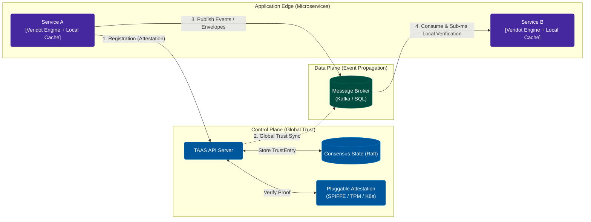
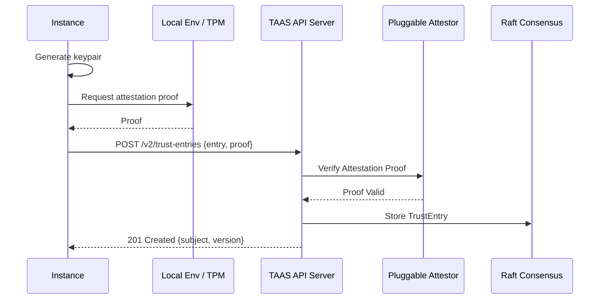
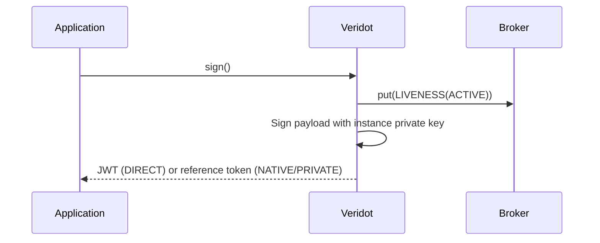
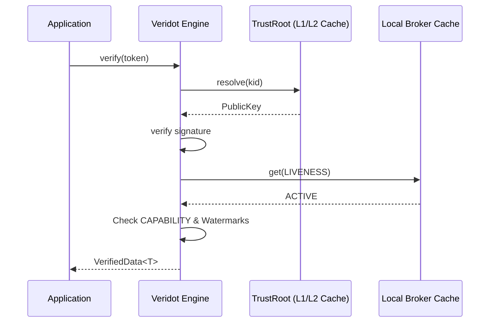

# Architecture Overview

Veridot Protocol Version 5 (V5) is a distributed token verification protocol that solves the authentication trilemma: **sub-millisecond verification**, **instant revocation**, and **zero shared secrets** between services. This page describes the system architecture, its internal components, and how data flows through the signing and verification hot paths.

## High-Level Architecture (Control Plane vs Data Plane)

Veridot's architecture strongly mimics modern infrastructure patterns (like Kubernetes) by cleanly separating the **Control Plane** (trust and identity) from the **Data Plane** (event propagation) and the **Application Edge** (sub-millisecond local verification).

## Global Event-Driven & Trust Architecture

In a production event-driven microservices environment, Veridot separates business payload delivery, cryptographic metadata propagation, and long-term trust resolution into distinct, decoupled paths.

### Key Architectural Characteristics:

1. **Broker-Untrusted Delivery**: The message broker manages logical topics (e.g., Kafka topics or SQL tables) to carry business events and Veridot envelopes. The broker is completely untrusted and has no authority over the validity of any entry.
2. **Instance-Native Identity**: An instance binds its identity to a generated keypair. While TAAS supports explicit key rotation, ephemeral instances typically use a Single-Key-Per-Instance pattern. It computes its subject as `CN@base64url(SHA-256(pk))[0:32]`.
3. **Attestation-First Trust**: Instances register their public keys at the **Trust Authority and Attestation Service (TAAS)** cluster by providing an attestation proof.
4. **Three Distribution Modes**:
   - **DIRECT**: Standard JWT returned to the caller.
   - **NATIVE**: V5 envelope stored directly in the broker as `SIGNED_DATA`. Compact reference token returned.
   - **PRIVATE**: End-to-End Encrypted payload stored as `SECURE_PAYLOAD` in the broker.

## Three Separated Paths

### 1. Registration / Bootstrap Path

Before an instance can sign, it must establish its cryptographic identity.

### 2. Signing Hot Path

The signing hot path runs when a service creates a new token or native envelope.

### 3. Verification Hot Path

The verification hot path runs when a service validates an incoming token. It is designed for **sub-millisecond latency** by reading exclusively from local state.

**Verification pipeline (Protocol V5 §1.6.3):**
1. **Resolve**: Extract `kid` and resolve via TrustRoot.
2. **Verify Signature**: Verify cryptographic signature using resolved public key.
3. **Check Capability**: Confirm signer holds a valid `CAPABILITY` for the scope.
4. **Check Liveness**: Confirm a fresh `LIVENESS(ACTIVE)` entry exists for the session.
5. **Deliver**: Verified data is delivered.

## Design Principles

These principles govern V5 architecture:

1. **Attestation-First**: Identities must be backed by a verifiable attestation proof.
2. **Identity-Key Binding**: Identity `CN@hash` natively ties the instance to its key. Ephemeral instances skip rotation entirely.
3. **Broker-Untrusted**: Security guarantees hold even if the broker is compromised.
4. **Structural Authorization**: Permissions are granted exclusively via signed `CAPABILITY` entries.
5. **Instance-Native**: Fits ephemeral compute environments natively.
6. **Post-Quantum Ready**: Support for ML-DSA-65 and hybrid schemes.

## Next Steps

- [Security Model](./security-model.md) — threat model, fail-closed semantics, residual risks
- [Trust Hierarchy](./trust-hierarchy.md) — Root trust hierarchy, capabilities, delegation chains
- [Distributed Consistency](./distributed-consistency.md) — monotonic versions, fencing, reconciliation
- [Performance](./performance.md) — latency characteristics and tuning guidance
