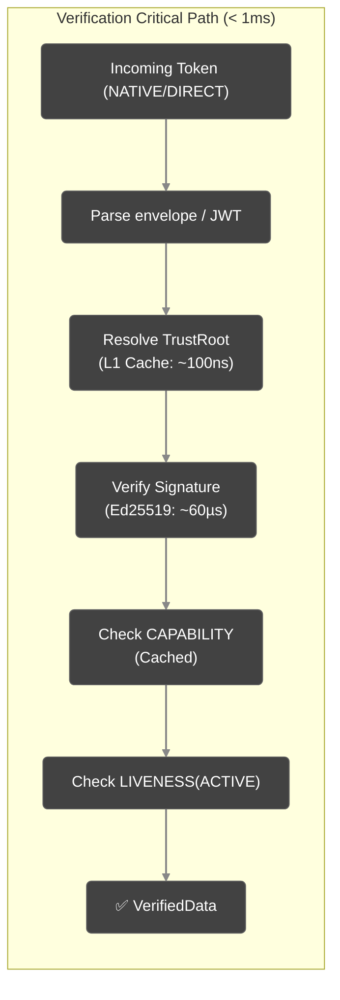

# Performance

Veridot Protocol V5 is engineered for sub-millisecond token verification with instance-native lifecycle management.

## Verification Latency: Sub-Millisecond

The verification hot path reads **exclusively from local state** (e.g., `CachingTrustRoot`). 

:::info[Network I/O vs. Cryptographic Verification]
**A crucial distinction:** When using the `NATIVE` or `PRIVATE` distribution modes, the consumer service *must* fetch the actual payload from the Message Broker (e.g., consuming a Kafka topic). This is standard **Network I/O** and is subject to network latency. 
However, once the payload is in memory, the **Cryptographic Verification** (validating the signature, checking capabilities, and confirming liveness) happens entirely via local CPU and RAM. **There are zero network calls made to identity providers or TAAS during this validation phase.** This is what enables the massive throughput of Veridot.
:::

### Latency Breakdown

| Step | Typical Latency | Notes |
|---|:---:|---|
| Resolution / Parse | ~2–10 µs | Local cache or fast binary parse |
| Signature verify | ~50–80 µs | Ed25519 (Constant-time) |
| CAPABILITY & Liveness check | ~1–5 µs | Local state / cache check |
| **Total (Ed25519)** | **~100–250 µs** | **Well under 1ms** |

## Signing Latency

In V5, each instance uses its **single, pre-generated asymmetric keypair**. There is no key rotation on the hot path.

| Operation | Ed25519 | RSA-2048 | ML-DSA-65 |
|---|:---:|:---:|:---:|
| Signature generation | ~50 µs | ~2 ms | ~500 µs |
| Broker write | ~1–5 ms | ~1–5 ms | ~1–5 ms |
| **Total signing latency** | **~1–5 ms** | **~3–7 ms** | **~2–6 ms** |

## Throughput Considerations

Since verification is purely local, throughput scales linearly with CPU cores. A multi-threaded system can easily achieve 40,000–60,000 verifications/sec per node when using Ed25519.

### ⚠️ Post-Quantum Signature Size Impact (ML-DSA-65)

While ML-DSA-65 offers NIST Level-3 post-quantum security, **it produces signatures that are ~3,300 bytes long** (compared to 64 bytes for Ed25519). 

If you configure your instances to sign `NATIVE` envelopes with ML-DSA-65, be aware that:
- **Broker Throughput:** Your message broker (e.g., Kafka) will process payloads that are significantly larger. This increases network bandwidth and storage costs.
- **Cache Memory:** Verification nodes caching these envelopes will experience higher RAM utilization.

Use ML-DSA-65 only for systems where the threat model explicitly requires post-quantum resilience *today*, and ensure your broker is provisioned for the increased payload size.

## See Also
- [Architecture Overview](./overview.md)
