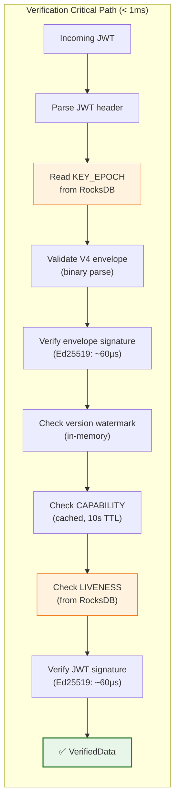
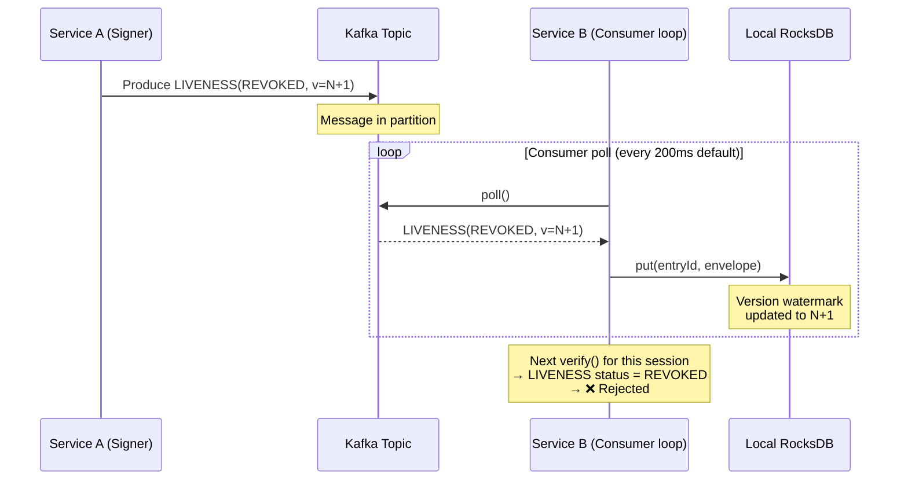
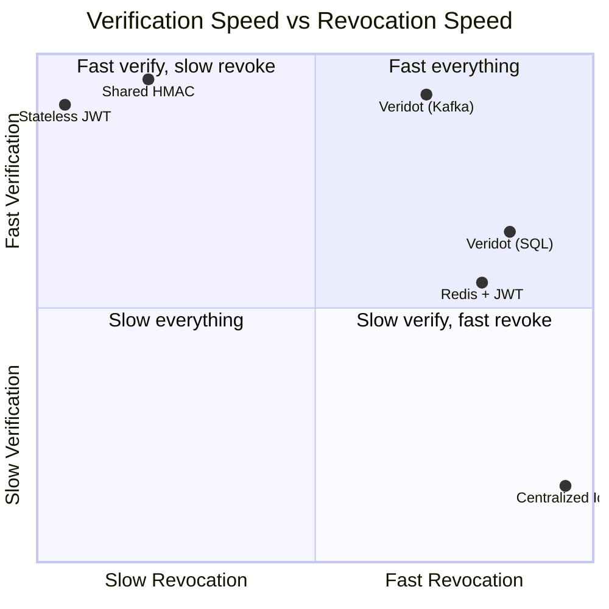

# Performance

Veridot is engineered for sub-millisecond token verification with instant revocation propagation. This page analyzes the latency characteristics of each operation, provides RocksDB tuning guidance, and compares Veridot against alternative approaches.

## Verification Latency: Sub-Millisecond

The verification hot path reads **exclusively from local state** — either an in-memory cache or a local RocksDB instance. There are **zero network calls** during token verification.



### Latency Breakdown

| Step | Typical Latency | Notes |
|---|:---:|---|
| JWT header parse | ~5 µs | Base64url decode + JSON parse of header only |
| RocksDB `get()` for KEY_EPOCH | ~10–50 µs | Local SSD; varies with working set size |
| V4 binary envelope parse | ~2–5 µs | Fixed offsets, no string splitting |
| Ed25519 envelope signature verify | ~50–80 µs | Constant-time; JDK 25+ native support |
| Version watermark check | ~0.1 µs | In-memory `ConcurrentHashMap` lookup |
| CAPABILITY check | ~0.5 µs (cached) | 10s positive cache; 5s negative cache |
| RocksDB `get()` for LIVENESS | ~10–50 µs | Same RocksDB instance |
| Ed25519 JWT signature verify | ~50–80 µs | Same algorithm as envelope |
| **Total (Ed25519)** | **~130–270 µs** | **Well under 1ms** |

:::info Algorithm impact on verification
Ed25519 verification is ~60µs. RSA-3072 verification is ~150µs. RSA-PSS is similar to RSA-3072. The choice of algorithm affects verification latency by 2–3×, but all options remain sub-millisecond.
:::

## Signing Latency

Signing latency depends primarily on ephemeral key generation and broker write latency:

| Operation | Ed25519 | RSA-3072 | ECDSA P-256 |
|---|:---:|:---:|:---:|
| Ephemeral key generation | ~50 µs | ~150 ms | ~5 ms |
| JWT signing | ~50 µs | ~2 ms | ~1 ms |
| Broker write (Kafka) | ~1–5 ms | ~1–5 ms | ~1–5 ms |
| **Total signing latency** | **~1–5 ms** | **~155 ms** | **~7 ms** |

:::tip Use Ed25519 for signing performance
Ed25519 key generation is **3000× faster** than RSA-3072. For services with high signing throughput, this eliminates the key generation bottleneck entirely.
:::

### Key Rotation Impact

Key generation happens in the background on a schedule (default: every 24 hours), so it does not affect the signing hot path. The `KeyRotationService` pre-generates the next key pair and atomically swaps the `KeySnapshot`:

```java
// KeyRotationService — atomic key rotation
private volatile KeySnapshot currentSnapshot;

public record KeySnapshot(PrivateKey privateKey, PublicKey publicKey, Algorithm alg) {}

// Rotation happens on a background thread — no impact on sign() latency
this.scheduler.scheduleAtFixedRate(
    this::generateKeyPair,
    Config.KEYS_ROTATION_MINUTES,
    Config.KEYS_ROTATION_MINUTES,
    TimeUnit.MINUTES
);
```

## Revocation Propagation

Revocation propagates at the speed of the broker's delivery mechanism:

### With KafkaBroker



| Phase | Latency | Configurable? |
|---|:---:|---|
| Kafka produce | ~1–5 ms | Kafka producer config |
| Kafka replication | ~1–10 ms | Kafka replication factor |
| Consumer poll interval | ~200 ms (default) | `VDOT_KAFKA_POLL_MS` |
| RocksDB write | ~10–50 µs | RocksDB write options |
| **Total revocation propagation** | **~200–250 ms** | Dominated by poll interval |

:::note Control channel priority
Within each Kafka consumer poll cycle, `LIVENESS` and `CONFIG` entries are processed **before** `KEY_EPOCH` data entries. This bounds revocation propagation latency to approximately 1 poll interval.
:::

### With DatabaseBroker (SQL)

SQL-based brokers have higher read latency (network round-trip to database) but provide immediate consistency:

| Phase | Latency |
|---|:---:|
| SQL INSERT for LIVENESS(REVOKED) | ~2–10 ms |
| Next verify() reads from SQL | ~2–10 ms |
| **Total revocation propagation** | **~2–10 ms** |

The trade-off: SQL provides faster revocation propagation but slower verification (every `verify()` requires a database query).

## Comparison with Alternatives

| Approach | Verification Latency | Revocation Latency | Shared Secrets? | Network Call on Verify? |
|---|:---:|:---:|:---:|:---:|
| **Veridot (Kafka + RocksDB)** | **~200 µs** | **~200 ms** | **None** | **No** |
| Centralized IdP call (OAuth introspection) | 5–50 ms | Immediate | None | **Yes** (every request) |
| Shared HMAC secret | ~5 µs | Requires key rotation | **Yes** (shared across services) | No |
| Stateless RSA/ECDSA JWT (no revocation) | ~150 µs | **Not possible** (wait for exp) | None | No |
| Distributed cache (Redis + JWT) | ~1–5 ms | ~1–5 ms | Depends | **Yes** (Redis call) |
| Veridot (SQL broker) | ~5–10 ms | ~5–10 ms | None | Yes (SQL query) |



## RocksDB Tuning

When using `KafkaBroker`, RocksDB serves as the local cache. Tuning it affects both verification latency and memory usage.

### Key Considerations

| Parameter | Impact | Recommendation |
|---|---|---|
| **Block cache size** | Determines how many entries are cached in RAM | Set to cover your active working set (all active groups × entry types) |
| **Write buffer size** | Affects write amplification and compaction frequency | Default is usually fine; increase for high-throughput signers |
| **Compaction style** | Level vs Universal compaction | Level (default) is better for read-heavy verification workloads |
| **Bloom filter** | Speeds up negative lookups (entry not found) | Enable; reduces unnecessary disk reads |
| **TTL compaction** | Removes expired entries | Enabled by default; runs every 5 minutes |

### Memory Estimation

```
Approximate memory = (active_groups × entries_per_group × avg_entry_size) + block_cache

Example:
  10,000 active groups × 3 entries/group × 500 bytes/entry = ~15 MB of data
  Block cache: 64 MB (default)
  Total: ~80 MB
```

### TTL Compaction

Expired entries are automatically purged from RocksDB during periodic compaction:

```
Compaction removes entries where:
  timestamp + ttl + 300s (clock drift tolerance) < now
```

This runs every 5 minutes by default, preventing stale accumulation without impacting read latency.

## Throughput Considerations

### Verification Throughput

Since verification is purely local (RocksDB + in-memory watermarks), throughput scales linearly with CPU cores:

| Scenario | Estimated Throughput | Bottleneck |
|---|:---:|---|
| Single-threaded, Ed25519 | ~5,000–8,000 verifications/sec | Signature verification CPU |
| Multi-threaded (8 cores), Ed25519 | ~40,000–60,000 verifications/sec | CPU; RocksDB is thread-safe |
| Single-threaded, RSA-3072 | ~3,000–5,000 verifications/sec | RSA verification CPU |

### Signing Throughput

Signing throughput is bounded by broker write latency and (for RSA) key generation:

| Scenario | Estimated Throughput | Bottleneck |
|---|:---:|---|
| Ed25519, Kafka broker | ~200–1,000 signs/sec | Kafka produce latency |
| RSA-3072, Kafka broker | ~6–7 signs/sec per key epoch | RSA key generation (background) |
| Ed25519, SQL broker | ~100–500 signs/sec | SQL INSERT latency |

:::note Key generation is not on the hot path
Ephemeral key pairs are pre-generated by `KeyRotationService` on a background thread. Signing uses the already-generated key. The throughput figures above reflect signing with a pre-generated key.
:::

## Monitoring Recommendations

| Metric | Alert Threshold | Indicates |
|---|:---:|---|
| `veridot.verify.latency.p99` | > 1 ms | RocksDB cache miss or CPU saturation |
| `veridot.verify.rejected.count` | Spike | Possible attack, key rotation issue, or clock drift |
| `veridot.reconciliation.staleness` | > 60 min | Reconciliation failing; snapshot may be stale |
| `veridot.fence.contention.count` | Increasing | Multiple processors competing for same scope |
| `veridot.rocksdb.cache.hit_ratio` | < 95% | Block cache too small for working set |

## Next Steps

- [Architecture Overview](./overview.md) — how signing and verification paths are separated
- [Distributed Consistency](./distributed-consistency.md) — why reconciliation interval affects staleness
- [Security Model](./security-model.md) — why Ed25519 is recommended for timing safety
