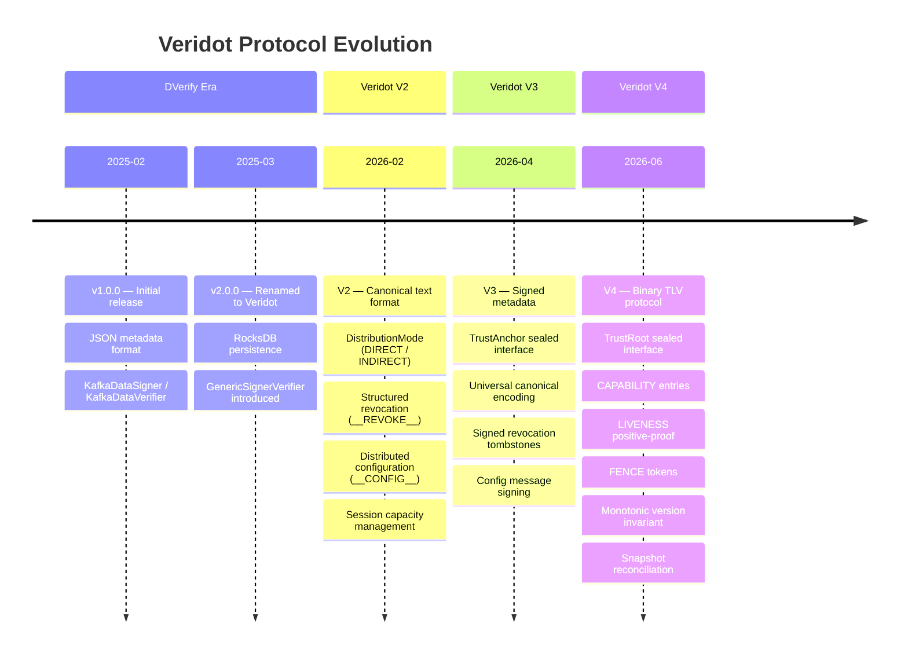

# Protocol Evolution

Veridot has evolved through four major protocol versions, each addressing specific architectural limitations discovered in production. This page documents the timeline, key changes, and design rationale for each version.

## Timeline



## Version-by-Version Changes

### DVerify v1 → Veridot v2 (2025-02 → 2026-02)

**Theme: Foundation**

The project began as "DVerify" — a simple Kafka-based key distribution mechanism for verifying JWTs without shared secrets.

| Aspect | v1 (DVerify) | v2 (Veridot) |
|---|---|---|
| **Name** | DVerify | Veridot |
| **Package** | `io.github.cyfko.dverify` | `io.github.cyfko.veridot` |
| **Metadata format** | JSON blob | Canonical text format `2:<groupId>:<seqId>\|<metadata>` |
| **Key classes** | `KafkaDataSigner`, `KafkaDataVerifier` | `GenericSignerVerifier` (unified) |
| **Distribution modes** | Single mode | `DIRECT` (return JWT) and `INDIRECT` (broker-stored) |
| **Session management** | None | `max`, `EvictionPolicy` (FIFO, LIFO, LRU, REJECT) |
| **Revocation** | Ad-hoc deletion | Structured `__REVOKE__` messages |
| **Configuration** | Constructor params only | Hierarchical: local → site → global via broker |

**Key design decision:** Unifying signer and verifier into `GenericSignerVerifier` simplified the API surface from 4 classes to 1, enabling a single processor to both sign and verify.

### Veridot v2 → V3 (2026-02 → 2026-04)

**Theme: Broker is no longer trusted**

:::danger[Security vulnerability fixed]
V2 had a critical flaw: any node with write access to the Kafka topic could inject a fraudulent key announcement and obtain valid verification results from any consumer. V3 closed this by introducing the `TrustAnchor` and mandatory envelope signing.
:::

| Aspect | v2 | V3 |
|---|---|---|
| **Broker trust** | Implicit trust (broker write = signing authority) | Broker is transport only; `TrustAnchor` validates identity |
| **Key announcements** | Unsigned metadata | Mandatory `sid` + `sig` (long-term RSA signature) |
| **Revocation messages** | Unsigned tombstones | Signed tombstones (long-term RSA signature) |
| **Config messages** | Unsigned | Signed with `sid` + `sig`; DoS injection vector closed |
| **Canonical encoding** | Per-message-type | Universal canonical encoding for all message types |
| **RSA key size** | 2048 (JDK default) | 3072 (NIST post-2030 recommendation) |

**New concept: `TrustAnchor`** — a `sealed interface` with two permitted implementations:
- `PublicKeyResolver` — resolves `signerId → PublicKey` locally
- `DelegatedVerifier` — delegates to external KMS/HSM

**Failure semantics:** `TrustAnchor` unavailable → fail safe (reject token). Invalid signature → log SEVERE security event.

### V3 → V4 (2026-04 → 2026-06)

**Theme: Binary format, structural authorization, positive-proof liveness**

V4 is the most significant protocol upgrade, replacing the text-based format with a self-describing binary TLV protocol and introducing four new entry types.

| Aspect | V3 | V4 |
|---|---|---|
| **Wire format** | Text: `3:<gid>:<sid>\|key:val,key:val` | Binary TLV: `VD` magic + structured envelope |
| **Trust interface** | `TrustAnchor` (sealed, 2 variants) | `TrustRoot` (sealed, 2 variants) |
| **Authorization** | Implicit (any resolvable identity can act on any scope) | Structural via `CAPABILITY` entries; no default grant |
| **Session validity** | Absence of revocation = valid | Positive-proof `LIVENESS(ACTIVE)` required |
| **Consistency model** | Eventual; timestamp-wins conflict resolution | Monotonic version invariant; version-wins |
| **Capacity ordering** | Best-effort (two processors can exceed `max`) | `FENCE` tokens provide total order |
| **Reconciliation** | None | Periodic `SNAPSHOT` + `SNAPSHOT_MARKER` |
| **Entry types** | 3 (normal, config, revocation) | 7 (KEY_EPOCH, CAPABILITY, CONFIG, LIVENESS, FENCE, SNAPSHOT_MARKER, SECURE_PAYLOAD) |
| **Algorithms** | RSA only | RSA-SHA256, ECDSA-SHA256, RSA-PSS, Ed25519 |
| **E2EE support** | None | `SECURE_PAYLOAD` with hybrid encryption (PRIVATE mode) |

#### Key V4 Innovations

**1. Text → Binary TLV**

The V3 text format used Base64url-encoded values with colon/comma/pipe delimiters. V4 uses a binary envelope with length-prefixed fields:

```
┌────────┬──────────────┬───────────┬───────┬──────────┐
│ VD     │ 0x04         │ entryType │ flags │ scopeLen │
│ magic  │ protoVersion │           │       │          │
├────────┴──────────────┴───────────┴───────┴──────────┤
│ scope ‖ keyLen ‖ key ‖ version ‖ timestamp ‖         │
│ issuerLen ‖ issuer ‖ payloadLen ‖ payload             │
├───────────────────────────────────────────────────────┤
│ sigAlg ‖ sigLen ‖ signature                           │
└───────────────────────────────────────────────────────┘
```

**Rationale:** Binary format eliminates Base64 encoding/decoding overhead, reduces message size, and makes length-field validation unambiguous.

**2. TrustAnchor → TrustRoot (Sealed Interface)**

The rename reflects a semantic shift: V3's `TrustAnchor` was an "anchor" that also handled scope authorization. V4's `TrustRoot` is purely a trust store — authorization is now handled structurally by `CAPABILITY` entries:

```java
// V3: TrustAnchor handled both identity AND authorization
interface TrustAnchor {
    PublicKey resolve(String signerId);
    boolean isAuthorizedForScope(String signerId, String scope); // ← removed in V4
}

// V4: TrustRoot handles identity ONLY; CAPABILITY entries handle authorization
sealed interface TrustRoot permits PublicKeyTrustRoot, DelegatedTrustRoot {
    TrustIdentity resolve(String issuer);
}
```

**3. CAPABILITY Entries**

V3 had no formal authorization model — any identity resolvable by the `TrustAnchor` could act on any scope. V4 introduces `CAPABILITY` entries that explicitly grant authorization:

- Required for all non-root identities
- Scope-pattern matching with wildcard support
- Delegation chains with `maxDelegationDepth` bound
- Cryptographically signed and subject to version monotonicity

**4. LIVENESS Positive-Proof**

V3 used a "revocation = invalidation" model: a session was valid until explicitly revoked. V4 inverts this:

| Model | V3 (Negative proof) | V4 (Positive proof) |
|---|---|---|
| No information | Session assumed valid | Session treated as **not valid** |
| Explicit status | Revoked → invalid | `ACTIVE` → valid; `REVOKED` → invalid |
| Attestation expires | N/A | Session treated as **not valid** until renewed |
| Network failure | Session might remain valid | Session treated as **not valid** |

**5. FENCE Tokens**

V3 acknowledged that two processors could temporarily exceed `max` session limits — "availability over strict consistency." V4 closes this gap with fence tokens that provide total ordering without requiring a shared lock.

## Breaking Changes Summary (V3 → V4)

| V3 Concept | V4 Replacement | Migration Action |
|---|---|---|
| `MetadataBroker` interface | `Broker` interface | Rewrite implementations |
| `TrustAnchor` sealed interface | `TrustRoot` sealed interface | Rename; remove `isAuthorizedForScope` |
| `V4Exception` | `VeridotException` | Rename exception references |
| Text message format `3:gid:sid\|...` | Binary TLV envelope | Automatic (protocol version in header) |
| `KafkaMetadataBrokerAdapter` | `KafkaBroker` | Replace class |
| `DatabaseMetadataBroker` | `DatabaseBroker` | Replace class |
| No capability required | `CAPABILITY` entry required | Publish capabilities for all non-root signers |
| Absence of revocation = valid | `LIVENESS(ACTIVE)` required | Configure liveness renewal |

## Protocol Coexistence

Multiple major protocol versions can coexist on the same transport:

- V3 messages start with ASCII `3:`
- V4 messages start with bytes `0x56 0x44 0x04` (`VD` + version byte)

A processor encountering an envelope of an unsupported `protoVersion` rejects it with `V4001` rather than attempting best-effort interpretation.

## Next Steps

- [Architecture Overview](./overview.md) — how these protocol concepts map to system components
- [Distributed Consistency](./distributed-consistency.md) — deep dive into the monotonic version model introduced in V4
- [Performance](./performance.md) — impact of binary format on throughput and latency
