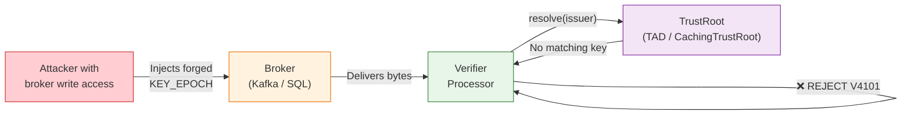

# Security Model

Veridot's security model is designed around a single principle: **the broker is transport only, never an authority**. All trust decisions are made locally by each processor using cryptographic verification against the `TrustRoot`. This page describes the threat model, fail-closed semantics, and residual risks.

## Broker Trust Model

The broker stores and relays bytes. It is never granted authority over the meaning of those bytes.



A processor with write access to the broker but **without** the long-term private key material corresponding to a TrustRoot-resolvable `issuer` is structurally incapable of producing an entry that a conforming verifier will accept as a new, valid state for any EntryId it does not already control (Protocol V4 §14.4).

## Threat Model

| # | Threat | Attack Vector | Mitigation | Protocol Reference |
|:---:|---|---|---|:---:|
| T1 | **Broker injection of forged key material** | Attacker with broker write access publishes a `KEY_EPOCH` with their own public key | TrustRoot resolution + mandatory envelope signature verification; the forged entry fails `V4101` | §3.4, §5.4 |
| T2 | **Forged or unauthorized configuration** | Attacker publishes a `CONFIG` entry (e.g., `max=1, pol=REJECT`) to DoS a group | Mandatory `CAPABILITY` verification for every `CONFIG` entry; no default grant exists | §6.4, §7.4 |
| T3 | **State rollback via broker overwrite** | Attacker or bug overwrites a stored entry with an older version | Monotonic version invariant enforced locally, independent of broker content; watermark never decreases | §11.1, §11.3 |
| T4 | **Silent treatment of revoked sessions** | Verifier treats absence of revocation as "still active" | Positive-proof liveness model; absence or invalidity of `LIVENESS(ACTIVE)` defaults to rejection | §8.3 |
| T5 | **Capacity race between concurrent processors** | Two processors simultaneously create sessions, exceeding `max` quota | Mandatory `FENCE` token with strictly-increasing counter; exactly one processor wins the race | §9.4, §10.3 |
| T6 | **Replay of a stale entry** | Attacker re-submits a previously valid entry | Monotonic version invariant; `version ≤ watermark` → rejected with `V4201` | §11.1 |
| T7 | **Undetected loss of entry in transit** | Network partition drops a `LIVENESS(REVOKED)` delivery | Periodic full-scope snapshot reconciliation detects and recovers missed deliveries | §11.4, §13.2 |
| T8 | **Injection / malformed input** | Crafted binary envelope with inconsistent length fields | Strict envelope validation before any payload interpretation; `magic` + `protoVersion` checked first | §3.2 |

## Fail-Closed Semantics

Veridot enforces fail-closed behavior in every failure scenario. There is no configuration option to disable this.

### TrustRoot Unavailable → Reject

```java
// When TAD/TrustRoot is unreachable, resolve() throws VeridotException
// The processor MUST reject — never fall back to accepting unverified entries
try {
    TrustIdentity identity = trustRoot.resolve(envelope.issuer());
    // ... verify signature
} catch (VeridotException e) {
    // MUST fail closed: reject the token
    throw new BrokerExtractionException("TrustRoot unavailable", e);
}
```

:::danger[No fallback]
A processor MUST NOT fall back to accepting entries without trust resolution. `TrustRoot` unavailability produces the same outcome as a definitive rejection: the token is not accepted.
:::

### Broker Unavailable → Reject

When the broker is unreachable, a processor cannot retrieve `KEY_EPOCH` or `LIVENESS` entries. Per §8.3, absence of a fresh `ACTIVE` attestation — for any reason, including network failure — means the session is treated as **not valid**.

### Missing LIVENESS → Reject

A session is valid **if and only if** all of these hold simultaneously:

1. A `LIVENESS` entry exists with the highest observed `version`
2. That entry passes structural and trust validation
3. `status = ACTIVE`
4. `now < validUntil`

Any failure — including "no entry found" — produces rejection. The protocol does not distinguish "no attestation found" from "attestation invalid."

### Expired KEY_EPOCH → Reject

A `KEY_EPOCH` outside its `[validFrom, validUntil)` window is rejected with `V4203`, regardless of whether the JWT itself has not yet expired.

## Timing-Safe Verification

### The Problem

Traditional RSA and ECDSA signature verification can leak information through timing side channels. While exploiting these in practice requires highly controlled conditions, Veridot takes a defense-in-depth approach.

### Recommendation: Ed25519

Ed25519 verification is **mathematically constant-time** — it is immune to timing attacks by construction, not by implementation care. The Java implementation emits a warning when verifying with non-constant-time algorithms:

```java
// From SignatureVerifier — warning on RSA/ECDSA verification
if (alg != Algorithm.ED25519) {
    logger.warning("Verifying with " + alg.name() + " which is not constant-time. "
        + "Consider migrating to Ed25519 for timing-safe verification.");
}
```

:::tip[Best practice]
Use `Algorithm.ED25519` for both long-term (envelope) and ephemeral (JWT) keys. It provides:
- Constant-time verification (immune to timing attacks)
- Small key sizes (32 bytes public key)
- Fast key generation (~50µs vs ~150ms for RSA-3072)
- Small signatures (64 bytes vs 384 bytes for RSA-3072)
:::

### Algorithm Confusion Prevention

Verifiers MUST extract the JWT header `alg` attribute and verify it matches the expected algorithm derived from the `KEY_EPOCH`'s `alg` property:

| KEY_EPOCH `alg` | Expected JWT `alg` |
|:---:|:---:|
| `0x01` (RSA-SHA256) | `RS256` |
| `0x02` (ECDSA-SHA256) | `ES256` |
| `0x03` (RSA-PSS) | `PS256` |
| `0x04` (Ed25519) | `EdDSA` |

A mismatch results in token rejection, preventing algorithm confusion attacks.

## Allowed Signature Algorithms

The `ALLOWED_SIG_ALGS` configuration controls which algorithms a processor will accept for envelope signatures.

**Default:** `ED25519, RSA_PSS` only.

This deliberately excludes:
- **RSA-SHA256** (`0x01`) — uses PKCS#1 v1.5 padding, which has known padding oracle vulnerabilities
- **ECDSA-SHA256** (`0x02`) — requires careful nonce generation; nonce reuse leaks the private key

Override via environment variable if needed:

```bash
# Add ECDSA support (not recommended for new deployments)
export VDOT_ALLOWED_SIG_ALGS="ED25519,RSA_PSS,ECDSA_SHA256"
```

## Minimum RSA Key Length

When RSA algorithms are used, Veridot enforces a minimum key length:

| Configuration | Default | Environment Variable |
|---|:---:|---|
| Minimum RSA key bits | 2048 | `VDOT_MIN_RSA_KEY_LENGTH` |
| Ephemeral RSA key size | 3072 | Hardcoded in `Config.ASYMMETRIC_KEY_SIZE` |

RSA-3072 is the default for ephemeral key generation, aligning with NIST post-2030 recommendations.

## Envelope Signing Scope

The `signature` field in every V4 envelope covers **every byte** preceding `sigAlg` in the encoded envelope, in wire order:

```
magic ‖ protoVersion ‖ entryType ‖ flags ‖ scopeLen ‖ scope ‖
keyLen ‖ key ‖ version ‖ timestamp ‖ issuerLen ‖ issuer ‖
payloadLen ‖ payload
```

No field is excluded from the signed region. No field is signed in isolation. This eliminates the possibility of relocating a valid signature to a different scope, key, version, or payload.

## Residual Risks

This protocol protects the integrity and ordering of state as distributed through an untrusted broker. It does **not** protect against:

| Residual Risk | Explanation | Recommended Mitigation |
|---|---|---|
| **Compromise of a TrustRoot-resolvable private key** | Key custody is outside the protocol's scope. If an attacker obtains the long-term private key, they can produce valid entries. | Use secure key storage (HSM, vault agents, or environment variables); never store keys in plaintext PEM files in production. Distribute public keys via the TAD cluster. Implement key rotation procedures. |
| **Fencing authority unavailability** | If the fencing authority for a scope is unreachable, capacity-affecting mutations stall. This is a deliberate consistency-over-availability trade-off. | Deploy redundant fencing authorities; monitor for `FENCE_TOKEN_STALE` errors. |
| **Resource exhaustion from unbounded entry volume** | The protocol does not define rate limits or storage quotas. | Apply rate limiting and storage quotas at the transport layer (Kafka quotas, SQL connection limits). |
| **Clock drift beyond tolerance** | The protocol uses a fixed 5-minute clock drift tolerance for temporal validation. Services with greater drift will see spurious rejections. | Use NTP synchronization; monitor `V4203` errors for clock drift symptoms. |

## Security Configuration Summary

| Parameter | Default | Environment Variable | Description |
|---|:---:|---|---|
| Allowed algorithms | `ED25519, RSA_PSS` | `VDOT_ALLOWED_SIG_ALGS` | Accepted envelope signature algorithms |
| Min RSA key length | 2048 bits | `VDOT_MIN_RSA_KEY_LENGTH` | Minimum accepted RSA public key size |
| Clock drift tolerance | 300s (5 min) | `VDOT_CLOCK_DRIFT_TOLERANCE_SECONDS` | Max allowed clock skew |
| Capability cache TTL | 10s | `VDOT_CAPABILITY_CACHE_TTL_SECONDS` | Positive capability cache duration |
| Negative capability cache TTL | 5s | `VDOT_CAPABILITY_NEGATIVE_CACHE_TTL_SECONDS` | Denied capability cache duration |
| Watermark persistence | disabled | `VDOT_WATERMARK_PERSISTENCE_FILE` | File path for durable watermark storage |

## Next Steps

- [Trust Hierarchy](./trust-hierarchy.md) — root identities, capability delegation, bootstrap
- [Distributed Consistency](./distributed-consistency.md) — monotonic versions, fencing, reconciliation
