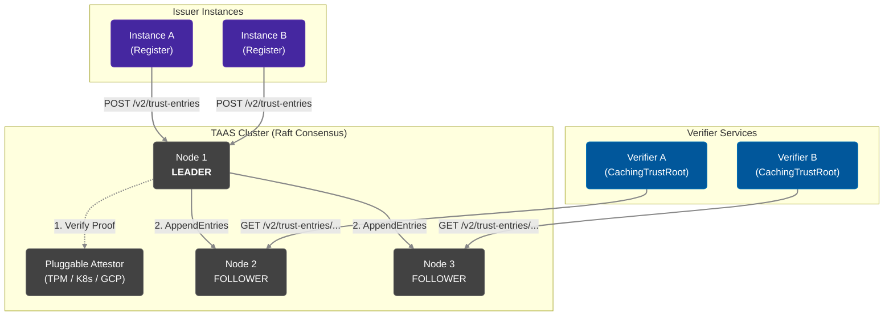
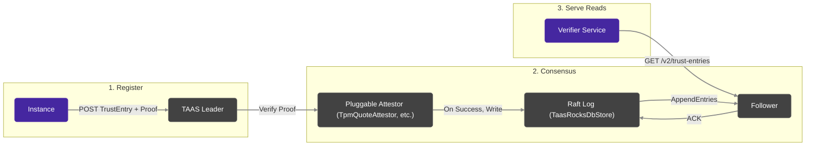

# TAAS Architecture

The **Trust Authority & Attestation Service (TAAS)** is Veridot's distributed, strongly-consistent registry for public key distribution and instance attestation. It solves a fundamental problem: how do verifier services securely obtain the public keys of ephemeral compute instances?

TAAS uses Raft consensus to replicate public key entries across a cluster, ensuring high availability and tamper resistance.

## High-Level Architecture

## Attestation-First Registration

Every identity participating in the protocol MUST be backed by an attestation proof. During registration:

1. An instance generates an asymmetric keypair and computes its subject `CN@hash`.
2. It obtains an **attestation proof** binding its public key to its runtime environment (e.g., TPM quote).
3. It registers at the TAAS via `POST /v2/trust-entries` with its trust entry and proof.
4. The TAAS verifies the proof. Upon success, it stores the public key via Raft consensus.

## TrustEntry Record

A `TrustEntry` is the canonical record of a registered identity in the TAAS. It contains:
- `schemaVersion` (MUST be 2 for V5)
- `subject` (Format: `CN@hash`)
- `publicKeyEncoded`
- `algorithm`
- `isRoot` and `isInstanceScoped`
- `attestationPlugin` and `attestationRef`

## Data Flow: Register → Replicate → Serve

## See Also

- [CachingTrustRoot Architecture](./caching-trustroot.md) — Client-side caching layer
