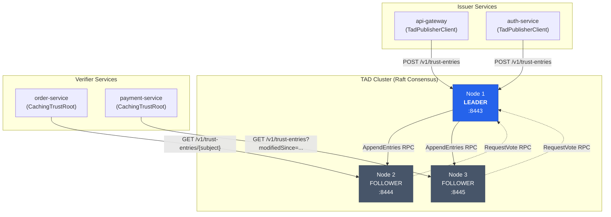
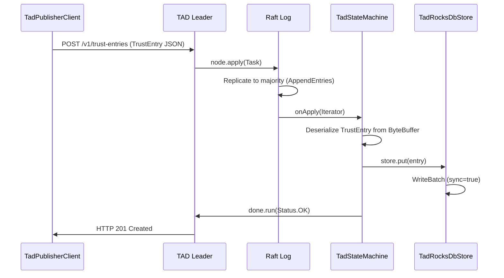
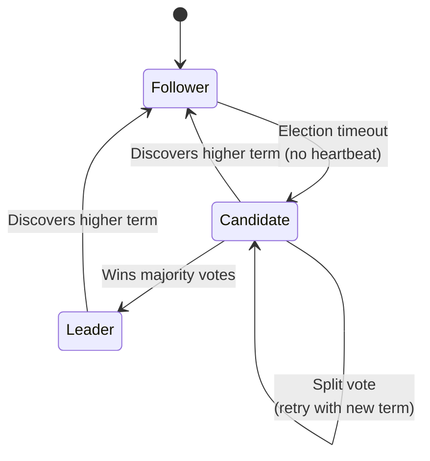
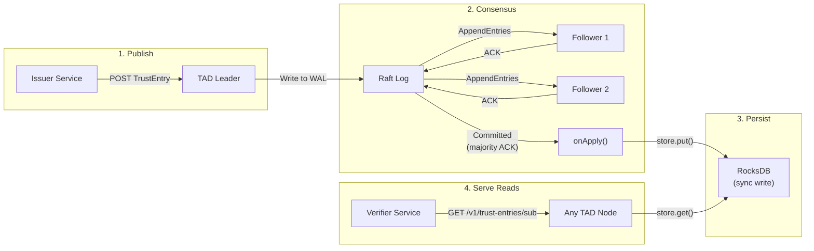

# TAD Architecture

The **Trust Authority Directory (TAD)** is Veridot's distributed, strongly-consistent registry for long-term public key distribution. It solves a fundamental problem: how do verifier services obtain the public keys of issuers without sharing secrets and without a single point of failure?

TAD uses [SOFAJRaft](https://www.sofastack.tech/projects/sofa-jraft/overview/) — an Alibaba-contributed, production-hardened Java implementation of the Raft consensus protocol — to replicate public key entries across a cluster of 3 or 5 nodes.

## High-Level Architecture



:::info[Key Insight]
**Writes go to the leader**, which replicates the entry to a majority of nodes before acknowledging. **Reads can be served by any node** (including followers), since the local RocksDB store on each node is updated via the deterministic Raft state machine.
:::

## Rationale: Why TAD over Alternatives?

The design of the Trust Authority Directory (TAD) was chosen after evaluating several traditional key distribution and verification methods. Each alternative introduces architectural flaws or violates core constraints of the Veridot protocol:

### 1. Why not Cloud KMS (AWS KMS, Google Cloud KMS, Azure Key Vault)?
* **Violation of Key Custody Invariant**: Protocol V4 dictates that **the long-term private key must never leave the issuer's custody**. Cloud KMS systems generate and manage private keys internally. Under KMS custody, the issuer service does not own the key, but delegates cryptographic operations to the cloud, violating this trust boundaries principle.
* **Network Latency and SPoF**: Querying a cloud KMS synchronously on the token verification path introduces 1–10ms network latency and turns the cloud provider into a single point of failure (SPoF), violating the offline-verification requirement.

### 2. Why not Relational Databases (PostgreSQL, MySQL)?
* **No Cryptographic Write Guarantees**: Databases are passive storage engines. They cannot natively validate the authenticity (`issuerSignature`) of public keys upon write. If database credentials or the database instance is compromised, an attacker can substitute public keys. In contrast, TAD validates signatures cryptographically before appending entries.
* **Performance and Connections Overhead**: Querying SQL databases synchronously on cache misses is extremely slow compared to TAD's lightweight, in-memory/RocksDB lookup.

### 3. Why not Redis / Hazelcast?
* **Shared Network Cache vs. Local Cache**: Redis is a shared network hop. If Redis fails, all verifier instances fail. This does not allow true offline verification. Veridot's TAD is decoupled from the hot path using local RocksDB persistent caches on the verifier side.
* **No Validation of Signatures**: Redis does not verify the signature of entries, exposing the cache to poisoning if the Redis network is breached.

### 4. Why not Shared File Systems (NFS)?
* **NFS Read Latency & Concurrency**: Read operations on shared mounts are slow and non-deterministic. NFS offers no native transactional concurrency control for key rotation updates.
* **Security Vuln**: Any process with write access to the NFS mount can substitute public keys, violating the protocol's integrity requirement.

### 5. Why not HTTP JWKS per service?
* **Heavy Network Coupling**: Every verifier must know the URL of every publisher service. In a system with thousands of microservices, this creates a complex, fragile grid of network dependencies.

### Summary Comparison Matrix

| Criteria | TAD (Consensus) | Cloud KMS / HSM | Relational DB | Redis / Cache | Shared FS (NFS) | HTTP JWKS |
|---|---|---|---|---|---|---|
| **Protocol V4 Compatible** | ✅ Yes | ❌ No (Key custody) | ✅ Yes | ⚠️ Partial | ⚠️ Partial | ✅ Yes |
| **Offline Verification** | ✅ Yes (with cache) | ❌ No | ✅ Yes (with cache) | ⚠️ Partial | ✅ Yes (with cache) | ✅ Yes (with cache) |
| **Tamper Resistance** | ✅ High (`issuerSignature`) | ✅ High | ❌ Low (Credential leak) | ❌ Low | ❌ Low | ⚠️ Medium (TLS only) |
| **No Network on Hot Path** | ✅ Yes | ❌ No (Direct call) | ✅ Yes | ❌ No (Network hop) | ⚠️ Partial | ✅ Yes |
| **Zero SPoF** | ✅ Yes (Raft cluster) | ✅ Yes | ⚠️ Requires Replica | ✅ Yes | ❌ No | ❌ No |

## Component Breakdown

TAD is structured as five Maven sub-modules under `veridot-trustroots`:

| Module | Role |
|--------|------|
| `veridot-trustroots-api` | `TrustEntry`, `TrustRootProvider`, `KeyAlgorithm` — shared data model |
| `veridot-trustroots-core` | `CachingTrustRoot`, L1/L2 caches — client-side caching layer |
| `veridot-trustroots-tad-client` | `TadTrustRootProvider`, `TadPublisherClient` — HTTP clients |
| `veridot-trustroots-tad-server` | Spring Boot app: `TadController`, `RaftServerEngine`, `TadStateMachine`, `TadRocksDbStore` |
| `veridot-trustroots-spring` | Spring Boot auto-configuration for `CachingTrustRoot` |

## SOFAJRaft Consensus Protocol

### Why SOFAJRaft?

| Criterion | SOFAJRaft | etcd | Consul | Custom impl |
|-----------|:---------:|:----:|:------:|:-----------:|
| Language | Java (native) | Go (requires sidecar) | Go (requires sidecar) | Java |
| Embedded | ✅ In-process | ❌ External process | ❌ External process | ✅ |
| Production proven | Alibaba-scale | Kubernetes-scale | HashiCorp-scale | ❌ |
| RocksDB storage | ✅ Built-in | ✅ bbolt | ❌ | Manual |
| Maintenance burden | Low (library) | Medium (infra) | Medium (infra) | Very High |

SOFAJRaft gives us an **in-process Java library** — no sidecar, no gRPC bridge, no polyglot operational overhead. The TAD server is a single Spring Boot JAR.

### Raft Group Configuration

```java
// RaftServerEngine.java — simplified
NodeOptions nodeOptions = new NodeOptions();
nodeOptions.setLogUri(dataPath + "/log");       // WAL directory
nodeOptions.setRaftMetaUri(dataPath + "/meta");  // Raft metadata (term, votedFor)
nodeOptions.setSnapshotUri(dataPath + "/snapshot");
nodeOptions.setFsm(stateMachine);               // TadStateMachine

Configuration initConf = new Configuration();
initConf.parse(peersStr);  // "127.0.0.1:9443,127.0.0.1:9444,127.0.0.1:9445"
nodeOptions.setInitialConf(initConf);

RaftGroupService service = new RaftGroupService(raftGroupId, serverPeer, nodeOptions);
Node node = service.start();
```

Every node in the cluster is identified by its `IP:port` and belongs to a Raft group (default: `veridot-tad`). The node stores three types of data locally:

- **Log**: Write-ahead log of all proposed entries (append-only)
- **Meta**: Current term number and `votedFor` — persisted across restarts
- **Snapshot**: Periodic compacted snapshot of the state machine

## State Machine Replication

### TadStateMachine

`TadStateMachine` extends SOFAJRaft's `StateMachineAdapter` and implements the deterministic `onApply` callback:



The critical section in `TadStateMachine.onApply`:

```java
@Override
public void onApply(Iterator iter) {
    while (iter.hasNext()) {
        Status status = Status.OK();
        try {
            ByteBuffer data = iter.getData();
            byte[] bytes = new byte[data.remaining()];
            data.get(bytes);

            TrustEntry entry = objectMapper.readValue(bytes, TrustEntry.class);
            store.put(entry); // Synchronous RocksDB write
        } catch (Exception e) {
            status = new Status(RaftError.EINTERNAL,
                "Failed to apply log to State Machine: " + e.getMessage());
        }

        // Notify the client via the completion callback
        Closure done = iter.done();
        if (done != null) {
            done.run(status);
        }
        iter.next();
    }
}
```

:::warning[Determinism Requirement]
`onApply` **must** be deterministic. The same log entry applied on any node must produce the same state. This is why `TadStateMachine` uses `setSync(true)` for RocksDB writes — the state machine cannot return success unless the write is physically durable.
:::

## Leader Election and Failover



### Election Behavior

1. **Normal operation**: The leader sends periodic `AppendEntries` heartbeats. Followers reset their election timer on each heartbeat.
2. **Leader failure**: A follower's election timer expires. It increments its term, votes for itself, and sends `RequestVote` RPCs.
3. **Majority wins**: The candidate that receives votes from a majority becomes the new leader.
4. **Write redirection**: If a write request hits a follower, `TadController` returns **HTTP 307 Temporary Redirect** to the leader:

```java
@PostMapping("/v1/trust-entries")
public ResponseEntity<?> publish(@RequestBody TrustEntry entry) {
    if (!stateMachine.isLeader()) {
        PeerId leader = raftEngine.getNode().getLeaderId();
        if (leader == null) {
            return ResponseEntity.status(HttpStatus.SERVICE_UNAVAILABLE)
                .body(Map.of("error", "RAFT_UNAVAILABLE",
                             "detail", "Leader not elected yet"));
        }
        return ResponseEntity.status(HttpStatus.TEMPORARY_REDIRECT)
            .location(URI.create("http://" + leader.getEndpoint()
                + "/v1/trust-entries"))
            .build();
    }
    // ... apply via Raft
}
```

### Leader Tracking in the State Machine

```java
@Override
public void onLeaderStart(long term) {
    leaderTerm.set(term);  // AtomicLong
}

@Override
public void onLeaderStop(Status status) {
    leaderTerm.set(-1);
}

public boolean isLeader() {
    return leaderTerm.get() > 0;
}
```

## Data Flow: Publish → Replicate → Serve



### TadRocksDbStore: Storage Model

The server-side RocksDB store uses **three column families**:

| Column Family | Key | Value | Purpose |
|--------------|-----|-------|---------|
| `entries` | `<subject> ‖ 0x00 ‖ <version_8B>` | JSON-serialized `TrustEntry` | Versioned key storage |
| `subjects` | `<subject>` | `<latest_version_8B>` | Active version index |
| `meta` | Metadata keys | Various | Global metadata (sync tokens, etc.) |

The composite key in `entries` enables:
- **Point lookups** by subject + version
- **Range scans** by subject prefix (for historical versions)
- **Version ordering** via big-endian 8-byte version encoding

### Incremental Sync API

The `GET /v1/trust-entries?modifiedSince=<ISO-8601>` endpoint supports differential synchronization:

```java
public List<TrustEntry> getModifiedSince(Instant since) {
    List<TrustEntry> list = new ArrayList<>();
    try (RocksIterator iterator = db.newIterator(entriesHandle)) {
        iterator.seekToFirst();
        while (iterator.isValid()) {
            TrustEntry entry = objectMapper.readValue(iterator.value(), TrustEntry.class);
            if (entry.publishedAt().isAfter(since)) {
                list.add(entry);
            }
            iterator.next();
        }
    }
    return list;
}
```

This is used by `CachingTrustRoot` for periodic background synchronization (see [CachingTrustRoot Architecture](./caching-trustroot.md)).

## REST API Reference

| Method | Endpoint | Description | Leader required? |
|--------|----------|-------------|:----------------:|
| `POST` | `/v1/trust-entries` | Publish a new `TrustEntry` | ✅ |
| `PUT` | `/v1/trust-entries/{subject}` | Rotate key for subject | ✅ |
| `GET` | `/v1/trust-entries/{subject}` | Resolve latest key | ❌ |
| `POST` | `/v1/trust-entries/batch` | Batch resolve multiple subjects | ❌ |
| `GET` | `/v1/trust-entries?modifiedSince=` | Incremental sync | ❌ |
| `GET` | `/health` | Health check (role + leader info) | ❌ |

## Deployment Configuration

TAD is a standard Spring Boot application. Configuration via `application.yml`:

```yaml
veridot:
  tad-server:
    node-id: "192.168.1.10:9443"          # This node's Raft address
    raft-group-id: "veridot-tad"           # Cluster name
    initial-peers: "192.168.1.10:9443,192.168.1.11:9443,192.168.1.12:9443"
    storage:
      directory: "/var/lib/veridot-tad"    # RocksDB + Raft data
```

### Production Recommendations

:::tip[Cluster Sizing]
- **3 nodes**: Tolerates 1 failure. Recommended for most deployments.
- **5 nodes**: Tolerates 2 failures. Use for mission-critical environments.
- Always deploy an **odd number** of nodes to avoid split-brain scenarios.
:::

:::danger[Never Run a Single Node in Production]
A single TAD node cannot form a Raft quorum alone. If it crashes, no writes are possible until it recovers. Always deploy at least 3 nodes.
:::

| Concern | Recommendation |
|---------|----------------|
| Storage | SSD-backed volumes for RocksDB write performance |
| Network | Low-latency links between Raft peers (< 10ms RTT) |
| Memory | 512 MB–1 GB heap per node (RocksDB uses off-heap) |
| Monitoring | Scrape `/health` endpoint; alert on `role=FOLLOWER` on all nodes |
| Backup | Periodic snapshot of the `storage.directory` |

## Client Integration

### TadTrustRootProvider (Verifier Side)

```java
import io.github.cyfko.veridot.trustroots.tad.client.TadTrustRootProvider;

// Connect to the TAD cluster with failover
TrustRootProvider provider = new TadTrustRootProvider(
    List.of(
        "https://tad-1.internal:8443",
        "https://tad-2.internal:8443",
        "https://tad-3.internal:8443"
    ),
    sslContext,              // Optional: TLS context
    Duration.ofSeconds(3)    // Per-request timeout
);
```

The client iterates through all cluster URLs on failure, following HTTP 307 redirects automatically via `HttpClient.Redirect.NORMAL`.

### TadPublisherClient (Issuer Side)

```java
import io.github.cyfko.veridot.trustroots.tad.client.TadPublisherClient;

TadPublisherClient publisher = new TadPublisherClient(
    List.of("https://tad-1.internal:8443", "https://tad-2.internal:8443"),
    sslContext,
    Duration.ofSeconds(5)
);

// Publish a new trust entry
publisher.publish(trustEntry);

// Rotate key for a subject
publisher.rotate("api-gateway", newTrustEntry);
```

## See Also

- [CachingTrustRoot Architecture](./caching-trustroot.md) — Client-side caching layer that sits in front of TAD
- [Trust Hierarchy](./trust-hierarchy.md) — How TAD fits into the overall trust model
- [Security Model](./security-model.md) — Signature verification chain
