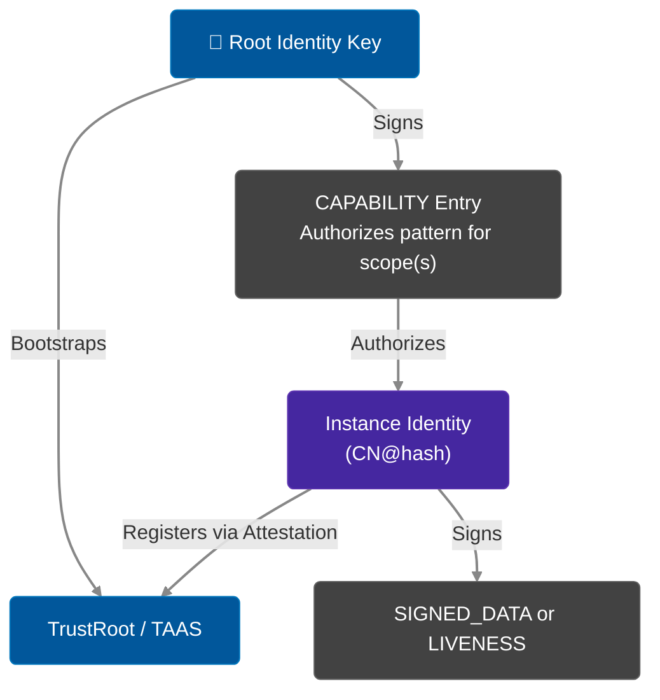

# Trust Hierarchy

Veridot uses a hierarchical cryptographic trust model where all authority derives from root identities registered in the `TrustRoot`. 

## Trust Chain

## Root Identity

An identity directly and successfully resolvable in the `TrustRoot` with `isRoot=true` is called a **trust anchor** or root identity. Root identities have special privileges:

- **Unconditionally authorized** to publish `CAPABILITY` entries for any scope, without itself holding a prior `CAPABILITY`
- **Treated as having delegation depth 0**

### Trust Bootstrap
In a new deployment, the TAAS cluster is initialized with a bootstrap keypair (the root trust anchor). This key publishes the initial `CAPABILITY` entries authorizing service classes (e.g., using subject pattern `orders-service@*`).

## Capability Delegation

Non-root instances derive their authorization from `CAPABILITY (0x02)` entries. 

### CAPABILITY Entry Structure

- `subjectSid` OR `subjectPattern` (e.g. `orders-service@*`)
- `permissions` (list of strings)
- `delegationDepth`
- `notBefore`, `notAfter`

### Subject Pattern Matching

In an instance-native model, each instance has a unique subject (`CN@hash`). Creating one CAPABILITY entry per instance is operationally expensive. `subjectPattern` with wildcard `"orders-service@*"` authorizes all instances of a service class with a single entry.

## Revocation

Instead of key rotation, V5 uses explicit revocation. An instance that is shutting down or compromised publishes a `LIVENESS(REVOKED)` entry. Alternatively, an authoritative party can issue a `TRUST_REVOCATION (0x0A)` entry broadcasting the revocation of the previously trusted identity.

## Next Steps

- [Security Model](./security-model.md)
