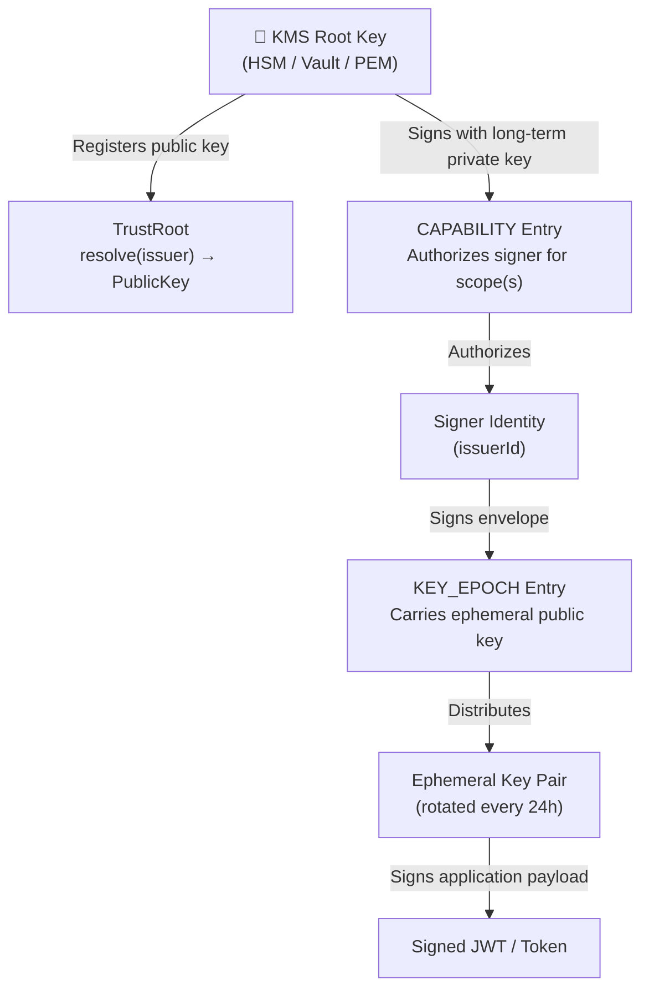
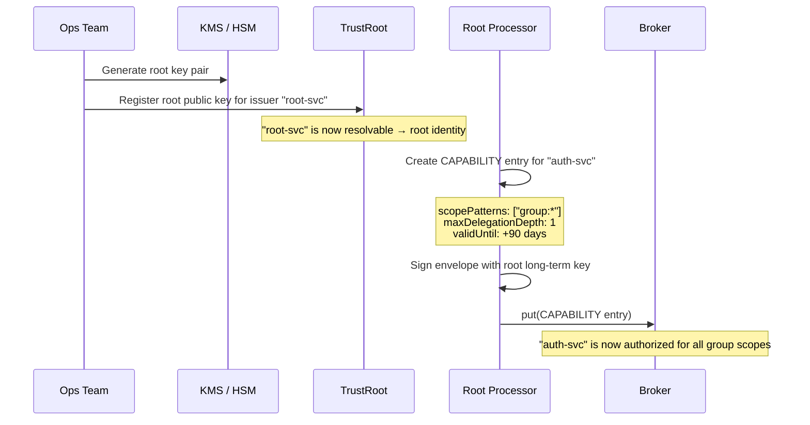
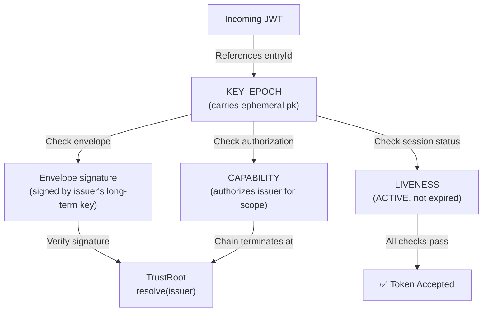

# Trust Hierarchy

Veridot uses a hierarchical cryptographic trust model where all authority derives from root identities registered in the `TrustRoot`. This page describes the trust chain, capability delegation, bootstrap procedures, and key rotation lifecycle.

## Trust Chain

Every token verification ultimately traces back to a root key in the `TrustRoot`:



### Layer Responsibilities

| Layer | Lifetime | Managed By | Purpose |
|---|---|---|---|
| **KMS Root Key** | Months–years | Ops / Security team | Ultimate trust anchor; signs capability grants |
| **CAPABILITY** | Configurable (`validUntil`) | Root identity or delegating identity | Authorizes an issuer to publish entries for a set of scopes |
| **Signer Identity** | Lifetime of the service | Service deployment | Long-term identity used to sign all V4 envelopes |
| **KEY_EPOCH** | Hours (default: 24h) | `KeyRotationService` | Distributes the ephemeral public key through the broker |
| **Ephemeral Key** | Same as KEY_EPOCH | `KeyRotationService` | Signs individual application tokens (JWTs) |

## Root Identity

An identity directly and successfully resolvable in the `TrustRoot` is called a **root identity**. Root identities have special privileges:

- **Unconditionally authorized** to publish `CAPABILITY` entries for any scope, without itself holding a prior `CAPABILITY`
- **Does not require** a `CAPABILITY` entry to issue `KEY_EPOCH`, `LIVENESS`, `CONFIG`, or `FENCE` entries for any scope
- Treated as having **delegation depth 0** for capability chain verification

```java
// A root identity is simply one that the TrustRoot can resolve
sealed interface TrustRoot permits PublicKeyTrustRoot, DelegatedTrustRoot {
    /**
     * Resolves the long-term identity of the issuer.
     * @throws VeridotException if the issuer cannot be resolved
     */
    TrustIdentity resolve(String issuer);
}
```

The `TrustRoot` is a `sealed interface` with exactly two permitted implementations:

| Implementation | Use Case |
|---|---|
| `PublicKeyTrustRoot` | Resolves `issuer → PublicKey` locally (trust store, TAD Local Cache, PEM file). Veridot verifies signatures in-process. This is the **recommended production option** when paired with TAD. |
| `DelegatedTrustRoot` | Delegates signature verification to an external KMS/HSM (e.g., Vault Transit). The signature is verified outside of the JVM process. |

:::warning[Key Security & Operational Guidance]
1. **Never store long-term private keys in plain-text PEM files** on local disks in production. Use secure environment variables, vault agents, or local HSM-backed endpoints for signers.
2. **Avoid direct Cloud KMS calls in DelegatedTrustRoot**: Direct synchronous calls to external cloud KMS APIs (such as AWS KMS or Azure Key Vault) on the verification path violate Protocol V4's offline-verification invariant and add runtime network dependencies. For distributed deployments, configure signers with local custody of their long-term private keys and distribute public keys via the **TAD (Trust Authority Directory)** cluster.
:::

## Capability Delegation

Non-root identities derive their authorization from `CAPABILITY` entries issued — directly or transitively — by a root identity.

### CAPABILITY Entry Structure

| Field | Type | Description |
|---|---|---|
| `subjectSid` | string | Identity being granted the capability |
| `scopePatterns` | list of strings | Scope patterns this capability authorizes (e.g., `group:42`, `site:*`) |
| `maxDelegationDepth` | u8 | Maximum further delegation hops permitted (`0` = no re-delegation) |
| `validUntil` | i64 | Expiry timestamp in milliseconds since epoch |

### Delegation Chain

```mermaid
graph LR
    Root["Root Identity<br/>(depth 0)"]
    CapA["CAPABILITY<br/>subjectSid: svc-auth<br/>maxDelegationDepth: 2"]
    SvcAuth["svc-auth<br/>(depth 1)"]
    CapB["CAPABILITY<br/>subjectSid: svc-payments<br/>maxDelegationDepth: 1"]
    SvcPay["svc-payments<br/>(depth 2)"]
    CapC["CAPABILITY<br/>subjectSid: svc-notifications<br/>maxDelegationDepth: 0"]
    SvcNotif["svc-notifications<br/>(depth 3) ❌ EXCEEDS DEPTH"]

    Root -->|"Signs"| CapA
    CapA -->|"Authorizes"| SvcAuth
    SvcAuth -->|"Signs"| CapB
    CapB -->|"Authorizes"| SvcPay
    SvcPay -->|"Signs"| CapC
    CapC -.->|"❌ Rejected: depth 3 > maxDelegationDepth 2"| SvcNotif

```



**Delegation depth rules:**

- A capability issued directly by a root identity has depth **0**
- A capability issued by `subjectSid` of another valid capability has depth **n+1**
- The chain is bounded by the granting capability's `maxDelegationDepth`
- If the chain exceeds `maxDelegationDepth`, the capability is rejected with `V4104`

### Scope Pattern Matching

Scope patterns support a trailing `*` wildcard:

| Pattern | Matches |
|---|---|
| `group:user-123` | Exactly `group:user-123` |
| `group:*` | Any group scope |
| `site:prod-cluster` | Exactly `site:prod-cluster` |
| `global` | The global scope |

Patterns MUST NOT use `*` in any position other than as a single trailing character.

## Bootstrap: First Capability

In a fresh deployment, no `CAPABILITY` entries exist. The bootstrap process uses root identity privileges:



:::info[No chicken-and-egg problem]
Root identities bypass the `CAPABILITY` check entirely. The first `CAPABILITY` entry in a deployment is always signed by a root identity, requiring no prior capability.
:::

## Key Rotation Lifecycle

Veridot uses a dual-layer key architecture:

### Ephemeral Keys (Automatic)

Managed by `KeyRotationService`, rotated automatically:

```java
// KeyRotationService rotates ephemeral keys on a schedule
public KeyRotationService(Algorithm alg) {
    this.alg = alg;
    generateKeyPair(); // Initial key pair
    this.scheduler.scheduleAtFixedRate(
        this::generateKeyPair,
        Config.KEYS_ROTATION_MINUTES,  // default: 1440 (24h)
        Config.KEYS_ROTATION_MINUTES,
        TimeUnit.MINUTES
    );
}
```

Key properties:
- Default rotation: every 24 hours (`VDOT_KEYS_ROTATION_MINUTES`)
- Atomic snapshot access via `KeySnapshot` record (prevents key/algorithm mismatch)
- Old private keys are actively destroyed via `Destroyable.destroy()` (forward secrecy)
- Default algorithm: `ED25519`

### Long-Term Root Keys (Manual)

Rotated via an operational four-phase procedure:

| Phase | Action | Impact |
|---|---|---|
| **1. Dual Trust** | Generate new key; configure `TrustRoot` to accept both old and new | Verifiers accept both keys |
| **2. Re-issue** | Re-sign all `CAPABILITY` and `CONFIG` entries with new key, incrementing `version` | Watermarks advance to new entries |
| **3. Session Rollover** | Wait for ephemeral key rotation to naturally expire old sessions, or force rollover | All active sessions use new trust chain |
| **4. Decommission** | Remove old key from `TrustRoot`; destroy old private key in KMS | Old key can no longer authorize anything |

:::tip[Version monotonicity]
Always increment the `version` field on any re-signed envelope. Veridot verifiers reject incoming entries with a version lower than the current watermark (`STALE_VERSION` error `V4201`).
:::

## Emergency Key Rotation (Compromise Recovery)

If a root or signer key is compromised:

1. **Immediate revocation** — publish `LIVENESS(REVOKED)` for all sessions associated with the compromised key, with incremented `version`
2. **Fence injection** — issue new `FENCE` entries for affected scopes to invalidate all capacity grants
3. **Fast-track root rotation** — deploy new `TrustRoot` configuration, publish updated capabilities signed by the new key
4. **Monitor** — watch for `TRUST_RESOLUTION_FAILED` (`V4101`) errors confirming the old key is rejected

## Verification: Putting It All Together

When a verifier receives a JWT, it traces the full trust chain:



## Next Steps

- [Security Model](./security-model.md) — threat model and fail-closed semantics
- [Distributed Consistency](./distributed-consistency.md) — how monotonic versions prevent rollback
- [Protocol Evolution](./protocol-evolution.md) — how the trust model evolved from V1 to V4
