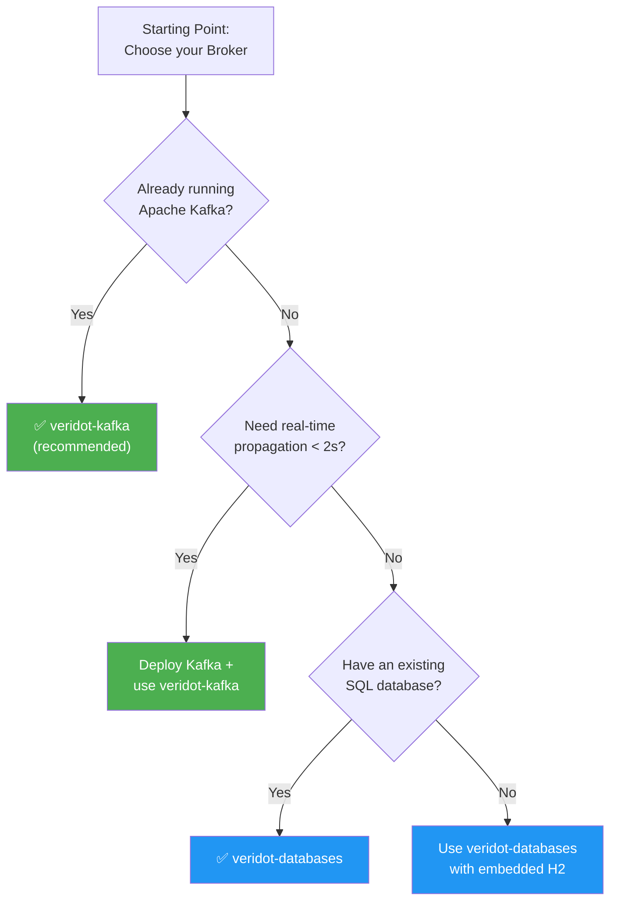

import Tabs from '@theme/Tabs';
import TabItem from '@theme/TabItem';

# Choosing a Broker

The `Broker` is the distribution layer that propagates cryptographic metadata (public keys, liveness attestations, configurations) between signer and verifier nodes. Veridot ships two production-ready implementations:

| Module | Backed by | Best for |
|---|---|---|
| **`veridot-kafka`** | Apache Kafka + local RocksDB | Production deployments with real-time propagation |
| **`veridot-databases`** | Any JDBC DataSource | Teams already running SQL, simpler infrastructure |

## Decision Tree



## Comparison

| Feature | `veridot-kafka` | `veridot-databases` |
|---|---|---|
| **Verification latency** | < 1ms (local RocksDB) | < 5ms (SQL query, with local cache) |
| **Propagation model** | Push (Kafka consumer loop) | Pull (polling / on-demand) |
| **Propagation delay** | ~1 second | Depends on polling interval |
| **Infrastructure** | Kafka cluster + local disk | Any JDBC database |
| **Scaling** | Horizontally — every consumer gets all messages | Vertically — bounded by DB connections |
| **Offline resilience** | RocksDB retains state across restarts | Local cache is in-memory only |
| **Watermark persistence** | Built-in (RocksDB) | Built-in (same SQL table) |
| **Java requirement** | 17+ (this module only) | 17+ (this module only) |

:::info Both Require veridot-core
Both broker implementations require `veridot-core` (Java 25+) as a dependency. The broker modules themselves compile on Java 17+, but `GenericSignerVerifier` needs Java 25+.
:::

## Option 1: Kafka + RocksDB (Recommended)

**`veridot-kafka`** is the recommended choice for production. Protocol entries are broadcast via Kafka, and every verifier instance maintains a local RocksDB mirror. Verification reads never hit the network.

### How it works

```
Signer node                    Verifier nodes (all instances)
───────────                    ──────────────────────────────
put(key, bytes)                Kafka consumer loop
  ├─ write to local RocksDB     ├─ poll() every ~200ms
  └─ Kafka producer → topic     ├─ validate envelope structure
                                ├─ write to local RocksDB
                                └─ get() reads local RocksDB (< 1ms)
```

### Setup

<Tabs>
  <TabItem value="maven" label="Maven" default>

```xml
<dependency>
    <groupId>io.github.cyfko</groupId>
    <artifactId>veridot-kafka</artifactId>
    <version>4.0.1</version>
</dependency>
```

  </TabItem>
  <TabItem value="gradle" label="Gradle">

```groovy
implementation 'io.github.cyfko:veridot-kafka:4.0.1'
```

  </TabItem>
</Tabs>

### Configuration

```java
import io.github.cyfko.veridot.kafka.KafkaBroker;
import java.util.Properties;

Properties props = new Properties();

// Required
props.setProperty("bootstrap.servers", "kafka1:9092,kafka2:9092");
props.setProperty("veridot.embedded.db", "/var/lib/veridot/rocksdb");

// Optional: custom topic name (default: "token-verifier")
props.setProperty("veridot.broker.topic", "my-veridot-topic");

// Production: TLS + SASL
props.setProperty("security.protocol", "SASL_SSL");
props.setProperty("sasl.mechanism", "SCRAM-SHA-512");
props.setProperty("sasl.jaas.config",
    "org.apache.kafka.common.security.scram.ScramLoginModule required " +
    "username=\"veridot-svc\" password=\"${KAFKA_PASSWORD}\";");

Broker broker = new KafkaBroker(props);
```

### Kafka Topic Setup

```bash
# Create the topic (replication factor 3 for production)
kafka-topics.sh --create \
  --topic token-verifier \
  --replication-factor 3 \
  --partitions 12 \
  --bootstrap-server kafka:9092
```

:::tip Retention
Set Kafka topic retention to at least as long as the maximum token TTL. A 7-day retention is sufficient for default settings.
:::

### Key Characteristics

- **Broadcast semantics**: every consumer instance receives all messages (auto-assigned consumer group per instance)
- **Race-free on signer node**: the signer writes to local RocksDB *before* the Kafka send, so `verify()` on the same node succeeds immediately
- **Implements `WatermarkStore`**: `KafkaBroker` persists version watermarks in RocksDB, surviving JVM restarts without re-processing the entire topic
- **Implements `AutoCloseable`**: always close the broker to flush producers and release RocksDB handles

## Option 2: SQL Database

**`veridot-databases`** stores Protocol V4 entries in a standard SQL table. It auto-detects the database dialect and creates the schema automatically.

### Supported Databases

| Database | Dialect | Tested Versions |
|---|---|---|
| **PostgreSQL** | `ON CONFLICT ... DO UPDATE` | 12+ |
| **MySQL / MariaDB** | `ON DUPLICATE KEY UPDATE` | 8.0+ / 10.5+ |
| **Microsoft SQL Server** | `MERGE ... WITH (HOLDLOCK)` | 2017+ |
| **Oracle** | `MERGE ... USING DUAL` | 19c+ |
| **H2** (embedded) | `ON CONFLICT ... DO UPDATE` | 2.x |

### Setup

<Tabs>
  <TabItem value="maven" label="Maven" default>

```xml
<dependency>
    <groupId>io.github.cyfko</groupId>
    <artifactId>veridot-databases</artifactId>
    <version>4.0.1</version>
</dependency>
```

  </TabItem>
  <TabItem value="gradle" label="Gradle">

```groovy
implementation 'io.github.cyfko:veridot-databases:4.0.1'
```

  </TabItem>
</Tabs>

### Configuration

```java
import io.github.cyfko.veridot.databases.DatabaseBroker;
import javax.sql.DataSource;

// Use any JDBC DataSource — HikariCP, Spring-managed, etc.
DataSource dataSource = createYourDataSource();

// Table is created automatically if it doesn't exist
Broker broker = new DatabaseBroker(dataSource, "veridot_entries");
```

### With H2 (Embedded — Great for Testing)

```java
import org.h2.jdbcx.JdbcDataSource;

JdbcDataSource ds = new JdbcDataSource();
ds.setURL("jdbc:h2:mem:veridot;DB_CLOSE_DELAY=-1");

Broker broker = new DatabaseBroker(ds, "veridot_entries");
```

### Key Characteristics

- **Zero infrastructure**: if you already have a database, there's nothing else to deploy
- **Auto-schema**: the broker creates the `veridot_entries` table automatically using DDL appropriate for the detected dialect
- **Polling-based**: verifier nodes read entries on demand or via reconciliation; there is no push notification
- **Implements `WatermarkStore`**: version watermarks are stored in the same SQL table
- **Propagation trade-off**: revocation propagation depends on when verifier nodes query the database, making it slower than Kafka's push model

:::warning Propagation Latency
With `veridot-databases`, revocation is not pushed to verifiers in real time. Verifiers will see the revocation only when they next reconcile or when a `verify()` call reads from the database. For instant revocation guarantees, use `veridot-kafka`.
:::

## Making the Switch

Both brokers implement the same `Broker` interface. Switching between them requires changing only the broker construction — no changes to `GenericSignerVerifier`, `sign()`, `verify()`, or `revoke()`:

```java
// Switch from Kafka to SQL — everything else stays the same
// Broker broker = new KafkaBroker(kafkaProps);
Broker broker = new DatabaseBroker(dataSource, "veridot_entries");

var veridot = new GenericSignerVerifier(
    broker, trustRoot, issuerId,
    longTermKey, Algorithm.ED25519
);
```

## What's Next?

- **[Installation](./installation.md)** — full dependency setup for all modules
- **[Quickstart](./quickstart.md)** — complete working example
