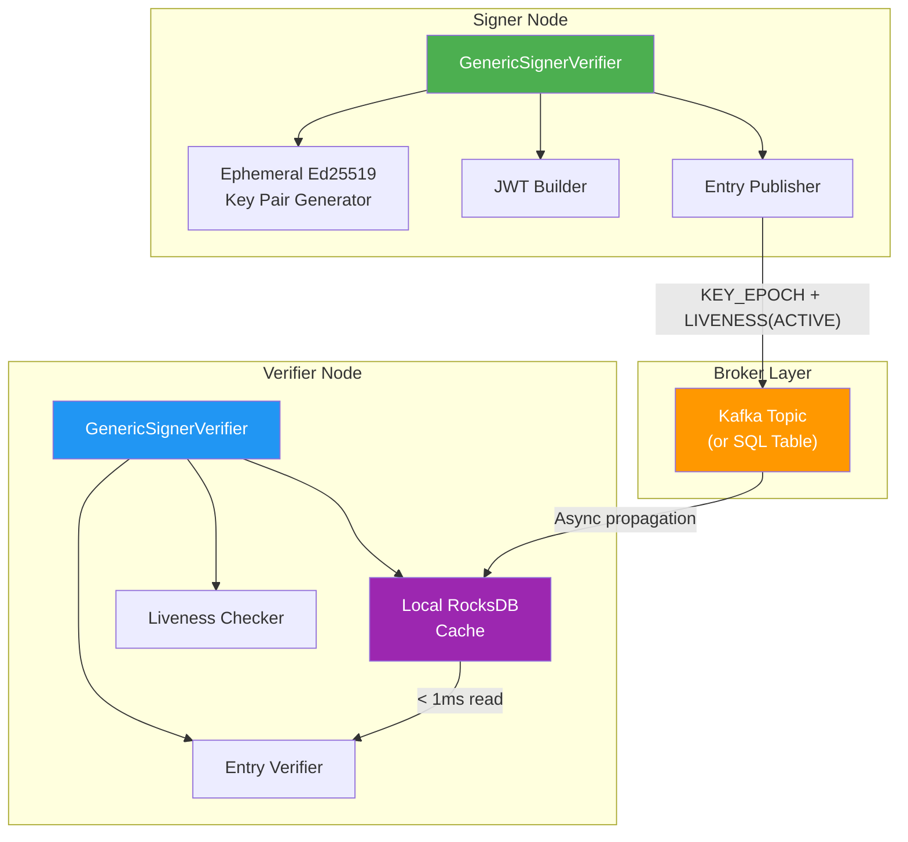
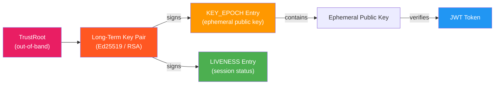
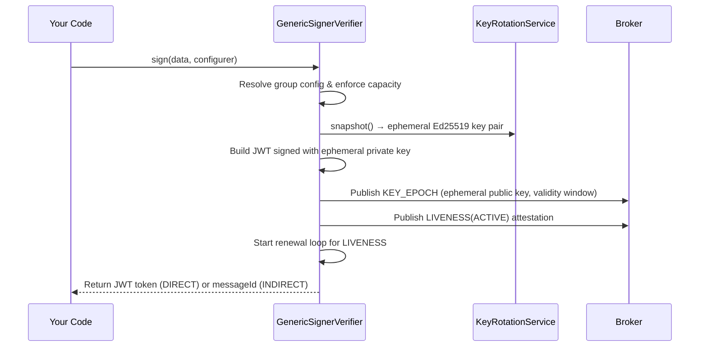
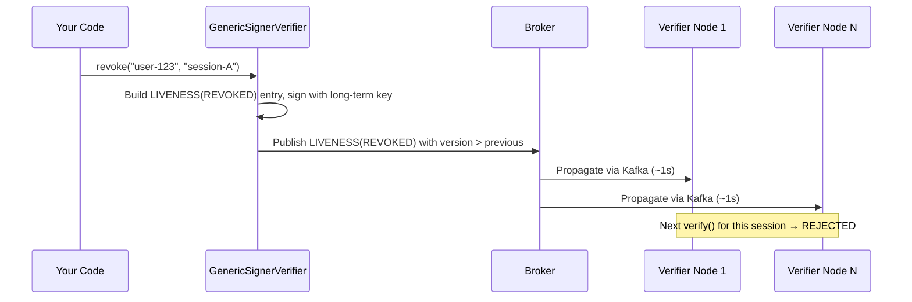

# How It Works

This page explains Veridot's architecture in 2 minutes. By the end, you'll understand the cryptographic layers, the three core operations (`sign`, `verify`, `revoke`), and why the system achieves all three properties simultaneously.

## Architecture Overview



## The Dual-Layer Cryptography

Veridot uses two independent layers of cryptographic material, each serving a distinct purpose:

### Layer 1: Long-Term Identity Keys

The **long-term key** is a root-level key pair (e.g., Ed25519, RSA, or ECDSA) that establishes the signer's identity. It is used to:

- Sign all Protocol V4 entries (`KEY_EPOCH`, `LIVENESS`, `CAPABILITY`, `CONFIG`)
- Establish trust via the `TrustRoot` — verifiers resolve the `issuer` identifier to this public key

The long-term private key is held only by the signing authority. It **never** appears in a JWT and **never** travels through the broker.

### Layer 2: Ephemeral Session Keys

For each signing operation, Veridot generates a **fresh ephemeral Ed25519 key pair**. This key is used to:

- Sign the JWT payload (the actual token the application receives)
- Provide forward secrecy — even if a past ephemeral key is compromised, other sessions are unaffected

The ephemeral public key is distributed via a `KEY_EPOCH` entry, itself signed by the long-term key.



:::info[Why Two Layers?]
The long-term key proves *who* the signer is. The ephemeral key proves *what* was signed. This separation means that verifiers trust the ephemeral key only because the long-term key vouched for it — and trust in the long-term key is established entirely out-of-band via the `TrustRoot`, never through the broker.
:::

## The Three Core Operations

### 1. `sign()` — Issue a Token

When you call `sign()`, the following happens internally:



**Step by step:**

1. **Capacity check** — resolves hierarchical `CONFIG` entries (group → site → global) and enforces session limits with eviction policies (FIFO, LIFO, LRU, REJECT)
2. **Ephemeral key generation** — the `KeyRotationService` provides a fresh Ed25519 key pair (rotated periodically)
3. **JWT creation** — the payload is serialized, embedded in a JWT, and signed with the ephemeral private key
4. **KEY_EPOCH publication** — the ephemeral public key, algorithm, and validity window are wrapped in a Protocol V4 binary envelope, signed with the long-term key, and published to the broker
5. **LIVENESS(ACTIVE) publication** — a signed attestation that the session is active, with a freshness window
6. **Renewal loop** — a background thread periodically republishes `LIVENESS(ACTIVE)` to maintain freshness

### 2. `verify()` — Validate a Token

When you call `verify()`, a strict 9-step pipeline executes locally:

```java
// All of this happens in < 1ms — no network call
VerifiedData<String> result = verifier.verify(token, s -> s);
```

| Step | What happens | Failure → |
|:---:|---|---|
| 1 | **Extract** EntryId from token subject | `BrokerExtractionException` |
| 2 | **Retrieve** `KEY_EPOCH` from local RocksDB | `BrokerExtractionException` |
| 3 | **Structural validation** — parse V4 binary envelope, check magic bytes, field lengths | Rejection with error code |
| 4 | **Trust validation** — resolve `issuer` via `TrustRoot`, verify envelope signature | `V4101` |
| 5 | **Capability validation** — confirm issuer holds a valid `CAPABILITY` for the scope | `V4102` |
| 6 | **Temporal validation** — check `validFrom`/`validUntil` with 5-minute clock drift tolerance | Rejection |
| 7 | **Liveness validation** — verify a fresh `LIVENESS(ACTIVE)` attestation exists | Rejection |
| 8 | **JWT cryptographic validation** — verify JWT signature using the ephemeral public key | `BrokerExtractionException` |
| 9 | **Deserialization** — extract and deserialize the payload | `DataDeserializationException` |

:::warning[Default-Deny Semantics]
Every step must independently pass. Missing data, expired attestations, signature failures, and broker unavailability all produce the **same result: rejection**. There is no fallback, no grace period, and no "soft fail" mode.
:::

### 3. `revoke()` — Invalidate a Session

Revocation is immediate and cryptographic:



**Why it's instant:**

- The `LIVENESS(REVOKED)` entry carries a `version` strictly greater than the previous `ACTIVE` attestation
- Protocol V4's **monotonic version invariant** (§11.1) ensures that once a verifier accepts a `REVOKED` entry, it can **never** regress to `ACTIVE` — even if the broker is compromised
- The revocation entry is signed by the long-term key, so it cannot be forged
- Group-wide revocation (`revoke("user-123", null)`) revokes **all** active sessions atomically

## Protocol V4 Entry Types

All data flowing through the broker uses the Protocol V4 binary envelope format:

| Entry Type | Code | Purpose |
|---|:---:|---|
| `KEY_EPOCH` | `0x01` | Distributes ephemeral public key + validity window |
| `CAPABILITY` | `0x02` | Grants an issuer authorization over scopes |
| `CONFIG` | `0x03` | Hierarchical session capacity configuration |
| `LIVENESS` | `0x04` | Positive-proof session status attestation |
| `FENCE` | `0x05` | Totally orders capacity-affecting mutations |
| `SNAPSHOT_MARKER` | `0x06` | Marks a complete scope reconciliation |
| `SECURE_PAYLOAD` | `0x07` | End-to-end encrypted payload (PRIVATE mode) |

Every entry is wrapped in a canonical binary envelope with magic bytes (`VD`), protocol version, TLV payload, and a cryptographic signature covering all fields.

## Reconciliation

Verifiers run a periodic **reconciliation loop** that performs a full snapshot of each monitored scope from the broker and replays entries through the monotonic watermark. This closes gaps from lost or delayed Kafka messages without relaxing any acceptance rule.

## What's Next?

- **[Quickstart](./quickstart.md)** — run a complete sign/verify/revoke cycle in 5 minutes
- **[Choosing a Broker](./choosing-a-broker.md)** — pick the right broker for your infrastructure
