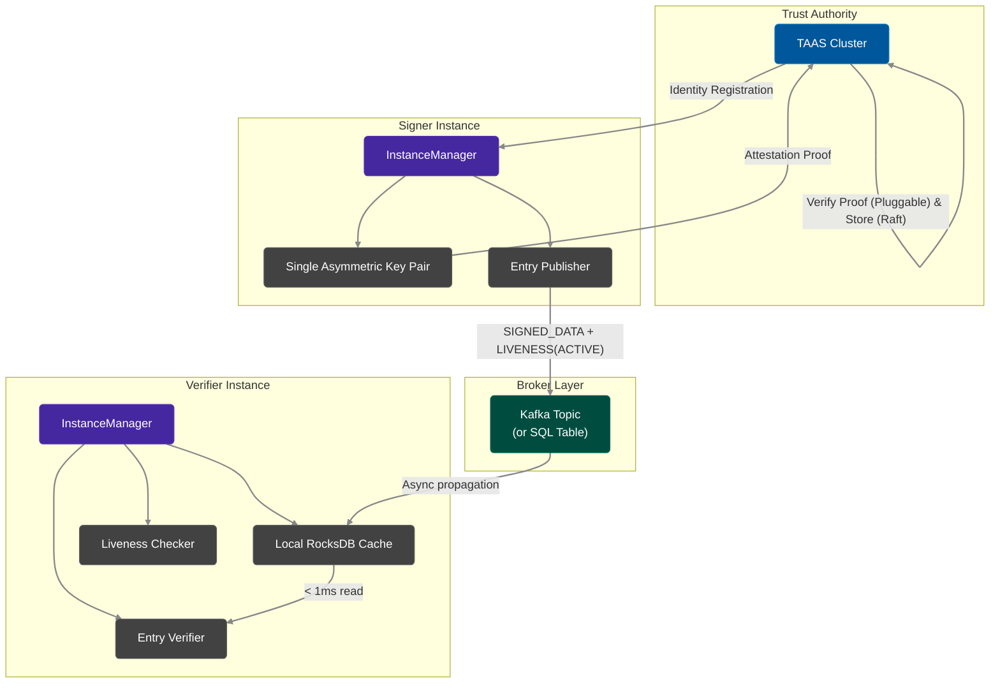
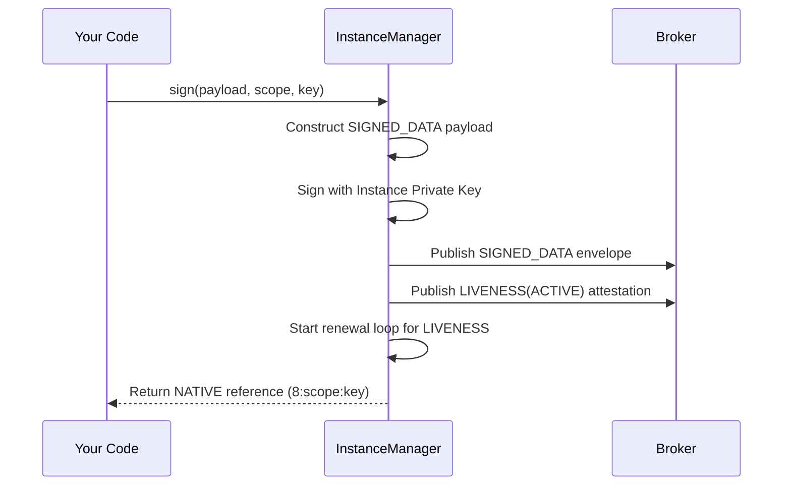
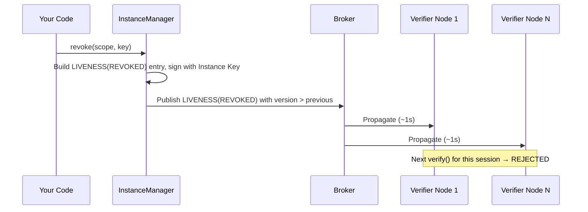

# How It Works

This page explains Veridot's V5 architecture in 2 minutes. By the end, you'll understand the cryptographic model, the three core operations (`sign`, `verify`, `revoke`), and why the system achieves sub-millisecond verification with zero shared secrets.

## Architecture Overview



## The V5 Cryptographic Model: Instance-Native

Unlike older protocols that rely on shared secrets or rotating ephemeral keys, Veridot V5 uses a **Single Key Per Instance** model tied to a **Trust Authority & Attestation Service (TAAS)**.

### 1. Instance Key Generation & Attestation

When a Veridot instance starts, it generates exactly one asymmetric key pair (e.g., Ed25519) in memory. It then submits its public key alongside an attestation proof (e.g., TPM quote, Kubernetes service account token) to the TAAS cluster.
The TAAS cluster verifies the proof and issues a cryptographic identity, structured as `CN@hash(pk)`. 

### 2. Signing and Distribution

The instance uses this single private key to sign all entries it issues, including session payloads and liveness attestations. The private key never leaves the instance, and it is destroyed when the instance shuts down or is replaced.
Verifiers trust the instance's public key because the TAAS registered it. The TAAS acts as the out-of-band `TrustRoot`.

:::info[Zero Shared Secrets]
Since every instance has its own unique keypair verified by TAAS, a compromised instance only compromises its own sessions. It cannot forge tokens for other instances.
:::

## The Three Core Operations

### 1. `sign()` — Issue a Session

When you call `sign()` using `InstanceManager`, the following happens internally:



**Step by step:**

1. **V5 Envelope Creation** — The payload is serialized into a Protocol V5 binary envelope of type `SIGNED_DATA`.
2. **Cryptographic Signature** — The instance signs the envelope using its private key.
3. **Publication** — The `SIGNED_DATA` envelope is published to the broker.
4. **Liveness Attestation** — A `LIVENESS(ACTIVE)` entry is published, acting as a positive proof of session validity.
5. **Return** — In NATIVE mode, a compact reference like `8:scope:key` is returned to the client instead of a large JWT.

### 2. `verify()` — Validate a Session

When you call `verify()`, a strict pipeline executes locally against the RocksDB cache:

```java
// All of this happens in < 1ms — no network call
VerifiedData<String> result = instanceManager.verify(token);
```

| Step | What happens | Failure → |
|:---:|---|---|
| 1 | **Extraction** — Extract `scope` and `key` from the token | Rejection |
| 2 | **Local Retrieval** — Retrieve `SIGNED_DATA` and `LIVENESS` from RocksDB | Rejection |
| 3 | **Structural Validation** — Parse V5 binary envelope, check magic bytes (`VD`) | `V5001`, `V5003` |
| 4 | **Trust Validation** — Resolve `issuer` via TAAS cache, verify envelope signature | `V5101` |
| 5 | **Capability Validation** — Confirm issuer holds a valid `CAPABILITY` for the scope | `V5102` |
| 6 | **Temporal Validation** — Check `validFrom`/`validUntil` on entries | `V5203` |
| 7 | **Liveness Validation** — Verify a fresh `LIVENESS(ACTIVE)` attestation exists | Rejection |
| 8 | **Deserialization** — Extract and deserialize the `SIGNED_DATA` payload | Rejection |

:::warning[Default-Deny Semantics]
Every step must independently pass. Missing data, expired attestations, signature failures, and broker unavailability all produce the **same result: rejection**. There is no fallback or "soft fail" mode.
:::

### 3. `revoke()` — Invalidate a Session

Revocation is immediate and cryptographic:



**Why it's instant and safe:**

- The `LIVENESS(REVOKED)` entry carries a `version` strictly greater than the previous `ACTIVE` attestation.
- Protocol V5's **monotonic version invariant** ensures that once a verifier accepts a `REVOKED` entry, it can **never** regress to `ACTIVE` — even if the broker is compromised and replays old entries.
- The revocation entry is signed, so it cannot be forged by an attacker.

## Protocol V5 Entry Types

All data flowing through the broker uses the Protocol V5 binary envelope format:

| Entry Type | Code | Purpose |
|---|:---:|---|
| `CAPABILITY` | `0x02` | Grants an issuer authorization over scopes |
| `CONFIG` | `0x03` | Hierarchical session capacity configuration |
| `LIVENESS` | `0x04` | Positive-proof session status attestation |
| `FENCE` | `0x05` | Totally orders capacity-affecting mutations |
| `SNAPSHOT` | `0x06` | Snapshot data for reconciliation |
| `SECURE_PAYLOAD` | `0x07` | End-to-end encrypted payload (PRIVATE mode) |
| `SIGNED_DATA` | `0x08` | Natively signed session payloads |
| `AUDIT_ANCHOR` | `0x09` | Cryptographic audit trail markers |
| `TRUST_REVOCATION` | `0x0A` | Revokes trust for a specific identity |

## Reconciliation

Verifiers run a periodic **reconciliation loop** that performs a full snapshot of each monitored scope from the broker and replays entries through the monotonic watermark. This closes gaps from lost or delayed broker messages without relaxing any acceptance rule.

## What's Next?

- **[Quickstart](./quickstart.md)** — run a complete sign/verify/revoke cycle in 5 minutes
- **[Choosing a Broker](./choosing-a-broker.md)** — pick the right broker for your infrastructure
