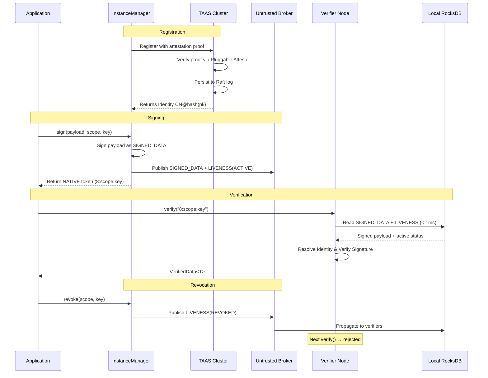

# What Is Veridot?

**Veridot (Protocol V5)** is a distributed token verification protocol library for Java 21 that lets any microservice verify any token in **sub-millisecond** time without a network call, **revoke** tokens instantly across the entire cluster, and maintain **zero shared secrets** between services.

## The Authentication Trilemma

Every microservice architecture eventually faces the same problem: how do you verify incoming tokens? The traditional approaches each sacrifice something critical:

| Approach | Instant Revocation | No Shared Secret | No Network Call | Trade-off |
|---|:---:|:---:|:---:|---|
| **Shared HMAC** | ✅ | ❌ | ✅ | Every service holds the same secret — one compromised node breaks everything |
| **Stateless RSA/ECDSA JWT** | ❌ | ✅ | ✅ | No way to revoke a token before expiry without a blocklist |
| **Centralized IdP call** | ✅ | ✅ | ❌ | Every verification is a network round-trip — latency and single point of failure |
| **Veridot V5** | ✅ | ✅ | ✅ | All three, simultaneously |

:::info[The Core Insight]
The trilemma exists because traditional systems conflate *key distribution* with *token validation*. Veridot V5 separates them: cryptographic state and public keys flow asynchronously through an untrusted broker, while verification happens locally from a RocksDB cache — no network call, no shared secret, no compromise.
:::

## How Veridot Solves All Three (V5 Architecture)

Veridot V5 combines three architectural primitives to achieve what traditional approaches cannot:

### 1. Single Key Per Instance & TAAS Attestation — No Shared Secrets

Instead of sharing symmetric keys or rotating ephemeral keys, Veridot V5 adopts an **Instance-Native, Single Key Per Instance** model. Each instance generates exactly one asymmetric keypair upon startup and registers with the **Trust Authority & Attestation Service (TAAS)** using an attestation proof. The instance receives a cryptographic identity represented as `CN@hash(pk)`. The private key never leaves the instance, and verifiers only hold public keys.

### 2. Distributed Liveness & Untrusted Broker — Instant Revocation

Tokens (or sessions) are bound to a verifiable **Liveness Attestation**. The instance publishes a `LIVENESS(ACTIVE)` entry to an untrusted broker (like Kafka or SQL). When revoked, it publishes a `LIVENESS(REVOKED)` entry that propagates to all verifiers within ~1 second. Because every entry is cryptographically signed using the V5 binary envelope format, a compromised broker cannot forge or suppress revocation without breaking the deterministic version chain.

### 3. NATIVE Mode & Local RocksDB Cache — Sub-Millisecond Verification

Using Veridot's **NATIVE** distribution mode, signed data is kept out of the HTTP headers. Verifiers receive a compact reference token (e.g., `8:<scope>:<key>`). Verifier nodes maintain a local RocksDB instance that mirrors the broker state. Every `verify()` call reads exclusively from this local store to fetch the `SIGNED_DATA` and `LIVENESS` state — zero network round-trip. Typical verification latency is **under 1 millisecond**.

## High-Level Flow (NATIVE Mode)

## Key Value Propositions

### ⚡ Sub-Millisecond Verification
Every `verify()` reads from local RocksDB — zero network I/O. Verification completes in under 1ms regardless of cluster size.

### 🔒 Instant Revocation
Revocation publishes a signed `LIVENESS(REVOKED)` entry with a strictly increasing monotonic version. Once accepted, no prior `ACTIVE` state can revert the revocation.

### 🔑 Zero Shared Secrets
Services never share cryptographic material. The TAAS infrastructure anchors trust based on verifiable attestation. A compromised verifier cannot forge tokens.

### 📦 Drop-In for Java 21 Microservices
Veridot V5 ships as Maven artifacts configured cleanly via `BasicConfigurer`. It leverages Java 21 features and requires no sidecar or agent.

### 🏗️ Protocol V5 — Binary, Versioned, Extensible
The underlying wire format uses a self-describing binary TLV envelope with cryptographic signatures, monotonicity, and a capability-based authorization model (CAPABILITY entries). Error codes are standard `V5xxx`.

## When to Use Veridot

Veridot is designed for architectures where:

- **Multiple services** need to independently verify sessions or tokens without calling back to the issuer.
- **Instant revocation** is a security requirement (e.g., compromised credentials, session invalidation).
- **Low latency** is critical and you cannot afford network calls on every request.
- **Zero-trust** principles demand that no two services share the same secret.

:::tip[Common Use Cases]
- API gateway token verification across a microservice mesh.
- User session management with real-time logout across all devices.
- Service-to-service authentication in Kubernetes clusters.
- Configuration and capacity management via verifiable capabilities.
:::

## What's Next?

- **[How It Works](./how-it-works.md)** — understand TAAS, InstanceManager, and the verification pipeline in 2 minutes.
- **[Quickstart](./quickstart.md)** — get a working Java 21 `BasicConfigurer` example in 5 minutes.
- **[Choosing a Broker](./choosing-a-broker.md)** — decide between Kafka+RocksDB and SQL.
- **[Installation](./installation.md)** — Maven/Gradle setup for all modules.
