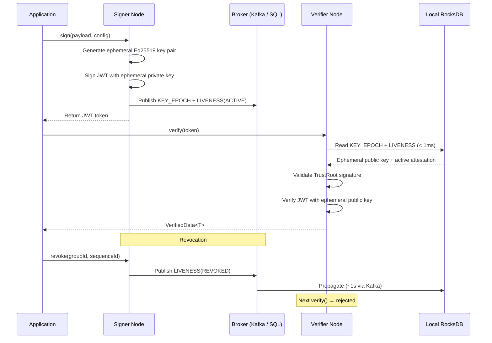

# What Is Veridot?

**Veridot** is a distributed token verification protocol library for Java that lets any microservice verify any token in **sub-millisecond** without a network call, **revoke** tokens instantly across the entire cluster, and maintain **zero shared secrets** between services.

## The Authentication Trilemma

Every microservice architecture eventually faces the same problem: how do you verify incoming tokens? The traditional approaches each sacrifice something critical:

| Approach | Instant Revocation | No Shared Secret | No Network Call | Trade-off |
|---|:---:|:---:|:---:|---|
| **Shared HMAC** | ✅ | ❌ | ✅ | Every service holds the same secret — one compromised node breaks everything |
| **Stateless RSA/ECDSA JWT** | ❌ | ✅ | ✅ | No way to revoke a token before expiry without a blocklist |
| **Centralized IdP call** | ✅ | ✅ | ❌ | Every verification is a network round-trip — latency and single point of failure |
| **Veridot** | ✅ | ✅ | ✅ | All three, simultaneously |

:::info[The Core Insight]
The trilemma exists because traditional systems conflate *key distribution* with *token validation*. Veridot separates them: cryptographic metadata flows through a broker asynchronously, while verification happens locally from a RocksDB cache — no network call, no shared secret, no compromise.
:::

## How Veridot Solves All Three

Veridot combines three architectural primitives to achieve what traditional approaches cannot:

### 1. Ephemeral Asymmetric Key Pairs — No Shared Secrets

Instead of sharing a symmetric HMAC key, Veridot generates **ephemeral Ed25519 key pairs** per signing session. The private key never leaves the signer; only the public key is distributed. Even if a verifier node is compromised, the attacker cannot forge tokens — they only hold public keys.

### 2. Distributed Metadata Propagation — Instant Revocation

When a token is signed, Veridot publishes a `KEY_EPOCH` entry (the ephemeral public key) and a `LIVENESS(ACTIVE)` attestation to a broker (Kafka or SQL). When revoked, a signed `LIVENESS(REVOKED)` entry propagates to all verifiers within ~1 second via Kafka. Revocation is **cryptographic** — the revocation entry itself is signed by the issuer's long-term key, so even a compromised broker cannot fake or suppress it.

### 3. Local RocksDB Cache — Sub-Millisecond Verification

Verifier nodes maintain a local RocksDB instance that mirrors broker state. Every `verify()` call reads exclusively from this local store — no network round-trip. Typical verification latency is **under 1 millisecond**, even under heavy load.

## High-Level Flow

## Key Value Propositions

### ⚡ Sub-Millisecond Verification
Every `verify()` reads from local RocksDB — zero network I/O. Verification completes in under 1ms regardless of cluster size.

### 🔒 Instant Revocation
Revocation publishes a signed `LIVENESS(REVOKED)` entry that propagates to all nodes via the broker. With Kafka, propagation completes in ~1 second across the entire cluster.

### 🔑 Zero Shared Secrets
Services never share cryptographic material. Each signer generates ephemeral key pairs; verifiers only hold public keys. A compromised verifier cannot forge tokens.

### 📦 Drop-In for Java Microservices
Veridot ships as Maven artifacts (`io.github.cyfko:veridot-core`, `veridot-kafka`, `veridot-databases`). No sidecar, no agent, no proprietary infrastructure.

### 🏗️ Protocol V4 — Binary, Versioned, Extensible
The underlying wire format uses a self-describing binary TLV envelope with cryptographic signatures, version monotonicity, and capability-based authorization. Any conforming implementation — regardless of language — can verify tokens produced by any other.

## When to Use Veridot

Veridot is designed for architectures where:

- **Multiple services** need to independently verify tokens without calling back to the issuer
- **Instant revocation** is a security requirement (e.g., compromised credentials, session invalidation)
- **Low latency** is critical and you cannot afford network calls on every request
- **Zero-trust** principles demand that no two services share the same secret

:::tip[Common Use Cases]
- API gateway token verification across a microservice mesh
- User session management with real-time logout across all devices
- Service-to-service authentication in Kubernetes clusters
- Multi-tenant SaaS platforms requiring per-tenant session control
:::

## What's Next?

- **[How It Works](./how-it-works.md)** — understand the dual-layer cryptography and verification pipeline in 2 minutes
- **[Quickstart](./quickstart.md)** — get a working example in 5 minutes
- **[Choosing a Broker](./choosing-a-broker.md)** — decide between Kafka+RocksDB and SQL
- **[Installation](./installation.md)** — Maven/Gradle setup for all modules
