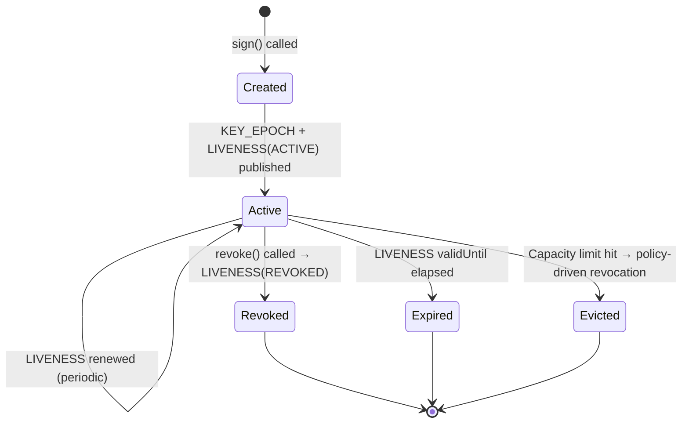
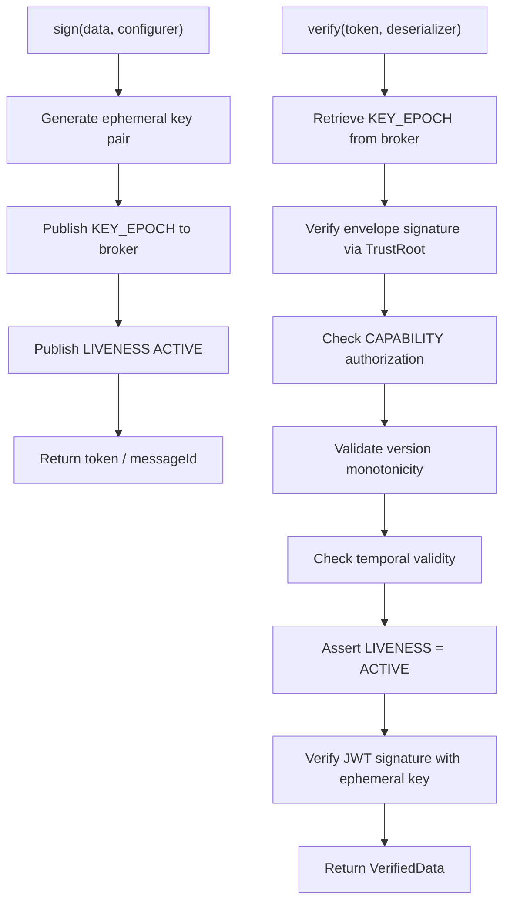

# Core Concepts

This page defines the fundamental building blocks of the Veridot protocol. Every API call, configuration option, and verification step refers back to these concepts.

## Identifiers

### groupId

A **groupId** is a logical namespace that aggregates related sessions. It typically maps to a business entity: a user account, a service instance, an API client, or a device.

```java
// groupId identifies the owner of all sessions beneath it
BasicConfigurer.builder()
    .groupId("user-123")   // ← the groupId
    .validity(3600)
    .build();
```

Constraints: 1–125 printable characters, must not contain `:`, `,`, `|`, or whitespace.

### sequenceId

A **sequenceId** identifies a single session within a group. If omitted at signing time, Veridot auto-generates a UUID.

```java
BasicConfigurer.builder()
    .groupId("user-123")
    .sequenceId("session-A")  // ← explicit sequenceId
    .validity(3600)
    .build();
```

The pair `(groupId, sequenceId)` uniquely identifies a session across the entire system.

## Session

A **session** is a single verification context within a group. It is backed by a `KEY_EPOCH` entry (carrying the ephemeral public key) and a `LIVENESS` entry (carrying the session status). A session is **active** if and only if a fresh, valid `LIVENESS` entry with status `ACTIVE` exists for it.

### Session Lifecycle



:::info
Once a session leaves the **Active** state, it cannot be reactivated. You must call `sign()` again to create a new session.
:::

## Scope

A **scope** is a typed, hierarchical namespace that determines which sessions or configurations an entry governs. There are exactly three scope kinds:

| Scope pattern | Java equivalent | Applies to |
|---|---|---|
| `group:<groupId>` | `Scope.group("user-123")` | A specific group only |
| `site:<siteId>` | `Scope.site("eu-west")` | All groups declaring membership in this site |
| `global` | `Scope.global()` | Every group across all sites |

Scopes are used for configuration resolution (group overrides site overrides global) and for capability-based authorization.

## Epoch

An **epoch** is a time-bounded validity window for a piece of cryptographic material. Each `KEY_EPOCH` entry carries `validFrom` and `validUntil` timestamps that define its epoch. A key epoch is active when `now ≥ validFrom − 5min` (clock-drift tolerance) and `now < validUntil`.

## Entry

An **entry** is a single signed unit of protocol state. Every entry conforms to the V4 binary envelope (magic `0x56 0x44`, protocol version `0x04`) and belongs to exactly one of the registered entry types.

### EntryId

The **EntryId** is the triple `(scope, entryType, key)` that uniquely identifies an entry's logical position in the broker. The broker storage key is derived deterministically:

```
storageKey = scope || 0x00 || entryType || 0x00 || key
```

## Version

A **version** is a 64-bit unsigned integer carried by every entry. Versions are strictly increasing per EntryId and establish total ordering for monotonic state resolution. The initial recorded version is `0`; the minimum valid version for any accepted entry is `1`.

:::warning
Versions are **not** wall-clock timestamps. The `timestamp` field in the envelope is advisory only and must never be used for ordering decisions.
:::

## Entry Type Registry

The Veridot V4 protocol defines exactly 7 entry types:

| Code | Name | Singleton | Purpose |
|:---:|---|:---:|---|
| `0x01` | **KEY_EPOCH** | No (one per session) | Distributes the ephemeral public key, algorithm, and validity window for verifying signed objects. |
| `0x02` | **CAPABILITY** | No (one per grant) | Signed authorization grant allowing an issuer to publish entries within one or more scope patterns. |
| `0x03` | **CONFIG** | Yes per scope | Hierarchical configuration (max sessions, eviction policy, default TTL) applying at group, site, or global level. |
| `0x04` | **LIVENESS** | Yes per session | Positive attestation of a session's current status (`ACTIVE` or `REVOKED`). Absence defaults to rejection. |
| `0x05` | **FENCE** | Yes per scope | Monotonic counter that totally orders capacity-affecting mutations across concurrent processors. |
| `0x06` | **SNAPSHOT_MARKER** | Yes per scope | Records that a complete point-in-time enumeration of a scope was performed, for reconciliation. |
| `0x07` | **SECURE_PAYLOAD** | No (one per target) | Transports an application-level payload through the broker, optionally with E2EE hybrid encryption. |

:::tip
All 7 entry types share the same binary envelope and the same signature verification pipeline. No entry type can bypass cryptographic verification.
:::

## How They Fit Together



## Next Steps

- [TrustRoot Setup](./trustroot-setup.md) — configure how Veridot resolves issuer identities
- [Signing Tokens](./signing-tokens.md) — issue tokens with the `BasicConfigurer` builder
- [Verifying Tokens](./verifying-tokens.md) — understand the 9-step verification pipeline
