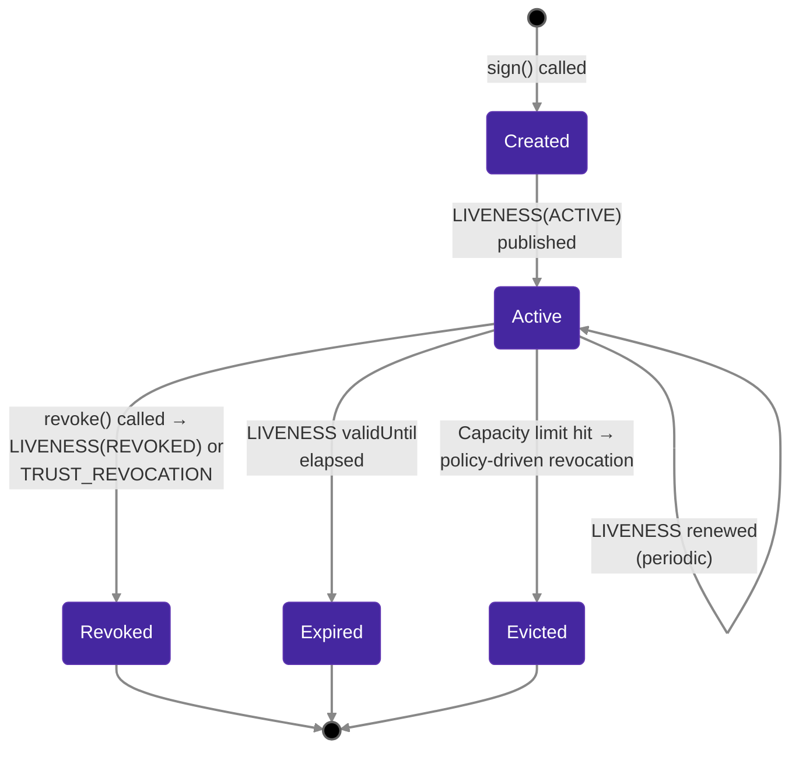
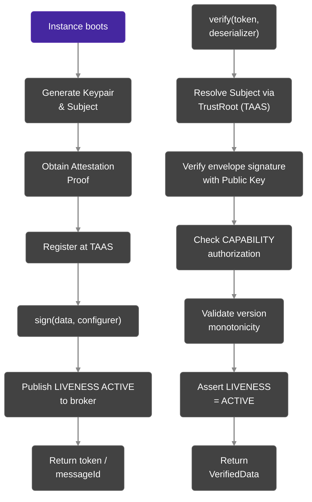

# Core Concepts

This page defines the fundamental building blocks of the Veridot V5 protocol. Every API call, configuration option, and verification step refers back to these concepts.

## Identifiers

### scope

A **scope** is a logical namespace that aggregates related sessions. It typically maps to a business entity: a user account, a service instance, an API client, or a device.

```java
// groupId identifies the owner of all sessions beneath it
BasicConfigurer.builder()
    .scope("user-123")   // ← the groupId
    .validity(3600)
    .build();
```

Constraints: 1–125 printable characters, must not contain `:`, `,`, `|`, or whitespace.

### key

A **key** identifies a single session within a group. If omitted at signing time, Veridot auto-generates a UUID.

```java
BasicConfigurer.builder()
    .scope("user-123")
    .key("session-A")  // ← explicit sequenceId
    .validity(3600)
    .build();
```

The pair `(scope, key)` uniquely identifies a session across the entire system.

## Trust Authority & Attestation Service (TAAS)

In V5, cryptographic trust is established dynamically via the **Trust Authority & Attestation Service (TAAS)**. Every participating node must register its single asymmetric keypair with the TAAS alongside an **attestation proof** (e.g., TPM quote, Kubernetes service account token).

- **Attestation-First:** Identity relies on verifiable runtime environment proofs.
- **Instance-Native:** Each ephemeral compute instance (e.g. pod) has one identity and one non-rotatable key. 

### Identity Subject

An identity in Veridot is derived deterministically:
`CN@base64url(SHA-256(publicKey))[0:32]`
This binds a readable Common Name (CN) directly to the cryptographic material.

## Session

A **session** is a single verification context within a group. It is strictly backed by a `LIVENESS` entry. A session is **active** if and only if a fresh, valid `LIVENESS` entry with status `ACTIVE` exists for it.

### Session Lifecycle



:::info
Once a session leaves the **Active** state, it cannot be reactivated. You must call `sign()` again to create a new session.
:::

## Scope

A **scope** is a typed, hierarchical namespace that determines which sessions or configurations an entry governs. There are exactly three scope kinds:

| Scope pattern | Java equivalent | Applies to |
|---|---|---|
| `group:<groupName>` | `Scope.group("user-123")` | A specific group only |
| `site:<siteId>` | `Scope.site("eu-west")` | All groups declaring membership in this site |
| `global` | `Scope.global()` | Every group across all sites |

Scopes are used for configuration resolution (group overrides site overrides global) and for capability-based authorization.

## Entry

An **entry** is a single signed unit of protocol state. Every entry conforms to the V5 binary envelope (magic `0x56 0x44`, protocol version `0x05`) and belongs to exactly one of the registered entry types.

### EntryId

The **EntryId** is the triple `(scope, entryType, key)` that uniquely identifies an entry's logical position in the broker. The broker storage key is derived deterministically:

```
storageKey = scope || 0x00 || entryType || 0x00 || key
```

## Version

A **version** is a 64-bit unsigned integer carried by every entry. Versions are strictly increasing per EntryId and establish total ordering for monotonic state resolution. The minimum valid version for any accepted entry is `1`.

:::warning
Versions are **not** wall-clock timestamps. The `timestamp` field in the envelope is advisory only and must never be used for ordering decisions.
:::

## Entry Type Registry

The Veridot V5 protocol defines 10 entry types:

| Code | Name | Singleton | Purpose |
|:---:|---|:---:|---|
| `0x01` | **(reserved)** | - | Reserved, rejected natively. |
| `0x02` | **CAPABILITY** | No | Signed authorization grant allowing an issuer to publish entries. |
| `0x03` | **CONFIG** | Yes | Scope-level configuration (e.g., max sessions). |
| `0x04` | **LIVENESS** | No | Session liveness heartbeat. |
| `0x05` | **FENCE** | Yes | Monotonic counter that totally orders capacity-affecting mutations. |
| `0x06` | **SNAPSHOT_MARKER** | Yes | Records a reconciliation boundary in a scope. |
| `0x07` | **SECURE_PAYLOAD** | No | Carries end-to-end encrypted data (PRIVATE mode). |
| `0x08` | **SIGNED_DATA** | No | Native mode signed payload data. |
| `0x09` | **AUDIT_ANCHOR** | No | Merkle audit proofs. |
| `0x0A` | **TRUST_REVOCATION**| No | Identity revocation broadcasts. |

## How They Fit Together



## Next Steps

- [TrustRoot Setup](./trustroot-setup.md) — configure how Veridot resolves issuer identities
- [Signing Tokens](./signing-tokens.md) — issue tokens with the `BasicConfigurer` builder
- [Verifying Tokens](./verifying-tokens.md) — understand the verification pipeline
