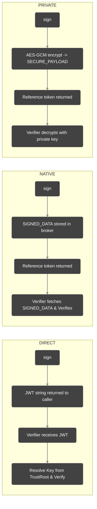
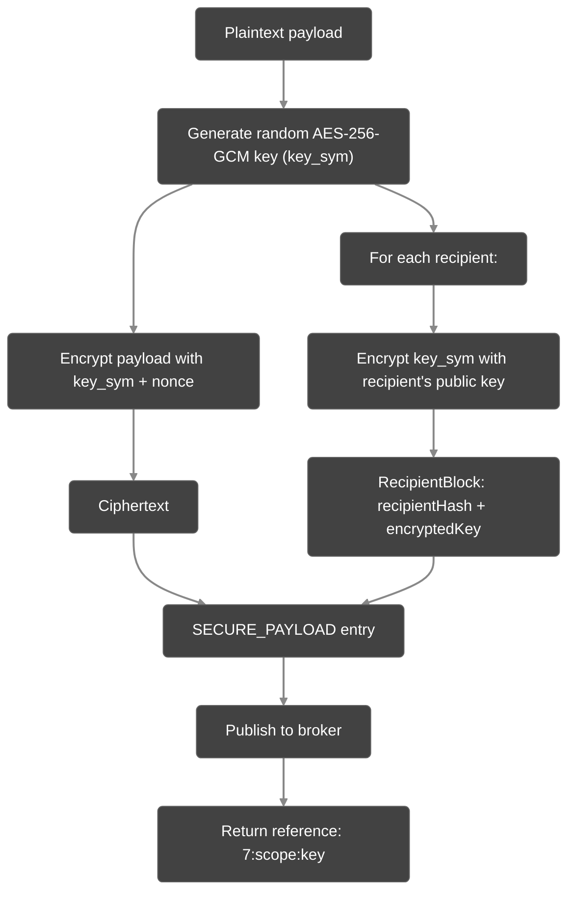

# Distribution Modes

Veridot V5 supports three distribution modes that control how the signed payload is delivered to the caller after signing. Each mode produces a different token format and has distinct security properties. All modes are inherently offline-verifiable once the key is cached.

## Overview



## DIRECT Mode (Default)

The signed data is returned directly to the caller as a standard JSON Web Token (JWT). The JWT is self-describing and can be transmitted in HTTP headers, cookies, or any text-based channel. It requires no broker storage for the payload itself.

```java
String jwt = signer.sign("user@example.com",
    BasicConfigurer.builder()
        .groupId("user-123")
        .build());

// jwt → "eyJhbGciOiJFZERTQSIsInR5cCI6IkpXVCJ9.eyJzdWIiOiI0..."
// Send as: Authorization: Bearer <jwt>
```

**Wire format:** Standard JWT (`header.payload.signature`).

**Verification:** The verifier extracts the key identifier, queries the TrustRoot (backed by TAAS) to resolve the public key, and verifies the JWT signature.

## NATIVE Mode

The signed payload is stored inside a `SIGNED_DATA` (0x08) entry on the broker. Only a compact reference token is returned to the caller.

```java
String messageId = signer.sign(sensitivePayload,
    BasicConfigurer.builder()
        .groupId("service-X")
        .distribution(DistributionMode.NATIVE)
        .build());

// messageId → "8:service-X:a1b2c3d4-e5f6-7890-abcd-ef1234567890"
```

**Wire format:** `8:<scope>:<key>` (e.g., `8:group:service-X:uuid`).

**Verification:** The verifier parses the reference token, fetches the `SIGNED_DATA` entry from the broker, resolves the TrustRoot, and validates the single binary envelope signature.

## PRIVATE Mode (E2EE)

The payload is end-to-end encrypted using hybrid encryption and stored as a `SECURE_PAYLOAD` (0x07) entry on the broker. Only explicitly listed recipient identities can decrypt it.

### Encryption Scheme



### Signing with PRIVATE Mode

```java
String ref = signer.sign(medicalRecord,
    BasicConfigurer.builder()
        .groupId("patient-456")
        .distribution(DistributionMode.PRIVATE)
        .recipients(List.of("radiology-service@hash123", "oncology-service@hash456"))
        .mimeType("application/json")
        .build());

// ref → "7:group:patient-456:session-uuid"
```

### Verifying a PRIVATE Token

```java
// Only works if the verifier's identity is in the recipients list
VerifiedData<MedicalRecord> result = verifier.verify(ref,
    BasicConfigurer.deserializer(MedicalRecord.class));
```

:::warning
If the verifier's identity is not explicitly listed in the `recipients`, verification fails with `V4205 DECRYPTION_FAILED` — the verifier cannot decrypt the symmetric key.
:::

## Decision Table

| Criterion | DIRECT | NATIVE | PRIVATE |
|---|:---:|:---:|:---:|
| Token leaves your infrastructure | ✅ Yes | ❌ No (only reference) | ❌ No (only reference) |
| Self-describing token | ✅ Yes | ❌ No | ❌ No |
| Payload visible on broker | N/A | ✅ Yes (in SIGNED_DATA) | ❌ No (encrypted) |
| Compact token size | ❌ JWT can be large | ✅ ~50 chars | ✅ ~50 chars |
| E2E confidentiality | ❌ No | ❌ No | ✅ Yes (AES-256-GCM) |
| Recipient restriction | ❌ Anyone | ❌ Anyone with broker | ✅ Explicit recipients |

### When to Use Each

- **DIRECT** — API authentication, mobile/web session tokens, HTTP header transmission.
- **NATIVE** — Internal microservice communication, large payloads, hiding payload sizes on the wire.
- **PRIVATE** — Regulated data (HIPAA, GDPR), PII, scenarios requiring E2E encryption.

## Mixed-Mode Verification

The `verify()` method automatically detects the token format:

```java
VerifiedData<String> r1 = verifier.verify(jwt,       s -> s); // DIRECT
VerifiedData<String> r2 = verifier.verify(messageId, s -> s); // NATIVE
VerifiedData<String> r3 = verifier.verify(ref,       s -> s); // PRIVATE
```

Token format detection:
- Starts with `"7:"` → `SECURE_PAYLOAD` (PRIVATE)
- Starts with `"8:"` → `SIGNED_DATA` (NATIVE)
- Looks like a JWT (`header.payload.signature`) → JWT (DIRECT)

## Next Steps

- [Session Capacity](./session-capacity.md) — control how many concurrent sessions a group can have
- [Error Handling](./error-handling.md) — exception hierarchy for all three modes
