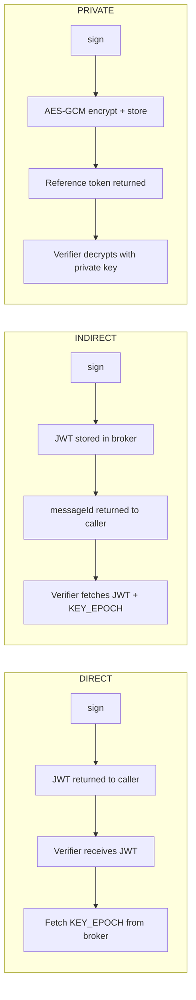
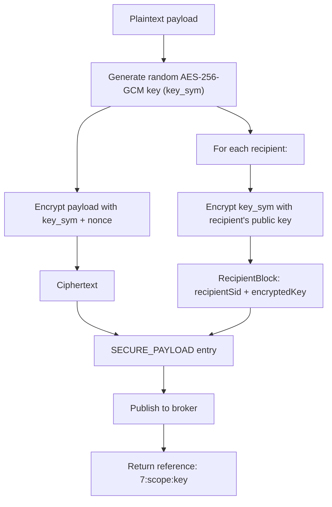

# Distribution Modes

Veridot supports three distribution modes that control how the signed payload is delivered to the caller after signing. Each mode produces a different token format and has distinct security properties.

## Overview



## DIRECT Mode (Default)

The signed JWT is returned directly to the caller. The JWT is self-describing and can be transmitted in HTTP headers, cookies, or any text-based channel.

```java
String jwt = signer.sign("user@example.com",
    BasicConfigurer.builder()
        .groupId("user-123")
        .validity(3600)
        .build());

// jwt → "eyJhbGciOiJFZERTQSIsInR5cCI6IkpXVCJ9.eyJzdWIiOiI0..."
// Send as: Authorization: Bearer <jwt>
```

**Wire format:** Standard JWT (`header.payload.signature`).

**Verification:** The verifier extracts the `sub` claim (which contains the `messageId`), fetches the `KEY_EPOCH` from the broker, and verifies the JWT signature with the ephemeral public key.

## INDIRECT Mode

The JWT is stored inside the `KEY_EPOCH` entry on the broker. Only a compact `messageId` is returned to the caller.

```java
String messageId = signer.sign(sensitivePayload,
    BasicConfigurer.builder()
        .groupId("service-X")
        .distribution(DistributionMode.INDIRECT)
        .validity(300)
        .build());

// messageId → "4:service-X:a1b2c3d4-e5f6-7890-abcd-ef1234567890"
```

**Wire format:** `<protocolVersion>:<groupId>:<sequenceId>` (e.g., `4:service-X:uuid`).

**Verification:** The verifier parses the `messageId`, fetches the `KEY_EPOCH` entry, extracts the embedded JWT from it, and runs the full verification pipeline.

```java
// Verifier side — same API regardless of distribution mode
VerifiedData<String> result = verifier.verify(messageId, s -> s);
```

## PRIVATE Mode (E2EE)

The payload is end-to-end encrypted using hybrid encryption and stored as a `SECURE_PAYLOAD` entry on the broker. Only explicitly listed recipients can decrypt it.

### Encryption Scheme



| Component | Algorithm | Purpose |
|---|---|---|
| Symmetric encryption | AES-256-GCM | Encrypts the payload data |
| Key wrapping | RSA / ECDH | Encrypts the symmetric key per recipient |
| Nonce | 12 bytes, random | Initialization vector for AES-GCM |

### Signing with PRIVATE Mode

```java
String ref = signer.sign(medicalRecord,
    BasicConfigurer.builder()
        .groupId("patient-456")
        .distribution(DistributionMode.PRIVATE)
        .recipients(List.of("radiology-service", "oncology-service"))
        .mimeType("application/json")
        .validity(86400)
        .build());

// ref → "7:group:patient-456:session-uuid"
```

### Verifying a PRIVATE Token

```java
// Only works if "this" verifier's issuerId is in the recipients list
VerifiedData<MedicalRecord> result = verifier.verify(ref,
    BasicConfigurer.deserializer(MedicalRecord.class));
```

:::warning
If the verifier's `issuerId` is not listed in the `recipients`, verification fails with `BrokerExtractionException` — the verifier simply cannot decrypt the symmetric key.
:::

## Decision Table

Use this table to choose the right distribution mode for your use case:

| Criterion | DIRECT | INDIRECT | PRIVATE |
|---|:---:|:---:|:---:|
| Token leaves your infrastructure | ✅ Yes | ❌ No (only reference) | ❌ No (only reference) |
| Self-describing token | ✅ Yes | ❌ No | ❌ No |
| Payload visible on broker | N/A | ✅ Yes (in KEY_EPOCH) | ❌ No (encrypted) |
| Compact token size | ❌ JWT can be large | ✅ ~50 chars | ✅ ~50 chars |
| E2E confidentiality | ❌ No | ❌ No | ✅ Yes (AES-256-GCM) |
| Recipient restriction | ❌ Anyone with broker | ❌ Anyone with broker | ✅ Explicit recipient list |
| Typical use case | API auth, session tokens | Internal service tokens | Medical, financial, PII |

### When to Use Each

- **DIRECT** — API authentication, mobile/web session tokens, any case where the token travels in HTTP headers between services you control.
- **INDIRECT** — Internal microservice communication where you want to minimize wire-level payload size, or when the payload is sensitive enough that you prefer it not to leave the broker boundary.
- **PRIVATE** — Regulated data (HIPAA, GDPR), financial records, multi-tenant secrets, or any scenario requiring cryptographic proof that only authorized parties can read the payload.

## Mixed-Mode Verification

The `TokenVerifier.verify()` method automatically detects the token format:

```java
// All three modes use the same verify() method
VerifiedData<String> r1 = verifier.verify(jwt,       s -> s); // DIRECT
VerifiedData<String> r2 = verifier.verify(messageId, s -> s); // INDIRECT
VerifiedData<String> r3 = verifier.verify(ref,       s -> s); // PRIVATE
```

Token format detection:
- Starts with `"7:"` → `SECURE_PAYLOAD` (PRIVATE)
- Matches `<version>:<groupId>:<sequenceId>` → `messageId` (INDIRECT)
- Looks like a JWT (`header.payload.signature`) → JWT (DIRECT)

## Next Steps

- [Session Capacity](./session-capacity.md) — control how many concurrent sessions a group can have
- [Error Handling](./error-handling.md) — exception hierarchy for all three modes
