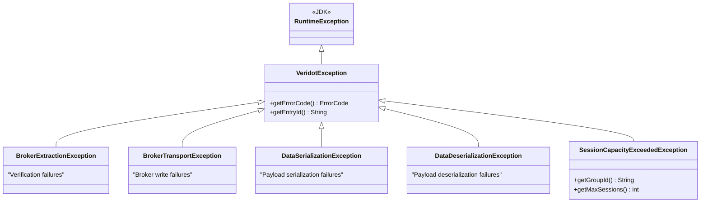

# Error Handling

Veridot uses a structured exception hierarchy rooted in `VeridotException`. Every exception carries an optional `ErrorCode` (from Protocol V5) and an `entryId` for traceability.

## Exception Hierarchy



## Exception Reference

| Exception | Thrown by | When | Has ErrorCode |
|---|---|---|:---:|
| `VeridotException` | Internal | Any Protocol V5 violation | ✅ |
| `BrokerExtractionException` | `verify()` | Token invalid, expired, revoked, or metaasata unavailable | Sometimes |
| `BrokerTransportException` | `sign()` | Publishing metaasata to broker fails (network, timeout) | ❌ |
| `DataSerializationException` | `sign()` | Payload cannot be serialized | ❌ |
| `DataDeserializationException` | `verify()` | Payload valid but cannot be deserialized | ❌ |
| `SessionCapacityExceededException` | `sign()` | Max sessions reached under `REJECT` policy | ❌ |

## Protocol V5 Error Codes

Here are the most common error codes encountered at runtime:

| Code | Name | Description |
|---|---|---|
| `V5001` | `INVALID_ENVELOPE` | Magic bytes or protocol version mismatch |
| `V5002` | `UNSUPPORTED_ENTRY_TYPE` | Unknown entry type code |
| `V5006` | `INVALID_KEY` | Entry key constraint violated |
| `V5007` | `INVALID_TLV` | Malformed TLV payload |
| `V5101` | `TRUST_RESOLUTION_FAILED` | Issuer unresolvable via TAAS or signature failed |
| `V5102` | `REGISTRATION_FAILED` | Attestation rejected by TAAS |
| `V5201` | `UNSUPPORTED_ALGORITHM` | Signature algorithm not supported |
| `V5301` | `UNAUTHORIZED` | Subject not authorized for this operation |
| `V4202` | `LIVENESS_NOT_ESTABLISHED` | No fresh `ACTIVE` liveness attestation |
| `V4205` | `DECRYPTION_FAILED` | Hybrid decryption of SECURE_PAYLOAD failed |

## Catch Patterns

### For sign()

```java
try {
    String token = signer.sign(payload, BasicConfigurer.builder().groupId("user-123").build());
    return Response.ok(token).build();
} catch (SessionCapacityExceededException e) {
    log.warn("Capacity exceeded for {}: max {}", e.getGroupId(), e.getMaxSessions());
    return Response.status(429).entity("Too many active sessions").build();
} catch (BrokerTransportException e) {
    log.error("Broker unavailable: {}", e.getMessage());
    return Response.status(503).entity("Service temporarily unavailable").build();
} catch (VeridotException e) {
    log.error("Signing failed: {}", e.getMessage());
    return Response.status(500).build();
}
```

### For verify()

```java
try {
    VerifiedData<UserClaims> result = verifier.verify(token, s -> UserClaims.parse(s));
    return Response.ok(result.data()).build();
} catch (BrokerExtractionException e) {
    // Token is invalid, expired, revoked, or unverifiable
    log.info("Verification rejected: {}", e.getMessage());
    return Response.status(401).entity("Invalid or expired token").build();
}
```

## HTTP Status Code Mapping

| Exception | Recommended HTTP Status |
|---|:---:|
| `DataSerializationException` | `400 Bad Request` |
| `DataDeserializationException` | `400 Bad Request` |
| `BrokerExtractionException` | `401 Unauthorized` |
| `SessionCapacityExceededException` | `429 Too Many Requests` |
| `BrokerTransportException` | `503 Service Unavailable` |
| `VeridotException` (other) | `500 Internal Server Error` |

:::warning
Always return `401` for `BrokerExtractionException`, not `403`. Veridot intentionally does not distinguish between "revoked," "expired," and "forged" tokens at the API boundary — this prevents attackers from learning which checks their forgery passed.
:::
