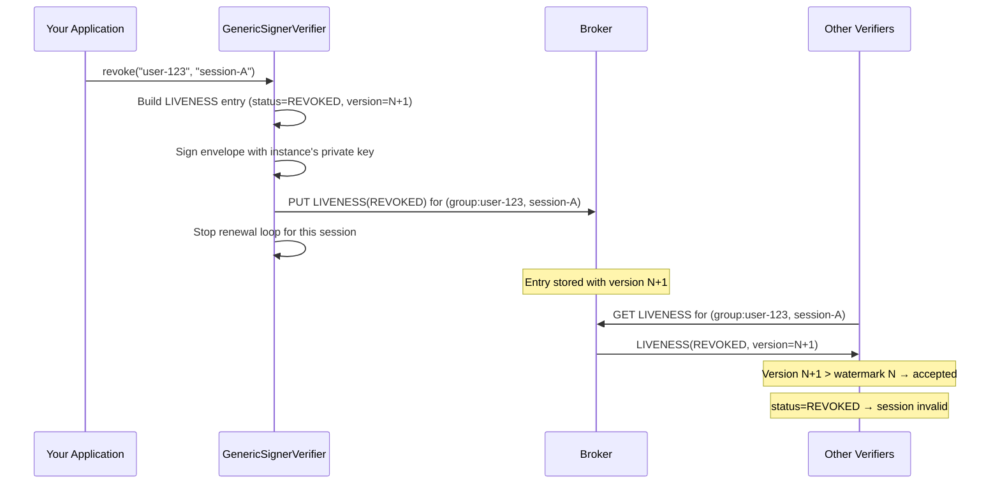

# Revoking Sessions

Veridot V5 provides instant revocation through the `TokenRevoker.revoke()` method. Revocation is expressed in terms of protocol identifiers — `scope` and `key` — and takes effect as soon as verifiers observe the `LIVENESS(REVOKED)` entry from the broker.

## Single Session Revocation

Revoke one specific session within a group:

```java
// After verifying a token, revoke that specific session
VerifiedData<String> result = verifier.verify(token, s -> s);
revoker.revoke(result.scope(), result.key());
// e.g., revoker.revoke("group:user-123", "session-A");
```

## Group-Wide Revocation

Revoke **all** active sessions for a group by passing `null` as the `key`:

```java
// Security breach: revoke all sessions for this user
revoker.revoke("group:user-123", null);
```

This iterates over all active sessions in the group and publishes a `LIVENESS(REVOKED)` entry for each one.

:::tip[Use cases for group-wide revocation]
- Password change / credential rotation
- Account compromise detection
- User-initiated "sign out everywhere"
- Administrative account suspension
:::

## Identity Revocation

In V5, if an entire instance (or identity) is compromised, you can broadcast a `TRUST_REVOCATION (0x0A)` entry to permanently revoke all trust in that subject. This stops the compromised instance from issuing any new valid tokens or asserting liveness.

```java
// Revoke a specific identity globally
revoker.revokeIdentity("orders-service@x9Y8w7V6u5T4s3R2q1P0o9N8m7L6k5J4", "Key compromise");
```

## How Session Revocation Propagates

When you call `revoke()` on a session, the following happens:



### Monotonic Version Guarantee

The revocation entry carries a `version` strictly greater than the previous `LIVENESS(ACTIVE)` version. This guarantees:

1. **No rollback** — once a session is revoked, no previously-cached `ACTIVE` attestation with a lower version can override it
2. **Total ordering** — any verifier seeing both the `ACTIVE` and `REVOKED` entries will always accept the `REVOKED` one (higher version wins)
3. **Broker independence** — even if the broker is compromised, it cannot produce a valid `REVOKED → ACTIVE` transition because it lacks the instance's private key

## Irreversibility

:::warning
Revocation is **irreversible**. Once a `LIVENESS(REVOKED)` entry is published:

- The session's renewal loop is stopped
- No operation in the protocol can revert a `REVOKED` status back to `ACTIVE`
- The monotonic version invariant prevents any lower-version `ACTIVE` entry from being accepted

To re-authorize a user, you must call `sign()` to create a **new** session with a new key.
:::

## Revocation Propagation Latency

Revocation propagation depends on two factors:

| Factor | Bound | Configuration |
|---|---|---|
| Broker read consistency | Eventual | Transport-dependent |
| Reconciliation interval | Periodic | `VDOT_RECONCILIATION_INTERVAL_MINUTES` |

For most deployments, revocation is observed within seconds.

## Next Steps

- [Distribution Modes](./distribution-modes.md) — understand how revocation works across DIRECT, NATIVE, and PRIVATE modes
- [Session Capacity](./session-capacity.md) — automatic eviction policies that trigger revocation
