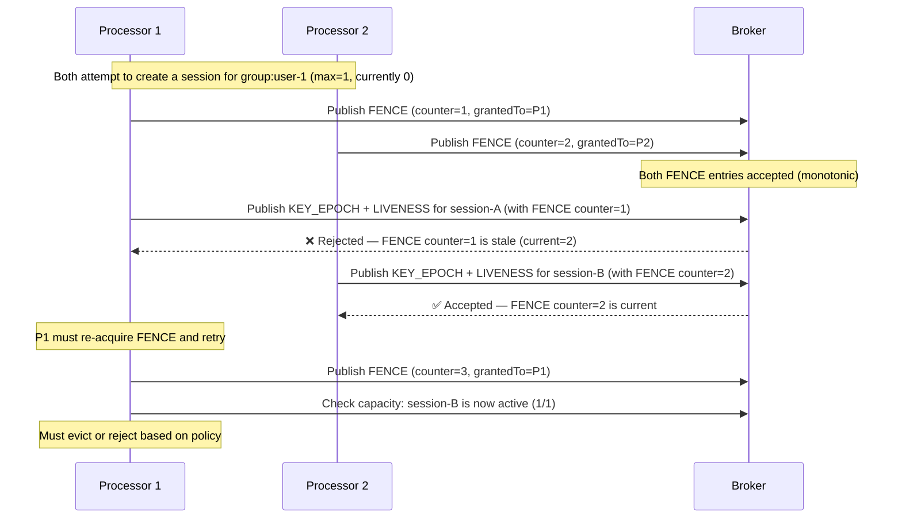

# Session Capacity Management

Veridot enforces per-group limits on the number of concurrent active sessions. When a new session would exceed the configured maximum, the eviction policy determines whether an existing session is automatically revoked or the request is rejected.

## Constructor Configuration

Capacity management is configured when constructing `GenericSignerVerifier`:

```java
// Allow at most 3 concurrent sessions per group, evict oldest on overflow
var sv = new GenericSignerVerifier(
    broker, trustRoot, "auth-service", longTermPrivateKey,
    Algorithm.ED25519,
    3,                    // maxSessions
    EvictionPolicy.FIFO   // eviction policy
);
```

| Parameter | Type | Description |
|---|---|---|
| `maxSessions` | `int` | Maximum active sessions per group. Use `-1` for unlimited. |
| `policy` | `EvictionPolicy` | Strategy when the limit is reached. |

:::info
Capacity can also be configured dynamically via `CONFIG` entries at the group, site, or global scope level. Dynamic configuration takes precedence over constructor defaults.
:::

## Eviction Policies

### FIFO — First In, First Out

Evicts the session with the **oldest** `asOf` timestamp in its most recent `LIVENESS(ACTIVE)` entry.

```java
var sv = new GenericSignerVerifier(broker, trustRoot, "svc", key,
    Algorithm.ED25519, 2, EvictionPolicy.FIFO);

sv.sign("data", config("user-1")); // session-A created (slot 1/2)
sv.sign("data", config("user-1")); // session-B created (slot 2/2)
sv.sign("data", config("user-1")); // session-A evicted, session-C created
```

**Best for:** Login-based systems where the oldest session should yield to the newest (e.g., "maximum 3 devices").

### LIFO — Last In, First Out

Evicts the session with the **newest** `asOf` timestamp.

```java
var sv = new GenericSignerVerifier(broker, trustRoot, "svc", key,
    Algorithm.ED25519, 2, EvictionPolicy.LIFO);

sv.sign("data", config("user-1")); // session-A created (slot 1/2)
sv.sign("data", config("user-1")); // session-B created (slot 2/2)
sv.sign("data", config("user-1")); // session-B evicted, session-C created
```

**Best for:** Scenarios where the most-established sessions should be preserved (e.g., primary device priority).

### LRU — Least Recently Used

Evicts the session whose most recent `LIVENESS(ACTIVE)` entry has the lowest `asOf` value. The issuing authority updates `asOf` during renewal attestations, so actively-used sessions are refreshed and survive eviction.

```java
var sv = new GenericSignerVerifier(broker, trustRoot, "svc", key,
    Algorithm.ED25519, 2, EvictionPolicy.LRU);
```

**Best for:** API token pools where idle sessions should be reclaimed first.

### REJECT — Hard Limit

Refuses the signing attempt entirely and throws `SessionCapacityExceededException`. No existing session is evicted.

```java
var sv = new GenericSignerVerifier(broker, trustRoot, "svc", key,
    Algorithm.ED25519, 2, EvictionPolicy.REJECT);

sv.sign("data", config("user-1")); // OK (1/2)
sv.sign("data", config("user-1")); // OK (2/2)
sv.sign("data", config("user-1")); // throws SessionCapacityExceededException
```

**Best for:** Strict licensing enforcement or compliance-driven session limits.

## Handling SessionCapacityExceededException

```java
try {
    String token = signer.sign(payload,
        BasicConfigurer.builder()
            .groupId("user-42")
            .validity(3600)
            .build());
} catch (SessionCapacityExceededException e) {
    log.warn("Capacity exceeded for group {}: max {} sessions",
        e.getGroupId(), e.getMaxSessions());

    // Option 1: Return 429 Too Many Requests
    return Response.status(429)
        .header("Retry-After", "60")
        .entity("Maximum sessions reached. Sign out from another device.")
        .build();

    // Option 2: Revoke the oldest session and retry
    // revoker.revoke(e.getGroupId(), oldestSessionId);
}
```

## Distributed Fencing

When multiple processor instances share the same broker, FENCE entries prevent race conditions during capacity-affecting mutations.

### How Fencing Works



### Key Guarantees

1. **Exactly-once admission** — Two processors concurrently creating sessions for the same group cannot both succeed for the same slot. Exactly one holds the next valid `fenceCounter`.

2. **FENCE before mutation** — The `FENCE` entry must be durably stored before the accompanying mutation (`KEY_EPOCH` + `LIVENESS`) is submitted.

3. **No counter reuse** — If a mutation fails after the `FENCE` is committed, the consumed counter value is never reused. The processor must obtain a new `FENCE` grant.

4. **Transport independence** — The fencing guarantee holds regardless of the broker's own consistency model.

## Dynamic Configuration

Capacity limits and eviction policies can be updated at runtime via `CONFIG` entries:

```java
// Set a site-wide limit of 5 sessions per group with LRU eviction
sv.publishConfig(
    ConfigScope.SITE, "eu-west",
    5,                      // maxSessions
    EvictionPolicy.LRU,     // policy
    3600,                   // default TTL (seconds)
    86400                   // CONFIG entry validity (seconds)
);
```

Configuration resolution follows the scope hierarchy: group → site → global → constructor defaults.

## Next Steps

- [Error Handling](./error-handling.md) — `SessionCapacityExceededException` in the exception hierarchy
- [Environment Variables](./environment-variables.md) — configure reconciliation intervals and staleness limits
