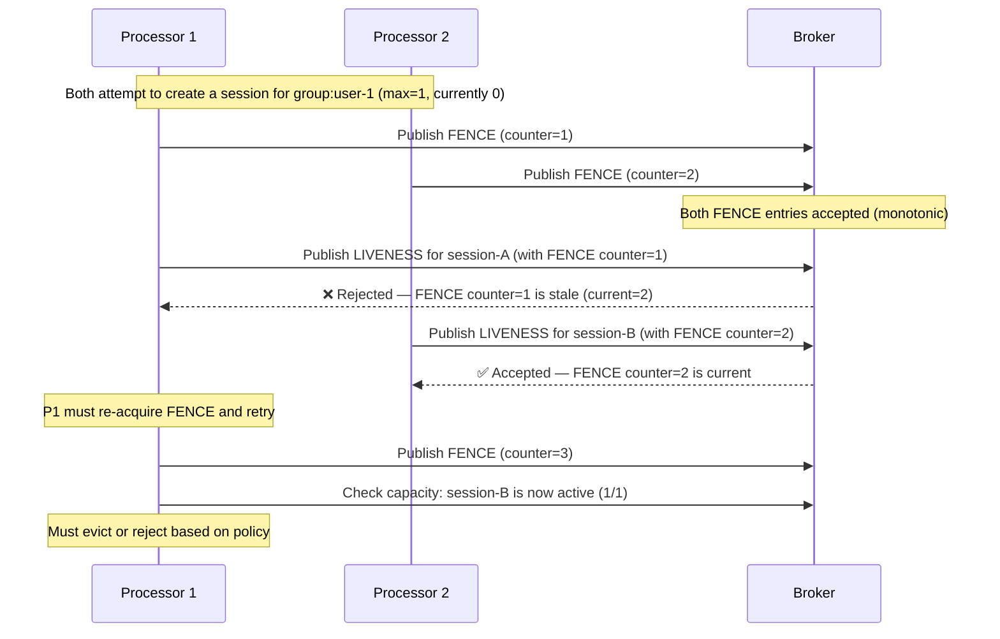

# Session Capacity Management

Veridot enforces per-group limits on the number of concurrent active sessions. When a new session would exceed the configured maximum, the eviction policy determines whether an existing session is automatically revoked or the request is rejected.

## Constructor Configuration

Capacity management is configured when constructing `GenericSignerVerifier`:

```java
KeyPairGenerator instance = KeyPairGenerator.getInstance(Algorithm.ED25519.getJcaKeyAlg());
KeyPair keyPair = instance.generateKeyPair();

// Allow at most 3 concurrent sessions per group, evict oldest on overflow
var sv = new GenericSignerVerifier(
    broker, trustRoot, "orders-service", 
    keyPair.getPrivate(), keyPair.getPublic(),
    Algorithm.ED25519,
    3,                    // maxSessions
    EvictionPolicy.FIFO   // eviction policy
);
```

| Parameter | Type | Description |
|---|---|---|
| `maxSessions` | `int` | Maximum active sessions per group. Use `-1` for unlimited. |
| `policy` | `EvictionPolicy` | Strategy when the limit is reached. |

:::info
Capacity can also be configured dynamically via `CONFIG` entries at the group, site, or global scope level. Dynamic configuration takes precedence over constructor defaults.
:::

## Eviction Policies

### FIFO — First In, First Out

Evicts the session with the **oldest** timestamp in its most recent `LIVENESS(ACTIVE)` entry.

**Best for:** Login-based systems where the oldest session should yield to the newest.

### LIFO — Last In, First Out

Evicts the session with the **newest** timestamp.

**Best for:** Scenarios where the most-established sessions should be preserved.

### LRU — Least Recently Used

Evicts the session whose most recent `LIVENESS(ACTIVE)` entry has the lowest heartbeat timestamp.

**Best for:** API token pools where idle sessions should be reclaimed first.

### REJECT — Hard Limit

Refuses the signing attempt entirely and throws `SessionCapacityExceededException`. No existing session is evicted.

**Best for:** Strict licensing enforcement or compliance-driven session limits.

## Distributed Fencing

When multiple processor instances share the same broker, `FENCE (0x05)` entries prevent race conditions during capacity-affecting mutations.

### How Fencing Works



### Key Guarantees

1. **Exactly-once admission** — Two processors concurrently creating sessions for the same group cannot both succeed for the same slot.
2. **FENCE before mutation** — The `FENCE` entry must be durably stored before the mutation (`LIVENESS`) is submitted.
3. **No counter reuse** — If a mutation fails after the `FENCE` is committed, the processor must obtain a new `FENCE` grant.

## Dynamic Configuration

Capacity limits and eviction policies can be updated at runtime via `CONFIG (0x03)` entries:

```java
// Set a site-wide limit of 5 sessions per group with LRU eviction
sv.publishConfig(
    ConfigScope.SITE, "eu-west",
    5,                      // maxSessions
    EvictionPolicy.LRU,     // policy
    3600,                   // default TTL (seconds)
    86400                   // CONFIG entry validity (seconds)
);
```

Configuration resolution follows the scope hierarchy: group → site → global → constructor defaults.

## Next Steps

- [Error Handling](./error-handling.md) — `SessionCapacityExceededException` in the exception hierarchy
