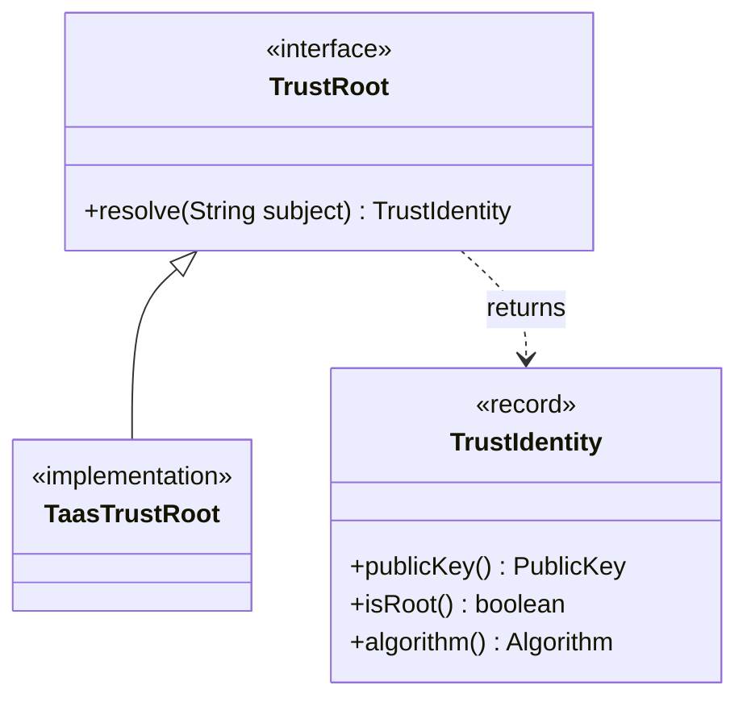

import Tabs from '@theme/Tabs';
import TabItem from '@theme/TabItem';

# TrustRoot Setup

In Veridot V5, the `TrustRoot` is the **sole source of cryptographic trust** in the system. It is responsible for resolving a long-term identity subject (e.g., `orders-service@a1B2c...`) to a `TrustIdentity` containing the issuer's public key, root status, and algorithm. The TrustRoot is backed by the **Trust Authority & Attestation Service (TAAS)** cluster.

## Architecture



## Two-Level Trust Cache

TrustRoot resolution is a latency-critical operation (it occurs on every verification). To minimize latency and provide resilience against TAAS outages, Veridot V5 mandates a two-level cache structure.

| Layer | Storage | TTL | Purpose |
|---|---|---|---|
| **L1** | In-memory `ConcurrentHashMap` | 60s | Hot-path, sub-millisecond lookups |
| **L2** | Persistent store (RocksDB) | 3600s | Survives application restarts |
| **TAAS** | REST API | - | Authoritative source of truth |

### Setting Up CachingTrustRoot

For production deployments, configure the `TaasTrustRoot` with L1 and L2 caching enabled:

<Tabs>
<TabItem value="maven" label="Maven">

```xml
<dependency>
    <groupId>io.github.cyfko</groupId>
    <artifactId>veridot-trustroots</artifactId>
    <version>${veridot.version}</version>
</dependency>
```

</TabItem>
<TabItem value="gradle" label="Gradle">

```groovy
implementation "io.github.cyfko:veridot-trustroots:${veridotVersion}"
```

</TabItem>
</Tabs>

```java
TrustRoot trustRoot = TaasTrustRoot.builder()
    .taasServerUrl("https://taas.internal:8443")
    .rocksDbPath("/var/lib/veridot/trustroot")
    .l1MaxEntries(10_000)
    .l1TtlSeconds(60)
    .l2TtlSeconds(3600)
    .build();
```

### Stale Window and Graceful Degradation

If the TAAS cluster is temporarily unreachable, the `TaasTrustRoot` will serve entries that are technically expired (past their `notAfter` timestamp) but still within the L2 cache TTL window.

- **Cache hit (fresh):** Verification succeeds normally.
- **Cache hit (stale):** Verification succeeds with a warning logged. An async background thread attempts to refresh the entry from TAAS with exponential backoff.
- **Cache miss:** Raises `V5101 TRUST_RESOLUTION_FAILED`.

## Trust Bootstrap

A new Veridot deployment requires at least one **trust anchor** to bootstrap the authorization chain.

1. Generate a secure bootstrap keypair (e.g. via HSM).
2. Insert this key's `TrustEntry` directly into the TAAS storage (bypassing attestation) with `isRoot = true`.
3. Use the bootstrap identity to publish the initial `CAPABILITY` entries for other services.
4. From then on, instances register automatically via attestation plugins (e.g. AWS Nitro Enclaves, Kubernetes SATs) with `isRoot = false`.

### Testing with NoneAttestor

For local development or CI pipelines, you can start a TAAS node allowing the `NoneAttestor` plugin, which bypasses cryptographic attestation verification:

```java
// Testing ONLY: Do not use NoneAttestor in production!
TrustRoot devTrustRoot = TaasTrustRoot.builder()
    .taasServerUrl("http://localhost:8080")
    .allowNoneAttestor(true)
    .build();
```

## Security Requirements

:::danger[Never fall back to synthetic identities]
If TrustRoot resolution fails (network error, unknown subject), Veridot **MUST fail closed** — it rejects the pending verification. You must never configure a TrustRoot to return a synthetic or default identity. Doing so compromises the attestation-first guarantee of the protocol.
:::

## Next Steps

- [Signing Tokens](./signing-tokens.md) — use your configured TrustRoot to issue tokens
- [Verifying Tokens](./verifying-tokens.md) — see how TrustRoot integrates into the verification pipeline
