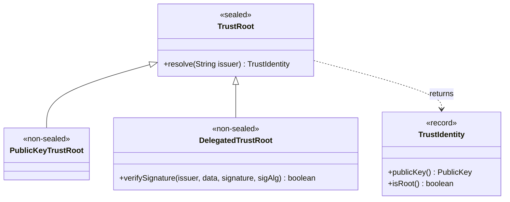
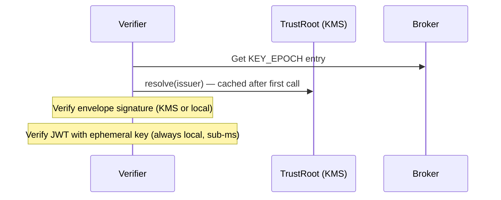

import Tabs from '@theme/Tabs';
import TabItem from '@theme/TabItem';

# TrustRoot Setup

The `TrustRoot` is the **sole source of cryptographic trust** in Veridot. It resolves a long-term issuer identifier (a string like `"auth-service"`) to a `TrustIdentity` containing the issuer's public key and root status — completely independent of the broker.

## Architecture

`TrustRoot` is a [sealed interface](https://docs.oracle.com/en/java/javase/21/language/sealed-classes-and-interfaces.html) with exactly two permitted sub-interfaces:



### TrustIdentity

The `TrustIdentity` record carries two fields:

| Field | Type | Description |
|---|---|---|
| `publicKey()` | `java.security.PublicKey` | The long-term public key of the resolved issuer |
| `isRoot()` | `boolean` | `true` if this identity is a root identity (unconditionally authorized for all scopes) |

## Option A: PublicKeyTrustRoot

You provide the public key directly. Veridot uses it to verify envelope signatures locally.

**Best for:** development, testing, single-signer deployments, or when you manage keys yourself.

```java
PublicKeyTrustRoot trustRoot = issuer -> {
    // Load the public key for this issuer from your key store
    PublicKey publicKey = loadPublicKeyFor(issuer);
    if (publicKey == null) {
        throw new VeridotException("Unknown issuer: " + issuer);
    }
    return new TrustIdentity(publicKey, true); // root identity
};

var sv = new GenericSignerVerifier(broker, trustRoot, "auth-service",
    longTermPrivateKey, Algorithm.ED25519);
```

For multi-signer deployments, resolve different keys per issuer:

```java
PublicKeyTrustRoot trustRoot = issuer -> switch (issuer) {
    case "auth-service"    -> new TrustIdentity(authServicePubKey, true);
    case "payment-service" -> new TrustIdentity(paymentPubKey, false);
    default -> throw new VeridotException("Unknown issuer: " + issuer);
};
```

## Option B: DelegatedTrustRoot

`DelegatedTrustRoot` allows integrating signature verification with external Key Management Services (KMS) or Hardware Security Modules (HSMs). The `DelegatedTrustRoot` interface delegates the cryptographic signature verification to an external API rather than performing it locally.

:::caution Architectural Trade-offs & Protocol Conflicts
Using cloud KMS providers (such as AWS KMS, Google Cloud KMS, or Azure Key Vault) directly on the verification path introduces severe conflicts with Veridot's core principles:
1. **Offline Verification Violation**: Verifying signatures via a cloud KMS API requires a synchronous network call per issuer, introducing 1–10ms latency and turning the KMS provider into a runtime SPoF.
2. **Key Custody Violation**: Protocol V4 requires that **the long-term private key must never leave the issuer's boundary**. Cloud KMS systems generate and retain private keys within the cloud provider's boundary, meaning the issuer service does not have custody of its own root key.

Therefore, `DelegatedTrustRoot` should only be used if:
- Verification results are cached locally.
- Enterprise security compliance mandates that all cryptographic operations must occur inside a certified HSM.
- You use it in conjunction with a local cache layer (like `CachingTrustRoot`).
:::

```java
DelegatedTrustRoot trustRoot = new DelegatedTrustRoot() {
    @Override
    public TrustIdentity resolve(String issuer) {
        // Still need to return the public key for capability chain validation
        PublicKey publicKey = vaultClient.getPublicKey(issuer);
        return new TrustIdentity(publicKey, true);
    }

    @Override
    public boolean verifySignature(String issuer, byte[] data,
                                    byte[] signature, Algorithm sigAlg) {
        // Delegate the actual verification to your KMS/HSM
        return vaultClient.verify(issuer, data, signature,
            sigAlg.getJcaSignatureAlg());
    }
};
```

### Hot Path Isolation

:::tip Caching is Mandatory for DelegatedTrustRoot
KMS/HSM APIs must **NOT** be on the token verification hot path. Veridot calls `resolve()` once per issuer and caches the result. The ephemeral key verification (step 8 of the pipeline) uses the locally-held ephemeral public key from the `KEY_EPOCH` entry — it does not call your KMS. Only the envelope's long-term signature check (step 4) may use `verifySignature()`. However, to achieve true sub-millisecond offline verification, you must wrap your `DelegatedTrustRoot` in a `CachingTrustRoot`.
:::



## Option C: CachingTrustRoot (Production)

For production deployments with multiple verifier instances, use `CachingTrustRoot` from the `veridot-trustroots` module. It provides a tiered caching architecture:

| Layer | Storage | Latency | Purpose |
|---|---|---|---|
| **L1** | In-memory `ConcurrentHashMap` | ~100 ns | Hot-path lookups |
| **L2** | RocksDB on local disk | ~1 ms | Survives restarts |
| **TAD Provider** | TAD Server (Raft consensus) | ~5–50 ms | Authoritative source of truth |

<Tabs>
<TabItem value="maven" label="Maven">

```xml
<dependency>
    <groupId>io.github.cyfko</groupId>
    <artifactId>veridot-trustroots</artifactId>
    <version>${veridot.version}</version>
</dependency>
```

</TabItem>
<TabItem value="gradle" label="Gradle">

```groovy
implementation "io.github.cyfko:veridot-trustroots:${veridotVersion}"
```

</TabItem>
</Tabs>

```java
CachingTrustRoot trustRoot = CachingTrustRoot.builder()
    .tadServerUrl("https://tad.internal:8443")
    .rocksDbPath("/var/lib/veridot/trustroot")
    .l1MaxEntries(1000)
    .l1TtlSeconds(300)
    .build();
```

## Security Requirements

:::danger Never fall back to accepting unverified announcements
If TrustRoot resolution fails (network error, KMS timeout, unknown issuer), Veridot **MUST fail closed** — it rejects the pending verification. Your `TrustRoot` implementation must **never** return a synthetic or default identity to "keep things working." This would allow any party with broker write access to forge entries.

```java
// ❌ NEVER DO THIS
PublicKeyTrustRoot bad = issuer -> new TrustIdentity(defaultKey, true);

// ✅ ALWAYS validate
PublicKeyTrustRoot good = issuer -> {
    PublicKey key = keyStore.get(issuer);
    if (key == null) {
        throw new VeridotException("Unknown issuer: " + issuer);
    }
    return new TrustIdentity(key, key.equals(rootKey));
};
```
:::

## Next Steps

- [Signing Tokens](./signing-tokens.md) — use your configured TrustRoot to issue tokens
- [Verifying Tokens](./verifying-tokens.md) — see how TrustRoot integrates into the verification pipeline
