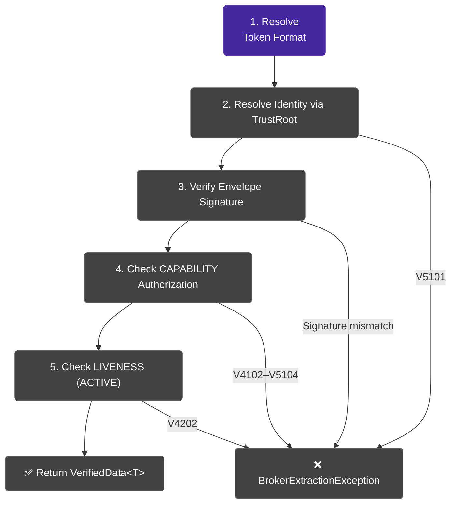

# Verifying Tokens

Veridot V5 enforces a strict sequence of checks to verify an incoming token (DIRECT JWT, NATIVE reference, or PRIVATE reference). Every step independently produces rejection on failure. 

## The Verification Pipeline



### Step-by-Step Breakdown

| Step | Name | What it checks | Error code on failure |
|:---:|---|---|:---:|
| 1 | **Format resolution** | Extracts the key identifier from the token (DIRECT, NATIVE, PRIVATE). Fetches `SIGNED_DATA` or `SECURE_PAYLOAD` if broker-backed. | V4401 |
| 2 | **Identity resolution** | Queries `TrustRoot` (TAAS) to obtain the signer's public key from the subject. | V5101 |
| 3 | **Signature verification** | Verifies the single cryptographic signature over the envelope bytes using the resolved public key. | V5001-V5007 |
| 4 | **Capability check** | Confirms the signer holds a valid, unexpired `CAPABILITY` for the relevant scope. | V4102-V5104 |
| 5 | **Liveness check** | Confirms a fresh `LIVENESS(ACTIVE)` entry exists for the session. | V4202 |

:::info
Unlike Protocol V4, there is no ephemeral key verification in V5. The instance's long-term private key signs the data natively, ensuring fewer round-trips and simpler semantics.
:::

## Basic Verification

```java
// Verify a DIRECT token (JWT)
VerifiedData<String> result = verifier.verify(jwtToken, s -> s);
String payload   = result.data();       // "user@example.com"
String scope   = result.scope();    // "user-123"
String sessionId = result.key(); // "session-A"

// Verify a NATIVE token (messageId)
VerifiedData<String> resultNative = verifier.verify("8:group:user-123:session-A", s -> s);
```

## The VerifiedData Record

`VerifiedData<T>` is an immutable record carrying the verification result:

```java
public record VerifiedData<T>(
    String scope,      // group identifier from the token
    String key,   // session identifier from the token
    T data               // deserialized payload
) {}
```

Use the extracted identifiers for downstream operations:

```java
VerifiedData<UserClaims> result = verifier.verify(token,
    BasicConfigurer.deserializer(UserClaims.class));

// Access verified data
UserClaims claims = result.data();
log.info("Verified user {} in session {}", result.scope(), result.key());

// Revoke this session later if needed
revoker.revoke(result.scope(), result.key());
```

## Custom Deserializers

### Using BasicConfigurer.deserializer()

The simplest approach for POJO deserialization (uses Jackson):

```java
record UserClaims(String email, String role) {}

VerifiedData<UserClaims> result = verifier.verify(token,
    BasicConfigurer.deserializer(UserClaims.class));
```

### Using a Lambda

For full control over deserialization:

```java
// Protocol Buffers deserializer
VerifiedData<MyProto> result = verifier.verify(token, raw -> {
    try {
        byte[] bytes = Base64.getDecoder().decode(raw);
        return MyProto.parseFrom(bytes);
    } catch (InvalidProtocolBufferException e) {
        throw new DataDeserializationException("Protobuf decode failed", e);
    }
});
```

## Error Handling

All verification failures are surfaced as `BrokerExtractionException`:

```java
try {
    VerifiedData<String> result = verifier.verify(token, s -> s);
    // Token is valid — proceed
} catch (DataDeserializationException e) {
    // Schema/compatibility error, not a security violation
    log.warn("Deserialization error: {}", e.getMessage());
    return Response.status(400).build();
} catch (BrokerExtractionException e) {
    // Token invalid, expired, revoked, or unauthorized
    log.warn("Verification failed: {}", e.getMessage());
    return Response.status(401).build();
}
```

:::warning
`BrokerExtractionException` deliberately masks the specific reason at the API boundary to prevent attackers from learning which checks their forgery passed.
:::

## Next Steps

- [Revoking Sessions](./revoking-sessions.md) — invalidate sessions using `groupId` and `sequenceId`
- [Error Handling](./error-handling.md) — complete exception hierarchy and HTTP status mapping
