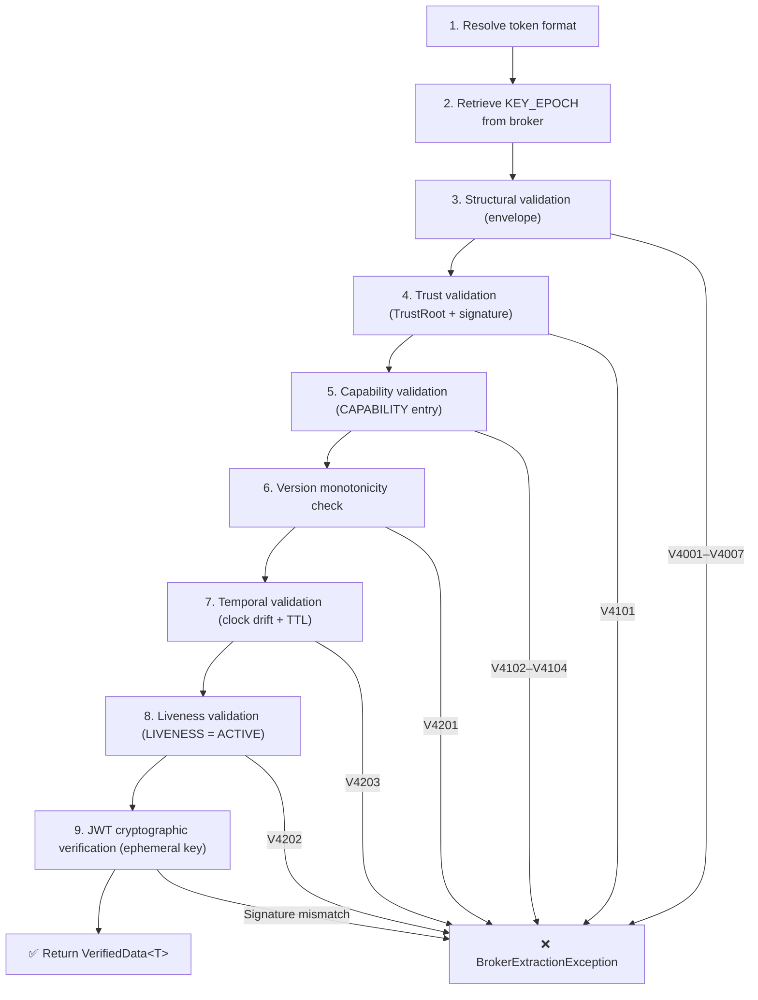

# Verifying Tokens

Veridot's verification pipeline performs 9 sequential checks before returning deserialized data. Every step independently produces rejection on failure — no step can be skipped or reordered.

## The 9-Step Verification Pipeline



### Step-by-Step Breakdown

| Step | Name | What it checks | Error code on failure |
|:---:|---|---|:---:|
| 1 | **Format resolution** | Is the token a JWT or a `messageId` (`4:groupId:seqId`)? | — |
| 2 | **Broker retrieval** | Fetch `KEY_EPOCH` entry by `(scope, KEY_EPOCH, sequenceId)` | V4401 |
| 3 | **Structural validation** | Magic bytes, protocol version, entry type, field lengths | V4001–V4007 |
| 4 | **Trust validation** | Resolve `issuer` via TrustRoot; verify envelope signature | V4101 |
| 5 | **Capability validation** | Issuer holds a valid, unexpired `CAPABILITY` for this scope | V4102–V4104 |
| 6 | **Version monotonicity** | Entry version > previously recorded watermark | V4201 |
| 7 | **Temporal validation** | `now` within `[validFrom − 5min, validUntil)` | V4203 |
| 8 | **Liveness validation** | Fresh `LIVENESS(ACTIVE)` exists for this session | V4202 |
| 9 | **JWT verification** | Verify JWT signature with ephemeral public key from `KEY_EPOCH` | — |

:::info
Steps 1–8 validate the **protocol metadata**. Step 9 validates the **application token** itself. The ephemeral key check in step 9 is always performed locally — it never hits your KMS.
:::

## Basic Verification

```java
// Verify a DIRECT token (JWT)
VerifiedData<String> result = verifier.verify(token, s -> s);
String payload   = result.data();       // "user@example.com"
String groupId   = result.groupId();    // "user-123"
String sessionId = result.sequenceId(); // "session-A"

// Verify an INDIRECT token (messageId)
VerifiedData<String> result = verifier.verify("4:user-123:session-A", s -> s);
```

## The VerifiedData Record

`VerifiedData<T>` is an immutable record carrying the verification result:

```java
public record VerifiedData<T>(
    String groupId,      // group identifier from the token
    String sequenceId,   // session identifier from the token
    T data               // deserialized payload
) {}
```

Use the extracted identifiers for downstream operations:

```java
VerifiedData<UserClaims> result = verifier.verify(token,
    BasicConfigurer.deserializer(UserClaims.class));

// Access verified data
UserClaims claims = result.data();
log.info("Verified user {} in session {}", result.groupId(), result.sequenceId());

// Revoke this session later
revoker.revoke(result.groupId(), result.sequenceId());
```

## Custom Deserializers

### Using BasicConfigurer.deserializer()

The simplest approach for POJO deserialization:

```java
record UserClaims(String email, String role) {}

VerifiedData<UserClaims> result = verifier.verify(token,
    BasicConfigurer.deserializer(UserClaims.class));
```

This uses Jackson internally. For `String.class`, the raw value passes through without JSON parsing.

### Using a Lambda

For full control over deserialization:

```java
// Protocol Buffers deserializer
VerifiedData<MyProto> result = verifier.verify(token, raw -> {
    try {
        byte[] bytes = Base64.getDecoder().decode(raw);
        return MyProto.parseFrom(bytes);
    } catch (InvalidProtocolBufferException e) {
        throw new DataDeserializationException("Protobuf decode failed", e);
    }
});
```

### Using DataTransformer

For bidirectional serialization needs:

```java
public class JsonTransformer implements DataTransformer {
    private final ObjectMapper mapper = new ObjectMapper();

    @Override
    public String serialize(Object data) {
        try {
            return mapper.writeValueAsString(data);
        } catch (JsonProcessingException e) {
            throw new DataSerializationException("Serialization failed", e);
        }
    }

    @Override
    public Object deserialize(String data) {
        try {
            return mapper.readValue(data, Map.class);
        } catch (JsonProcessingException e) {
            throw new DataDeserializationException("Deserialization failed", e);
        }
    }
}
```

## Error Handling

All verification failures are surfaced as `BrokerExtractionException`, which covers the entire pipeline:

```java
try {
    VerifiedData<String> result = verifier.verify(token, s -> s);
    // Token is valid — proceed
} catch (DataDeserializationException e) {
    // Token is cryptographically valid, but payload can't be deserialized
    // This is a schema/compatibility error, not a security violation
    log.warn("Deserialization error: {}", e.getMessage());
    return Response.status(400).build();
} catch (BrokerExtractionException e) {
    // Token is invalid, expired, revoked, or metadata unavailable
    log.warn("Verification failed: {}", e.getMessage());
    return Response.status(401).build();
}
```

:::warning
`BrokerExtractionException` deliberately does not distinguish between "token revoked," "token expired," and "token forged." This is a security design decision — leaking the specific reason helps attackers understand which checks their forgery passed.
:::

## Reconciliation Staleness

You can monitor how fresh your local verification state is:

```java
long stalenessMs = verifier.getReconciliationStalenessMs("group:user-123");
if (stalenessMs > 120_000) { // more than 2 minutes stale
    log.warn("Verification cache is {}ms stale", stalenessMs);
}
```

## Next Steps

- [Revoking Sessions](./revoking-sessions.md) — invalidate sessions using `groupId` and `sequenceId`
- [Error Handling](./error-handling.md) — complete exception hierarchy and HTTP status mapping
