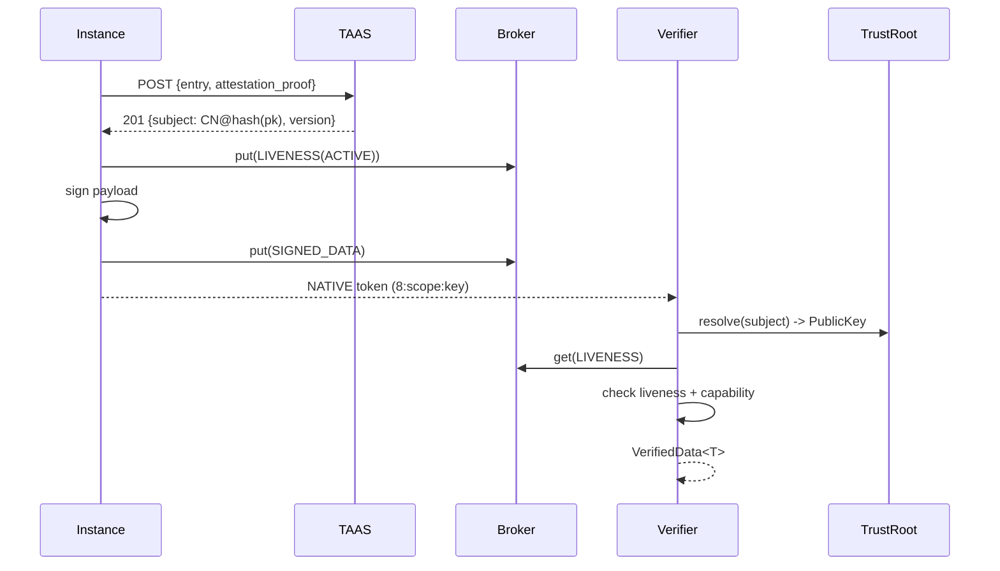

# Veridot Documentation

**Veridot** is a distributed authenticity and integrity protocol (V5) that solves the authentication trilemma: verify tokens in **sub-millisecond** without a central authority, revoke them **instantly** across the cluster, and maintain **zero shared secrets** between services.

---

## The Problem

Every microservice authentication approach forces a compromise:

| Approach | Revocable? | No shared secret? | No network call? |
|----------|:----------:|:-----------------:|:----------------:|
| Shared HMAC | ✅ | ❌ | ✅ |
| Stateless RSA/ECDSA JWT | ❌ | ✅ | ✅ |
| Centralized IdP call | ✅ | ✅ | ❌ |
| **Veridot V5** | ✅ | ✅ | ✅ |

Veridot achieves all three through an **attestation-first** design, single-key-per-instance lifecycles, and a **broker-untrusted** architecture. 

---

## Quick Links

### 🚀 Getting Started

New to Veridot? Start here.

- [The Authentication Trilemma](./learn/the-problem.md)
- [How Veridot Works](./learn/how-veridot-works.md)
- [Your First Integration](./learn/first-integration.md)

### 🔧 Developer Guides

Understand the core mechanics.

- [The TAAS Cluster](./learn/going-distributed.md)
- [Capabilities](./learn/capabilities.md)
- [Living Sessions](./learn/session-management.md)
- [Going to Production](./learn/production.md)

### 📜 Reference

Dive deep into the V5 internals.

- [Protocol V5 Spec](./protocol/index.md)
- [Error Codes](./protocol/index.md)

---

## Architecture at a Glance

---

## Protocol V5 Features

Veridot Protocol V5 introduces an **attestation-first** approach:
- **Trust Authority & Attestation Service (TAAS)** for robust identity registration.
- Identity based on `CN@hash(pk)`.
- **NATIVE** distribution mode using compact reference tokens (`8:<scope>:<key>`).
- Completely removes the concept of Key Epochs.

## License

[MIT](https://github.com/cyfko/veridot/blob/main/LICENSE) · **Kunrin SA** · [frank.kossi@kunrin.com](mailto:frank.kossi@kunrin.com)
