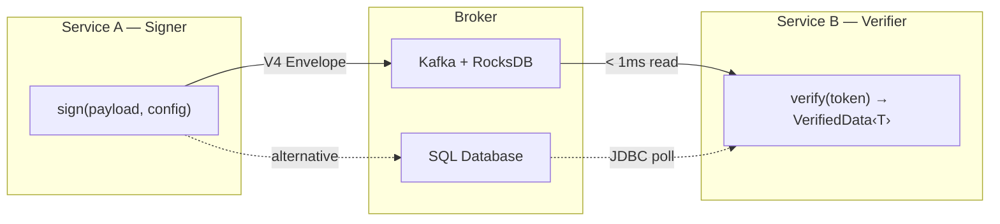

# Veridot Documentation

**Veridot** is a distributed token verification protocol and Java library that solves the authentication trilemma: verify tokens in **sub-millisecond** without a central authority, revoke them **instantly** across the cluster, and maintain **zero shared secrets** between services.

---

## The Problem

Every microservice authentication approach forces a compromise:

| Approach | Revocable? | No shared secret? | No network call? |
|----------|:----------:|:-----------------:|:----------------:|
| Shared HMAC | ✅ | ❌ | ✅ |
| Stateless RSA/ECDSA JWT | ❌ | ✅ | ✅ |
| Centralized IdP call | ✅ | ✅ | ❌ |
| **Veridot** | ✅ | ✅ | ✅ |

Veridot achieves all three by combining **ephemeral asymmetric key pairs** with **distributed metadata propagation** and a **local RocksDB cache**.

---

## Quick Links

<div className="row">
<div className="col col--4">

### 🚀 Getting Started

New to Veridot? Start here.

- [What is Veridot?](./getting-started/what-is-veridot.md)
- [How it Works](./getting-started/how-it-works.md)
- [Quickstart (5 min)](./getting-started/quickstart.md)

</div>
<div className="col col--4">

### 🔧 Developer Guides

Build with Veridot.

- [Core Concepts](./guides/core-concepts.md)
- [TrustRoot Setup](./guides/trustroot-setup.md)
- [Distribution Modes](./guides/distribution-modes.md)

</div>
<div className="col col--4">

### 📜 Reference

Dive deep into the internals.

- [Protocol V4 Spec](./protocol/v4/index.md)
- [API Reference](./api/index.md)
- [Error Codes](./protocol/v4/error-codes.md)

</div>
</div>

---

## Architecture at a Glance



---

## Java Modules

| Module | Artifact | Description |
|--------|----------|-------------|
| **veridot-core** | `io.github.cyfko:veridot-core:4.0.1` | Core API, `GenericSignerVerifier`, Protocol V4 |
| **veridot-kafka** | `io.github.cyfko:veridot-kafka:4.0.1` | Kafka + RocksDB `Broker` implementation |
| **veridot-databases** | `io.github.cyfko:veridot-databases:4.0.1` | SQL `Broker` (PostgreSQL, MySQL, Oracle, MSSQL) |
| **veridot-trustroots** | `io.github.cyfko:veridot-trustroots-*:4.0.1` | Production TrustRoot with L1/L2 cache + TAD cluster |

:::tip[Quick Install]

```xml
<dependency>
    <groupId>io.github.cyfko</groupId>
    <artifactId>veridot-core</artifactId>
    <version>4.0.1</version>
</dependency>
```

Requires **Java 25+** · [Full installation guide →](./getting-started/installation.md)

:::

---

## Protocol V4

Veridot Protocol V4 is a binary, self-describing message format enabling distributed verification of signed objects without shared secrets. It defines 7 entry types, a TLV payload encoding, monotonic state consistency, and positive-proof liveness attestation.

[Read the Protocol V4 Specification →](./protocol/v4/index.md)

---

## License

[MIT](https://github.com/cyfko/veridot/blob/main/LICENSE) · **Kunrin SA** · [frank.kossi@kunrin.com](mailto:frank.kossi@kunrin.com)
