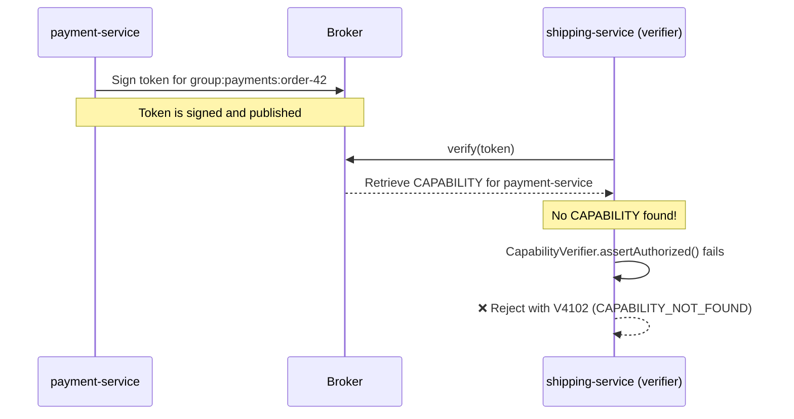

# Chapter 5: Who Can Sign? — Capabilities

In ShopFlow, `order-service` signs tokens for orders. But you don't want it signing tokens for payments — that's `payment-service`'s job. How do you control **who signs what**?

Veridot answers this with **capabilities**: signed, scope-bound authorization grants that form a cryptographic chain of trust.

## The Problem: Unrestricted Signing

Without capability controls, any service that holds a signing key could issue tokens for *any* scope. In a microservices architecture like ShopFlow, that means `order-service` could sign tokens for `group:payments:*` — a scope it has no business touching. You need a way to say:

> "`order-service` can sign for `group:orders:*`, and **only** `group:orders:*`."

## Root Identities: The Starting Point

Every capability chain starts with a **root identity** — an identity whose long-term public key is directly resolvable in the [TrustRoot](/docs/architecture/trust-hierarchy). Root identities are unconditionally authorized for any scope, without needing a `CAPABILITY` entry of their own.

In ShopFlow, `admin-service` is registered in the TrustRoot. That makes it a root identity:

```
┌───────────┐  resolves   ┌─────────────────────┐
│ TrustRoot ├────────────▶│    admin-service    │
└───────────┘             │   (root identity)   │
                          └──────────┬──────────┘
                                     │
                          ┌──────────┴──────────────────┐
                          │ ✅ Authorized for any scope │
                          │ No CAPABILITY entry needed  │
                          └─────────────────────────────┘
```

:::tip[Root identity ≠ root access to your application]
A root identity can publish protocol entries (keys, liveness, config, capabilities) for any scope. It does **not** grant application-level superuser powers — it's scoped to the Veridot protocol layer.
:::

## Granting a Capability

`admin-service` uses `EntryPublisher` to publish a `CAPABILITY` entry granting `order-service` permission to operate within `group:orders:*`:

```
CAPABILITY {
  subjectSid:        "order-service"
  scopePatterns:     ["group:orders:*"]
  maxDelegationDepth: 1
  validUntil:        2025-12-31T23:59:59Z
}
```

This entry is signed by `admin-service`'s long-term key, published via the broker, and stored like any other protocol entry. When `shipping-service` later calls `verify()` on a token signed by `order-service`, the verifier resolves the capability chain to confirm authorization.

:::danger[No default grants]
There is **no** default-authorized scope and **no** fallback. If `order-service` doesn't have a valid `CAPABILITY` entry for a scope, any token it signs for that scope will be **rejected**. Absence = rejection.
:::

## Scope Patterns: Controlling the Blast Radius

Scope patterns determine exactly *which* scopes a capability covers. A pattern is a scope string with an optional trailing `*` wildcard:

| Pattern | Matches | Does NOT match |
|---|---|---|
| `group:orders:*` | `group:orders:123`, `group:orders:456`, `group:orders:eu:789` | `group:payments:1` |
| `group:payments` | `group:payments` only (exact) | `group:payments:123` |
| `group:orders:eu:*` | `group:orders:eu:123`, `group:orders:eu:456` | `group:orders:us:789` |

In ShopFlow, you'd grant narrow capabilities:

| Service | Scope pattern | Reasoning |
|---|---|---|
| `order-service` | `group:orders:*` | Can sign for any order group |
| `payment-service` | `group:payments:*` | Can sign for any payment group |
| `shipping-service` | *(no capability needed — it only verifies, never signs)* | Verifiers don't need capabilities |

:::info[Verifiers don't need capabilities]
Capabilities control **who can publish entries** (sign tokens, issue liveness, etc.). A service that only **verifies** tokens doesn't need a capability — it just needs access to the TrustRoot and the broker.
:::

## Delegation Chains: Spreading Authority

Sometimes a service needs to delegate part of its authority to a sub-service. In ShopFlow, `order-service` runs a dedicated `order-worker` for EU orders. Rather than having `admin-service` directly grant every sub-service, `order-service` can **delegate**:

```
        ┌───────────┐
        │ TrustRoot │
        └─────┬─────┘
              │ resolves
              ▼
     ┌──────────────────┐
     │  admin-service   │
     │  (root identity) │
     └────────┬─────────┘
              │ CAPABILITY
              │ scope: group:orders:*
              │ maxDelegationDepth: 1
              ▼
     ┌──────────────────┐
     │  order-service   │
     └────────┬─────────┘
              │ CAPABILITY
              │ scope: group:orders:eu:*
              │ maxDelegationDepth: 0
              ▼
     ┌──────────────────┐
     │  order-worker    │
     └──────────────────┘
```

Here's how the delegation math works:

| Identity | Issued by | Chain depth | Bounded by |
|---|---|:---:|---|
| `admin-service` | TrustRoot (root identity) | 0 | Unlimited — root identities need no capability |
| `order-service` | `admin-service` | 1 | `admin-service` granted `maxDelegationDepth: 1` → ✅ depth 1 ≤ 1 |
| `order-worker` | `order-service` | — | `order-service` granted `maxDelegationDepth: 0` → ❌ **cannot sub-delegate** |

Wait — `order-worker` is at depth 1 from `order-service`, but `order-service` set `maxDelegationDepth: 0`. Does it work?

No! With `maxDelegationDepth: 0`, `order-worker` **cannot further delegate** to anyone else. But `order-worker` itself *is* authorized because it's within `admin-service`'s `maxDelegationDepth: 1`. The `maxDelegationDepth` on each capability controls how many **further** hops are allowed from *that* grant.

Let's correct the ShopFlow example. `admin-service` grants `order-service` with `maxDelegationDepth: 1`, meaning `order-service` can sub-delegate one hop. `order-service` then grants `order-worker` with `maxDelegationDepth: 0`, meaning `order-worker` can operate but cannot sub-delegate further:

```
        ┌───────────┐
        │ TrustRoot │
        └─────┬─────┘
              │ resolves
              ▼
     ┌────────────────────┐
     │   admin-service    │
     │   (root identity)  │
     └─────────┬──────────┘
               │ grants
               │ maxDelegationDepth: 1
               ▼
     ┌─────────────────────────────────┐
     │ order-service                   │
     │ ✅ can sub-delegate 1 hop       │
     └────────────────┬────────────────┘
                      │ grants
                      │ maxDelegationDepth: 0
                      ▼
     ┌──────────────────────────────────────┐
     │ order-worker                         │
     │ ✅ authorized, cannot sub-delegate   │
     └────────────────┬─────────────────────┘
                      ╳ ❌ depth exceeded
               ┌──────────────┐
               │  sub-worker  │
               └──────────────┘
```

## What Happens Without a Capability

Suppose `payment-service` is newly deployed but nobody has published a `CAPABILITY` entry for it yet. What happens when it tries to sign a token?



The verification **fails** at the capability check — `CapabilityVerifier.assertAuthorized()` is called during `verify()`, and without a valid capability, it throws `V4102`. The token is cryptographically valid but **unauthorized**.

:::warning[Authorization is checked during verification]
The signer can always *create* a signed token — the signing key doesn't know about capabilities. It's the **verifier** that enforces capabilities by walking the delegation chain during `verify()`. This means unauthorized tokens are rejected at verification time, not signing time.
:::

## Capability Expiration

Every capability has a `validUntil` timestamp. When it expires, **all operations that depend on it fail**:

```
Timeline:
─────────────────────────────────────────────────────────►
  │                                              │
  capability granted                     validUntil
  ├──── order-service authorized ────────┤
                                         ├── V4103 ──►
                                         (CAPABILITY_EXPIRED)
```

This applies transitively: if `admin-service`'s capability grant to `order-service` expires, then `order-worker`'s delegated capability also becomes invalid — even if `order-worker`'s own `validUntil` hasn't been reached yet. The entire chain must be valid at verification time.

:::tip[Rotate before expiry]
Plan capability renewals before expiration. Once a capability expires, every token signed under it will be rejected with `V4103` until a fresh capability is published.
:::

## The Full Verification Flow

When `shipping-service` calls `verify()` on a token signed by `order-worker`, here's what happens inside `CapabilityVerifier`:

```
┌──────────────────┐
│  verify(token)   │
└────────┬─────────┘
         ▼
┌──────────────────────────────────┐
│ Resolve order-worker's CAPABILITY│
└────────┬─────────────────────────┘
         ▼
    ┌──────────────────────┐
    │ CAPABILITY exists    │──── No ──▶ ❌ V4102 CAPABILITY_NOT_FOUND
    │ for order-worker?    │
    └──────────┬───────────┘
          Yes  │
               ▼
    ┌──────────────────────┐
    │  now < validUntil?   │──── No ──▶ ❌ V4103 CAPABILITY_EXPIRED
    └──────────┬───────────┘
          Yes  │
               ▼
    ┌──────────────────────┐
    │ scopePatterns cover  │──── No ──▶ ❌ V4102 CAPABILITY_NOT_FOUND
    │ target scope?        │
    └──────────┬───────────┘
          Yes  │
               ▼
┌───────────────────────────────────────────┐
│ Walk chain → order-service → admin-service│
└────────┬──────────────────────────────────┘
         ▼
    ┌──────────────────────┐
    │ Chain terminates at  │──── No ──▶ ❌ V4104 DELEGATION_DEPTH_EXCEEDED
    │ root identity?       │
    └──────────┬───────────┘
          Yes  │
               ▼
        ✅ Authorized
```

## Summary

| Concept | What it means in ShopFlow |
|---|---|
| **Root identity** | `admin-service` — registered in TrustRoot, authorized for everything |
| **CAPABILITY entry** | Signed grant: "this service can publish entries for these scopes" |
| **Scope patterns** | `group:orders:*` limits `order-service` to order scopes only |
| **Delegation** | `order-service` can sub-delegate to `order-worker` within depth limits |
| **No capability** | `payment-service` without a grant → `V4102` rejection at verify time |
| **Expiration** | Capabilities expire → all dependent operations fail with `V4103` |

---

:::info[What's next?]
Capabilities control **who** can sign. But what about the sessions themselves? What happens when a user opens 100 tabs, or an employee is fired mid-session? How do you prove a session is *still* valid — not just that it *was* valid when it was created?

**[Chapter 6: Living Sessions — Liveness, Revocation & Quotas →](./session-management)**
:::
