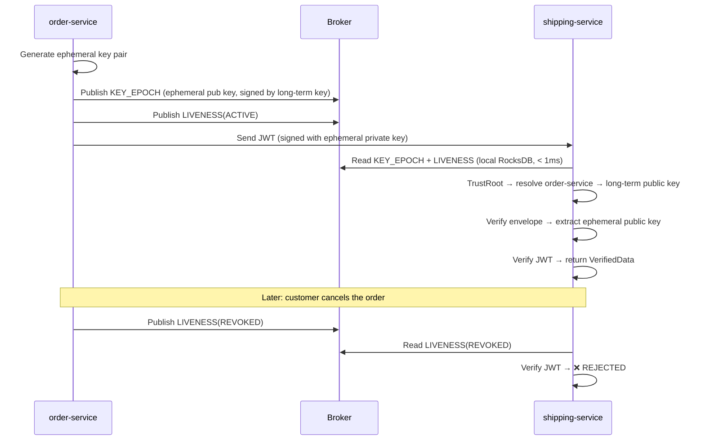

import Tabs from '@theme/Tabs';
import TabItem from '@theme/TabItem';

# Your First Sign-Verify-Revoke

In 15 minutes, you'll sign a token, verify it, and revoke it. All in a single Java file.

We'll use **ShopFlow** — our running e-commerce example — where `order-service` signs order tokens and `shipping-service` verifies them before dispatching packages.

## Prerequisites

- **Java 21+**
- **Maven** or **Gradle**
- **Apache Kafka** running locally (or any SQL database — we'll show the alternative)

---

## Step 1: Add Dependencies

You need two modules: `veridot-core` for the protocol engine, and a broker implementation.

<Tabs>
  <TabItem value="kafka" label="Kafka Broker" default>

```xml
<dependency>
    <groupId>io.github.cyfko</groupId>
    <artifactId>veridot-core</artifactId>
    <version>4.0.1</version>
</dependency>
<dependency>
    <groupId>io.github.cyfko</groupId>
    <artifactId>veridot-kafka</artifactId>
    <version>4.0.1</version>
</dependency>
```

  </TabItem>
  <TabItem value="sql" label="SQL Broker">

```xml
<dependency>
    <groupId>io.github.cyfko</groupId>
    <artifactId>veridot-core</artifactId>
    <version>4.0.1</version>
</dependency>
<dependency>
    <groupId>io.github.cyfko</groupId>
    <artifactId>veridot-databases</artifactId>
    <version>4.0.1</version>
</dependency>
```

  </TabItem>
</Tabs>

---

## Step 2: Generate a Long-Term Key Pair

Every signer needs a **long-term key pair**. The private key signs protocol envelopes; the public key lets verifiers confirm the signer's identity.

```java
import java.security.KeyPair;
import java.security.KeyPairGenerator;

// For quickstart only — in production, use the TAD for key distribution
KeyPairGenerator kpg = KeyPairGenerator.getInstance("Ed25519");
KeyPair longTermKeyPair = kpg.generateKeyPair();
```

:::note[Why Ed25519?]
Ed25519 is Veridot's recommended algorithm: constant-time, no nonce reuse risk, and compact 32-byte keys. The protocol also supports ECDSA P-256/P-384 and RSA 2048/4096.
:::

---

## Step 3: Set Up the TrustRoot

The `TrustRoot` is how a verifier answers: *"Given issuer ID `order-service`, what is its long-term public key?"*

For this single-JVM example, we use a lambda that captures the key pair directly:

```java
import io.github.cyfko.veridot.core.PublicKeyTrustRoot;
import io.github.cyfko.veridot.core.TrustIdentity;

String signerId = "order-service";

PublicKeyTrustRoot trustRoot = issuer -> {
    if (signerId.equals(issuer)) {
        return new TrustIdentity(longTermKeyPair.getPublic(), true);
    }
    throw new RuntimeException("Unknown issuer: " + issuer);
};
```

This works because signer and verifier share the same JVM — the lambda can see `longTermKeyPair`. We'll solve the distributed case in [Chapter 4](./going-distributed.md).

---

## Step 4: Configure the Broker

The broker is the distributed backbone that carries Protocol V4 entries (key epochs, liveness attestations) between services. Let's use Kafka with a local RocksDB store:

```java
import io.github.cyfko.veridot.kafka.KafkaBroker;
import java.util.Properties;

Properties kafkaProps = new Properties();
kafkaProps.setProperty("bootstrap.servers", "localhost:9092");
kafkaProps.setProperty("veridot.embedded.db", "/tmp/shopflow-veridot-db");

var broker = new KafkaBroker(kafkaProps);
```

:::tip[Using SQL instead?]
Replace `KafkaBroker` with the SQL broker from `veridot-databases`. The API is identical — only the transport layer changes. See [Choosing a Broker](../getting-started/choosing-a-broker.md) for guidance.
:::

---

## Step 5: Create the SignerVerifier

`GenericSignerVerifier` is the main entry point. It implements `DataSigner`, `TokenVerifier`, and `TokenRevoker`:

```java
import io.github.cyfko.veridot.core.Algorithm;
import io.github.cyfko.veridot.core.impl.GenericSignerVerifier;

var shopflow = new GenericSignerVerifier(
    broker,
    trustRoot,
    "order-service",                    // signer ID
    longTermKeyPair.getPrivate(),       // long-term private key
    Algorithm.ED25519                   // envelope signature algorithm
);
```

That's it — five arguments, and `shopflow` can sign, verify, and revoke.

---

## Step 6: Sign a Token

Let's sign an order payload. In ShopFlow, `order-service` creates a token that `shipping-service` will verify before dispatching:

```java
import io.github.cyfko.veridot.core.impl.BasicConfigurer;

// The payload — what shipping-service needs to know
record OrderPayload(String orderId, String destination, int itemCount) {}

String token = shopflow.sign(
    new OrderPayload("ORD-7842", "123 Main St, Springfield", 3),
    BasicConfigurer.builder()
        .groupId("order-7842")          // links this token to order 7842
        .sequenceId("session-A")        // names this signing session
        .validity(3600)                 // valid for 1 hour
        .build()
);

System.out.println("Token issued: " + token.substring(0, 50) + "...");
```

### What happened under the hood?

When `sign()` was called, Veridot:

1. **Generated an ephemeral Ed25519 key pair** — a fresh, short-lived key just for this signing session
2. **Signed the JWT** with the ephemeral private key (not the long-term key!)
3. **Published a `KEY_EPOCH` entry** to the broker — containing the ephemeral public key DER, signed by the long-term key
4. **Published a `LIVENESS(ACTIVE)` attestation** to the broker — proving this session is alive

The long-term key never touches the JWT. It only signs the envelope that vouches for the ephemeral key.

---

## Step 7: Verify the Token

Now let's verify it. In this single-JVM example, we use the same `shopflow` instance — but any service connected to the same broker with the right `TrustRoot` can verify:

```java
import io.github.cyfko.veridot.core.VerifiedData;

VerifiedData<OrderPayload> result = shopflow.verify(
    token,
    BasicConfigurer.deserializer(OrderPayload.class)
);

System.out.println("✅ Order:       " + result.data().orderId());      // "ORD-7842"
System.out.println("   Destination: " + result.data().destination());   // "123 Main St, Springfield"
System.out.println("   Items:       " + result.data().itemCount());     // 3
System.out.println("   Group:       " + result.groupId());             // "order-7842"
System.out.println("   Session:     " + result.sequenceId());          // "session-A"
```

The `verify()` call runs Veridot's full verification pipeline:

1. Parse the JWT and extract the protocol envelope
2. Read the `KEY_EPOCH` entry from local RocksDB — **no network call**
3. Resolve the issuer (`order-service`) via the `TrustRoot` → get the long-term public key
4. Verify the envelope signature (was the `KEY_EPOCH` really signed by `order-service`'s long-term key?)
5. Check capabilities, watermark, and temporal constraints
6. Check `LIVENESS` — is this session still active?
7. Extract the ephemeral public key from the verified envelope
8. Verify the JWT signature using the ephemeral public key
9. Deserialize the payload and return `VerifiedData<OrderPayload>`

All of this happens **locally**, with sub-millisecond latency.

---

## Step 8: Revoke the Token

Suppose a customer cancels order 7842. We need to revoke the token immediately:

```java
// Revoke a specific session
shopflow.revoke("order-7842", "session-A");
System.out.println("✅ Session revoked");
```

Under the hood, `revoke()` publishes a `LIVENESS(REVOKED)` entry to the broker. Every verifier connected to the same broker sees it immediately.

Now, if `shipping-service` tries to verify the same token:

```java
try {
    shopflow.verify(token, BasicConfigurer.deserializer(OrderPayload.class));
    System.out.println("❌ Should not reach here");
} catch (Exception e) {
    System.out.println("✅ Verification rejected: " + e.getMessage());
}
```

The verification fails at step 6 — the liveness check detects `REVOKED` status and rejects the token.

:::info[Revoking all sessions]
Pass `null` as the sequence ID to revoke **all** sessions for a group — useful when a security breach requires invalidating every active token for an order:

```java
shopflow.revoke("order-7842", null);  // revokes ALL sessions for order 7842
```
:::

---

## What Just Happened?

Let's recap the full lifecycle:



The key insight: **verification never calls back to the signer**. It reads from local storage, and the protocol guarantees consistency.

---

## Complete Example

Here's everything in a single runnable file:

```java
import io.github.cyfko.veridot.core.*;
import io.github.cyfko.veridot.core.impl.*;
import io.github.cyfko.veridot.kafka.KafkaBroker;

import java.security.KeyPair;
import java.security.KeyPairGenerator;
import java.util.Properties;

public class ShopFlowQuickstart {

    record OrderPayload(String orderId, String destination, int itemCount) {}

    public static void main(String[] args) throws Exception {

        // 1. Configure broker
        Properties kafkaProps = new Properties();
        kafkaProps.setProperty("bootstrap.servers", "localhost:9092");
        kafkaProps.setProperty("veridot.embedded.db", "/tmp/shopflow-veridot-db");

        try (var broker = new KafkaBroker(kafkaProps)) {

            // 2. Generate long-term key pair (single-JVM only!)
            KeyPairGenerator kpg = KeyPairGenerator.getInstance("Ed25519");
            KeyPair longTermKeyPair = kpg.generateKeyPair();

            // 3. Set up TrustRoot
            PublicKeyTrustRoot trustRoot = issuer -> {
                if ("order-service".equals(issuer)) {
                    return new TrustIdentity(longTermKeyPair.getPublic(), true);
                }
                throw new RuntimeException("Unknown issuer: " + issuer);
            };

            // 4. Create GenericSignerVerifier
            try (var shopflow = new GenericSignerVerifier(
                    broker, trustRoot, "order-service",
                    longTermKeyPair.getPrivate(), Algorithm.ED25519)) {

                // 5. Sign
                String token = shopflow.sign(
                    new OrderPayload("ORD-7842", "123 Main St, Springfield", 3),
                    BasicConfigurer.builder()
                        .groupId("order-7842")
                        .sequenceId("session-A")
                        .validity(3600)
                        .build());

                System.out.println("✅ Token issued: " + token.substring(0, 50) + "...");

                // 6. Verify
                VerifiedData<OrderPayload> result = shopflow.verify(
                    token, BasicConfigurer.deserializer(OrderPayload.class));
                System.out.println("✅ Verified: " + result.data().orderId());
                System.out.println("   Group:   " + result.groupId());
                System.out.println("   Session: " + result.sequenceId());

                // 7. Revoke
                shopflow.revoke("order-7842", "session-A");
                System.out.println("✅ Session revoked");

                // 8. Verify again — should fail
                try {
                    shopflow.verify(token, BasicConfigurer.deserializer(OrderPayload.class));
                    System.out.println("❌ Should not reach here");
                } catch (Exception e) {
                    System.out.println("✅ Post-revocation rejected: " + e.getMessage());
                }
            }
        }
    }
}
```

---

:::tip[What's next?]
Your example works perfectly — but signer and verifier share the same JVM and the same `longTermKeyPair` variable. In production, `shipping-service` runs on a different server. How does it obtain `order-service`'s public key?

That's exactly what the **Trust Authority Directory (TAD)** solves.

**[Chapter 4: Going Distributed →](./going-distributed.md)**
:::
