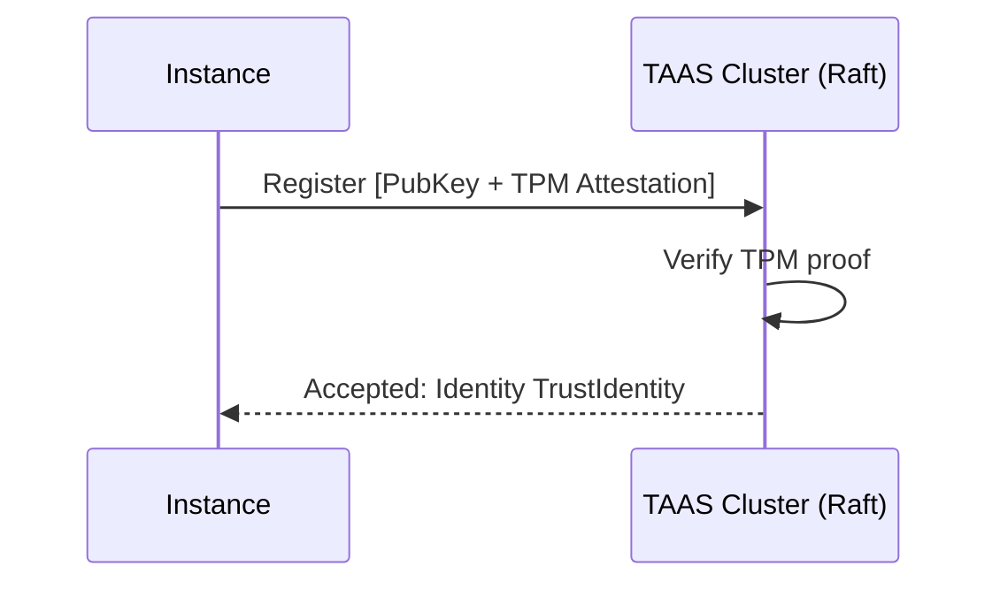

# Going Distributed — The TAAS

In Protocol V5, the core of identity management is the **Trust Authority & Attestation Service (TAAS)**. 

If Veridot uses ephemeral, single-use keys for every instance, how does a verifier know *which* ephemeral keys belong to legitimate services?

## Attestation-First Trust

A private key simply proves *who* signed a message. It doesn't prove that the signer is *trustworthy*. 
In Veridot V5, any instance can generate a key, but it cannot participate in the network until it registers with the TAAS.

To register, the instance must provide an **attestation proof**. This is a cryptographic statement binding the public key to the secure runtime environment—for example:
- A TPM quote from hardware
- A Kubernetes Service Account (KSA) signed by the cluster OIDC provider
- An AWS Nitro Enclave attestation document

## Identity as `TrustIdentity`

When the TAAS verifies the attestation, it records the public key and assigns the instance a globally unique identifier returned as a `TrustIdentity`.
- `key`: The public key of the instance validated from the proof.
- `algorithm`: The signature algorithm (e.g., Ed25519).
- `isRoot`: A flag indicating if this identity is a Trust Anchor (which bypasses CAPABILITY checks).

By removing the legacy "Key Epoch" concept from older versions, V5 vastly simplifies trust resolution. Every key is ephemeral, bound strictly to its instance lifecycle, and cryptographically anchored by the TAAS.
