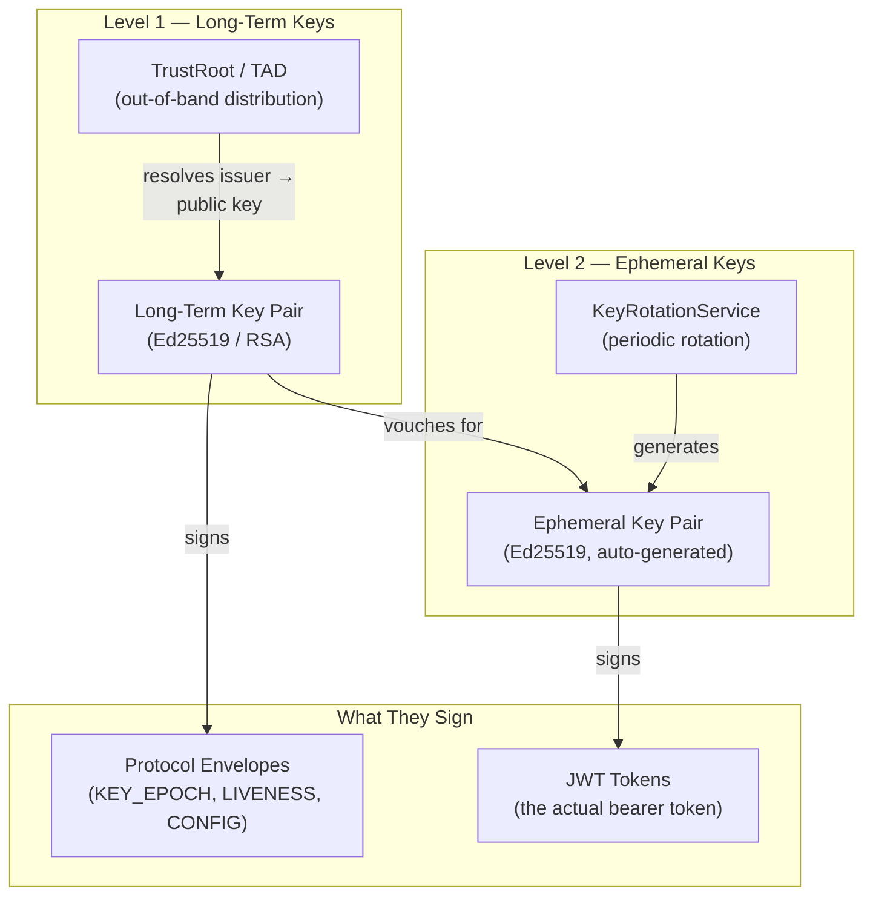
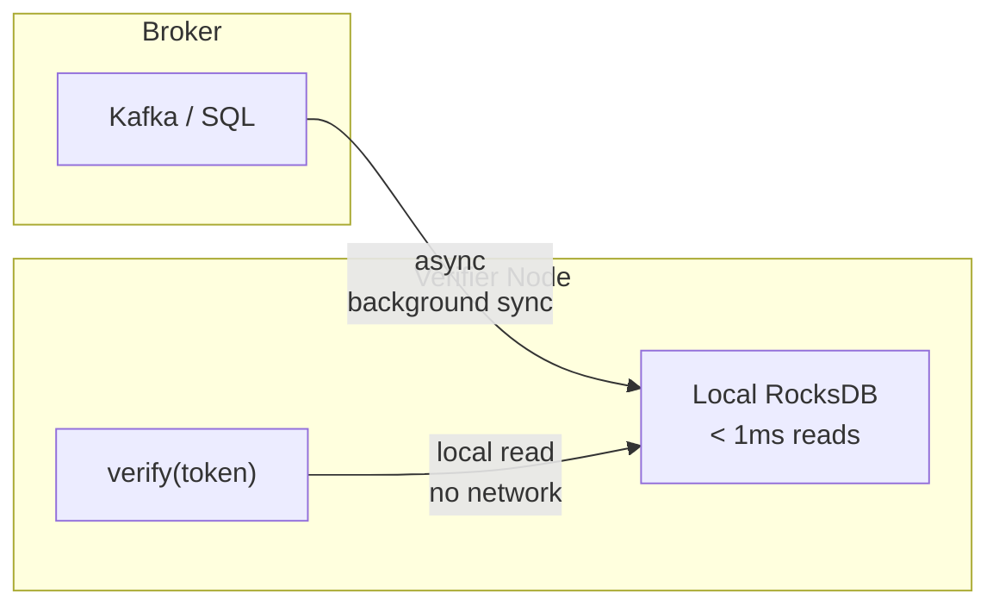
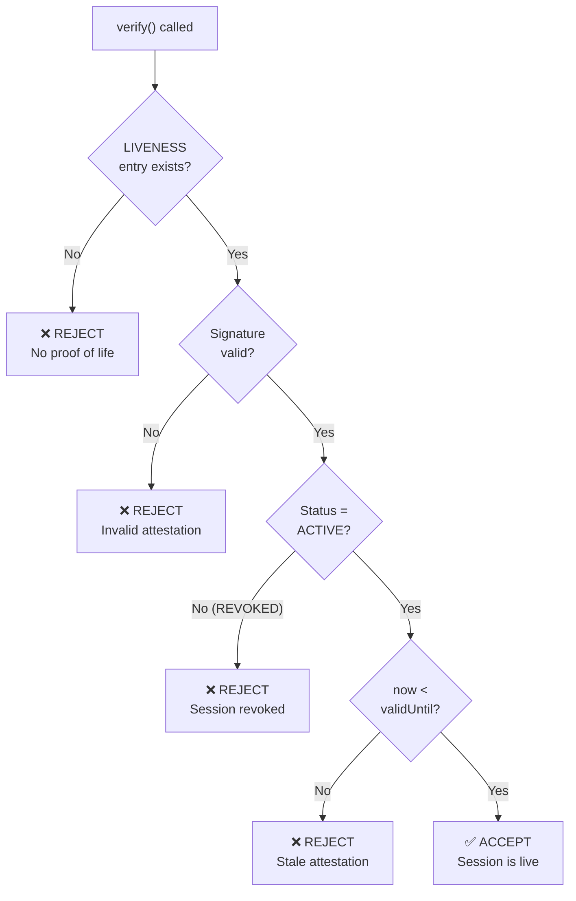
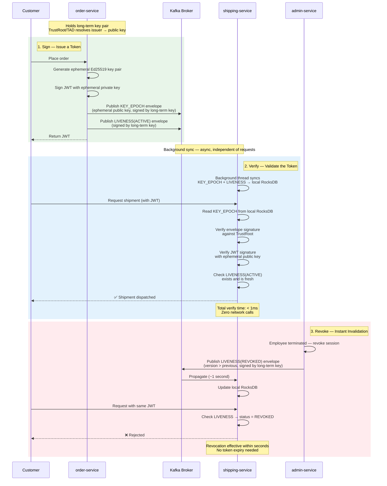
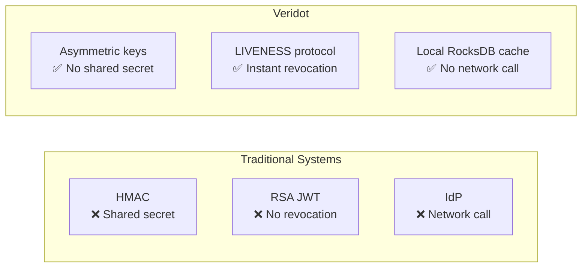
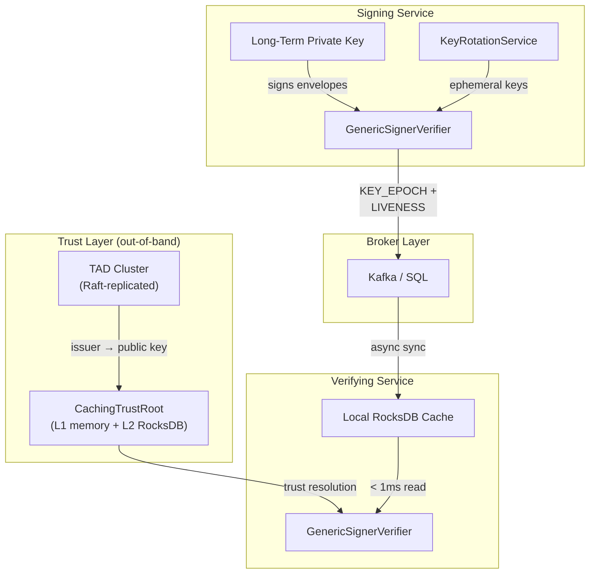

# How Veridot Works

In [Chapter 1](./the-problem.md), we saw the authentication trilemma: every traditional approach sacrifices either security (shared secrets), availability (centralized IdP), or real-time control (no revocation).

The key insight that breaks the trilemma: **separate key distribution from token verification.**

Veridot doesn't invent new cryptography. It restructures *how* cryptographic material flows through your system — so that verifiers always have what they need locally, and revocation signals arrive asynchronously without requiring a network call on the hot path.

---

## The Dual-Key Architecture

Veridot uses a 2-level key hierarchy. Each level serves a distinct purpose, and the two never cross paths:

### Level 1: Long-Term Keys

The **long-term key** is the signer's root identity. It's a key pair — typically Ed25519 — that is created once and held securely by the signing service.

It does two things:

1. **Signs protocol envelopes** — every `KEY_EPOCH`, `LIVENESS`, `CAPABILITY`, and `CONFIG` entry published to the broker is wrapped in a Protocol V4 binary envelope and signed with the long-term private key.
2. **Establishes trust via the TrustRoot** — verifiers resolve an `issuer` identifier to the corresponding long-term public key. This resolution happens **out-of-band**, completely independent of the broker.

In production, long-term public keys are distributed via the **TAD** (Trust Authority Directory) — a Raft-replicated cluster that Veridot provides. The TAD is the root of trust: if a public key isn't in the TAD, no envelope signed by its private counterpart will be accepted.

:::info[The long-term private key never touches the broker]
The long-term private key never appears in a JWT. It never travels through Kafka or SQL. It exists only in the signing service's secure environment. The broker only ever sees *envelopes signed by* the long-term key — never the key itself.
:::

### Level 2: Ephemeral Keys

For each signing session, Veridot's `KeyRotationService` generates a **fresh ephemeral Ed25519 key pair**. This key pair:

1. **Signs the JWT** — the actual bearer token that your application receives and passes between services
2. **Lives briefly** — ephemeral keys are rotated automatically and are scoped to a validity window
3. **Is vouched for by the long-term key** — the ephemeral public key is distributed inside a `KEY_EPOCH` entry, which is itself signed by the long-term key

The chain of trust is clear:

> *"I trust this JWT because the ephemeral key that signed it was vouched for by a long-term key that my TrustRoot recognizes."*

If an ephemeral key is compromised, only the sessions signed by *that specific key* during *that specific window* are affected. Other sessions, other keys, other time windows — all unaffected. This is **forward secrecy** by construction.

---

## The Broker as Metadata Transport

Here's a critical distinction: **the broker is not a message queue for your business data.** It's a transport layer for cryptographic metadata.

The broker carries Protocol V4 envelopes — binary-encoded, signed structures that contain:

| Entry Type | What it carries |
|---|---|
| `KEY_EPOCH` | An ephemeral public key + algorithm + validity window |
| `LIVENESS` | A signed attestation of session status (`ACTIVE` or `REVOKED`) |
| `CAPABILITY` | Authorization grants over scopes |
| `CONFIG` | Session capacity configuration |
| `FENCE` | Ordering tokens for capacity mutations |

The broker can be **Kafka** (recommended for high-throughput systems) or a **SQL database** (simpler to operate, uses JDBC polling). Either way, the broker never interprets the envelopes — it stores and relays bytes.

:::warning[The broker is untrusted]
An attacker with full write access to the broker **cannot** forge a valid entry. Every envelope is signed by the long-term key, and every verifier validates that signature against the TrustRoot before accepting anything. The broker is transport, not authority.
:::

---

## The Local Cache

This is where the "no network call" property comes from.

Every verifier node maintains a **local RocksDB cache** of the envelopes it has consumed from the broker. When a `verify()` call arrives, the verifier reads the `KEY_EPOCH` and `LIVENESS` entries **from local disk** — no network round-trip, no call to an auth server, no dependency on any remote service.

The key properties:

- **Sub-millisecond reads** — RocksDB is an embedded key-value store. Reads are local I/O, typically under 1ms.
- **Async population** — a background thread continuously consumes from the broker and writes to the local cache. This happens independently of any verification request.
- **No hot-path network dependency** — the verification path (`token → local cache → result`) never touches the network. The broker sync path runs in the background, on its own schedule.

:::tip[What happens if the broker goes down?]
Verification continues using the local cache. As long as the cached `LIVENESS(ACTIVE)` attestations are still fresh (within their validity window), tokens continue to verify successfully. The system degrades gracefully — and when the broker recovers, the background sync catches up automatically.
:::

---

## Positive Liveness Proof

This is the mechanism that makes instant revocation possible without a network call.

Traditional systems ask the question: *"Has this session been revoked?"* They check a revocation list. If the session isn't on the list, it's assumed active.

Veridot inverts this. It asks: *"Is there a fresh, signed proof that this session is still active?"*

The difference is profound:

| Model | What absence means |
|---|---|
| **Revocation list** (traditional) | Absence = active ✅ (dangerous assumption) |
| **Positive liveness proof** (Veridot) | Absence = rejected ❌ (safe default) |

A session is valid **if and only if**:

1. A `LIVENESS` entry exists for the session with the highest observed version
2. That entry passes structural and cryptographic validation (signed by the long-term key, verified against TrustRoot)
3. The status is `ACTIVE`
4. The attestation is still fresh (`now < validUntil`)

**Any failure at any step — including "no entry found" — produces rejection.** There is no distinction between "revoked," "expired," and "missing." Silence is rejection.

The signing service maintains liveness by publishing fresh `LIVENESS(ACTIVE)` attestations on a periodic renewal loop. If the signer crashes, the attestations stop — and verifiers automatically start rejecting after the freshness window expires.

---

## The ShopFlow Flow

Let's put it all together with our ShopFlow example. Here's the complete lifecycle — from order creation to verification to revocation:

Let's trace each phase:

### Phase 1: Sign

When `order-service` calls `sign()`:

1. The `KeyRotationService` generates (or reuses within its rotation window) a fresh **ephemeral Ed25519 key pair**
2. The JWT payload is signed with the **ephemeral private key**
3. A `KEY_EPOCH` envelope containing the **ephemeral public key** is signed with the **long-term key** and published to Kafka
4. A `LIVENESS(ACTIVE)` envelope is signed with the **long-term key** and published to Kafka
5. A background renewal loop begins, periodically republishing fresh `LIVENESS(ACTIVE)` attestations

The customer receives a JWT. Kafka receives two signed envelopes.

### Phase 2: Verify

When `shipping-service` receives the JWT and calls `verify()`:

1. The token's subject contains the `EntryId` — a pointer to the session's envelopes
2. The `KEY_EPOCH` is read from **local RocksDB** (no network call)
3. The envelope signature is verified against the **TrustRoot** (the long-term public key, resolved from the TAD)
4. The JWT signature is verified using the **ephemeral public key** from the `KEY_EPOCH`
5. The `LIVENESS` entry is checked: status must be `ACTIVE`, and the attestation must be fresh

All of this happens in under 1 millisecond. No network call. No auth server. No shared secret.

### Phase 3: Revoke

When `admin-service` needs to revoke a session:

1. A `LIVENESS(REVOKED)` envelope is created with a `version` strictly greater than the previous `ACTIVE` attestation
2. The envelope is signed with the **long-term key** and published to Kafka
3. Within seconds, verifiers consume the envelope and update their local RocksDB
4. The next `verify()` call for that session sees `REVOKED` → **immediate rejection**

The monotonic version invariant guarantees that once a verifier accepts a `REVOKED` entry, it can **never** regress to `ACTIVE` — even if the broker is compromised and an attacker replays an older `ACTIVE` entry.

---

## Why This Solves the Trilemma

Let's revisit the three properties:

| Property | How Veridot achieves it |
|---|---|
| **No shared secret** | Asymmetric cryptography throughout. The signing service holds the private keys. Verifiers only have public keys — obtained from the TrustRoot/TAD, not from the broker. A compromised verifier cannot forge tokens. |
| **No network call on verify** | The local RocksDB cache contains all the cryptographic material needed. Verification is a local disk read. The broker sync runs in the background, independently. |
| **Instant revocation** | `LIVENESS(REVOKED)` propagates through the broker and lands in the local cache within seconds. No token TTL to wait out. No revocation list to poll. |

The trick isn't inventing new cryptography. It's **restructuring the information flow**: trust is established out-of-band (TrustRoot/TAD), tokens are signed with ephemeral keys (forward secrecy), metadata propagates asynchronously (broker), and verification happens locally (RocksDB). Each concern flows through an independent path.

:::info[The separation principle]

**Key distribution** (TrustRoot/TAD → long-term public key → verifier) is completely independent of **token verification** (local RocksDB → KEY_EPOCH + LIVENESS → accept/reject).

The broker connects them asynchronously, but neither depends on the other synchronously. This is why the trilemma dissolves.
:::

---

## Putting It All Together

Here's the full architecture with all components and their relationships:

Two independent paths:

1. **Trust path** (vertical, out-of-band): TAD → CachingTrustRoot → Verifier. Establishes *who* is trusted.
2. **Data path** (horizontal, async): Signer → Broker → Local Cache → Verifier. Distributes *what* was signed and whether it's still active.

Neither path depends on the other being available in real-time. That's the architectural separation that makes it all work.

---

## What's Next

:::tip[Build it yourself]

You understand the architecture. You understand the dual-key hierarchy, the broker as metadata transport, the local cache, and the positive liveness protocol.

Now let's build it. In the next chapter, you'll sign your first token, verify it, and revoke it — all in 15 minutes.

**[Chapter 3: Your First Integration →](./first-integration.md)**

:::
