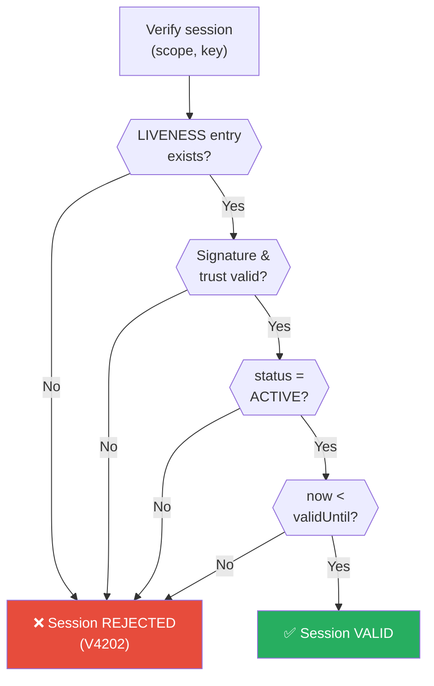
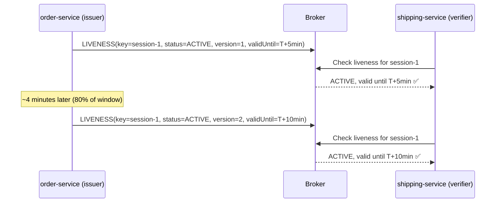
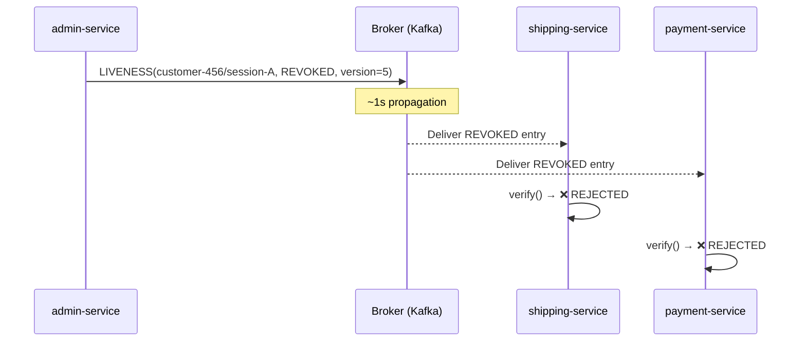
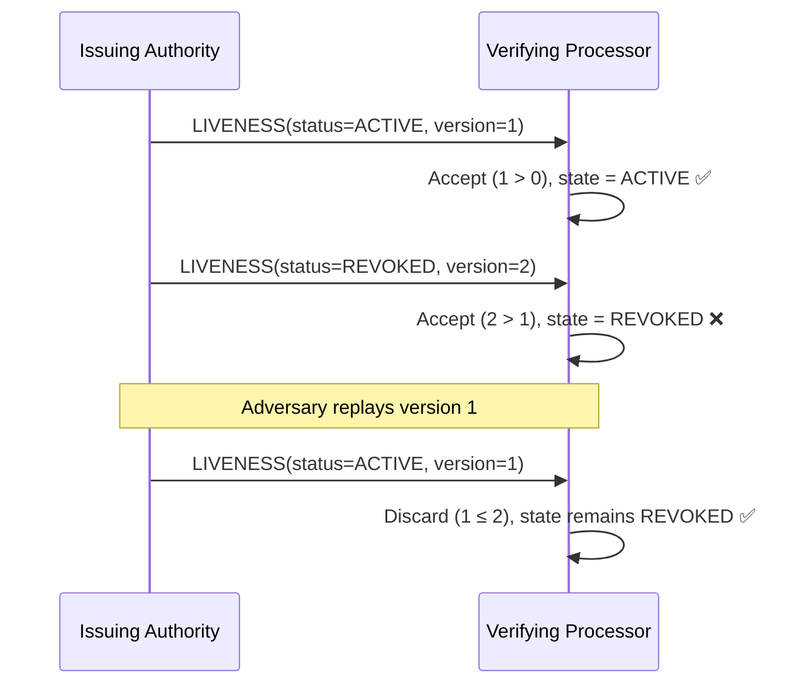
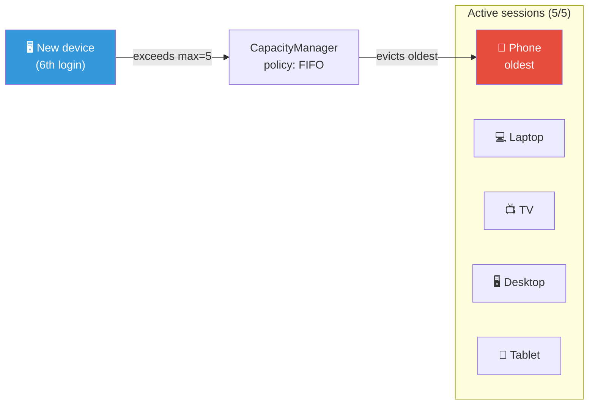
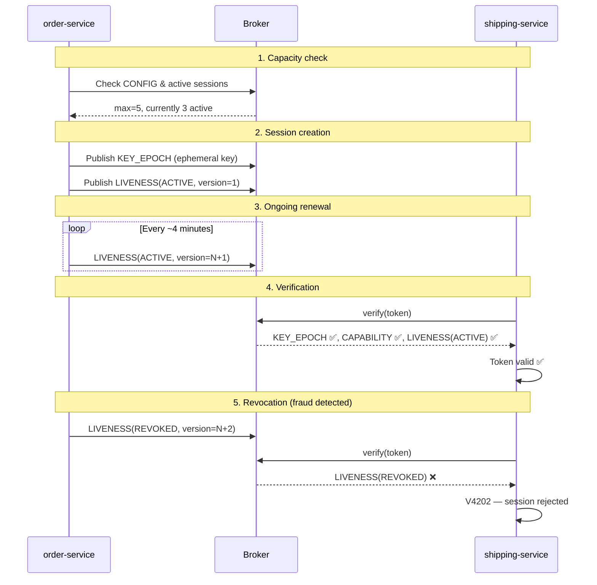

# Chapter 6: Living Sessions — Liveness, Revocation & Quotas

In traditional JWT systems, revoking a token means waiting for it to expire. Blocklists help, but they're centralized, eventually consistent, and easy to get wrong. With Veridot, revocation is **instant and cryptographic** — and sessions must *prove* they're alive, not just assume it.

## Positive Liveness: Guilty Until Proven Innocent

Most systems treat sessions as valid until someone explicitly revokes them. Veridot flips this: a session is **invalid by default** and must be *positively attested* as active.

### Default-Deny in Action

A `LIVENESS` entry is a signed attestation of a session's status. For a session to be considered valid, **all four conditions** must hold:

| # | Condition | What it means |
|:---:|---|---|
| 1 | Entry exists | A `LIVENESS` entry exists for this session with the highest observed version |
| 2 | Trust validation passes | The entry's signature is valid and the issuer is authorized |
| 3 | Status is `ACTIVE` | The `status` field is `ACTIVE` (not `REVOKED`) |
| 4 | Not expired | `now < validUntil` |

If **any** condition fails — including the entry simply not existing — the session is rejected. No attestation, no entry, broker down? **Rejected.**



:::danger All failures are equal
A missing attestation, an expired attestation, and a failed signature all produce the **same outcome**: rejection. The system fails closed — there's no "maybe valid" state.
:::

### Renewal: Keeping Sessions Alive

Because validity requires `now < validUntil`, the issuing authority must **periodically publish fresh `ACTIVE` attestations** for every session it considers valid. Each renewal carries a strictly increasing `version`:



The recommended renewal point is at **80% of the attestation window** — leaving a 20% tail to accommodate propagation latency and transient broker unavailability.

### Scenario: Employee Leaves the Company

In ShopFlow, when an employee leaves, their session doesn't need to be explicitly revoked. It simply **expires naturally**:

1. The employee's last `ACTIVE` attestation was published at 2:00 PM with `validUntil: 2:05 PM`
2. HR disables the account at 2:03 PM — the issuing authority stops publishing renewals
3. At 2:05 PM, the attestation expires
4. Any subsequent `verify()` call returns `V4202` (LIVENESS_NOT_ESTABLISHED) — the session is dead

No revocation command needed. No blocklist. The session dies by starvation.

## Explicit Revocation: Killing Sessions Instantly

Sometimes you can't wait for natural expiry. Fraud detected? Employee caught exfiltrating data? You need sessions dead **now**.

### Revoking a Single Session

```java
// Revoke a specific session
revoker.revoke("customer-456", "session-A");
```

This publishes a `LIVENESS(REVOKED)` entry for `session-A` within `group:customer-456`. The next time any verifier checks this session, it sees `status=REVOKED` and rejects.

### Revoking All Sessions for a User

```java
// Security breach: kill everything
revoker.revoke("customer-456", null);
```

Passing `null` as the `sequenceId` revokes **all** active sessions for that group. Every session under `group:customer-456` gets a `LIVENESS(REVOKED)` entry.

### Propagation Speed

Revocation propagates through the broker. With Kafka as the broker, verifiers observe the `LIVENESS(REVOKED)` entry within approximately **1 second** — compared to traditional JWT expiry windows of 5–15 minutes.



### Monotonicity: No Take-Backs

Once a session is `REVOKED`, it can **never** go back to `ACTIVE`. This is enforced by the monotonic version rule:

- Each `LIVENESS` entry carries a `version` number
- A processor only accepts entries with a `version` **strictly greater** than the highest version it has already seen
- Once `REVOKED` is accepted at version `N`, any replayed `ACTIVE` entry with `version ≤ N` is silently discarded



:::warning Revocation is permanent
By protocol design, there is no "un-revoke" operation. If you need to restore access after revocation, you must create a **new session** — which gets a new session key, new key epoch, and a fresh `ACTIVE` attestation.
:::

### Scenario: Fraud Detected

A ShopFlow customer's account is flagged for fraud at 3:42 PM:

1. `admin-service` calls `revoker.revoke("customer-456", null)` — revokes all sessions
2. Broker propagates `LIVENESS(REVOKED)` entries to all verifiers within ~1 second
3. At 3:42:01 PM, every `verify()` call for `customer-456` returns `V4202`
4. The customer's in-flight order confirmation? **Rejected.** Their payment authorization? **Rejected.** Their shipping label request? **Rejected.**
5. An attacker replaying an old `ACTIVE` attestation? **Discarded** — version is too low

## Session Quotas: Limiting Concurrency

What if a user opens 100 browser tabs? Or shares their credentials with 50 people? Veridot lets you enforce **session capacity limits** with configurable eviction policies.

### CONFIG Entries

A `CONFIG` entry sets capacity rules for a scope:

```
CONFIG {
  max:  5        // Maximum 5 concurrent sessions
  pol:  FIFO     // When full, evict the oldest session
  dttl: 300000   // Default TTL: 5 minutes
}
```

### Eviction Policies

When a new session would exceed the `max` limit, the eviction policy determines what happens:

| Policy | Code | Behavior | Best for |
|---|:---:|---|---|
| **FIFO** | `0x01` | Evict the **oldest** session | General-purpose, fair rotation |
| **LIFO** | `0x02` | Evict the **newest** session | Prevent rapid session creation attacks |
| **LRU** | `0x03` | Evict the **least recently used** session | Keep active users, drop idle ones |
| **REJECT** | `0x04` | **Refuse** the new session entirely | Hard limits, no exceptions |

### Scenario: Netflix-Style Device Limit

ShopFlow Premium allows customers to be logged in on **5 devices** simultaneously. Here's what happens when they try a 6th:

```
CONFIG(group:customer-789) {
  max: 5, pol: FIFO
}
```



1. Customer logs in on a 6th device
2. `SessionCounter` counts 5 active sessions — at capacity
3. `CapacityManager` applies the FIFO policy → selects the Phone session (oldest)
4. Publishes `LIVENESS(REVOKED)` for the Phone session
5. Creates the new session for the 6th device
6. The Phone's next API call → `V4202` (session revoked)

### FENCE Tokens: Safe Concurrent Mutations

What if two processor instances try to evict sessions at the same time? Without coordination, they could both read "5 active sessions," both evict one, and end up with only 3.

Veridot solves this with **FENCE tokens** — monotonic counters that provide distributed ordering without synchronous locks:

```
FENCE {
  fenceCounter: 42          // Strictly increasing
  grantedTo:    "proc-A"    // Only this processor can mutate
  validUntil:   <timestamp> // Grant expires
}
```

Before any capacity-affecting mutation, the processor must:
1. **Acquire** a fence grant (publish a FENCE entry with the next counter value)
2. **Verify** the fence is still valid after reading the current state
3. **Perform** the mutation (eviction + new session)
4. If another processor acquired a higher fence counter in the meantime → `V4301` (FENCE_TOKEN_STALE) → retry

This ensures exactly-once eviction semantics even in distributed deployments.

## Hierarchical Configuration

CONFIG entries follow a **precedence hierarchy**: the most specific scope wins.

```
global          →  max=10, pol=FIFO       (default for everyone)
site:us-east    →  max=20                 (US-East gets more capacity)
group:premium   →  max=100, pol=LRU       (premium tenants get 100 sessions)
```

| Scope level | Precedence | Use case |
|---|:---:|---|
| `group:<groupId>` | **Highest** | Per-user or per-tenant overrides |
| `site:<siteId>` | Medium | Regional defaults |
| `global` | Lowest | System-wide baseline |

### Scenario: Premium Tenant Override

ShopFlow's global default is `max=10` sessions. But enterprise customer "MegaCorp" needs 100 concurrent sessions for their operations team:

1. **Global CONFIG**: `max=10, pol=FIFO` — applies to all groups by default
2. **Group CONFIG** for `group:megacorp`: `max=100, pol=LRU` — overrides for MegaCorp
3. When MegaCorp's 11th session is created, the group config takes precedence: `max=100` → allowed
4. When a regular customer's 11th session is created, the global config applies: `max=10` → FIFO eviction kicks in

:::tip Config is protocol-level
CONFIG entries are published via `EntryPublisher` and stored on the broker like any other protocol entry. They're signed, versioned, and subject to capability authorization — `admin-service` needs a valid CAPABILITY to publish CONFIG entries for the target scope.
:::

## How It All Fits Together

Here's the complete lifecycle of a session in ShopFlow, from creation to revocation:



## Summary

| Concept | How it works | ShopFlow example |
|---|---|---|
| **Default-deny** | No attestation = rejected | Missing liveness → `V4202` |
| **Renewal** | Periodic `ACTIVE` with increasing version | Every ~4 min, 80% window |
| **Natural expiry** | Stop renewing → session dies | Employee leaves → access blocked |
| **Explicit revocation** | Publish `LIVENESS(REVOKED)` | Fraud → all sessions killed in ~1s |
| **Monotonicity** | Version only goes up → can't un-revoke | Replay attack → silently discarded |
| **Session quotas** | CONFIG `max` + eviction policy | 5 devices max, FIFO eviction |
| **FENCE tokens** | Monotonic counter for safe mutations | Prevents double-eviction races |
| **Config hierarchy** | group > site > global | Premium tenant gets `max=100` |

---

:::info What's next?
You now know how to sign, verify, revoke, control permissions, and manage sessions. Let's deploy all of this to production with Spring Boot and Kafka.

**[Chapter 7: Going to Production →](./production)**
:::
