# The Authentication Trilemma

Imagine you have dozens of microservices. The **Orders** service authenticates a user. The **Shipping** service needs to securely verify that authentication. Meanwhile, the **Admin** service needs to instantly revoke it if malicious activity is detected.

You are likely relying on one of three classic patterns — and they all force a compromise.

## Three Approaches, Three Sacrifices

When designing inter-service authentication, we always want three things:
1. **No Shared Secrets:** A compromised downstream service shouldn't be able to forge tokens.
2. **Instant Revocation:** If a token is compromised, we can kill it immediately.
3. **No Network Call on Verify:** Verifying a token shouldn't require a synchronous HTTP call to an identity provider, which adds latency and a single point of failure.

| Approach | No shared secret? | Instant revocation? | No network call on verify? |
|---|:---:|:---:|:---:|
| **Shared HMAC** | ❌ | ✅ | ✅ |
| **Stateless RSA/ECDSA JWT** | ✅ | ❌ | ✅ |
| **Centralized IdP** | ✅ | ✅ | ❌ |

This isn't a flaw in your code; it is a structural constraint of traditional token architectures.

### The Visual Contrast

```mermaid
graph TD

    %% Premium Theme
    linkStyle default stroke:#888888,stroke-width:2px;
    classDef default fill:#424242,stroke:#616161,stroke-width:1px,color:#fff,rx:5px,ry:5px;
    classDef service fill:#4527a0,stroke:#5e35b1,stroke-width:1px,color:#fff,rx:5px,ry:5px;
    classDef broker fill:#004d40,stroke:#00695c,stroke-width:1px,color:#fff,rx:5px,ry:5px;
    classDef db fill:#bf360c,stroke:#d84315,stroke-width:1px,color:#fff,rx:5px,ry:5px;
    classDef taas fill:#01579b,stroke:#0277bd,stroke-width:1px,color:#fff,rx:5px,ry:5px;

    subgraph "Legacy Architecture (Slow & Centralized)"
        A1[Microservice A]:::service -->|1. Request| A2[Microservice B]:::service
        A2 -->|2. Synchronous Network Call| IdP[Central IdP / Auth Server]:::db
        IdP -->|3. Validation| A2
    end

    subgraph "Veridot V5 Architecture (Fast & Local)"
        V1[Microservice A]:::service --->|"1. Publish NATIVE Token / Event"| Broker[(Message Broker)]:::broker
        Broker --->|"2. Consume Event"| V2[Microservice B]:::service
        V2 <-->|"3. Sub-ms Local Verification"| LocalCache[(Local Veridot Cache)]:::broker
    end
```

## Enter Veridot V5

Veridot Protocol V5 solves this trilemma entirely. By leveraging an **attestation-first** registration system and **broker-untrusted** verification, Veridot gives you sub-millisecond local verification, instantaneous global revocation, and absolutely zero shared secrets. 

Let's see how it works in the next chapter.
