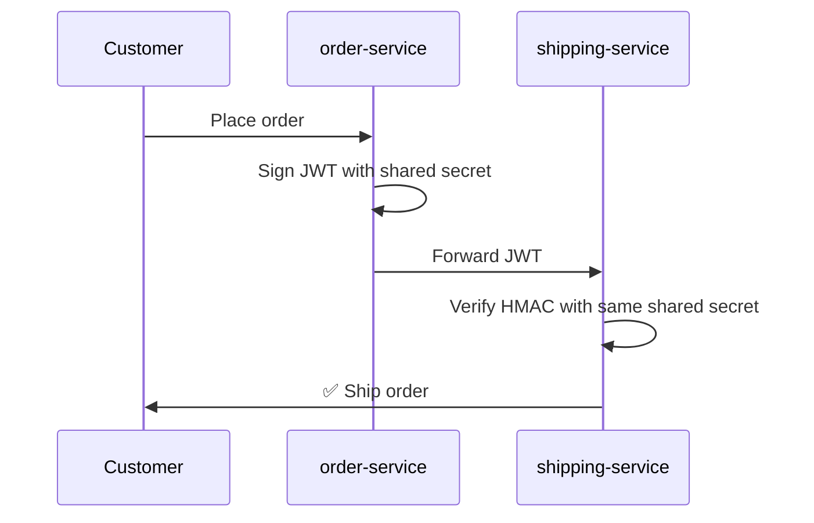
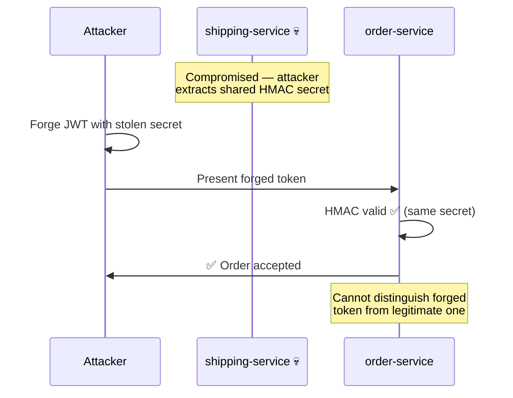
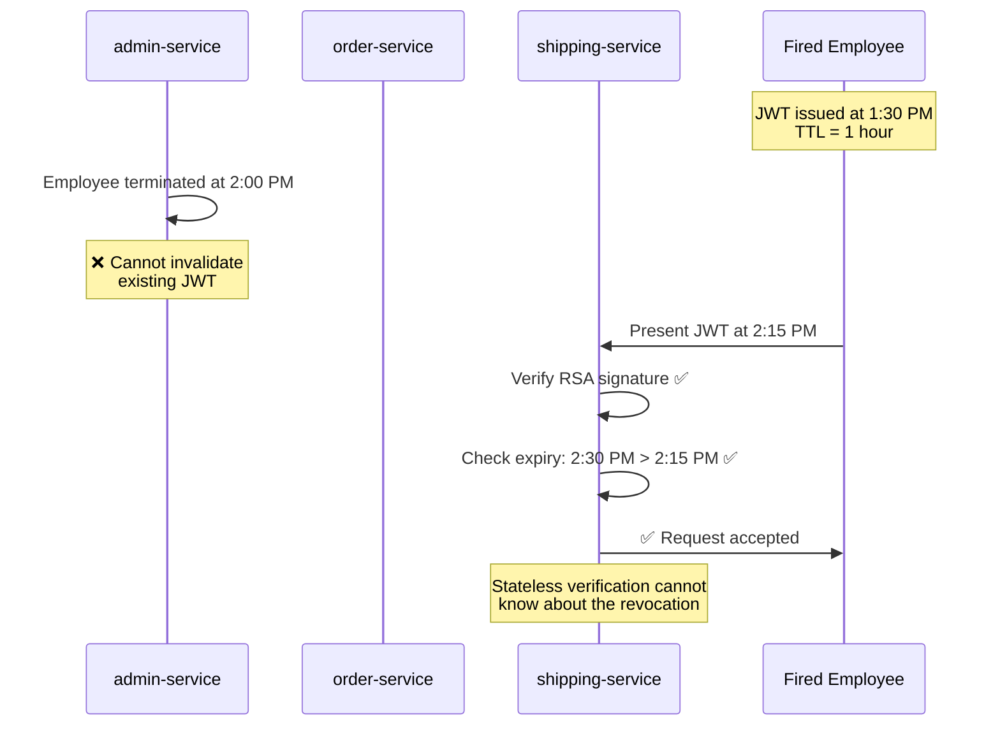
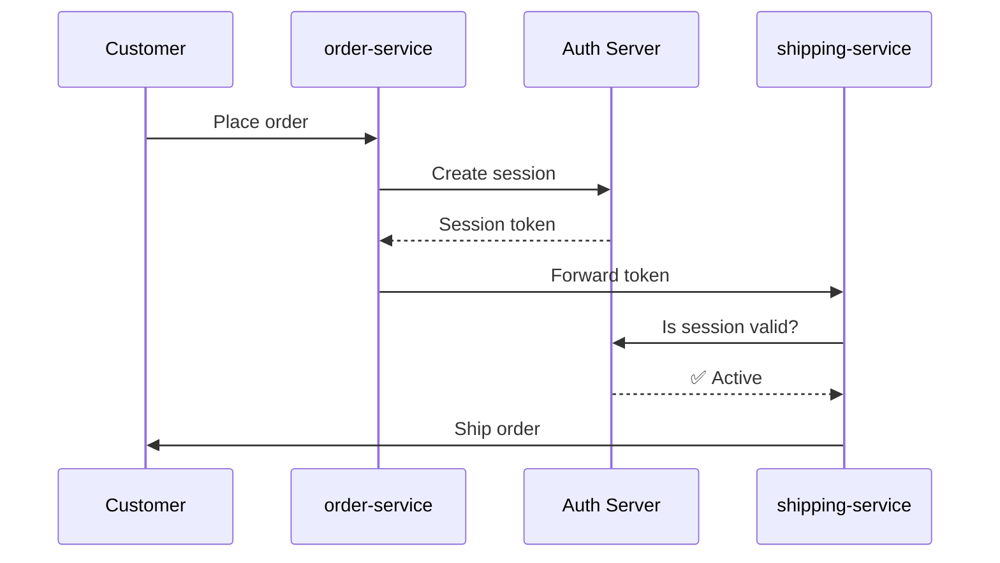
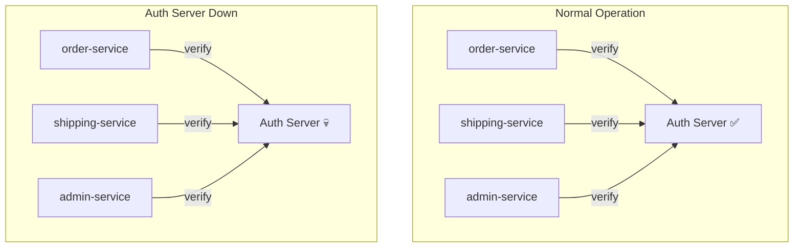

# The Authentication Trilemma

You have 50 microservices. The **Orders** service creates a JWT. The **Shipping** service needs to verify it. The **Admin** service needs to revoke it when something goes wrong.

You're probably using one of these three approaches — and every single one of them is broken.

## Three Approaches, Three Sacrifices

Every microservice authentication strategy forces you to choose two out of three desirable properties:

| Approach | No shared secret? | Instant revocation? | No network call on verify? |
|---|:---:|:---:|:---:|
| **Shared HMAC** | ❌ | ✅ | ✅ |
| **Stateless RSA/ECDSA JWT** | ✅ | ❌ | ✅ |
| **Centralized IdP** | ✅ | ✅ | ❌ |

This isn't a bug in any particular library. It's a structural constraint. Pick any row: one column is always ❌.

Let's make this concrete.

---

## Meet ShopFlow

ShopFlow is an e-commerce platform built on event-driven microservices. Three services are central to the authentication story:

- **`order-service`** — creates orders, signs tokens
- **`shipping-service`** — processes shipments, verifies tokens
- **`admin-service`** — manages permissions, revokes sessions

A customer places an order. Here's what happens:

1. **order-service** authenticates the customer and issues a signed token
2. **shipping-service** receives that token and must verify the customer's identity before dispatching
3. **admin-service** needs to revoke a session instantly — maybe a customer reported a stolen account, or an employee was terminated

Simple enough. Now let's see how each of the three traditional approaches handles this — and where it breaks.

---

## Approach 1: Shared HMAC

Every service shares the same symmetric secret. `order-service` signs a token with it. `shipping-service` verifies by recomputing the HMAC with the same key.

It's fast. Revocation is doable (you can rotate the shared key). But there's a fatal flaw.

:::danger[The shared secret is a single point of compromise]

Imagine `shipping-service` is compromised. An attacker gains read access to its environment variables or config files.

**The attacker now has the shared secret.** They can forge tokens as if they were `order-service`. They can create fake orders, impersonate any customer, and sign any payload they want.

Every service that shares the key is now compromised — even though only one was breached.
:::

**What was sacrificed:** No shared secret. Any service that can *verify* can also *forge*.

---

## Approach 2: Stateless RSA JWT

Now you switch to asymmetric cryptography. `order-service` holds a private key and signs JWTs with it. `shipping-service` only has the public key — it can verify but never forge.

This solves the shared secret problem. But a new one appears.

:::warning[You can't un-ring a bell]

A ShopFlow employee is fired at 2:00 PM. Their session JWT was issued at 1:30 PM with a 1-hour TTL. It's 2:15 PM.

**The JWT is still valid.** It will be valid until 2:30 PM.

The fired employee still has 15 minutes to access internal dashboards, export customer data, or place fraudulent orders.
:::

You could shorten the TTL to 30 seconds. But then every token expires almost immediately, forcing constant re-authentication — which defeats the purpose of being stateless.

You could maintain a revocation list. But then every verification requires checking that list — introducing the network call you were trying to avoid.

**What was sacrificed:** Instant revocation. Once a token is signed, it's valid until it expires.

---

## Approach 3: Centralized Identity Provider

Fine. You add a centralized auth server — an IdP. Every time `shipping-service` receives a token, it calls the IdP to check if the session is still active. Revocation is instant: the IdP marks the session as revoked, and the next check fails.

No shared secret. Instant revocation. But now your entire system depends on one service being available.

:::danger[The auth server is a single point of failure]

It's Black Friday. ShopFlow is processing 10,000 orders per minute. The IdP is under extreme load. At 11:47 AM, the auth server goes down for 3 minutes.

**Every service stops.** `shipping-service` can't verify tokens. `order-service` can't create sessions. 10,000 customers see errors. Revenue loss: $47,000 per minute.

The auth server isn't just another microservice — it's a **centralized chokepoint** that every request must pass through.
:::

Even with replicas and load balancers, the network round-trip adds latency to *every single verification*. At ShopFlow's scale, those milliseconds add up — and the dependency on network availability never goes away.

**What was sacrificed:** No network call. Every verification requires a synchronous call to a central authority.

---

## Why the Trilemma Exists

Look at the three approaches again. The pattern becomes clear:

| Approach | Root cause of the sacrifice |
|---|---|
| Shared HMAC | Key distribution = key duplication. The verifier *must* hold the signing key. |
| Stateless RSA JWT | No revocation channel. The verifier has no way to learn about state changes. |
| Centralized IdP | Verification = network call. The verifier delegates trust to a remote authority. |

The trilemma exists because **traditional systems conflate key distribution with token validation**. They assume that the entity verifying a token must either:

- Hold the same key (HMAC → shared secret problem), or
- Have no real-time state (RSA JWT → no revocation), or
- Call home for every decision (IdP → availability dependency)

:::info[The insight]

What if there was a way to distribute cryptographic material *asynchronously* — so verifiers always have what they need locally — while still receiving revocation signals in near-real-time?

What if key distribution and token verification were **completely independent paths**?

That's the separation that breaks the trilemma.
:::

---

## What Comes Next

:::tip[The way out]

What if you could have all three — no shared secrets, instant revocation, and no network calls on the verification path?

Veridot separates **key distribution** from **token verification**. Long-term keys establish trust out-of-band. Ephemeral keys sign tokens. Revocation signals propagate asynchronously through a broker. And verification reads from a local cache in under 1 millisecond.

**[Chapter 2: How Veridot Works →](./how-veridot-works.md)**

:::
