import Tabs from '@theme/Tabs';
import TabItem from '@theme/TabItem';

# veridot-core

`veridot-core` is the heart of Veridot Protocol V5. It contains the protocol engine, signing/verification logic, session management, TLV envelope parsing, and all extension point interfaces. Every other Veridot module depends on it.

```
io.github.cyfko:veridot-core:5.0.0
```

<Tabs>
<TabItem value="maven" label="Maven">

```xml
<dependency>
    <groupId>io.github.cyfko</groupId>
    <artifactId>veridot-core</artifactId>
    <version>5.0.0</version>
</dependency>
```

</TabItem>
<TabItem value="gradle" label="Gradle">

```groovy
implementation 'io.github.cyfko:veridot-core:5.0.0'
```

</TabItem>
</Tabs>

:::info
`veridot-core` V5 requires **Java 21+** to utilize sealed interfaces, modern pattern matching, and the latest cryptographic provider APIs.
:::

## Internal Architecture

In Protocol V5, identity is attestation-first and strictly bound to the instance lifecycle (Single Key Per Instance). `veridot-core` is designed to run locally on the ephemeral compute instance, securely managing its private key and interacting with the Trust Authority & Attestation Service (TAAS).

```mermaid
graph TB

    %% Premium Theme
    linkStyle default stroke:#888888,stroke-width:2px;
    classDef default fill:#424242,stroke:#616161,stroke-width:1px,color:#fff,rx:5px,ry:5px;
    classDef service fill:#4527a0,stroke:#5e35b1,stroke-width:1px,color:#fff,rx:5px,ry:5px;
    classDef broker fill:#004d40,stroke:#00695c,stroke-width:1px,color:#fff,rx:5px,ry:5px;
    classDef db fill:#bf360c,stroke:#d84315,stroke-width:1px,color:#fff,rx:5px,ry:5px;
    classDef taas fill:#01579b,stroke:#0277bd,stroke-width:1px,color:#fff,rx:5px,ry:5px;

    subgraph "GenericSignerVerifier"
        IM["InstanceManager<br/>(Single Key, Attestation)"]
        JM["EnvelopeBuilder<br/>(V5 Binary Envelope)"]
        JV["EntryVerifier<br/>(TLV parsing & validation)"]
        EP["EntryPublisher<br/>(Broker writes)"]
        EV["EntryVerifier<br/>(Cryptographic checks)"]
        CV["CapabilityVerifier<br/>(Authorization checks)"]
        LM["LivenessManager<br/>(LIVENESS entries)"]
        FM["FenceManager<br/>(Fencing tokens)"]
        CM["CapacityManager<br/>(Session limits)"]
        CR["ConfigResolver<br/>(Configuration cascade)"]
        RM["ReconciliationManager<br/>(Periodic sync)"]
        VW["VersionWatermark<br/>(Monotonic tracking)"]
    end

    subgraph "Extension Points (interfaces)"
        B["Broker"]
        TR["TrustRoot (TAAS-backed)"]
        WS["WatermarkStore"]
        DT["DataTransformer"]
    end

    IM --> TR
    EP --> B
    EV --> B
    EV --> TR
    LM --> B
    CM --> B
    CR --> B
    RM --> B

    class RM,JV,CV,CM,FM,LM,EV service;
    class B,EP broker;
    class TR,IM taas;

```



### GenericSignerVerifier

The central orchestrator that implements four core interfaces in Java 21:

| Interface | Purpose |
|-----------|---------|
| `DataSigner` | Sign arbitrary data → JWT (DIRECT) or Reference Token (NATIVE/PRIVATE) |
| `TokenVerifier` | Verify tokens → `VerifiedData<T>` |
| `TokenRevoker` | Publish explicit `LIVENESS(REVOKED)` entries |
| `TokenTracker` | Check active liveness status locally |

### Constructors

**1. Recommended Constructor (TAAS Integrated)**
```java
public GenericSignerVerifier(
    Broker broker,              // Storage backend (Kafka or Database)
    TrustRoot trustRoot,        // Backed by TAAS Client
    String commonName,          // Base CN for identity (e.g., "api-gateway")
    byte[] attestationProof,    // TPM Quote / K8s SAT
    Algorithm envelopeSigAlg    // ED25519 or RSA_PSS
)
```

## Internal Components

### InstanceManager (Single Key Per Instance)

Manages the instance's key lifecycle. For ephemeral environments, this enforces a **Single Key Per Instance** pattern where the key is generated exactly once. (Explicit rotation via TAAS is supported for long-lived nodes).
- The `subject` is deterministically computed as `CN@hash(pk)`.
- It performs registration with the TAAS using the `attestationProof`.
- There is no key rotation; upon compromise or shutdown, the instance is replaced and its key destroyed.

### EnvelopeBuilder & EnvelopeVerifier

Handles the V5 canonical binary envelope format.
- Computes deterministic canonical byte order for signing.
- `EntryVerifier` parses the Tag-Length-Value (TLV) payloads.
- Rejects any unknown tags or extra trailing bytes with `V5005` or `V5007` error codes.

### LivenessManager

Manages **LIVENESS attestation entries** (heartbeats):
- `publishActive()`: Write `LIVENESS(ACTIVE)` with version bump.
- `publishRevoked()`: Write `LIVENESS(REVOKED)` with version strictly greater than last active. In V5, revoking is an explicit entry, not a null tombstone.
- Runs the heartbeat renewal loop.

### CapacityManager & ReconciliationManager

- Enforces session capacities via fencing tokens and structural authorization.
- Reconciliation syncs via monotonic versions tracking, ensuring the `Broker`'s adversarial behavior cannot compromise state.

## Threading Model

`GenericSignerVerifier` employs virtual threads (Java 21 `Executors.newVirtualThreadPerTaskExecutor()`) for I/O operations and scheduled executor threads for heartbeats:

| Thread | Purpose |
|--------|---------|
| Virtual Threads | Async `Broker` writes and TAAS network calls |
| Scheduled T1 | `LivenessManager` periodic renewals |
| Scheduled T2 | Periodic broker reconciliation |

## Extension Points

### Broker Interface

```java
public interface Broker {
    CompletableFuture<Void> put(byte[] storageKey, byte[] envelopeBytes);
    byte[] get(byte[] storageKey);
    List<BrokerEntry> snapshot(Scope scope);
}
```

Implementations: [veridot-kafka](./veridot-kafka.md), [veridot-databases](./veridot-databases.md)

### TrustRoot Interface

```java
public sealed interface TrustRoot permits TAASClientTrustRoot, LocalCachingTrustRoot {
    PublicKey resolve(String subject);
}
```

The TrustRoot retrieves public keys by `CN@hash(pk)`. The implementation typically reaches out to TAAS nodes securely.
